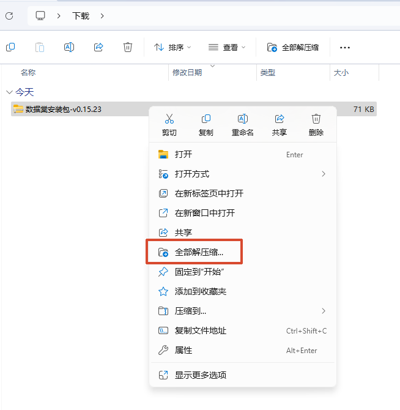
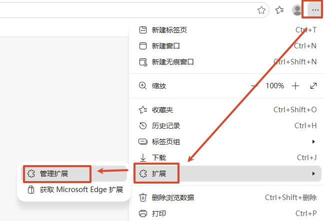
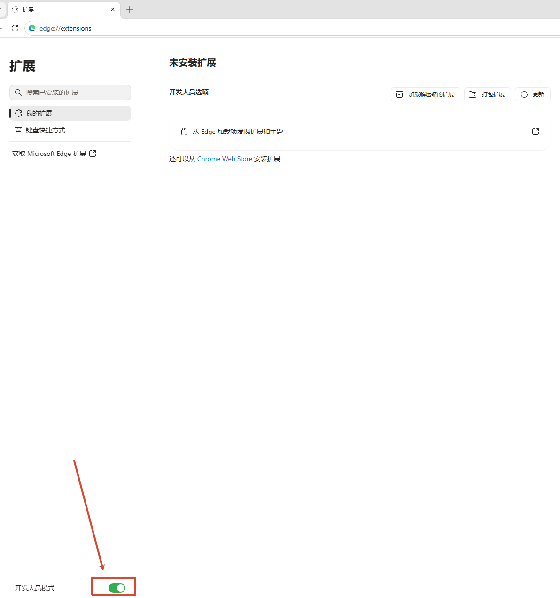
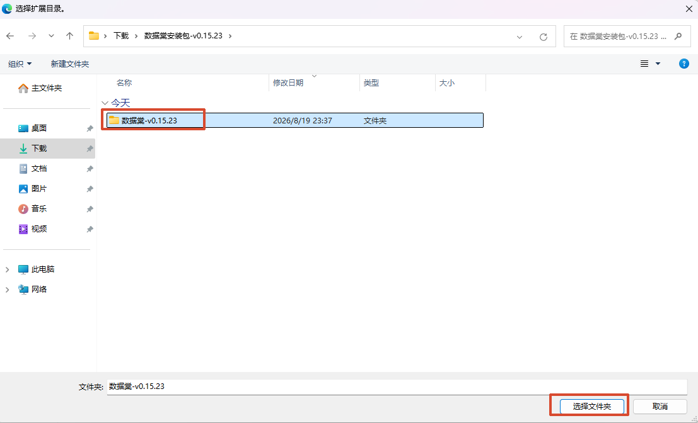
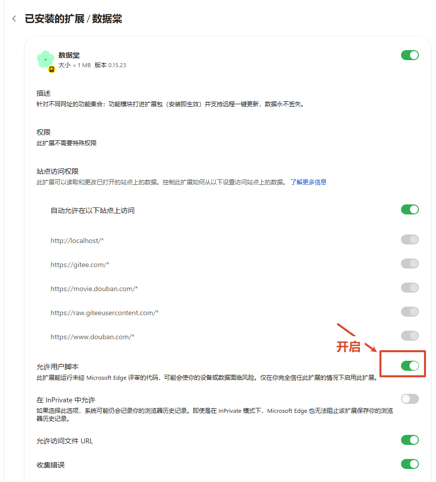
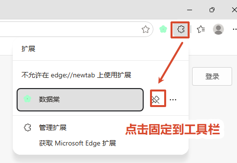
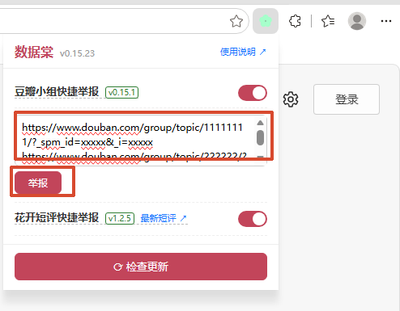
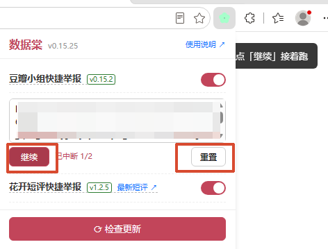
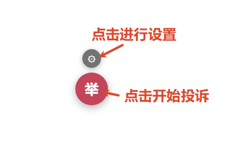
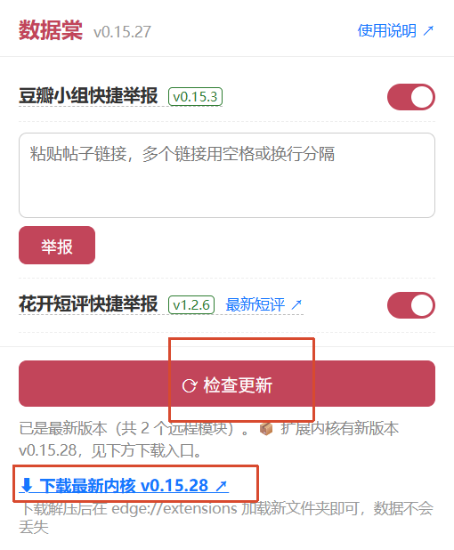

## 安装浏览器插件

1.点击右侧链接下载  [数据棠安装包-v0.15.27.zip](https://gitee.com/seolas/shujutang-release/releases/download/v0.15.27/%E6%95%B0%E6%8D%AE%E6%A3%A0%E5%AE%89%E8%A3%85%E5%8C%85-v0.15.27.zip) 最新版本的扩展包

> 注意:从v0.15.27开始, [检查更新](#检查更新)的功能才实现,如果需要此功能, 请下载 v0.15.27 及以上的版本

2.解压缩

3.打开 Edge 或谷歌浏览器, 点击浏览器右上角的三个点, 选择`扩展`, 选择`管理扩展`

5.打开开发者模式

6.加载扩展

7.打开`允许用户脚本`,用于后续方便更新插件内置脚本

7.固定扩展到工具栏

## db小组快捷举报

> 用于投诉小组内的帖子

### 使用方式一:

输入要投诉的小组内帖子的多条链接, 换行区分每条, 点击`举报`, 会跳转到帖子页面, 自动开始投诉

可以点击按钮暂停, 继续, 重置批量投诉的进度

### 使用方式二:

也可以在帖子内部右下角点击 `举` 悬浮球, 单独投诉帖子

> 自定义配置点击设置⚙️查看

## 花开短评快捷举报

点击 `最新短评` 跳转到花开锦绣最新短评页面

点击 `举` 悬浮球, 投诉一星二星匹配关键字的短评

> 默认投诉10轮,每轮间隔30分钟, 自定义配置点击设置⚙️查看

## 检查更新

点击 `检查更新` 按钮, 会自动更新模块脚本, 如果需要更新内核版本, 点击下载最新扩展zip 安装包重新安装

