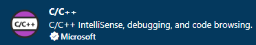
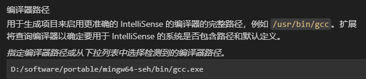
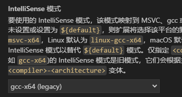
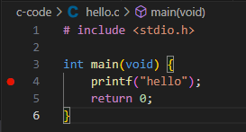
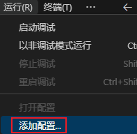
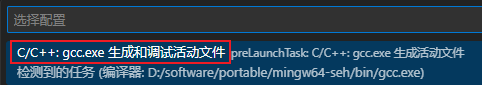

# 配置开发环境

## 下载

[win11 下载 mingw x86_64-win32-seh](https://sourceforge.net/projects/mingw-w64/files/)

[安装教程](https://www.w3cschool.cn/c/c-dh5j3owj.html)

## 配置 VSCODE

[配置教程](https://blog.csdn.net/y_universe/article/details/106052156)

安装扩展



CTRL + SHIFT + P 打开命令面板, 输入 C/C++ 编辑配置





配置后生成的文件是 .vscode/c_cpp_properties.json

## 运行调试

新建 hello.c, 打上断点



添加配置, 生成 .vscode/launch.json 文件



按 F5 开始调试, 生成 .vscode/tasks.json 文件




# 基础

## 语法

```c
#include <stdio.h>
#include <stdbool.h>

void increment (int* p) {
    *p = *p +1;
}

int main(void) {
    /* 注释1 */
    // 注释2
    printf("输出换行\n");
    printf("占位: \n字符%c \n数字%d \n浮点%f \n字符串%s \nsize_t类型%zd \n百分号%%\n", 'g', 1, 1.2, "hello", sizeof(int));
    printf("左对齐%-5d小数默认是6位%12f小数长度%6.2f\n",123, 123.45, 12.34);

    bool zero = false;

    int a = 1;
    increment(&a);
    printf("a的值%d",a);
}

```