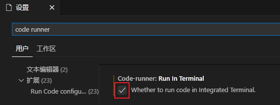
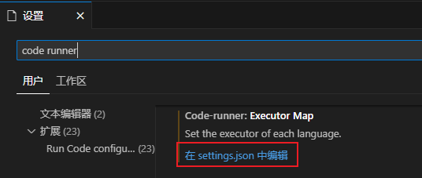
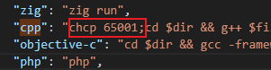

# 基础

## 简单运行

```cpp
int main()
{
    return 0;
}
```

> VSCODE 快捷键: `ALT + SHIFT + F` 格式化代码

编译

```bash
gcc -o hello hello.c
```

运行

```bash
./hello
```

> CODE RUNNER 快捷键: `CTRL + ALT + N` 运行代码

查看 main 函数的返回值

```bash
echo $?
```

## 简单输入输出

```cpp
#include <iostream>
int main()
{
    // 输出运算符 <<
    // endl 结束当前行, 并刷新缓冲区
    std::cout << "输入 2 个数字: " << std::endl;
    int v1 = 0, v2 = 0;
    // 输入运算符 >>
    std::cin >> v1 >> v2;
    std::cout << v1 << "+" << v2 << "=" << v1 + v2 << std::endl;
    return 0;
}
```

>[解决 code runner 无法输入](https://www.cnblogs.com/yqyang/p/13151160.html)



>[解决 code runner 终端乱码](https://blog.csdn.net/qq_43565353/article/details/125782401)





```json
chcp 65001;
```

## 持续输入

```cpp
#include <iostream>
int main()
{
    int sum = 0, value = 0;
    std::cout << "请开始输入数字: " << std::endl;
    while (std::cin >> value)
    {
        sum += value;
    }

    std::cout << "sum = " << sum << std::endl;
    return 0;
}
```

按 CTRL + Z 再按 ENTER 结束输入

## 语法

### 列表初始化

```cpp
int a = 0;
int b = {0};
int c{0};
int d(0);
```

### 声明

```cpp
extern int i;
```

### 全局变量

```cpp
#include <iostream>
int reused = 1;
int unique = 2;
int main()
{
    int reused = 3;
    // 局部和全局变量同名时, 使用 :: 访问全局变量
    std::cout << unique << reused << ::reused << std::endl; // 231
}
```

### 引用

```cpp
// 变量的引用
int val = 1024;
int &refVal = val;
refVal = 1025;
std::cout << val << std::endl; // 1025
// 指针的引用
int* p;
int* &r = p;
int i = 1;
r = &i;
```

### extern 用法

定义

```cpp
# base.cpp
extern const int extBufSize = 512;
```

头文件声明

```cpp
# base.h
extern const int extBufSize;
```

引入

```cpp
# test.cpp
#include <iostream>
#include "base.h"
int main()
{
    std::cout <<extBufSize << std::endl;
    return 0;
}
```