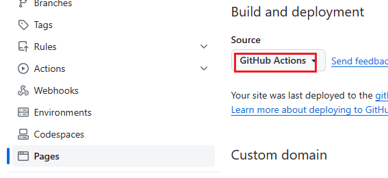
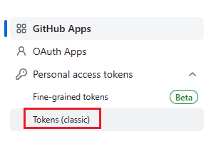
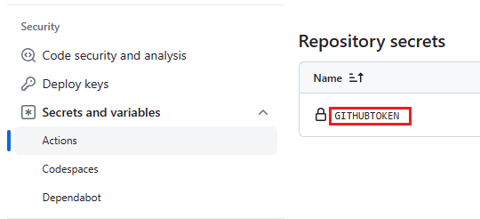

[Hexo 官方文档](https://hexo.io/zh-cn/docs/)

[Fluid 官方文档](https://fluid-dev.github.io/hexo-fluid-docs/start/)

# 安装

[安装 nodejs](https://nodejs.cn/download/)

```bash
# 校验前端包管理工具
npm -v
# 校验安装
node -v
```

[安装国内加速源](https://npmmirror.com/)

```bash
# 使用 cnpm 代替 npm
npm install -g cnpm --registry=https://registry.npmmirror.com
```

安装 hexo

```bash
npm install -g hexo-cli
```

安装 fluid

```
npm install --save hexo-theme-fluid
```

# 配置

## _config.yml

```yml
language: zh-CN
theme: fluid
```

## _config.fluid.yml

```yml
custom_js:
  - //cdn.jsdelivr.net/gh/wallleap/cdn/js/love.js
  - //cdn.jsdelivr.net/gh/wallleap/cdn@latest/js/sakura.js
  - //fastly.jsdelivr.net/gh/stevenjoezhang/live2d-widget@latest/autoload.js
```

# 自动构建

[配置参考 Hexo 官方文档](https://hexo.io/zh-cn/docs/github-pages)

选 GitHub Actions



生成 token 后, 将 token 加到仓库 的 secrets




