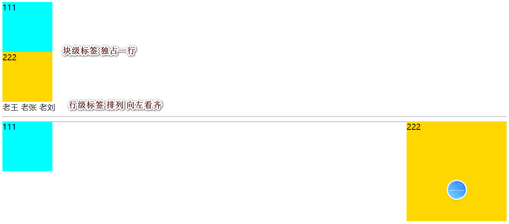
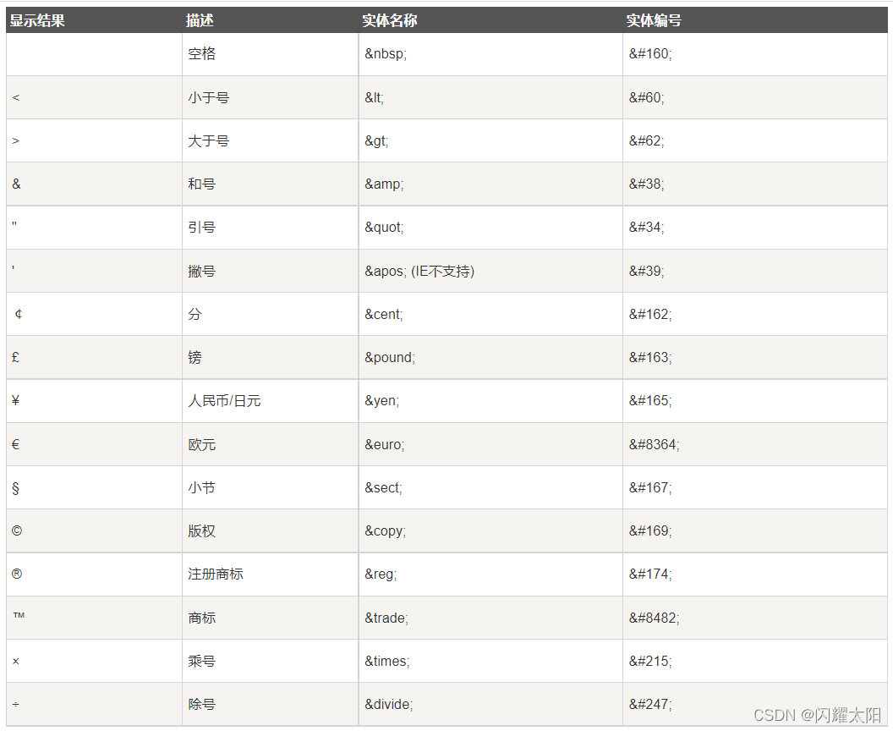
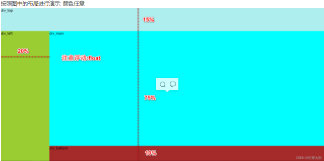
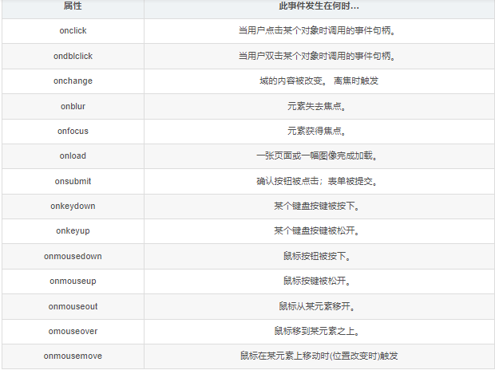
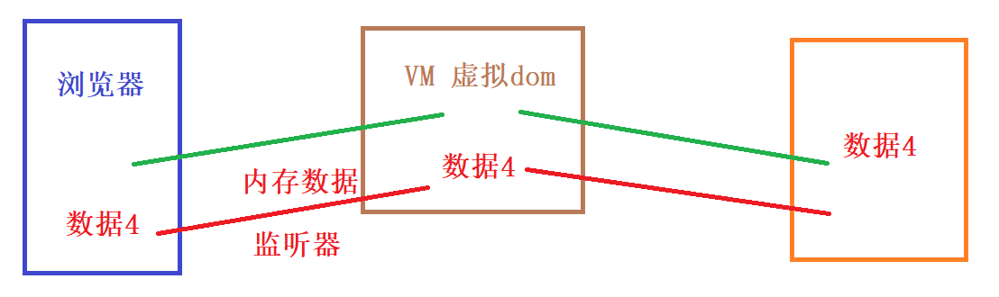
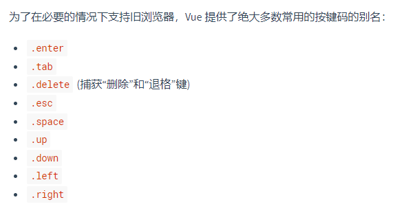

# html

## 入门案例

1. html 名称超文本标记语言
2. 页面是由浏览器解析html动态生成.
3. 编辑html的过程,也叫做"画页面"的过程
4. 超文本: 就是一种信息的结构
5. 标记语言:   标签             <p>xxxxxxxx</p>    
   1. 标签是特定的结构,不能自定义
   2. 单标签 不用闭合   双标签: 必须闭合.
   3. 标签可以嵌套.  但是不能交叉嵌套.
   4. 如果标签编辑不正确 浏览器显示不正确 .可能也不报错.   最好边写边测
6. html标签的基本代码结构 

```html
<!--
    说明: DOCTYPE 文档类型  浏览器解析当前标签时,采用html的方式解析页面.
         如果添加该标签 则默认以html5的方式解析(主流).
         否则以html4的方式解析
-->
<!DOCTYPE html>
<!--
    html是该文件的根标签 必须唯一,以后所有的html标签,都必须位于该标签之内.
    lang="en" 该标签主要是告诉浏览器,我是一个英文页面.
    该标记主要被搜索引擎记录. 和编辑html的文字无关.
-->
<html lang="zh">

    <!--head头部标签
        该标签主要的作用 标记引入的资源.定义标签的基本信息 主要起定义的作用
        例如:
            1.CSS样式表
            2.javaScript js
            3.页面的一些设定
    -->
    <head>
        <!-- 指定浏览器解析该页面的字符集编码格式 -->
        <meta charset="UTF-8">
        <!--浏览器页夹的名称-->
        <title>Title</title>
        <!--标记搜索引擎检索该网站的详情信息-->
        <meta name="description" content="京东JD.COM-专业的综合网上购物商城，为您提供正品低价的购物选择、优质便捷的服务体验。商品来自全球数十万品牌商家，囊括家电、手机、电脑、服装、居家、母婴、美妆、个护、食品、生鲜等丰富品类，满足各种购物需求。"><meta name="description" content="京东JD.COM-专业的综合网上购物商城，为您提供正品低价的购物选择、优质便捷的服务体验。商品来自全球数十万品牌商家，囊括家电、手机、电脑、服装、居家、母婴、美妆、个护、食品、生鲜等丰富品类，满足各种购物需求。"><meta name="description" content="京东JD.COM-专业的综合网上购物商城，为您提供正品低价的购物选择、优质便捷的服务体验。商品来自全球数十万品牌商家，囊括家电、手机、电脑、服装、居家、母婴、美妆、个护、食品、生鲜等丰富品类，满足各种购物需求。">
        <!--标记搜索引擎通过哪些关键字检索该网站-->
        <meta name="Keywords" content="网上购物,网上商城,家电,手机,电脑,服装,居家,母婴,美妆,个护,食品,生鲜,京东">
    </head>
    <!--body标签是页面中的主要的内容.以后所有的标签都必须位于body之内-->
    <body>
        <h1>我是html的入门案例</h1>
        <h2>我是html的入门案例</h2>
        <h3>我是html的入门案例</h3>
        <h4>我是html的入门案例</h4>
        <h5>我是html的入门案例</h5>
        <h6>我是html的入门案例</h6>
        <!--分割线-->
        <hr>
        <h3>静夜思</h3>
        <p>床前明月光，疑是地上霜。</p>
        <p>举头望明月，低头思故乡。</p>
        <hr>
        <!--换行标签用法
            规则: 在页面中手动的敲击空格,浏览器不解析的. 没有效果
            空格:  &nbsp;
            换行:  <br>
         -->
        <p>好好学习,&nbsp;&nbsp;&nbsp;&nbsp;&nbsp;<br>天天向上</p>


    </body>
</html>
```

## 有序列表和无序列表

1. 标题标签    h1-h6   字体加粗   依次减小.    

   1. 特点:  h1标签一个页面中最好只有1个.

2. 段落标签    p   独占一行  行前行末 都会有边距.       古诗词/小说/等场景.

3. 换行标签/空格标签

4. 注释写法:    <!--  xxxxxxx内容   -->

5. 有序列表和无序列表

   1. ol-li    type="排序编号" start="起始位置"   试题/需要排序的内容
   2. ul-li    type="了解一般不用"     标题展现时/商品信息展现

6. 关于绝对路径和相对路径的说明

7. a标签用法(重点!!!)

   1. href属性:  指定跳转的资源     
      1. 本资源       绝对路径    相对路径
      2. 网络资源:   http://xxxx.xx.xxx  
   2. target属性:    默认 _self     _blank

8. 图片标签    img   src="资源路径  本地资源/网络资源"    width/height  单位:像素 px

9. 音频/==视频介绍==

10. div(重点!!!)

    1. div不是展现页面内容的,而是定义页面布局的.

    2. div是块级标签,也把div称之为盒子模型.   可以进行嵌套,

    3. 浏览器解析html 是解释执行  按照行逐条解析,逐条展现.

    4. 块级标签:   ==**独占一行   前后回车换行**==    

       如果设定了大小,则大小固定的. 

       如果没有设定大小则以其中包含的内容决定.

    5. 行级标签:   ==不会独占一行   向左看齐      标签的大小由内容决定.==

    6. div默认独占一行,向左看齐. 如果需要并列div则必须设置浮动效果 float

       1. 如果前一个div没有浮动,则独占一行.  之后的div设定了浮动,也是在另一行展现.
       2. 如果前一个div设置了浮动效果,而后一个div没有设置浮动.则必然出现覆盖的现象, 浮动的覆盖未浮动的.
       3. 如果多个div都设置了浮动效果. 则并排展现.



11. 字符实体  有些html标签 在页面中不能直接编辑.必须使用转义标签代替.则该标签叫做字符实体.

```html
<!DOCTYPE html>
<html lang="zh">
    <head>
        <meta charset="UTF-8">
        <title>Title</title>
        <meta name="description" content="京东JD.COM-专业的综合网上购物商城，为您提供正品低价的购物选择、优质便捷的服务体验。商品来自全球数十万品牌商家，囊括家电、手机、电脑、服装、居家、母婴、美妆、个护、食品、生鲜等丰富品类，满足各种购物需求。"><meta name="description" content="京东JD.COM-专业的综合网上购物商城，为您提供正品低价的购物选择、优质便捷的服务体验。商品来自全球数十万品牌商家，囊括家电、手机、电脑、服装、居家、母婴、美妆、个护、食品、生鲜等丰富品类，满足各种购物需求。"><meta name="description" content="京东JD.COM-专业的综合网上购物商城，为您提供正品低价的购物选择、优质便捷的服务体验。商品来自全球数十万品牌商家，囊括家电、手机、电脑、服装、居家、母婴、美妆、个护、食品、生鲜等丰富品类，满足各种购物需求。">
        <meta name="Keywords" content="网上购物,网上商城,家电,手机,电脑,服装,居家,母婴,美妆,个护,食品,生鲜,京东">
    </head>
    <body>
       <!--有序标签-->
       <ol type="A" start="4">
           <li>第一</li>
           <li>第二</li>
           <li>第三</li>
       </ol>

        <!--无序列表
              type: disc 黑色圆圈
              circle 空心圆圈
              square 黑心方块
        -->
        <ul type="square">
            <li>张三</li>
            <li>李四</li>
            <li>王五</li>
        </ul>
        <!--
            实际通途:
                1.有序列表   考试题目等
                2.无序列表   标题信息/商品信息的排列
        -->
        <h3>1+1=?</h3>
        <ol type="A">
            <li>1</li>
            <li>2</li>
            <li>3</li>
        </ol>
    </body>
</html>
```

## 超链接标签

```html
<!DOCTYPE html>
<html lang="zh">
    <head>
        <meta charset="UTF-8">
        <title>Title</title>
    </head>
    <body>
        <!--
            1.绝对路径:  以磁盘路径为起始的文件路径
                F:\student_workspace2\workspa\day01\day1_3_超链接标签.html
            2.相对路径:  是以当前文件为起始的路径信息.(以文件名开头的路径)
                写法1:  aa/bb/test.html
                写法2:  ./aa/bb/test.html   ./代表当前目录
                上一级目录: ../xxx/xxx/xx.html  ../上一级
                上二级目录: ../../xxx/xx/xx.html   ../../上2级
         -->

        <!--超链接标签   a标签
            href="表示页面跳转"  当用户点击标签时,浏览器会重新加载新的页面
        -->

        <!--1.绝对路径写法
            1.1 IDEA如果使用绝对路径时,不能直接跳转. 因为和IDEA打开页面的方式有关.
            因为IDEA启动的服务器的方式,打开的页面.服务器不能找到F盘....的路径
            1.2 采用浏览器直接打开页面的方式 运行即可.
        -->
        <a href="F:\student_workspace2\workspa\day01\day1_1_入门案例.html">绝对路径</a>

        <!--2.相对路径写法-->
        <a href="day1_1_入门案例.html">相对路径1</a>
        <a href="./day1_1_入门案例.html">相对路径2</a>
        <a href=".\day1_1_入门案例.html">相对路径3</a>

        <hr>
        <!--3.跳转到其它网络资源-->
        <a href="http://www.baidu.com">百度</a>
        <a href="http://www.jd.com">京东</a>
        <a href="http://www.jd.com">性感图片</a>
        <hr>
        <!--4.新页面的打开方式
            target="_self" 新页面在当前页打开  默认值
            target="_blank"  在新窗口打开
            target="_parent"  在框架中的父级页面中展现
            target="_top"     在框架中的最外层页面中展现
        -->
        <a href="http://www.jd.com" target="_top">京东</a>
    </body>
</html>
```

## 图片标签


```html
<!DOCTYPE html>
<html lang="zh">
    <head>
        <meta charset="UTF-8">
        <title>Title</title>
    </head>
    <body>
        <!--
            图片标签
        -->
        
        

    </body>
</html>
```

## 多媒体案例

```html
<!DOCTYPE html>
<html lang="en">
<head>
    <meta charset="UTF-8">
    <title>Title</title>
</head>
<body>

    <!--
      html文档查询:
        https://www.w3school.com.cn/html/html_audio.asp
    -->
    <embed height="100px" width="600px" src="image/迎着风.mp3" />
    <object height="100" width="600" data="image/迎着风.mp3"></object>

    <audio controls="controls">
        <source src="image/迎着风.mp3" type="audio/ogg">
    </audio>
    <br>
    <video width="320" height="240" controls="controls">
        <source src="image/苹果.mp4" type="video/mp4" />
    </video>


</body>
</html>
```

## div案例讲解

```html
<!DOCTYPE html>
<html lang="en">
<head>
    <meta charset="UTF-8">
    <title>Title</title>
</head>
<body>
    <!--块级标签展现-->
    <div style="width: 100px; height: 100px;background-color: cyan">
        111
    </div>
    <div style="width: 100px; height: 100px;background-color: gold">
        222
    </div>
    <!--行级标签
        如果需要对文字进行修饰,则可以使用最小的标签span
    -->
    <span>老王</span> <span>老张</span>  <span>老刘</span>

    <hr>
    <div style="width: 100px; height: 100px;background-color: cyan; float: left">
        111
    </div>
    <div style="width: 200px; height: 200px;background-color: gold; float: right">
        222
    </div>
   <!-- <div style="width: 100px; height: 100px;background-color: darkgrey; float: left">
        333
    </div>-->
    <hr>


</body>
</html>
```

```html
<!DOCTYPE html>
<html lang="en">
<head>
    <meta charset="UTF-8">
    <title>Title</title>
</head>
<body>
    <div style="height: 400px; width: 900px; background-color: darkgrey">
        <div style="height: 400px;width: 300px; background-color: cyan;float: left"></div>
        <div style="height: 400px;width: 300px; background-color: coral;float: left"></div>
        <div style="height: 400px;width: 300px; background-color: seagreen;float: left"></div>
    </div>
</body>
</html>
```

## 字符实体

```html
<!DOCTYPE html>
<html lang="en">
<head>
    <meta charset="UTF-8">
    <title>Title</title>
</head>
<body>

    <h3> 请问下列是标题标签的是?</h3>
    <ol type="A">
        <li>&lt;h1&gt;xxxxxx&lt;/h1&gt;</li>
        <li>&lt;p&gt;xxxxxx&lt;/p&gt;</li>
        <li>&lt;div&gt;xxxxxx&lt;/div&gt;</li>
    </ol>
    <p>&yen;</p>
    <p>&euro;</p>
    <p>$</p>
    <p>&copy;</p>
    <p>&reg;</p>
</body>
</html>
```



## 表格写法

- 表格标签   table
- border属性: 边框线
- cellpadding   单元格的内填充
- cellspacing     单元格和单元格之间的距离
- tr标签      定义表格的行
- th标签     定义单元格  加粗和居中的效果  表头元素定义
- td标签      定义普通的单元格.
- colspan  跨列  向右扩展    
- rowspan 跨行  向下扩展   注意事项: 会对原始的表格产生影响 需要提前删除多余的标签

```html
<!DOCTYPE html>
<html lang="en">
<head>
    <meta charset="UTF-8">
    <title>Title</title>
</head>
<body>
    <!--

    -->
    <table border="1px" cellpadding="0" cellspacing="0" width="80%" align="center">
        <tr >
            <th colspan="4">
                <h1>惹事精</h1>
            </th>
        </tr>
        <tr>
            <th>序号</th>
            <!--<th rowspan="3">序号</th>-->
            <th>ID号</th>
            <th>名称</th>
            <th>年龄</th>
        </tr>
        <tr align="center">
            <td>1</td>
            <td>1001</td>
            <td>老妖婆</td>
            <td>81</td>
        </tr>
        <tr align="center">
            <td>2</td>
            <td>1002</td>
            <td>老普</td>
            <td>79</td>
        </tr>
        <tr align="center">
            <td>3</td>
            <td>1002</td>
            <td>老拜</td>
            <td>99</td>
        </tr>
    </table>
</body>
</html>
```

## 表单标签

- 一般向服务器提交数据,首选表单  注册/登录
- form表单的基本结构
  - form标签
  - action属性:   数据提交的地址  可以是本地服务器,可以是远程服务器.
  - method属性:  标识提交方式
    - GET提交       url?name=value&age=value2&sex=女
    - POST提交     URL  数据通过请求头的方式进行携带. 后续介绍
  - 提交按钮:  属性  type="submit"  设定唯一的提交按钮.

```html
<!DOCTYPE html>
<html lang="en">
<head>
    <meta charset="UTF-8">
    <title>Title</title>
</head>
<body>
    <form action="服务器地址" method="post">
        用户名: <input type="text" name="name">
        <button type="reset">重置</button>
        <button type="submit">提交</button>
    </form>
</body>
</html>
```

```html
<!DOCTYPE html>
<html lang="en">
<head>
    <meta charset="UTF-8">
    <title>Title</title>
</head>
<body>
    <form action="服务器地址" method="get">
        用户名: <input type="text" name="username" value="admin"><br>
        密码:   <input type="password" name="password"><br>
        性别:
            <!--
                关于单选标签说明:
                    1.单选标签必须写默认值value属性
                    2.单选操作是 name属性必须相同 才能互斥
                    3.label标签 通过点击文字关联单选框  for="id值"
                    4.checked 默认选中
            -->
            <input type="radio" name="gender" value="男" id="man">
            <label for="man">男</label>
            <input type="radio" name="gender" value="女" id="woman" checked>
            <label for="woman">女</label><br>
            爱好:
                <!--
                    type="checkbox" 复选框
                    name属性:  要求相同
                    value:  标识当前选项的值
                    提交方式:    key=value1&key=value2&key=value3 其中key相同
                -->
                <input type="checkbox" name="hobby" value="study">学习
                <input type="checkbox" name="hobby" value="wan" checked>旷课
                <input type="checkbox" name="hobby" value="game">打游戏
                <input type="checkbox" name="hobby" value="rap">rap<br>

            所在城市:
                <select name="city">
                    <option value="">---请选择---</option>
                    <option value="上海">上海</option>
                    <option value="成都">成都</option>
                    <option value="台湾" selected>台湾</option>
                </select><br>

            生日:
                <!--由于各个浏览器的内核不一致所以解析的插件效果也不相同.一般引入第三方的时间插件-->
                <input type="date" name="birthday">
            图片:
                <!--
                    注意事项:  文件的上传的类型,必须为post 不能为get.
                    因为:get提交最多允许4k的数据.
                -->
                <input type="file" name="img"><br>

            详情信息:
                <textarea name="info" style="width: 300px;height: 300px;"></textarea><br>

                <!--根据id修改: 隐藏域的功能-->
                <input type="hidden" name="id" value="100">
                <!--禁用   当标签禁用时,该属性不能提交数据-->
                <input type="text" name="id2" value="100" disabled><br>

            按钮操作:
                <button type="button">普通按钮</button><br>
                <input type="button" value="普通按钮2">

        <button type="reset">重置</button>
        <button type="submit">提交</button>
    </form>
</body>
</html>
```

# css

## css样式

- 关于样式优先级的说明

  - 行内样式  >  内部样式   > 外部样式

- 选择器

  - 标签选择器    p {}
  - id选择器         #id{}
  - 类选择器        .class值 {}

```html
<!DOCTYPE html>
<html lang="en">
<head>
    <meta charset="UTF-8">
    <title>Title</title>

    <!--如果样式可以被多个标签使用,则样式可以抽取.
        1.type="text/css"  标签的内容,只能写文本和css样式
    -->
    <style type="text/css">

        /*内部样式  2.指定哪些标签有效
          选择器用法:
                #p2:  选中id="p2"的标签      ID选择器   只能修饰一个元素
                p:    对p标签有效            标签选择器  对所有标签有效
                .red  对class=red的标签有效  类选择器    对class="red"有效  常用 灵活

        */
       /* #p2 {
            height: 30px;
            width: 100px;
           !* font-size: 150px;*!
            font-family: 宋体;
            color: coral;
            background-color: darkgrey;
        }

       .red {
            height: 30px;
            width: 100px;
            !* font-size: 150px;*!
            font-family: 宋体;
            color: coral;
            background-color: red;
        }

        p {
            height: 30px;
            width: 100px;
            !* font-size: 150px;*!
            font-family: 宋体;
            color: coral;
            background-color: blue;
        }*/
    </style>

    <!--
        rel="stylesheet" 引入的文件是一个样式表
        href=""          引入资源路径
        type="text/css"  不写则默认
    -->
    <link rel="stylesheet" href="../css/p.css" type="text/css">


</head>
<body>
    <!--1.行内样式-->
    <p style="height: 30px; width: 400px;background-color: seagreen;color: gold">CSS样式测试</p>
    <p id="p2">CSS样式测试</p>
    <p class="red">CSS样式测试</p>
    <p class="red">CSS样式测试</p>
</body>
</html>
```

## 盒子模型

- border div的边框线
- margin  外边距   div与其它元素的边距   margin不会影响当前div的大小
- padding  内边距    内部元素和border之间的距离. 会影响当前div的大小(慎重)   能用margin不要使用padding

```html
<!DOCTYPE html>
<html lang="en">
<head>
    <meta charset="UTF-8">
    <title>Title</title>
    <style type="text/css">
        #div1 {
            width: 100px;
            height: 100px;
            border: 1px solid red;
            background-color: darkgrey;
        }

        #div2 {
            width: 200px;
            height: 200px;
            border: 1px solid red;
            background-color: rosybrown;
            /*
                基准点:  左上方是基准点
            外边距 上 右 下 左  分别为20像素  */
            /*margin: 20px 20px 20px 20px;*/
            /*2个参数:   参数1: 上下结构   参数2: 左右结构*/
            /*margin: 20px 20px;*/
            /*1个参数:  上右下左 都是20像素*/
            /*margin: 20px;*/
            margin: auto;    /*水平居中*/
            margin-top: 20px;
            /*padding: 20px 20px 20px 20px;*/  /*顺时针 20像素*/
            /*padding: 20px 20px;*/  /* 上下  左右20像素*/
            /*padding: 20px;*/
            /*padding-top: 40px;*/
        }

        #div3 {
            height: 100px;
            width: 100px;
            background-color: blue;
            margin: auto;
            margin-top: 50px;
        }
    </style>

</head>
<body>
    <div id="div1"></div>
    <div id="div2">
        <div id="div3"></div>
    </div>
</body>
</html>
```



```html
<!DOCTYPE html>
<html lang="en">
<head>
    <meta charset="UTF-8">
    <title>Title</title>
    <style type="text/css">
        /*说明:如果同时为多个标签指定样式,则使用,号分割*/
        html,body{
            width: 100%;
            height: 100%;
            margin: 0;
            padding: 0;
        }

        #div_parent {
            width: 100%;
            height: 100%;
            background-color: darkgrey;
        }

        #top{
            height: 15%;
            background-color: cyan;
        }

        #left {
            width: 20%;
            height: 85%;
            background-color: seagreen;
            float: left;
        }

        #main {
            height: 75%;
            width: 80%;
            background-color: rosybrown;
            float: left;
        }

        #bottom {
            height: 10%;
            width: 80%;
            background-color: coral;
            float: right;
        }
    </style>

</head>
<body>
    <!--
        说明: 在h5的页面中 外层div使用%的形式不生效,
        如果想要生效则必须指定边界

    -->
    <div id="div_parent">
        <div id="top"></div>
        <div id="left"></div>
        <div id="main"></div>
        <div id="bottom"></div>
    </div>
</body>
</html>
```

# js

## 引入js

```javascript
<!DOCTYPE html>
<html lang="en">
<head>
    <meta charset="UTF-8">
    <title>Title</title>
    <!--1.添加标签-->
    <script type="text/javascript">
        alert("哈哈哈!!!")
    </script>
    <!--2.外部引入JS-->
    <script type="text/javascript" src="js/hello.js"></script>
</head>
<body>
    <h1>JS入门案例</h1>
    <h4>dddddd</h4>

</body>
</html>

```

```javascript
/*在script标签内部 添加js的内容 */
alert("你好世界!!!!")
```

## 变量

-  JS变量声明
   - var关键字     以后不建议使用   没有作用域范围
   - let 关键字     建议使用 有作用域范围  ES6以后推出的.
   - const关键字   定义常量   数据不允许被修改.
   - js严格区分大小写   都使用小写字母.
-  JS常见报错
   - not defined     没有声明变量
   - undefine         字符串操作 没有赋初始值
   - NaN                 数值操作 没有赋初始值

-  JS中的数据类型
   - number  数值类型       let  num = 100
   - string 数据类型            let  str = "hello"
   - boolean 布尔类型       true/false    可以实现自动的类型转化 
   - 为假的:   0   ""   null  undefined    除此之外都为真

```javascript
<!DOCTYPE html>
<html lang="en">
<head>
    <meta charset="UTF-8">
    <title>Title</title>

    <script>
      //1.变量的声明
      //var 没有作用域范围!!!!
      var a = 100  //成员变量
      //let 有作用域的范围  建议使用let
      let b = 100
      //常量定义
      const c = 100

      //关于JS常见报错说明
      let num // = 100
      //num1 is not defined 没有声明变量
      //undefine 变量没有赋初始值
      //NaN      做算术计算时 没有初始值
      alert("计算结果:"+(num + "aaa"))

    </script>
</head>
<body>

</body>
</html>
```

```javascript
<!DOCTYPE html>
<html lang="en">
<head>
    <meta charset="UTF-8">
    <title>Title</title>

    <script>
      let num = 100
      //alert("计算:"+(num-2))
      //alert(typeof (num))

      let str = "100"
      //alert("计算:"+num + str)
      //alert(typeof str)

      let boolean = true  //false
      //alert(typeof boolean)

      //布尔类型测试
      //为假的:   0   "" null  undefined 除此之外都为真
      let flag = "undefined"
      if(flag){
        alert("结果为真")
      }else{
        alert("结果为假")
      }


    </script>
</head>
<body>

</body>
</html>
```

## 内置函数

- 解释: JS中在内部封装了一些现成的函数,提供对应的功能.
- alert函数   弹出框效果    只能输出基本类型的内容    number string   boolean   如果是对象 则以object代替
- console函数   控制台日志输出    
  - console.log("xxxx"+基本数据类型)
  - console.log("xxxx"+对象)      会出现 xxxx[object object]的现象 
  - console.log(对象)       会展现对象的内容
- confirm  消息确认框   弹出框询问用户是否确定    点击确定 返回true   点击取消 返回false.

```html
<!DOCTYPE html>
<html lang="en">
<head>
    <meta charset="UTF-8">
    <title>Title</title>
    <script>
        //1.弹窗口效果
        let num = 100
        let str = "ssss"
        let flag = true
        //alert("我是弹出框效果")
        let user = {id: 100,name:"tomcat猫"}
        //alert(flag)
        //alert(user)
        //console.log("输入日志信息:"+flag)
        //console.log("用户信息:"+user)
        //console.log(user)

        let result = confirm("你确实删除吗?")
        alert(result)
    </script>
</head>
<body>

</body>
</html>
```


## 自定义函数

```html
<!DOCTYPE html>
<html lang="en">
<head>
    <meta charset="UTF-8">
    <title>Title</title>
    <script>
       //入门案例用法
       //函数定义
       function hello(){
           alert("你好JS")
       }
       //函数使用
       hello()

       //1.无参无返回值的函数写法
       function addNum(){
           let num1 = 100
           let num2 = 200
           let sum = num1 + num2
           alert("结果:"+sum)
       }
       addNum()

       //2.有参无返回值的函数写法
       function addNum2(num1,num2){

           let sum = num1 + num2
           alert("结果:"+sum)
       }
       addNum2(500,600)

       //3.有参有返回值
       function  addNum3(num1,num2,num3){
           //let sum = this.num1 + this.num2 + this.num3
           //return num1 + num2 + num3
           return num1 + num2 + num3
       }
       let result = addNum3(50,50,50)
       alert("三个参数的结果:"+result)


    </script>
</head>
<body>

</body>
</html>
```

## 匿名函数

```html
<!DOCTYPE html>
<html lang="en">
<head>
    <meta charset="UTF-8">
    <title>Title</title>
    <script>
       //function xxx(x,y){}
       //匿名函数  通过一个变量定义一个函数.
       let addNum = function (num1,num2) {
           alert(num1+num2)
       }
       addNum(100,200)

       /**
        * 当页面都加载完成之后,才调用该函数!!
        */
       window.onload = function (){
           alert("当页面所有的都加载完成之后,才调用该函数")
       }

       alert("测试执行顺序")


    </script>
</head>
<body>
    <div id="div1">xxxxx</div>
</body>
</html>
```

## 对象定义

this关键字用法

- 如果this在对象的内部使用,则代表当前对象
- 通过this.属性 获取的就是对象的属性值.
- 如果this 在script标签中直接使用,则this代表的是当前解析js的唯一对象window对象. 该对象提供了很多的内置函数. window对象就是JS内置核心对象.

```html
<!DOCTYPE html>
<html lang="en">
<head>
    <meta charset="UTF-8">
    <title>Title</title>
    <script>
       //1.通过new关键字创建对象
       let user = new Object()
       user.id = 100
       user.name = "tomcat猫"
       user.age = 18
       user.addNum = function (num1,num2) {
           return num1 + num2
       }
       console.log(user)
       console.log(user.addNum(100,100))

       /**
        * 对象定义方式二   大括号写法
        */
       let user2 = {
           id: 1000,
           name: "mysql",
           age: 18,
           addNum : function (num1,num2) {
               return num1 + num2
           },
           getAge: function (){
               return this.age
           }
       }
       console.log(user2)
       console.log(user2.addNum(200,300))
       console.log("获取当前对象的年龄:"+user2.getAge())


       //单独测试this
       let windows = this
       console.log(windows)

    </script>
</head>
<body>
    <div id="div1">xxxxx</div>
</body>
</html>
```

## 数组对象定义

```html
<!DOCTYPE html>
<html lang="en">
<head>
    <meta charset="UTF-8">
    <title>Title</title>
    <script>
      let array = new Array()
      array[0] = "数学"
      array[1] = "语文"
      array[2] = "英语"
      console.log(array)

      //2.[]括号写法
      let array2 = ["安琪拉","亚索","凹凸曼"]
      console.log(array2)

    </script>
</head>
<body>
    <div id="div1">xxxxx</div>
</body>
</html>
```

## 数组常用操作

- push    向数组末尾追加元素  

- pop      弹出最后一个元素

- reverse  实现数组反转

- splice("起始位置","删除几个元素")    删除操作

- splice("起始位置","替换的数量","替换后的值")   替换操作

  上述语法 会直接映射原始数组结构

  

- 字符串和数组的转化

  - join     将数组按照特定连接符拼接为字符串
  - split    将字符串按照特定的字符 拆分为数组

```html
<!DOCTYPE html>
<html lang="en">
<head>
    <meta charset="UTF-8">
    <title>Title</title>
    <script>
        let array = [1,2,3,4]

        //1.追加元素   push 在数组的末尾追加元素    压栈
        array.push(5)
        console.log(array)  //1,2,3,4,5

        //2.弹出数据  出栈/弹栈  会直接影响原始数组结构
        array.pop()
        console.log(array)  //1,2,3,4

        //3.数组反转
        array.reverse()
        console.log(array) //4,3,2,1

        //4.删除
        //4.1 删除第一个元素
        //array.splice("起始位置","删除几个元素")
        //array.splice(0,1)
        //console.log(array) //3,2,1

        //4.2 删除第2,3个元素
        //array.splice(1,2)
        //console.log(array)   //4,1

        //4.3 删除最后一个元素
        //array.splice(array.length-1,1)
        //console.log(array)     //4,3,2

        //5.修改操作
        let array2 = [1,2,3,4]

        //5.1 将第二个元素 换位6
        //array2.splice("起始位置","替换的数量","替换后的值")
        //array2.splice(1,1,6)
        //console.log(array2)

        //5.2 将第3-4个数据 修改为  100,200,300
        array2.splice(2,2,100,200,300)
        console.log(array2)

        //6.数组和字符串的关系转化
        //下列操作 不会对原始数组结构产生影响,需要手动接参
        let array3 = [1,2,3,4]
        let str = array3.join(":")
        console.log(str)        //1:2:3:4
        console.log(typeof str)

        //字符串转化为数组
        let newArray = str.split(":")
        console.log(newArray)


    </script>
</head>
<body>
    <div id="div1">xxxxx</div>
</body>
</html>
```

## 循环遍历操作

```html
<!DOCTYPE html>
<html lang="en">
<head>
    <meta charset="UTF-8">
    <title>Title</title>
    <script>
        let array = [1,2,3,4,5]

        //循环方式1:
        for (let i=0;i<array.length;i++){
            console.log(array[i])
        }

        //循环方式2: in关键字
        for(index in array){
            console.log("~~~~"+array[index])
        }

        //in关键字 遍历对象
        let user = {
            id: 100,
            name: "tomcat",
            age: 18
        }

        /**
         * bug说明:  对象.属性 要求属性是定值 不能是变量
         */
        for(key in user){
            console.log("~~~"+key)
            //console.log(user.id)
            //console.log(user.key)
            //如果需要通过变量的方式动态的取值 则使用[[key]]的写法
            console.log(user[[key]])
        }
        console.log("~~~~~~~~~~~~~~~~~~~~~~~~~")

        //循环方式3: of关键字
        let array3 = [1,2,3,4,5]
        for(num of array3){
            console.log(num)
        }

    </script>
</head>
<body>
    <div id="div1">xxxxx</div>
</body>
</html>
```

## JSON与JS对象的转化

```html
<!DOCTYPE html>
<html lang="en">
<head>
    <meta charset="UTF-8">
    <title>Title</title>
    <script>
       /*
       *  1.JSON串
       *  2.JS解析JSON串 自动的转化为 JSON对象
       *  3.JSON对象的本质就是JS对象
       */
       let json = {"id": 100,"name":"tomcat猫","age":18}
       alert(typeof json)
       alert("名称:"+json.name)

       //将对象转化为JSON串
       let str = JSON.stringify(json)
       alert(str.id)  //只有对象可以通过.的方式获取属性值.
       alert(typeof str)

       //将字符串转化为对象
       let obj = JSON.parse(str)
       alert(typeof obj)


    </script>
</head>
<body>
    <div id="div1">xxxxx</div>
</body>
</html>
```

## DOM操作

```html
<!DOCTYPE html>
<html lang="en">
<head>
    <meta charset="UTF-8">
    <title>Title</title>
    <script>
        window.onload = function (){
            //1.根据ID获取元素
            let p = document.getElementById("p1")
            console.log(p)

            //2.根据标签名称获取元素
            let pArray = document.getElementsByTagName("p")
            console.log(pArray[0])

            //3.根据name属性获取元素
            let p2 = document.getElementsByName("pName")[1]
            console.log(p2)

            //4.class属性获取元素
            let p1Class = document.getElementsByClassName("pClass")[0]
            console.log(p1Class)
        }
    </script>
</head>
<body>
    <h1>DOM操作</h1>
    <p id="p1" name="pName" class="pClass">我是DOM操作的入门案例1</p>
    <p id="p2" name="pName" class="pClass">我是DOM操作的入门案例2</p>
</body>
</html>
```

## 获取子元素

```html
<!DOCTYPE html>
<html lang="en">
<head>
    <meta charset="UTF-8">
    <title>Title</title>
    <script>
        window.onload = function (){

            //1.获取div1  获取子元素
            let childrens = document.getElementById("div1").children
            console.log(childrens)

            //2.获取div1  第一个孩子
            let p1 = document.getElementById("div1").firstElementChild
            console.log(p1)
        }
    </script>
</head>
<body>
    <h1>DOM操作</h1>
    <div id="div1">
        <p id="p1">老大</p>
        <p>老二</p>
        <p>老三</p>
    </div>
</body>
</html>
```

## 属性取值和赋值操作

关于属性取值和赋值操作

- 标签中的默认属性,可以通过元素.属性的方式获取数据.
- 如果标签中的属性是自定义的 则需要通过pEle.getAttribute("name") 获取数据.

```html
<!DOCTYPE html>
<html lang="en">
<head>
    <meta charset="UTF-8">
    <title>Title</title>
    <script>
        window.onload = function (){
            //1.获取p标签中的属性值
            let pEle = document.getElementById("p1")
            let id = pEle.id
            let name = pEle.name
            let name2 = pEle.getAttribute("name")
            console.log(id+":"+name+":"+name2)

            //获取文本信息
            let text = pEle.innerText
            console.log(text)

            //为属性和文本赋值
            pEle.id = "p100"
            pEle.setAttribute("name","pName2")
            pEle.innerText = "修改数据!!!!!"
            console.log(pEle)
        }
    </script>
</head>
<body>
    <h1>DOM操作</h1>
    <p id="p1" name="pName">我是p标签</p>
</body>
</html>
```

## 页面元素追加操作

```html
<!DOCTYPE html>
<html lang="en">
<head>
    <meta charset="UTF-8">
    <title>Title</title>
    <script>
        window.onload = function (){
            //写法1:
            //1.创建tr标签
           let trEle = document.createElement("tr")
           trEle.setAttribute("align","center")

           //2.创建td标签
            let tdEle1 = document.createElement("td")
            tdEle1.innerText = 200
            let tdEle2 = document.createElement("td")
            tdEle2.innerText = "李四"
            let tdEle3 = document.createElement("td")
            tdEle3.innerText = 18

           //3.将td追加到tr标签中
            trEle.append(tdEle1,tdEle2,tdEle3)
            console.log(trEle)

           //4.将tr标签追加到table中
            document.getElementById("tab1").append(trEle)

            //写法2:  利用innerHtml的方式简化代码
            let tr2 = document.createElement("tr")
            tr2.setAttribute("align","center")
            //定义的html的字符串
            let tds = "<td>300</td><td>麻子</td><td>20</td>"
            // <tr>
            //   <td>300</td><td>麻子</td><td>20</td>
            // </tr>
             tr2.innerHTML = tds
             document.getElementById("tab1").append(tr2)

        }
    </script>
</head>
<body>
    <h1>DOM操作</h1>
    <table id="tab1" border="1px" cellpadding="0" cellspacing="0" width="500px">
        <tr>
            <th>编号</th>
            <th>名称</th>
            <th>年龄</th>
        </tr>
        <tr align="center">
            <td>100</td>
            <td>张三</td>
            <td>18</td>
        </tr>
    </table>
</body>
</html>
```

## js事件驱动



```html
<!DOCTYPE html>
<html lang="en">
<head>
    <meta charset="UTF-8">
    <title>Title</title>
    <script>
        function myClick(){
            alert("我是点击事件")
        }

        function myChange(){
            alert("数据修改之后,离焦时触发")
        }

        function  myBlur(){
            alert("离焦时触发")
        }

        function myOnmouseover(){
            //alert("实现超练级跳转!!!!")
            window.location.href ="http://www.baidu.com"
        }
    </script>
</head>
<body>
    <button onclick="myClick()">点击时触发</button>
    <button ondblclick="myClick()">双击时触发</button><br>
    用户名:  <input type="text" name="username" onchange="myChange()">
    密码:  <input type="password" name="password" onblur="myBlur()"><br>
    <!--鼠标移动上去开始触发-->
    


</body>
</html>
```

模版字符串  

- 用途: 如果页面中有大量的字符串需要拼接,并且其中需要动态赋值操作.同时需要满足原始代码结构 时  建议采用模版字符串写法.
- 语法:   使用反引号进行定义   ==``==
- 取值方式:  ${key}

```html
<!DOCTYPE html>
<html lang="en">
<head>
    <meta charset="UTF-8">
    <title>Title</title>
    <script>

        /**
         * 1.获取用户填写的内容
         * 2.获取数据之后 封装为tr标签    1.每个标签自己创建  2.通过innerHtml动态生成
         * 3.将tr标签追加到table中
         */
        function addUser(){
            let id = document.getElementById("id").value
            let name = document.getElementById("name").value
            let sex = document.getElementById("sex").value
            let tr = document.createElement("tr")
            tr.setAttribute("align","center")
            let tds =
                `
                    <td>${id}</td>
                    <td>${name}</td>
                    <td>${sex}</td>
                    <td>
                        <button onclick="deleteUser(this)">删除</button>
                    </td>
                `
            tr.innerHTML = tds
            //将tr标签追加到table中
            document.getElementById("tab1").append(tr)
        }

        /**
         * 删除的策略
         *  根据删除按钮找到tr元素对象.之后将tr标签删除.
         */
        function deleteUser(ele){
            //1.利用内置函数动态获取
            //let btn = event.target
            //console.log(btn) td  tr
            ele.parentElement.parentElement.remove()
        }

    </script>
</head>
<body>
    <h3 align="center">动态表格</h3>
    <table id="tab1" width="65%" border="1px" cellspacing="0" cellpadding="0" align="center">
        <tr>
            <th>序号</th>
            <th>用户</th>
            <th>性别</th>
            <th>操作</th>
        </tr>
        <tr align="center">
            <td>100</td>
            <td>张三</td>
            <td>男</td>
            <td>
                <button onclick="deleteUser(this)">删除</button>
            </td>
        </tr>
    </table>

    <h3 align="center">新增用户</h3>
    <table width="25%" border="1px" cellspacing="0" cellpadding="0" align="center">
        <tr align="center">
            <td>序号</td>
            <td>
                <input id="id" name="id" type="text" value="1001">
            </td>
        </tr>
        <tr align="center">
            <td>姓名</td>
            <td>
                <input id="name" name="name" type="text">
            </td>
        </tr>
        <tr align="center">
            <td>性别</td>
            <td>
                <input id="sex" name="sex" type="text">
            </td>
        </tr>
        <tr align="center">
            <td colspan="2">
                <button onclick="addUser()">添加用户</button>
            </td>
        </tr>
    </table>
</body>
</html>
```

## 正则表达式

常用正则语法

- 不确定次数控制
  - \  转义字符   
  - ^  开始
  - $  结束
  - '* '   任意次   >=0
  - '+'    至少1次   >=1
  - '?'     0次或者1次 
- 确定次数的控制
  - {n}     只允许出现n次
  - {n,}    次数    >=n
  - {n,m}  次数     >=n  同时   <=m
- 万能通配符   . 点
- 字符集合用法
  - [xyz]     匹配一个字符 只能是xyz的其中一个
  - [^xyz]   匹配一个字符 不能是xyz的其中一个
  - [z-a]      匹配一个字符  所有的小写字母
  - [A-Z]     匹配一个字符  所有的大写字母
  - [0-9]      匹配一个字符  所有的数字
  - [a-zA-Z0-9]  匹配一个字符 要求必须是字母和数字
  - [^a-z]    匹配一个字符  不能是小写字母
- 或和分组写法
  - |   或的业务要求
  - () 分组   其中可以写多个条件
- 邮箱正则表达式  /^ [a-zA-Z0-9_-]+@([a-zA-Z0-9-]+[.]{1})+[a-zA-Z]+$/
- 正则匹配和替换

  - 规则说明:  
    - 默认条件下匹配和替换只能处理一个字符.
    - 如果需要全部匹配 则需要添加关键字 /g  全文匹配

```html
<!DOCTYPE html>
<html lang="en">
<head>
    <meta charset="UTF-8">
    <title>Title</title>
    <script>
        //1.定义正则表达式
        //let rege = new RegExp("a")
        //正则对象创建
        let rege = /a/


        //需要校验的字符串
        let str = "a"
        if(rege.test(str)){  //满足规则 返回true   不满足规则返回false
            alert("满足规则")
        }else{
            alert("不满足规则")
        }
    </script>
</head>
<body>
    <h1>正则表达式</h1>
</body>
</html>
```

```html
<!DOCTYPE html>
<html lang="en">
<head>
    <meta charset="UTF-8">
    <title>Title</title>
    <script>
        /**
         * 案例1:
         *      要求字符a至少出现1次
         */
       /* let rege = /^a+$/
        let str = "aaaa"
        if(rege.test(str)){
            alert("校验通过")
        }else{
            alert("校验失败")
        }*/

        /**
         * 只允许 a字符 出现 2,5次
         */
       /* let rege = /^a{2,5}$/
        let str = "aaaaaa"
        if(rege.test(str)){
            alert("校验通过")
        }else{
            alert("校验失败")
        }*/


        /**
         * 要求用户输入5个字符 内容不限
         * 校验输入的字符是否为.
         */
        //let rege = /.{5}/
       /* let rege = /^\.$/
        let str = "a"
        if(rege.test(str)){
            alert("校验通过")
        }else{
            alert("校验失败")
        }*/

        /**
         * 匹配三个字符 第一个字符 小写字母
         *            第二个字符  数字
         *            第三个字符  任意字符
            前3个字符英文和数字,后边的随意
         */
        //let rege = /^[a-z][0-9].$/
       /* let rege = /^[a-zA-Z0-9]{3}.*$/
        let str = "???!!!"
        if(rege.test(str)){
            alert("校验通过")
        }else{
            alert("校验失败")
        }*/

        /**
         * 要求1个字符 要么是数字,要么是a
         * @type {RegExp}
         */
        let rege = /^([0-9]|a)$/
        let str = "b"
        if(rege.test(str)){
            alert("校验通过")
        }else{
            alert("校验失败")
        }


    </script>
</head>
<body>
    <h1>正则表达式</h1>
</body>
</html>
```

```html
<!DOCTYPE html>
<html lang="en">
<head>
    <meta charset="UTF-8">
    <title>Title</title>
    <script>
        //匹配输入的文字中是否有 "国"
        let str  = "中华人民共和国,国家,中国"
        let rege = /国/g
        let result = str.match(rege)
        console.log(result.join(","))
        //一般使用于全文检索.

        //字符串替换
        let str2 = "你个大**,我是你**,你个小**"
        let rege2 = /[*]/g
        let result2 = str2.replace(rege2,"X")
        console.log(result2)

    </script>
</head>
<body>
    <h1>正则表达式</h1>
</body>
</html>
```

```html
<!DOCTYPE html>
<html lang="en">
<head>
    <meta charset="UTF-8">
    <title>Title</title>
    <script>

        function checkUsername(ele){
            //获取用户的输入信息
            let input = ele.value
            //定义正则表达式  i表示不区分大小写
            let rege = /^[a-z0-9]{5,20}$/i
            if(!rege.test(input)){
                alert("请正确输入用户名!!!")
            }
        }

        function checkPassword(ele){
            //获取用户的输入信息
            let input = ele.value
            //定义正则表达式  i表示不区分大小写
            let rege = /^[a-z0-9@_]{3,20}$/
            if(!rege.test(input)){
                alert("请正确输入密码!!")
            }
        }
    </script>
</head>
<body>
    <h1>正则案例练习</h1>
    <form action="#" method="post">
        <table border="1px" cellpadding="0" cellspacing="0" width="35%">
            <tr align="center">
                <td>
                    用户名:
                </td>
                <td>
                    <input type="text" name="username" id="username" onchange="checkUsername(this)">
                </td>
            </tr>
            <tr align="center">
                <td>
                    密码:
                </td>
                <td>
                    <input type="password" name="password" id="password" onchange="checkPassword(this)">
                </td>
            </tr>
            <tr align="center">
                <td colspan="2">
                    <button type="submit">提交</button>
                </td>
            </tr>
        </table>
    </form>
</body>
</html>
```

# vue

## 指令学习

- VUE.JS指令学习
  -  v-text   在未加载成功之前 不展现数据.    dom innerText
  -  v-html   以标签的方式展现内容                 dom innerHtml
  -  v-pre  想展现标签本身 跳过编译效果
  -  v-once  元素只需要被渲染一次,以后不变
  -  ==v-model  双向数据绑定== 
     - 属性变化元素变化  
     - 元素变化属性变化

- 核心思想 MVVM思想

  - M model 数据   在vue中可以理解为属性
  - V view  视图      在页面中看到的内容
  - VM  视图模型控制    实现双向数据绑定的核心机制.     
  - 理解:  传统页面数据变化 则必须=="刷新"==



```html
<!DOCTYPE html>
<html lang="en">
<head>
    <meta charset="UTF-8">
    <title>Title</title>
    <script src="js/vue.min.js"></script>
</head>
<body>

    <div id="app">
        {{name}}
    </div>

    <script>
        const  app = new Vue({
            el: "#app",
            data: {
                name: "今天太热了!!!"
            }
        })
    </script>
</body>
</html>
```

```html
<!DOCTYPE html>
<html lang="en">
<head>
    <meta charset="UTF-8">
    <title>Title</title>
    <script src="js/vue.min.js"></script>
</head>
<body>

    <div id="app">
        <!--1.说明: 如果浏览器未解析完成,则以原始结构展现
            这样的方式用户体验不好 所以需要优化.
        -->
        {{name}}
        <p v-text="name"></p>

        <!--2.v-html用法: 以标签的方式展现数据-->
        <div v-html="h1_html"></div>

        <!--3. v-pre指令  想展现标签本身-->
        <hr>
        <span v-pre>{{name}}</span>

        <!--4. v-once  页面标签只渲染一次-->
        <h3 v-text="hello" v-once></h3>

        <!--5.双向数据绑定测试-->
        用户名: <input type="text" name="username" v-model="username">
    </div>

    <script>
        const  app = new Vue({
            el: "#app",
            data: {
                name: "今天太热了!!!",
                h1_html: "<h1>今天外边40度 快熟了!!!</h1>",
                hello: "欢迎来到西安!!",
                username: "admin"
            }
        })
    </script>
</body>
</html>
```

## 事件绑定

事件绑定

- 语法
  - v-on:click="简单的计算"
  - @click="简单计算/事件函数"
  - 函数关键字:   methods : { 函数名:  function(){xxxxxx函数内容}}
- 事件修饰符

  - 阻止冒泡  .stop
    - 有时div会进行嵌套,内层div事件执行完成之后,会执行外层的事件,把这种行为 称之为:"事件冒泡"
    - 如果需要阻止时间冒泡 则添加.stop属性
- 阻止默认行为    .prevent
  - 有些标签的操作可能需要额外的业务处理,不需要默认行为 所以需要阻止默认行为    @click.prevent="事件函数"
  - 常用位置:    a标签    form表单提交
- 常见vue.js中的事件说明

  - 按键修饰符
    - 回车键触发  @keyup.enter="login"
    - 空格件触发  @keyup.space="login"
    - 鼠标左键触发  @click.left="login"
    - 鼠标右键触发 @click.right="login"
  - 常用事件
    @click
         			- @change
              			- @blur



```html
<!DOCTYPE html>
<html lang="en">
<head>
    <meta charset="UTF-8">
    <title>Title</title>
    <script src="js/vue.min.js"></script>
</head>
<body>
    <div id="app">
        <!--1.实现number自增
            功能:
                1.对简单的数据直接进行操作
        -->
        <h3 v-text="num"></h3>
        <button v-on:click="num++">自增1</button>
        <!--简化操作:   @代表 v-on: -->
        <button @click="num++">自增1</button>
        <!--点击事件绑定函数
            规则: 如果其中不需要传递参数,则()可以省略
                 如果需要传递参数 (arg0,arg1,arg2)
          -->
        <button @click="addNum()">自增1</button>
        <button @click="addNum">自增1</button>
    </div>
    <script>
        const app = new Vue({
            el: "#app",
            data: {
                num: 100
            },
            //函数定义
            methods: {
                addNum: function () {
                    //获取当前元素的属性 之后自增
                    this.num++
                }
            }
        })
    </script>
</body>
</html>
```

## 事件修饰符

```html
<!DOCTYPE html>
<html lang="en">
<head>
    <meta charset="UTF-8">
    <title>Title</title>
    <script src="js/vue.min.js"></script>
</head>
<body>
    <div id="app">
        {{num}}
        <div id="div1" @click="num++">
            <button @click.stop="num++">自增</button>
        </div>

        <hr>
        <!--阻止默认行为
            需求: 为超链接添加事件,同时不要求超链接跳转
        -->
        <a href="http://www.baidu.com" @click.prevent="toBaidu">超链接百度</a>

        <form action="####">
            用户名: <input type="text" name="username">
            <button type="submit" @click.prevent="toBaidu">提交</button>
        </form>

    </div>
    <script>
        const app = new Vue({
            el: "#app",
            data: {
                num: 100
            },
            //函数定义
            methods: {
                toBaidu: function () {
                    alert("通过点击事件,异步跳转百度")
                }
            }
        })
    </script>
</body>
</html>
```

## 按键修饰符

```html
<!DOCTYPE html>
<html lang="en">
<head>
    <meta charset="UTF-8">
    <title>Title</title>
    <script src="js/vue.min.js"></script>
</head>
<body>
    <div id="app">
        <!--1.要求:  用户录入完成之后,回车键触发事件-->
        回车键触发: <input type="text" name="username" @keyup.enter="login"><br>
        空格键触发: <input type="text" name="username" @keyup.space="login"><br>
        鼠标左键触发:  
            <br>
        鼠标右键触发:
        <br>


        <!--
            2.常见事件
                1.点击事件  @click="xxx"
                2.change事件     @change="xxx"
                3.离焦事件      @blur="xxxx"
        -->
        change事件
            <input type="text" name="username" @change="login"><br>
        离焦事件
            <input type="text" name="username" @blur="login">


    </div>
    <script>
        const app = new Vue({
            el: "#app",
            data: {
                num: 100
            },
            //函数定义
            methods: {
                login: function (){
                    alert("事件被触发了!!!")
                }
            }
        })
    </script>
</body>
</html>
```

```html
<!DOCTYPE html>
<html lang="en">
<head>
    <meta charset="UTF-8">
    <title>Title</title>
    <script src="js/vue.min.js"></script>
</head>
<body>
    <div id="app">
       <!--
            需求说明:
                1.准备2个文本输入框   num1   num2
                2. 准备一个总数的p标签  计算结果 num1 + num2
                3. 准备一个计算按钮  进行计算
                4. num2 添加一个回车事件 要求计算结果

            用法技巧:
                1.以后看到文本输入框,第一时间使用双向数据绑定
                2.默认条件下用户录入的数值 其实都是字符串.
                3.如果文本输入框中只能输入数值类型  则设定type="number"
       -->
        num1:  <input type="number" name="num1" v-model="num1"><br>
        num2:  <input type="number" name="num2" v-model="num2" @keyup.enter="addNum">
        <button @click="addNum">计算</button><br>
        <p>总数: <span v-text="sum"></span></p>
				
    </div>
    <script>
        const app = new Vue({
            el: "#app",
            data: {
                num1: "",
                num2: "",
                sum: 0
            },
            //函数定义
            methods: {
               /* addNum: function (){
                    alert("事件被触发了!!!")
                }*/
                addNum(){
                    //1.需求:  将字符串 转化为数值类型    evel函数
                    //2.需求:

                    //this.sum = eval(this.num1) + eval(this.num2)
                    this.sum = parseInt(this.num1)  + parseInt(this.num2)
                    //this.sum = this.num1 + this.num2
                }
            }
        })
    </script>
</body>
</html>
```

## 属性绑定

属性绑定

- 语法
  - v-bind:属性名="vue中定义的属性"  `<a v-bind:href="myHref">京东</a><br>`
  - 简化操作  `<a :href="myHref">京东</a><br>`
- ==核心功能:   动态的修改属性中的数据 使用属性绑定!!!==

关于if判断的说明

- ==  判断的是内容是否相同  但不能判断类型
- ===  判断的是 内容和类型是否一致.

```html
<!DOCTYPE html>
<html lang="en">
<head>
    <meta charset="UTF-8">
    <title>Title</title>
    <script src="js/vue.min.js"></script>
</head>
<body>
    <div id="app">
        <!--1.属性绑定 href标签
            需求:  准备2个按钮  一个京东 一个是天猫
            规则:  通过点击按钮  实现数据的"动态"跳转
            实现原理:
                1.动态的数据必须定义为属性
         -->
        <a href="http://www.jd.com">京东</a><br>
        <!--常规写法-->
        <a v-bind:href="myHref">京东</a><br>
        <!--简化写法-->
        <a :href="myHref">京东</a><br>
        <hr>

        <!--
            实现思路:
                变化的数据  url地址-名称
        -->
        <a v-bind:href="url">{{urlName}}</a><br>
        <button @click="changeUrlJD">京东</button>
        <button @click="changeUrlTM">天猫</button>
    </div>
    <script>
        const app = new Vue({
            el: "#app",
            data: {
                myHref: "http://www.jd.com",
                url: "http://www.jd.com",
                urlName: "京东"
            },
            //函数定义
            methods: {
                changeUrlJD(){
                    this.url = "http://www.jd.com"
                    this.urlName = "京东";
                },
                changeUrlTM(){
                    this.url = "http://www.tianmao.com"
                    this.urlName = "天猫";
                }
            }
        })
    </script>
</body>
</html>
```

```html
<!DOCTYPE html>
<html lang="en">
<head>
    <meta charset="UTF-8">
    <title>Title</title>
    <script src="js/vue.min.js"></script>

    <!--
        class在页面中 一般控制样式CSS
    -->
    <style type="text/css">
        .red{
            width: 50px;
            height: 50px;
            background-color: red;
        }

        .blue{
            width: 50px;
            height: 50px;
            background-color: blue;
        }
    </style>


</head>
<body>
    <div id="app">
        <div class="red"></div>
        <!--
            知识点1:  控制是否展现样式
        -->
        <div :class="{red: flag}"></div>
        <button @click="flag = !flag">切换</button>
        <hr>
        <!--
            案例2:  样式的改变  由红色 改为蓝色
        -->
        <div :class="divClass"></div>
        <button @click="changeColor">切换</button>
    </div>
    <script>
        const app = new Vue({
            el: "#app",
            data: {
                flag: true,
                divClass: "blue"
            },
            //函数定义
            /**
             *
             */
            methods: {
                changeColor(){
                    if(this.divClass === "blue"){
                        this.divClass = "red"
                    }else{
                        this.divClass = "blue"
                    }
                }
            }
        })
    </script>
</body>
</html>
```

## 分支结构

分支结构语法

- v-if     
  - 如果为true 则展现标签
  - 如果为false  则不展现标签
- 同类型标签
  - v-else-if
  - v-else
  - 特点: 该标签不允许单独使用,必须配合v-if使用
- v-show标签
  - 功能: 如果页面元素频繁切换 则建议使用v-show
  - 原理: style="display: none;"

```html
<!DOCTYPE html>
<html lang="en">
<head>
    <meta charset="UTF-8">
    <title>Title</title>
    <script src="js/vue.min.js"></script>
    <style type="text/css">


    </style>
</head>
<body>
    <div id="app">
        <h1 v-if="flag">控制标签是否展现</h1>
        <button @click="flag = !flag">切换</button>
        <hr>
        <!--
            根据用户输入的成绩,动态展现等级
        -->
        成绩: <input type="number" name="score" v-model="score"><br>
        等级:
                <!--v-if可以单独使用-->
                <span v-if="score >= 90">优秀</span>

                <!--下列条件必须配合v-if使用-->
                <span v-else-if="score >= 80">良好</span>
                <span v-else-if="score >= 70">中等</span>
                <span v-else>继续努力</span>

                <!--v-show介绍
                   业务说明: 如果需要对一个元素频繁的操作,如果按照默认的
                   方式 浏览器需要重新加载/删除该元素. 这样的效率不高.
                   高效的方式:
                   <h1 style="display: none;">我是h1标签</h1>
                -->
                <h1 v-show="flag">我是h1标签</h1>
    </div>
    <script>
        const app = new Vue({
            el: "#app",
            data: {
                flag: false,
                score: 0
            },
            methods: {
            }
        })
    </script>
</body>
</html>
```

## 循环结构

```html
<!DOCTYPE html>
<html lang="en">
<head>
    <meta charset="UTF-8">
    <title>Title</title>
    <script src="js/vue.min.js"></script>
    <style type="text/css">
    </style>
</head>
<body>
    <div id="app">
        <!--
            前提: vue.js中的循环 用来控制标签的.写在html中
                1.循环遍历展现数组-->
        <p v-for="item in array" v-text="item"><!--{{item}}--></p>

        <!--2.获取下标-->
        <p v-for="(item,index) in array">{{index}}~~~~{{item}}</p>

        <!--3.遍历对象 参数至于个数有关 和名称无关  形参!!!!-->
        <div v-for="(value,key,index) in user">
            <p>{{index}}~~~{{key}}~~~{{value}}</p>
        </div>

        <!--4.遍历集合-->
        <div v-for="user in userList">
            <p v-text="user.id"></p>
            <p v-text="user.name"></p>
            <p v-text="user.age"></p>
        </div>

        <!--5.遍历集合优化操作   有时集合数据为空,最好提示用户-->
        <h1 v-if="userList2.length === 0">请添加集合数据</h1>
        <div v-for="item in userList2">
            <h1>xxxxxxx</h1>
        </div>

    </div>
    <script>
        const app = new Vue({
            el: "#app",
            data: {
                array: [1,2,3,4],
                user: {
                    id: 100,
                    name: "tomcat猫",
                    age: 18
                },
                userList: [{
                    id: 100,
                    name: "tomcat猫1",
                    age: 181
                },{
                    id: 101,
                    name: "tomcat猫2",
                    age: 182
                }],
                userList2: []
            },
            methods: {
            }
        })
    </script>
</body>
</html>
```

## 表达数据提交

表单提交与Vue.js进行属性绑定的说明

- 一般的form表单提交的数据 都可以与vue.js中的属性进行双向数据绑定.
- 优势:  数据填写之后可以动态的为属性赋值,同时数据也可以回显.操作方便

表单提交常用属性

- number属性  可以将数据自动转化为数值类型   字母除外
  - 如果输入的是数字 则可以实现转化
  - 如果先输入字母后输入数字 则按照字符串拼接的方式处理 string
  - 如果先输入数字,后添加字母则默认为数值类型,则自动去除字母
  - 建议使用.number属性时 文本框的类型也是number 匹配度更高
- trim属性        可以去除前后多余的空格
- lazy属性         当输入结束之后.离焦时触发  懒加载的方式

计算属性

- 需求:  有时某些计算需要被重复调用,其中参数不变,结果不变 .但是方法需要执行多次 性能低.
- 要求: 能否只执行一次计算,存入缓存 提高用户的效率.
- 功能:  计算属性:  当有重复计算时,只计算一次 保存到缓存中,以后都从缓存中获取数据 效率高.
- 语法:
  - 关键字: computed
  - 使用时 通过方法名获取数据  不需要添加()
  - 计算属性对相于方法,内部有缓存效果,如果参数发生变化 则缓存同步更新.
- 过滤器

  - 目的:  主要用于用户的页面数据展现
  - 实际用途:   格式化代码/格式化时间/格式化字母大小写
  - 案例:   将用户输入的内容 全部转化为大写字母
  - 语法:
    - 创建过滤器 Vue.filter("过滤器名称","函数(参数)")
    - 其中的函数的参数 就是需要过滤器处理的内容.必须传递.
    - 使用过滤器时,必须添加return关键字.
    - 用户使用时  使用 |      `{{msg | upper}}`

```html
<!DOCTYPE html>
<html lang="en">
<head>
    <meta charset="UTF-8">
    <title>Title</title>
    <script src="js/vue.min.js"></script>
    <style type="text/css">
    </style>
</head>
<body>
    <div id="app">
        <form action="###" method="get">
            用户名: <input type="text" name="username" v-model="username"><br>
            密码: <input type="password" name="password" v-model="password"><br>
            性别:  <input type="radio" name="gender" value="男" v-model="gender"> 男
                   <input type="radio" name="gender" value="女" v-model="gender"> 女<br>
                   <!--如果是复选框 则建议使用数组接收-->
            爱好:  <input type="checkbox" name="hobby" value="游戏" v-model="hobby"> 游戏
                  <input type="checkbox" name="hobby" value="电影" v-model="hobby"> 电影
                  <input type="checkbox" name="hobby" value="电视剧" v-model="hobby"> 电视剧<br>
            城市:
                  <select name="city" v-model="city">
                      <option value="">---请选择---</option>
                      <option value="北京">北京</option>
                      <option value="上海">上海</option>
                  </select>
        </form>
    </div>
    <script>
        const app = new Vue({
            el: "#app",
            data: {
                username: "admin",
                password: "admin123",
                gender: "女",
                hobby: ["游戏","电视剧"],
                city: "上海"
            },
            methods: {
            }
        })
    </script>
</body>
</html>
```

## vue生命周期

```html
<!DOCTYPE html>
<html>
	<head>
		<meta charset="utf-8">
		<title>测试vue生命周期函数</title>
	</head>
	<body>
		
		<div id="app">
			<h3 v-text="msg"></h3>
			<button @click="destroy">销毁</button>
		</div>
		
		<!--引入js函数类库  -->
		<script src="js/vue.min.js"></script>
		<script>
			const app = new Vue({
				el : "#app",
				data : {
					msg: "vue生命周期"
				},
				
				//在实例初始化之后，数据观测 (data observer) 和 event/watcher 事件配置之前被调用。
				beforeCreate(){
					console.log("beforeCreate")
				},
				//在实例创建完成后被立即调用
				created(){
					console.log("created")
				},
				//在挂载开始之前被调用：相关的 render 函数首次被调用。
				beforeMount(){
					console.log("beforeMount")
				},
				//实例被挂载后调用，这时 el 被新创建的 vm.$el 替换了。
				mounted(){
					console.log("mounted")	
				},
				//数据更新时调用，发生在虚拟 DOM 打补丁之前
				beforeUpdate(){
					console.log("beforeUpdate")
				},
				//由于数据更改导致的虚拟 DOM 重新渲染和打补丁，在这之后会调用该钩子。
				updated(){
					console.log("updated")
				},
				//实例销毁之前调用。在这一步，实例仍然完全可用
				beforeDestroy(){
					console.log("beforeDestroy")	
				},
				//实例销毁后调用。
				destroyed(){
					console.log("destroyed")
				},
				methods:{
					destroy(){
						this.$destroy()
					}
				}
			})
		</script>
	</body>
</html>

```

```html
<!DOCTYPE html>
<html lang="en">
<head>
    <meta charset="UTF-8">
    <title>Title</title>
    <!--1.导入函数类库-->
    <script src="js/vue.min.js"></script>
</head>
<body>
    <div id="app">
        <h3 align="center">动态表格</h3>
        <table id="tab1" width="65%" border="1px" cellspacing="0" cellpadding="0" align="center">
            <tr>
                <th>序号</th>
                <th>用户</th>
                <th>性别</th>
                <th>操作</th>
            </tr>
            <tr align="center">
                <td colspan="4" v-show="userList.length === 0">
                    <h3>集合中没有数据,请新增</h3>
                </td>
            </tr>
            <tr align="center" v-for="(user,index) in userList">
                <td v-text="user.id">100</td>
                <td v-text="user.name">张三</td>
                <td v-text="user.sex">男</td>
                <td>
                    <button @click="updateUserMethod(user,index)">修改</button>
                    <button @click="deleteUserMethod(index)">删除</button>
                </td>
            </tr>
        </table>

        <h3 align="center">新增用户</h3>
        <table width="25%" border="1px" cellspacing="0" cellpadding="0" align="center">
            <tr align="center">
                <td>序号</td>
                <td>
                    <input  name="id" type="text" v-model="addUser.id">
                </td>
            </tr>
            <tr align="center">
                <td>姓名</td>
                <td>
                    <input  name="name" type="text" v-model="addUser.name">
                </td>
            </tr>
            <tr align="center">
                <td>性别</td>
                <td>
                    <input name="sex" type="text" v-model="addUser.sex">
                </td>
            </tr>
            <tr align="center">
                <td colspan="2">
                    <button @click="addUserMethod">添加用户</button>
                </td>
            </tr>
        </table>

        <h3 align="center">修改用户</h3>
        <table width="25%" border="1px" cellspacing="0" cellpadding="0" align="center">
            <tr align="center">
                <td>序号</td>
                <td>
                    <input name="id" type="text" v-model="updateUser.id">
                </td>
            </tr>
            <tr align="center">
                <td>姓名</td>
                <td>
                    <input  name="name" type="text" v-model="updateUser.name">
                </td>
            </tr>
            <tr align="center">
                <td>性别</td>
                <td>
                    <input  name="sex" type="text" v-model="updateUser.sex">
                </td>
            </tr>
            <tr align="center">
                <td colspan="2">
                    <button @click="updateSubmit">修改用户</button>
                </td>
            </tr>
        </table>
    </div>
    <script type="text/javascript">


        const app = new Vue({
            el: "#app",
            data: {
                //1.定义list列表数据
                userList: [],
                //2.定义user对象
                addUser: {
                    id: "",
                    name: "",
                    sex: ""
                },
                updateUser: {
                    id: "",
                    name: "",
                    sex: "",
                    //为了根据下标进行修改操作 ,可以提前定义下标的属性
                    index: 0
                }
            },
            methods: {
                addUserMethod(){
                    //实现数据新增
                    this.userList.push(this.addUser)
                    //新增之后将原始数据 清空 v-model绑定的对象中没有属性时会自动创建属性
                    this.addUser = {}
                },
                updateUserMethod(user,index){
                    //console.log(user)
                    //console.log(index)
                    this.updateUser = user
                    this.updateUser.index = index
                },
                updateSubmit(){
                    //数据的修改操作  1.修改后的user对象  2.修改数据的下标
                    let index = this.updateUser.index
                    //修改数组中的数据
                    this.userList.splice(index,1,this.updateUser)
                    //console.log(this.userList)
                    //清空修改操作
                    this.updateUser = {}
                    console.log(this.userList)
                },
                deleteUserMethod(index){
                    this.userList.splice(index,1)
                },
                init(){
                    //初始化数据  未来的数据来源 从数据库中获取
                    let userList = [{id: 1001,name:"安琪拉",sex:"女"},{id: 1002,name:"王昭君",sex:"女"},{id: 1003,name:"貂蝉",sex:"女"}]
                    this.userList = userList
                }
            },
            created(){  //程序自动完成的调用  利用生命周期函数用法 自动完成业务调用
                this.init()
            }
        })
    </script>
</body>
</html>
```