# Java基础

## HelloWorld

```java
public class HelloWorld {
	public static void main (String[] args) {
		System.out.println("HelloWorld");
	}
}
```

## 注释

```java
注释
	含义:
		在程序中用来解释说明的文字
	分类:
		单行注释
		多行注释
		文档注释

单行注释:
	含义:
		用来解释说明单行文字的注释
	格式:
		//注释内容 

多行注释:
	含义:
		用来解释说明多行文字的注释
	格式:
		/*
			注释内容
		*/
	注意:
		多行注释以/*作为注释的开始,以遇到的第一个*/作为注释的结束

文档注释:
	含义:
		用来解释说明多行文字并备注代码的相关信息的注释
	格式:
		/**
			@ClassName 类名
			@Description 该类的描述
			@Author 作者
			@DateTime 日期时间
			@Version 版本
		*/
	注意:
		多行注释以/**作为注释的开始,以遇到的第一个*/作为注释的结束

```

## 关键字

```java
/*
	关键字:
		含义:
			在程序中被赋予特殊含义的英文单词
		特点:
			1.每个关键字都被赋予了特殊含义
			2.关键字必须全部小写
		注意:
			1.关键字一共53个,其中常用关键字51个,保留关键字2个
			2.main,args不是关键字
			3.在Editplus工具中,关键字呈蓝色字体
*/
public class BasicDemo02 {
	public static void main (String[] args) {
		System.out.println();
	}
}
```

## 变量

```java
/*
	变量:
		含义:
			在程序中其值可以发生改变的量
		前提:
			数据类型
			变量名
			初始化值
		格式:
			直接声明初始化:
				数据类型 变量名 = 初始化值;
			先声明后初始化
				数据类型 变量名;
				变量名 = 初始化值;
*/
```

## 数据类型

```java
/*
	数据类型:
		含义:
			Java语言是一门强类型的语言,每个数据都有对应的数据类型
		分类:
			基本数据类型:
				整数型
					含义:
						存储整数数据的数据类型
					关键字:
						byte,short,int(默认),long
					注意:
						每创建一个byte类型变量,占内存1个字节
						每创建一个short类型变量,占内存2个字节
						每创建一个int类型变量,占内存4个字节
						每创建一个long类型变量,占内存8个字节
				浮点型
					含义:
						存储浮点数据的数据类型,可以理解为小数,本质上与小数不同
					关键字:
						float,double(默认)
					注意:
						float和double并不是精确的小数,目前将其理解为小数
						每创建一个float类型变量,占内存4个字节
						每创建一个double类型变量,占内存8个字节
				字符型
					含义:
						存储单个字符的数据类型,单个字符可以是:字母,数字,汉字,标点......
					关键字:
						char
					注意:
						每创建一个char类型变量,有两种占内存规则,分别为内码和外码
						内码规则:
							char类型变量由底层源码进行创建,每创建一个char类型变量,占内存2个字节
						外码规则:
							char类型变量由程序员手动进行创建,每创建一个char类型变量,根据当前开发环境的编码占用内存
							如果编码是GBK,每创建一个char类型变量,占内存2个字节
							如果编码是UTF-8,
								每创建一个字母,数字,英文标点,占内存1个字节
								每创建一个汉字,占内存3个字节
				布尔型
					含义:
						存储"真","假"值的数据类型
					关键字:
						boolean
					注意(了解):
						每创建一个boolean类型基本类型变量,占内存4个字节
						创建一个boolean类型的数组,数组中的每个boolean元素占内存1个字节
			引用数据类型:
				数组,类,接口
*/
```

## 标识符

```java
/*
	标识符:
		含义:
			在程序中,给包,类,接口,方法,变量等起的名字
		特点(硬性规则):
			1.标识符可以由英文大小写字母,0-9数字,美元符$,下划线_,Unicode码表中的中文字符组成;
			2.标识符中0-9数字不能开头
			3.标识符不可以是Java中的关键字
		注意(软性规范):
			1.标识符可以声明中文,但是不推荐
			2.声明标识符的时候,做到"见名知意"
			3.给不同的内容声明标识符要遵循不同的命名规范
				类的命名规范:
					一个单词:单词的首字母大写
					多个单词:每个单词的首字母大写
				方法的命名规范:
					一个单词:单词全部小写
					多个单词:第一个单词全部小写,第二个单词开始每个单词的首字母大写
				变量的命名规范:
					一个单词:单词全部小写
					多个单词:第一个单词全部小写,第二个单词开始每个单词的首字母大写					
*/
public class BasicDemo05 {
	public static void main (String[] args) {
		
	}
}
```

## 初始化值

```java
/*
	初始化值:
		含义:
			在程序中,声明变量时给变量赋的值;
		分类:
			数据值
			地址值(暂不涉及)
		注意:
			1.在程序中所有的变量使用前必须进行初始化赋值操作
			2.在程序中所有的初始化必须在其数据类型的取值范围内
			3.在声明初始化long类型变量时,初始化值后面需要追加字母L或l,推荐L
			4.在声明初始化float类型变量时,初始化值后面需要追加字母F或f
			5.在声明初始化double类型变量时,初始化值后面需要追加字母D或d,推荐不写
			6.在声明初始化char类型变量时,初始化值需要使用''进行表示,''中有且仅有一个字符
			7.在声明初始化char类型变量时,初始化值除了单字符表示法外,还有一种较为常用的数字表示法(0~65535)
			8.在声明初始化booelan类型变量时,初始化值只有两个:true和false
			9.在给变量进行初始化赋值时,初始化值也可以是一个变量名(将该变量的初始化赋值给另外一个变量)


	补充:
		编码表:十进制数字和字符进行一一对应的码表
		ASCII编码表:世界上第一张编码表,将大小写字母,数字,标点和0~127进行一一对应的编码表
			字符0		数字48
			字符A		数字65
			字符a		数字97
		Unicode编码表:将各个国家常用的文字收集后的编码表(0~65535)
*/

public class BasicDemo06 {
	public static void main (String[] args) {
		char var = 48;
		System.out.println(var);

		boolean var1 = true;

		int a = 3;
		int b = a;//将变量a的3的值赋值给int类型的变量b
		System.out.println(a);
		System.out.println(b);
	}
}
```

```java
/*
	声明并初始化8个基本数据类型变量和字符串变量,并打印
*/

public class BasicDemo07 {
	public static void main (String[] args) {
		//声明初始化整数型变量
		byte var1 = 123;
		short var2 = 12345;
		int var3 = 1234567890;
		long var4 = 12345678900L;

		System.out.println(var1);
		System.out.println(var2);
		System.out.println(var3);
		System.out.println(var4);

		System.out.println("=======================");

		//声明并初始化浮点型变量
		float var5 = 12.34F;
		double var6 = 67.89;
		System.out.println(var5);
		System.out.println(var6);

		System.out.println("=======================");

		//声明初始化字符型变量
		char var7 = 'a';
		System.out.println(var7);

		System.out.println("=======================");

		//声明并初始化布尔类型变量
		boolean var8 = true;
		System.out.println(var8);

		System.out.println("=======================");

		//声明并初始化字符串类型变量
		String var9 = "HelloWorld";
		System.out.println(var9);
	}
}
```

```java
/*
	变量声明初始化的注意事项:
		1.遵循数据类型,标识符,初始化值的注意事项
		2.在同一作用域内,不可以声明同名的变量
			作用域:变量所属的那对大括号
		3.变量的使用只在所属的作用域内有效
		4.声明多个变量,且多个变量还是同一种数据类型的时候,可以将其在同一行上进行声明初始化
*/
public class BasicDemo08 {
	public static void main (String[] args) {
		//两个变量分别直接声明初始化(推荐)
		int a1 = 3;
		int b1 = 4;
		System.out.println(a1);
		System.out.println(b1);

		System.out.println("===============================");

		//两个变量分别先声明后初始化(推荐)
		int a2;
		a2 = 3;
		int b2;
		b2 = 4;
		System.out.println(a2);
		System.out.println(b2);

		System.out.println("===============================");

		//两个变量一起直接声明初始化(笔试)
		int a3 = 3 , b3 = 4;
		System.out.println(a3);
		System.out.println(b3);

		System.out.println("===============================");

		//两个变量一起先声明后初始化(笔试,源码)
		int a4 , b4;
		a4 = 3;
		b4 = 4;
		System.out.println(a4);
		System.out.println(b4);

		System.out.println("===============================");

		//两个变量一起混合初始化(笔试)
		int a5 = 3, b5;
		b5 = 4;
		System.out.println(a5);
		System.out.println(b5);
	}
}
```

## 进制转换

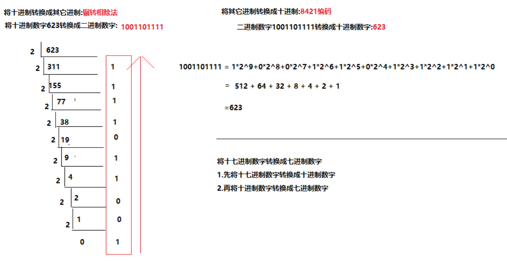

## 类型的转换

```java
/*
	类型的转换
		含义:
			将一种数据类型的数据转换为另外一种数据类型的数据
		分类:
			基本类型的类型转换
			引用类型的类型转换(暂不涉及)
			基本类型和包装类型的类型转换(暂不涉及)
			基本类型和字符串类型的类型转换(暂不涉及)

	基本类型的类型转换
		含义:
			将一种基本类型的数据转换为另外一种基本类型的数据
		分类:
			自动转换(隐式转换)
			强制转换(显式转换)
		格式:
			数据类型1 变量名 = (数据类型1)数据类型2的变量值;
*/
```

### 自动转换(隐式转换)

```java
/*
	自动转换(隐式转换)
		含义:
			将取值范围较小的数据类型转换成取值范围较大的数据类型
		关系:
			基本类型取值范围从小到大的关系:
				byte < short < int < long < float < double
						char < int < long < float < double
		注意:
			1.基本类型间的转换是七种数值类型间的转换,boolean类型无法进行转换
			2.自动转换也可以使用类型转换的格式,往往将(数据类型)省略不写
*/

public class BasicDemo02 {
	public static void main (String[] args) {
		byte var1 = 123;
		int var2 = 123;

		//var1 = var2;//错误: 不兼容的类型: 从int转换到byte可能会有损失
		var2 = var1;

		long var3 = 123L;
		float var4 = 12.34F;

		//var3 = var4;//错误: 不兼容的类型: 从float转换到long可能会有损失
		var4 = var3;

		char var5 = 'a';
		var2 = var5;
		//var5 = var2;//错误: 不兼容的类型: 从int转换到char可能会有损失

		short var6 = 123;
		//var5 = var6;//错误: 不兼容的类型: 从short转换到char可能会有损失
		//var6 = var5;//错误: 不兼容的类型: 从char转换到short可能会有损失
	}
}
```

```java
/*
	在内存中,每创建一个float类型变量,占内存4个字节,每创建一个long类型变量,占内存8个字节,
	为什么float类型可以存储long类型数据?
		1.基本类型的类型转换只与数据类型的取值范围有关,和所在内存大小无关
		2.float类型之所有可以用更少的字节存储更大或更小的数据,因为float或double底层不是十进制小数,而是一套IEEE754浮点计数标准
		3.证明long的取值范围小于float的取值范围
			long的取值范围中最大的整数 < 2^63
			float的取值范围中最大的整数 > 3.4*10^38 > 2*10^38 > 2*8^38 = 2*(2^3)^38 = 2*2^114 = 2^115 > 2^63

*/
```

### 强制类型(显式转换)

```java
/*
	基本类型的强制类型(显式转换)
		含义:
			将取值范围较大的数据类型转换成取值范围较小的数据类型
		格式:
			取值范围较小的数据类型 变量名 = (取值范围较小的数据类型)取值范围较大数据类型的变量值;
		注意:
			在实际应用中尽量避免使用基本类型的强制转换,可能会发生数据的精度损失或数据溢出
*/
public class BasicDemo04 {
	public static void main (String[] args) {
		int var = (int)3.99;
		System.out.println(var);

		System.out.println("=============================");

		byte num = (byte)130;// 130 = 127 + 3  -128 -127 -126
		System.out.println(num);
	}
}
```

### 类型转换注意事项

```java
/*
	基本类型的类型转换注意事项
		1.类型类型的自动转换和强制转换都可以使用基本类型转换的格式,自动转换可以省略不写(数据类型);
		2.基本类型间的转换是七种数值类型间的转换,boolean类型无法进行转换
		3.在实际应用中尽量避免使用基本类型的强制转换,可能会发生数据的精度损失或数据溢出
		4.byte,short,char这三种基本类型只要参与数学运算,先自动提升成int类型,再参与数学运算;如果没有数学运算,依旧按照基本类型的自动转换关系进行转换
*/

public class BasicDemo05 {
	public static void main (String[] args) {
		float var1 = 3.3F;
		float var2 = 4.4F;
		float var3 = var1 + var2;
		System.out.println(var3);

		byte num1 = 3;
		byte num2 = 4;
		//byte num3 = num1 + num2;
		//System.out.println(num3);

		short s = num1;
	}
}
```

## 两种常见的输出语句

```java
/*
	两种常见的输出语句:
		换行输出语句:
			含义:
				将内容进行输出打印,并进行回车换行操作
			格式:
				System.out.println(内容);
			注意:
				当换行输出语句没有任何输出内容时,直接进行换行处理
		直接输出语句
			含义:
				将内容进行输出打印,不进行其它操作
			格式:
				System.out.print(内容);
			注意:
				当直接输出语句没有任何输出内容时,程序"编译报错"
*/

public class BasicDemo06 {
	public static void main (String[] args) {
		System.out.println("Hello");

		System.out.print();

		System.out.println("World");

		System.out.println("====================");

		System.out.print("Hello");
		System.out.print("World");
	}
}
```

## 常量

```java
/*
	常量:
		含义:
			在程序执行的过程中,其值不可以发生改变的量
		分类:
			自定义常量(暂不涉及)
				含义:由开发人员定义的常量,并且有final关键字进行修饰
			字面值常量
				含义:单独的数据值,无法直接进行使用,需要结合其它语句进行使用
				分类:
					整数字面值常量
					浮点字面值常量
					字符字面值常量
					布尔字面值常量
					字符串字面值常量
					空常量(暂不涉及)
						null
				注意:
					字面值常量无法单独使用,需要结合其它语句进行使用
					null无法在输出语句中进行打印

*/

public class BasicDemo07 {
	public static void main (String[] args) {
		//直接打印字面值常量
		System.out.println(123);
		System.out.println(3.14);
		System.out.println('a');
		System.out.println(true);
		System.out.println("HelloWorld");
		//System.out.println(null);
	}
}
```

```java
/*
	常量的注意事项:
		1.在给byte,short,char这三种数据类型进行整数赋值操作时,初始化值如果是字面值常量,且该初始化值还在其数据类型的取值范围内,JVM中的存储常量的内存区域会将其自动优化为该数据类型,将这一过程称之为"常量优化机制"
		2.在给变量进行初始化赋值操作时,如果初始化值是一个表达式,运算符号两边的数据都是字面值常量,且运算的结果还在其数据类型的取值范围内,JVM中的编译器在编译器自动将其运算完毕,将这一过程称之为"常量优化机制"
*/

public class BasicDemo08 {
	public static void main (String[] args) {
		byte var1 = 123;
		int var2 = 123;

		//var1 = var2;

		System.out.println("=====================");

		byte b1 = 3;
		byte b2 = 4;
		byte b3 = 3 + 4;
	}
}
```

## 运算符

```java
/*
	运算符:
		含义:
			在程序中用来连接常量或变量的运算符号
		
	表达式:
		含义:
			在程序中用运算符连接起来的式子

	常见的运算符:
		算术运算符
		赋值运算符
		关系运算符
		逻辑运算符
		三元运算符
		位运算符
*/
```

### 算术运算符

```java
/*
	算术运算符:
		含义:
			进行常量或变量算术操作的运算符
		分类:
			四则运算符
				+ - * /
			取余运算符
				%
			自增运算符
				++
			自减运算符
				--

	四则运算符和取余运算符
		含义:
			针对常量或变量进行数学运算的运算符
		注意:
			/是获取两个数相除的商
			%是获取两个数相除的余数

*/

public class OperatorDemo02 {
	public static void main (String[] args) {
		int a = 3;
		int b = 4;

		System.out.println(a + b);
		System.out.println(a - b);
		System.out.println(a * b);
		System.out.println(a / b);
		System.out.println(a % b);
	}
}
```

### 四则运算符和取余运算符的练习

```java
/*
	四则运算符和取余运算符的练习

	需求:获取指定四位数中各个位上的数字
*/

public class OperatorDemo03 {
	public static void main (String[] args) {
		//声明并初始化四位整数
		int num = 4396;

		//获取该四位整数中各个位上的数字
		int ge = num % 10;
		int shi = num / 10 % 10;
		int bai = num / 100 % 10;
		int qian = num / 1000 % 10;

		//打印各个位上的数字
		System.out.println(qian);
		System.out.println(bai);
		System.out.println(shi);
		System.out.println(ge);
	}
}
```

### +号的多种用法

```java
/*
	+号的多种用法:
		1.加法运算符
		2.字符串连接符
			当+号两边中的任意一边出现了字符串时,+号不再起到加法运算符的作用,而是变成了字符串连接符,将运算符两边的内容进行连接操作
*/

public class OperatorDemo04 {
	public static void main (String[] args) {
		String str1 = "Hello";
		String str2 = "World";
		String str3 = str1 + str2;

		System.out.println(str3);
	}
}
```

```java
public class OperatorDemo05 {
	public static void main (String[] args) {
		System.out.println("Hello" + 5 + 20);//Hello520
		System.out.println(5 + 20 + "Hello");//25Hello

		System.out.println("=================================");

		System.out.println('a' + 1);//98
		System.out.println("a" + 1);//a1
		System.out.println("" + 'a' + 1);//a1
	}
}
```

### 自增自减运算符

```java
/*
	自增自减运算符
		含义:
			在变量的自身数据基础上进行+1或-1的运算符
		注意:
			自增自减运算符只能变量进行使用,常量无法进行使用
		格式(以++为例):
			++变量名 或者 变量名++
		分类:
			单独使用
				++在前和++在后的结果是一样的
			复合使用
				如果++在前,先自增,再使用
				如果++在后,先使用,在自增
*/

public class OperatorDemo06 {
	public static void main (String[] args) {
		int a = 3;
		int b = 4;

		//a++;
		//++a;
		//b = ++a;
		b = a++;


		System.out.println("a = " + a);
		System.out.println("b = " + b);
	}
}
```

```java
/*
	自增自减运算符的练习
*/

public class OperatorDemo07 {
	public static void main (String[] args) {
		int a = 3;
		//int b = ++a + a++;
		//分析:4(a=4) + 4(a=5) = 8(a=5)


		//int b = a++ + ++a;
		//分析:3(a=4) + 5(a=5) = 8(a=5)


		//int b = a++ + a++;
		//分析:3(a=4) + 4(a=5) = 7(a=5)

		int b = ++a + ++a;
		//分析:4(a=4) + 5(a=5) = 9(a=5)

		System.out.println("a = " + a);
		System.out.println("b = " + b);

		System.out.println("==================================");

		/*
			思考题1:x=3,x=x++,++在后,先将x=3的值赋值给x,在进行自增,x变成4,但实际结果执行3,为什么?
		*/
		int x = 3;
		x = x++;
		System.out.println("x = " + x);//3

		System.out.println("==================================");

		/*
			思考题2:按照运算符的优先级,有括号先算括号,先执行i++ + 1,结果2,i变成2,再计算i++ * 2,结果4,i变成3,但是实际结果打印3和3,不是3和4,为什么?
		*/

		int i = 1;
		int j = i++ * (i++ + 1);

		System.out.println("i = " + i);//3
		System.out.println("j = " + j);//3
	}
}
```

### 赋值运算符

```java
/*
	赋值运算符:
		含义:
			针对变量或操作进行赋值操作的运算符
		分类:
			直接赋值运算符
				=
			复合赋值运算符
				+= -= *= /= %= ......
				含义:将运算符两边的结果进行运算操作(取决于=之外的符号),再将运算的结果赋值给左边的变量
		注意:
			复合的赋值运算符再将左右两边运算的结果赋值给左边的变量之前,会根据左边变量的数据类型隐藏做了一步强制转换

*/
public class OperatorDemo08 {
	public static void main (String[] args) {
		//声明并初始化变量
		int var = 3;//将整数3赋值给int类型的变量var


		int a = 3;
		int b = 4;

		a += b;//相当于 a = a + b 
		System.out.println("a = " + a);
		System.out.println("b = " + b);

		System.out.println("==========================");

		byte b1 = 3;
		byte b2 = 4;

		b2 += b1;//b2 = b1 + b2;
	}
}
```

### 关系运算符

```java
/*
	关系运算符:
		含义:
			比较变量或常量之间关系的运算符
		分类:
			< <= > >= == !=
		注意:
			关系表达式的结果一定是boolean值
	
	==:比较基本类型数据值是否相等
	!=:比较基本类型数据值是否不等

		
*/

public class OperatorDemo09 {
	public static void main (String[] args) {
		int a = 3;
		int b = 4;
		int c = 4;

		System.out.println(a < b);//true
		System.out.println(a <= b);//true
		System.out.println(b < c);//false
		System.out.println(b <= c);//true

		System.out.println("===========================");

		System.out.println(a > b);//false
		System.out.println(a >= b);//false
		System.out.println(b > c);//false
		System.out.println(b >= c);//true

		System.out.println("===========================");

		System.out.println(a == b);//false
		System.out.println(b == c);//true

		System.out.println("===========================");

		System.out.println(a != b);
		System.out.println(b != c);
	}
}
```

### 逻辑运算符

```java
/*
	逻辑运算符
		含义:
			用来连接结果是boolean值表达式的运算符
		分类:
			单独逻辑运算符
				&	|	^	!
			短路逻辑运算符
				&&	||

	单独逻辑运算符
		运算符&:
			含义:
				与,且
			特点:
				有false则false
			场景:
				判断多个条件是否同时满足

		运算符|:
			含义:
				或
			特点:
				有true则true
			场景:
				判断多个条件是否至少满足其中一条

		运算符^:
			含义:
				异或
			特点:
				相同则false,不同则true
			场景:
				判断多个条件结果是否不一致

		运算符!:
			含义:
				非
			特点:
				非true则false,非false则true
			场景:
				针对boolean值结果进行取反
*/
public class OperatorDemo10 {
	public static void main (String[] args) {
		int a = 3;
		int b = 4;
		int c = 5;

		//运算符&
		System.out.println(a > b & a > c);//false & false
		System.out.println(a > b & a < c);//false & true
		System.out.println(a < b & a > c);//true & false
		System.out.println(a < b & a < c);//true & true

		System.out.println("==============================");

		//运算符|
		System.out.println(a > b | a > c);//false | false
		System.out.println(a > b | a < c);//false | true
		System.out.println(a < b | a > c);//true | false
		System.out.println(a < b | a < c);//true | true

		System.out.println("==============================");

		//运算符&
		System.out.println(a > b ^ a > c);//false ^ false
		System.out.println(a > b ^ a < c);//false ^ true
		System.out.println(a < b ^ a > c);//true ^ false
		System.out.println(a < b ^ a < c);//true ^ true

		System.out.println("==============================");

		//运算符!
		System.out.println(!true);
		System.out.println(!false);

		System.out.println(!!!true);
	}
}
```

### 短路逻辑运算符

```java
/*
	短路逻辑运算符
		&& ||

	&和&&的区别:
		&和&&的结果是一样的;&&具有短路效果,当&&前面表达式的结果为false时,后面的表达式不会被执行;&无论前面表达式结果的值是true还是false,后面表达式都会被执行

	|和||的区别:
		|和||的结果是一样的;||具有短路效果,当||前面表达式的结果为true时,后面的表达式不会被执行;|无论前面表达式结果的值是true还是false,后面表达式都会被执行
*/

public class OperatorDemo11 {
	public static void main (String[] args) {
		int a = 3;
		int b = 4;
		int c = 5;

		//运算符&
		System.out.println(a > b & a > c);//false & false
		System.out.println(a > b & a < c);//false & true
		System.out.println(a < b & a > c);//true & false
		System.out.println(a < b & a < c);//true & true

		System.out.println("========================");

		//运算符&&
		System.out.println(a > b && a > c);//false && false
		System.out.println(a > b && a < c);//false && true
		System.out.println(a < b && a > c);//true && false
		System.out.println(a < b && a < c);//true && true

		System.out.println("========================");

		int x = 3;

		System.out.println(false && ++x > 3);

		System.out.println("x = " + x);
	}
}
```

### 三元运算符

```java
/*
	三元运算符:
		含义:
			含有三个未知量的运算符
		格式:
			关系表达式 ? 结果值1 :结果值2
		流程:
			1.先确认关系表达式的结果是true还是false;
			2.在获取关系表达式结果的同时,统一结果值1和结果值2的数据类型
			3.如果是true,执行"统一数据类型后的"结果值1;
			  如果是false,执行"统一数据类型后的"结果值2;

	需求:
		获取两个整数的较大值
*/

public class OperatorDemo12 {
	public static void main (String[] args) {
		int a = 3;
		int b = 4;
		System.out.println(a > b ? a : b);

		System.out.println("=====================");

		System.out.println(false ? 3.6 : 5);
	}
}
```

### 原码,反码,补码

```java
/*
	原码,反码,补码:
		相同点:
			1.原码,反码,补码都是特殊的二进制形式表示法
			2.原码,反码,补码在二进制数据中规定的符号位,最高位即为符号位,正数为0,负数为1
			3.原码,反码,补码在二进制数据中根据在内存中占用字节大小进行足位存储,不足位数通过补0进行占位
				例如:int num = 2;
					普通二进制:10
					特殊二进制:
						00000000 00000000 00000000 00000010
		不同点:
			原码:计算机中显示数据的二进制特殊表示形式
			补码:计算机中底层进行数据运算的二进制特殊表示形式
			反码:进行原码和补码相互转换的中间量

	底层存储和操作数据的过程分析:
		1.显示数据==>数据原码
			(1)根据显示数据占用字节数确定二进制的总位数
			(2)根据显示数据的正负确定二进制原码的符号位
		2.数据原码==>数据反码
			如果符号位是0,数据反码与其原码相同
			如果符号位是1,数据反码在其原码的基础上进行逐位取反,符号位保持不变
		3.数据反码==>数据补码
			如果符号位是0,数据补码与其反码相同
			如果符号位是1,数据补码在其反码的基础上进行+1运算
		4.操作补码==>结果补码
			根据实际需求进行运算操作
		5.结果补码==>结果反码
			如果符号位是0,结果反码与其补码相同
			如果符号位是1,数据反码在其补码的基础上进行-1运算
		6.结果反码==>结果原码
			如果符号位是0,结果原码与其反码相同
			如果符号位是1,数据原码在其反码的基础上进行逐位取反,符号位保持不变
		7.结果原码==>结果数据
			(1)将除符号位外,所有二进制数进行将十进制的转换
			(2)如果符号位是1,在十进制结果数据的前面补上负号

	将int类型的130强制转换成byte类型后,结果为-126的存储操作过程:
		1.显示数据==>数据原码
			数据原码:00000000 00000000 00000000 10000010
		2.数据原码==>数据反码
			数据反码:00000000 00000000 00000000 10000010
		3.数据反码==>数据补码
			数据补码:00000000 00000000 00000000 10000010
		4.操作补码==>结果补码
			结果补码:10000010
		5.结果补码==>结果反码
			结果反码:10000001
		6.结果反码==>结果原码
			结果原码:11111110
		7.结果原码==>结果数据
			结果数据:-126
*/
```

### 位运算符

```java
/*
	位运算符:
		含义:
			直接针对二进制位进行操作的运算符
		分类:
			按位运算符
				& | ^ ~
			移位运算符
				<< >> >>>

	按位运算符:
		运算符&:
			含义:
				按位与
			特点:
				当两位相同时为1时才返回1,包括符号位

		运算符|:
			含义:
				按位或
			特点:
				当两位有一位为1即可返回1,包括符号位

		运算符^:
			含义:
				按位异或
			特点:
				当两位相同时返回0,不同时返回1,包括符号位

				^:按位异或,当两位相同时返回0,不同时返回1
*/
public class OperatorDemo14 {
	public static void main (String[] args) {
		//按位与
		System.out.println(6 & 23);
		System.out.println(-6 & -23);

		System.out.println("==============================");

		//按位或
		System.out.println(6 | 23);
		System.out.println(-6 | -23);

		System.out.println("==============================");

		//按位异或
		System.out.println(6 ^ 23);
		System.out.println(-6 ^ -23);

		System.out.println("==============================");

		//按位非
		System.out.println(~6);
		System.out.println(~-6);
	}
}
```
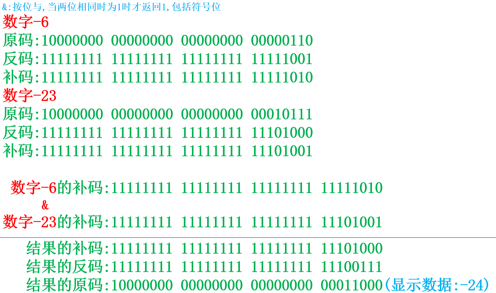
### 移位运算符

```java
/*
	移位运算符
		含义:
			移动二进制位操作的运算符
		分类:
			<< >> >>>

	左移运算符:
		含义:
			将二进制位往左移动指定的位数,包含符号位
		格式:
			数据 << 位数
		特点:
			将二进制位往左移动指定的位数,符号位也随之移动,如果低位出现了空位,补0进行占位操作
			
	右移运算符:
		含义:
			将二进制位往右移动指定的位数,包含符号位
		格式:
			数据 >> 位数
		特点:
			将二进制位往右移动指定的位数,符号位也随之移动,如果高位出现了空位,补和符号位相同的数字进行占位操作

	无符号右移运算符:
		含义:
			将二进制位往右移动指定的位数,无需关注符号位
		格式:
			数据 >>> 位数
		特点:
			将二进制位往右移动指定的位数,符号位也随之移动,如果高位出现了空位,补0进行占位操作
*/

public class OperatorDemo15 {
	public static void main (String[] args) {
		System.out.println(6 << 2);
		System.out.println(-6 << 2);

		System.out.println(6 << 29);
		System.out.println(-6 << 29);

		System.out.println("==================================");

		System.out.println(6 >> 2);
		System.out.println(-6 >> 2);

		System.out.println("==================================");

		System.out.println(6 >>> 2);
		System.out.println(-6 >>> 2);
	}
}
```

### 运算符的优先级

```java
/*
	运算符的优先级
		1.Java中运算符的优先级和数学中的符号的优先级不同,数学中符号的优先级,谁优先级高就优先执行谁,但程序中的优先级是程序从左到右依次执行,如果碰到比执行运算符优先级更高的运算符,先将其作为一个整体进行计算
		2.当表达式中出现了自增自减运算符,且同时出现了(),需要注意运算符优先级问题
		3.当赋值运算符左右两边出现了相同的变量,需要注意运算符优先级问题
		4.如果在程序中出现了复合的赋值运算符,先进行拆分,再进行运算,在拆分的时候需要注意:复合的赋值运算符,将左边的变量和右边的式子进行运算操作,再根据左边变量的数据类型进行强制转换后赋值给左边的变量,而不是将右边的式子和左边的变量进行运算操作
		5.在程序中()只作为一个整体进行运算
		6.不要把一个表达式写得过于复杂，如果一个表达式过于复杂，则把它分成几步来完成；
		7.不要过多的依赖运算的优先级来控制表达式的执行顺序，这样可读性太差，尽量使用()来控制表达式的执行顺序

*/

public class OperatorDemo {
	public static void main (String[] args) {
		int i = 1;
		int j = i++ * (i++ + 1);//1(i=2) * 3(i=3) = 3
		System.out.println("i = " + i);//3
		System.out.println("j = " + j);//3

		System.out.println("======================================");

		int x = 3;//3==>4==>3
		x = x++;//先使用,后自增:先3的值存储在内存中的临时数据区
		System.out.println("x = " + x);

		System.out.println("======================================");

		int a = 2;
		int b = 5;
		//a *= b + 5;
		//a = a * (b + 5);
		a *= a++;
		//a = a * a++;//4,2==>3==>4
		//a = a++ * a;//6,2==>3==>6
		System.out.println("a = " + a);
		//System.out.println("b = " + b);
	}
}
```

## 流程控制

```java
/*
	所有编程语言都会遵循最基础的结构:顺序结构,代码从上至下依次执行
	
	流程控制:
		含义:
			针对程序中的代码进行逻辑执行,整体遵循顺序结构和自身流程控制执行
		分类:
			流程控制语句:
				含义:
					进行流程控制的语句,编写在代码块中
				分类:
					分支结构语句
						条件判断语句:if语句
						条件选择语句:switch语句
					循环结构语句
						for语句
						while语句
						dowhile语句

			流程控制代码块
				含义:
					进行流程控制的代码块,编写在类文件中
				分类:
					调用结构:
						普通方法
						构造器
						构造器代码块
						......

	学习流程控制的小技巧:
		1.记住流程控制的基本格式
		2.记住流程控制的执行流程
		3.精通流程控制的实际应用
*/
```

### if语句格式

```java
/*
	if语句第一种格式:
		if (条件判断语句) {
			语句体
		}

	执行流程:
		1.先确认条件判断语句的结果是true还是false;
		2.如果是true,执行语句体;
		  如果是false,if语句结束,继续往下执行;
	
	应用场景:
		只有一种选择情况

	需求:
		判断指定整数是否为偶数,如果是执行打印;
*/

public class IfDemo01 {
	public static void main (String[] args) {
		System.out.println("开始");

		//声明并初始化指定整数
		int num = 624;

		if (num % 2 == 0) {
			System.out.println(num + "是偶数");
		}

		System.out.println("结束");
	}	
}
```

```java
/*
	if语句的第二种格式:
		if (条件判断语句) {
			语句体1
		} else {
			语句体2
		}

	执行流程:
		1.先确认条件判断语句的结果是true还是false
		2.如果是true,执行语句体1,if语句结束;
		  如果是false,执行语句体2,if语句结束;

	应用场景:
		解决有两种选择情况

	注意事项:
		if语句的第二种格式和三元运算符相比,在实际开发中,更推荐使用if语句的第二种格式,三元运算符可以解决的问题,if语句的第二种格式都可以解决,但是if语句的第二种格式可以解决的问题,三元运算符不一定可以解决

	
	需求:判断指定整数的奇偶性并打印
*/

public class IfDemo02 {
	public static void main (String[] args) {
		//声明并初始化指定整数
		int num = 456;

		//进行num的奇偶性判断
		if (num % 2 == 0) {
			System.out.println(num + "是偶数");
		} else {
			System.out.println(num + "是奇数");
		}

		System.out.println("================================");

		String result = num % 2 == 0 ? num + "是偶数" : num + "是奇数";

		System.out.println(result);
	}
}
```

```java
/*
	if语句的第三种格式:
		if (条件判断语句1) {
			语句体1
		} else if (条件判断语句2) {
			语句体2
		}
		......
		else if (条件判断语句n) {
			语句体n
		} else {
			语句体n+1
		}

	执行流程:
		1.先确认条件判断语句1的结果是true,还是false
		2.如果是true,执行语句体1,if语句结束;
		  如果是false,确认条件判断语句2的结果是true,还是false
		......
		3.当所有的条件判断语句的结果是false时,执行else中的语句体n+1;

	应用场景:解决三种及三种以上的选择情况
	
	注意事项:
		if语句第三种格式中的else语句可以省略不写,但是建议写上,因为在特殊场景中不写可能编译报错

	需求:判断两个整数的关系
*/

public class IfDemo03 {
	public static void main (String[] args) {
		int a = 3;
		int b = 4;

		//判断a和b之间的关系
		if (a > b) {
			System.out.println("a > b");
		} else if (a < b) {
			System.out.println("a < b");
		} else {
			System.out.println("a = b");
		}
	}
}
```

```java
/*
	x和y的关系满足如下：
		x>=3 y = 2x + 1;
		-1<x<3 y = 2x;
		x<=-1 y = 2x - 1;
	根据给定的x的值，计算出y的值并输出。
*/
public class IfDemo04 {
	public static void main (String[] args) {
		//声明并初始化x变量
		int x = 5;

		//声明变量y
		int y;

		//针对x进行判断
		if (x >= 3) {
			y = 2 * x + 1;
		} else if (x > -1 && x < 3) {
			y = 2 * x;
		} else {
			y = 2 * x - 1; 
		}

		//打印变量y
		System.out.println("y = " + y);
	}
}
```

```java
/*
	通过指定考试成绩，判断学生等级
		90-100      优秀
		80-89        好
		70-79        良
		60-69        及格
		60以下    不及格
*/

public class IfDemo05 {
	public static void main (String[] args) {
		//声明并初始化学生的考试成绩
		int score = -1;

		if (score >= 90 && score <= 100) {
			System.out.println("优秀");
		} else if (score >= 80 && score <= 89) {
			System.out.println("好");
		} else if (score >= 70 && score <= 79) {
			System.out.println("良");
		} else if (score >= 60 && score <= 69) {
			System.out.println("及格");
		} else if (score >= 0 && score <= 59) {
			System.out.println("不及格");
		} else {
			System.out.println("成绩有误");
		}

		System.out.println("================================");

		if (score >= 0 && score <= 100) {
			if (score >= 90 && score <= 100) {
				System.out.println("优秀");
			} else if (score >= 80 && score <= 89) {
				System.out.println("好");
			} else if (score >= 70 && score <= 79) {
				System.out.println("良");
			} else if (score >= 60 && score <= 69) {
				System.out.println("及格");
			} else {
				System.out.println("不及格");
			}
		} else {
			System.out.println("成绩有误");
		}
	}
}
```

### switch语句的格式

```java
/*
	switch语句的格式:
		switch (数据值) {
			case 待选数据值1:
				语句体1
				break;

			case 待选数据值2:
				语句体2
				break;

			......

			case 待选数据值n:
				语句体n
				break;
			
			default:
				语句体n+1
				break;
		}

	执行流程:
		1.确认switch()中的数据值具体是多少
		2.选择"待选数据值1"和数据值进行匹配,看是否匹配条件;
		3.如果和数据值匹配成功,执行语句体1,执行break,switch语句结束;
		  如果和数据值匹配失败,选择"待选数据值2"和数据值进行匹配,看是否匹配条件;
		......
		4.当所有的待选数据值都和数据值匹配失败,执行default中语句体n+1,执行break,switch语句结束
*/

public class SwitchDemo01 {
	public static void main (String[] args) {
		//声明并初始化数字变量
		int weekday = 8;

		switch (weekday) {
			case 1:
				System.out.println("星期一");
				break;
			case 2:
				System.out.println("星期二");
				break;
			case 3:
				System.out.println("星期三");
				break;
			case 4:
				System.out.println("星期四");
				break;
			case 5:
				System.out.println("星期五");
				break;
			case 6:
				System.out.println("星期六");
				break;
			case 7:
				System.out.println("星期日");
				break;
			default:
				System.out.println("哥们你是火星来的吧,地球上没有这个星期");
				break;
		}
	}
}
```

```java
/*
	switch语句的注意事项:
		1.switch语句()中数据值的数据类型:
			基本类型:只支持int类型,根据基本类型转换,间接支持byte,short,char
			引用类型:
				在JDK5.0(包含)以后,可以支持枚举(Enum)类型
				在JDK7.0(包含)以后,可以支持字符串(String)类型
		2.switch语句中default可以省略不写,推荐写上
		3.switch语句中case和default位置可以互换,但不影响执行流程
		4.switch语句中break可以省略不写,如果不写会出现case穿透效果
			
*/

public class SwitchDemo02 {
	public static void main (String[] args) {
		int num = 1;

		switch (num) {
			case 1:
				System.out.println("你好");
				//break;
			default:
				System.out.println("苗苗老师好");
				//break;
			case 2:
				System.out.println("我好");
				//break;
			case 3:
				System.out.println("大家好");
				//break;
		}
	}
}
```

```java
/*
  需求：定义一个月份，输出该月份对应的季节。
  		一年有四季`````
  		3,4,5	春季
  		6,7,8	夏季
  		9,10,11	秋季
  		12,1,2	冬季
  
  分析：
  		A:指定一个月份
  		B:判断该月份是几月,根据月份输出对应的季节
  			if
  			switch

	if语句和switch语句的区别:
		底层处理阶段,switch语句的执行效率更高,在硬件过剩的今天,这点效率可以忽略不计,在实际开发中,更推荐使用if语句
*/

public class SwitchDemo03 {
	public static void main (String[] args) {
		//声明并初始化月份变量
		int month = 6;

		if (month == 1) {
			System.out.println("冬季");
		} else if (month == 2) {
			System.out.println("冬季");
		} else if (month == 3) {
			System.out.println("春季");
		} else if (month == 4) {
			System.out.println("春季");
		} else if (month == 5) {
			System.out.println("春季");
		} else if (month == 6) {
			System.out.println("夏季");
		} else if (month == 7) {
			System.out.println("夏季");
		} else if (month == 8) {
			System.out.println("夏季");
		} else if (month == 9) {
			System.out.println("秋季");
		} else if (month == 10) {
			System.out.println("秋季");
		} else if (month == 11) {
			System.out.println("秋季");
		} else if (month == 12) {
			System.out.println("冬季");
		} else {
			System.out.println("月份有误");
		}

		System.out.println("========================");

		if (month == 3 || month == 4 || month == 5) {
			System.out.println("春季");
		} else if (month == 6 || month == 7 || month == 8) {
			System.out.println("夏季");
		} else if (month == 9 || month == 10 || month == 11) {
			System.out.println("秋季"); 
		} else if (month == 12 || month == 1 || month == 2) {
			System.out.println("冬季");
		} else {
			System.out.println("月份有误");
		}

		System.out.println("========================");

		switch (month) {
			case 1:
				System.out.println("冬季");
				break;
			case 2:
				System.out.println("冬季");
				break;
			case 3:
				System.out.println("春季");
				break;
			case 4:
				System.out.println("春季");
				break;
			case 5:
				System.out.println("春季");
				break;
			case 6:
				System.out.println("夏季");
				break;
			case 7:
				System.out.println("夏季");
				break;
			case 8:
				System.out.println("夏季");
				break;
			case 9:
				System.out.println("秋季");
				break;
			case 10:
				System.out.println("秋季");
				break;
			case 11:
				System.out.println("秋季");
				break;
			case 12:
				System.out.println("冬季");
				break;
			default:
				System.out.println("月份有误");
				break;
		}

		System.out.println("========================");

		switch (month) {
			case 3:
			case 4:
			case 5:
				System.out.println("春季");
				break;

			case 6:
			case 7:
			case 8:
				System.out.println("夏季");
				break;

			case 9:
			case 10:
			case 11:
				System.out.println("秋季");
				break;

			case 12:
			case 1:
			case 2:
				System.out.println("冬季");
				break;
			default:
				System.out.println("月份有误");
				break;
		}
	}
}
```

### for语句的格式

```java
/*
	for语句的格式:
		for (初始化语句;循环条件语句;迭代语句) {
			循环体语句
		}

	执行流程:
		1.先执行初始化语句;
		2.确认循环条件语句的结果是true还是false
		3.如果是true,执行循环体语句;
		  如果是false,for语句结束;
		4.执行迭代语句
		5.跳回第2步,继续执行

	需求:打印10遍HelloWorld
*/

public class ForDemo01 {
	public static void main (String[] args) {
		System.out.println("HelloWorld");
		System.out.println("HelloWorld");
		System.out.println("HelloWorld");
		System.out.println("HelloWorld");
		System.out.println("HelloWorld");
		System.out.println("HelloWorld");
		System.out.println("HelloWorld");
		System.out.println("HelloWorld");
		System.out.println("HelloWorld");
		System.out.println("HelloWorld");

		System.out.println("==============================");
		
		for (int i = 1; i <= 10 ; i++ ) {
			System.out.println("HelloWorld");
		}
	}
}
```

```java

public class ForDemo02 {
	public static void main (String[] args) {
		System.out.println(1);
		System.out.println(2);
		System.out.println(3);
		System.out.println(4);
		System.out.println(5);

		System.out.println("=============================");

		for (int i = 1; i <= 5 ; i++) {
			System.out.println(i);
		}

		System.out.println("=============================");

		for (int i = 5; i >= 1 ; i-- ) {
			System.out.println(i);
		}
	}
}
```

```java
/*
	通过for语句计算1-5之间的累加和

*/

public class ForDemo03 {
	public static void main (String[] args) {
		//声明并初始化求和变量
		int sum = 0;

		/*
		sum = sum + 1;
		sum = sum + 2;
		sum = sum + 3;
		sum = sum + 4;
		sum = sum + 5;
		*/

		for (int i = 1; i <= 5 ; i++ ) {
			sum += i;//sum = sum + i;
		}

		System.out.println("sum = " + sum);
	}
}
```

```java
/*
	通过for语句获取1-100之间的偶数之和
*/

public class ForDemo04 {
	public static void main (String[] args) {
		//声明并初始化求和变量
		int sum = 0;

		//遍历1-100之间所有整数
		for (int i = 1; i <= 100 ; i++ ) {
			//判断每个整数是否为偶数
			if (i % 2 == 0) {
				sum += i;
			}
		}

		System.out.println("sum = " + sum);
	}
}
```

```java
/*
  练习：打印所有的水仙花数
  
  分析：
  		什么是水仙花数呢?
  			所谓的水仙花数是指一个三位数，其各位数字的立方和等于该数本身。
 			举例：153就是一个水仙花数。
 			153 = 1*1*1 + 5*5*5 + 3*3*3
 
 		1.三位数其实就告诉了我们水仙花数的范围
 			100-999
 		2.如何获取一个数据的每一个位上的数呢?
 			举例：我有一个数据153，请问如何获取到个位，十位，百位
 			个位：153%10 = 3;
 			十位：153/10%10 = 5;
 			百位：153/10/10%10 = 1;
 			千位：...
 			万位：...
 		3.让每个位上的立方和相加，并和该数据进行比较，如果相等，就说明该数据是水仙花数，在控制台输出
*/

public class ForDemo05 {
	public static void main (String[] args) {
		//遍历所有的三位数
		for (int i = 100; i < 1000; i++) {
			//获取每个三位数的个位,十位,百位
			int ge = i % 10;
			int shi = i / 10 % 10;
			int bai = i / 100 % 10;

			//进行数据的筛选
			if (i == bai*bai*bai + shi*shi*shi + ge*ge*ge) {
				System.out.println(i);
			}
		}
	}
}
```

```java
/*
	打印所有的水仙花数共有多少个
*/

public class ForDemo06 {
	public static void main (String[] args) {
		//声明并初始化水仙花数的计数器变量
		int count = 0;

		//遍历所有的三位数
		for (int i = 100; i < 1000 ;i++ ) {
			//获取每个三位数的个位,十位,百位
			int ge = i % 10;
			int shi = i / 10 % 10;
			int bai = i / 100 % 10;

			//针对数据进行筛选
			if (i == bai*bai*bai + shi*shi*shi + ge*ge*ge) {
				//符合要求,计数器变量累加
				count++;
			}
		}

		//打印计数器变量
		System.out.println("count = " + count);
	}
}
```

```java
/*
	分析以下需求，并用代码实现：
	(1)打印出四位数字中个位+百位=十位+千位并且个位数为偶数，千位数为奇数的数字,并打印符合条件的数字的个数
	(2)符合条件的数字,每行显示5个,用空格隔开,打印格式如下:
		1012 1034 1056 1078 1100 
		1122 1144 1166 1188 1210
		//......
		符合条件的数字总共有: 165个
*/

public class ForDemo07 {
	public static void main (String[] args) {
		//声明并初始化计数器变量
		int count = 0;

		//遍历四位数
		for (int i = 1000; i < 10000 ; i++ ) {
			//获取每个四位数字的各个位上的数字
			int ge = i % 10;
			int shi = i / 10 % 10;
			int bai = i / 100 % 10;
			int qian = i / 1000 % 10;

			//进行数据的筛选
			if ((ge + bai == shi + qian) && (ge % 2 == 0) && (qian % 2 == 1)) {
				//符合条件,计数器累加
				count++;


				//按照规则打印符合要求数据
				if (count % 5 == 0) {
					System.out.println(i);
				} else {
					System.out.print(i + " ");
				}
			}
		}

		//打印计数器变量
		System.out.println("符合条件的数字总共有: " + count + "个");
	}
}
```

### while语句的格式

```java
/*
	while语句的格式:
		while (循环条件语句) {
			循环体语句
		}

	执行流程:
		1.确认循环条件语句的结果是true还是false
		2.如果是true,执行循环体语句;
		  如果是false,while语句结束;
		3.跳回第1步,继续执行

	为了和for循环进行转换,衍生出while的扩展格式:
		初始化语句
		while (循环条件语句) {
			循环体语句
			迭代语句
		}
*/

public class WhileDemo01 {
	public static void main (String[] args) {
		for (int i = 1; i <= 10 ; i++ ) {
			System.out.println("HelloWorld");
		}

		System.out.println("====================");

		int i = 1;
		while (i <= 10) {
			System.out.println("HelloWorld");
			i++;
		}
	}
}
```

```java
/*
 	练习：趣味折纸
  	
 	题目：
 		世界最高山峰是珠穆朗玛峰，它的高度是8848.86米，假如我有一张足够大的纸，它的厚度是0.1毫米请问，折叠多少次，不低于珠穆朗玛峰的高度?
 */

 public class WhileDemo02 {
	public static void main (String[] args) {
		//变量的声明并统一单位
		int zf = 88488600;
		int zhi = 1;

		//声明并初始化计数器变量
		int count = 0;

		//考虑不知道折叠多少次,选择while循环
		while (zhi < zf) {
			//计数器累加
			count++;

			//折叠将原有的厚度*2
			zhi *= 2;
		}

		//打印计数器变量
		System.out.println("count = " + count);
	}
 }
```

### dowhile语句的格式

```java
/*
	dowhile语句的格式
		do {
			循环体语句
		} while (循环条件语句);

	执行流程:
		1.先执行循环体语句
		2.再确认循环条件语句的结果是true还是false;
		3.如果是true,跳回第1步继续执行
		  如果是false,dowhile语句结束

	为了和for语句进行转换,衍生出dowhile语句的扩展格式:
		初始化语句
		do {
			循环体语句
			迭代语句
		} while (循环条件语句); 
*/

public class DoWhileDemo {
	public static void main (String[] args) {
		for (int i = 1; i <= 10 ; i++ ) {
			System.out.println("HelloWorld");
		}

		System.out.println("====================");

		int i = 1;
		do {
			System.out.println("HelloWorld");
			i++;
		} while (i <= 10);
	}
}
```

### 三种循环的区别

```java
/*
	三种循环的区别:
		1.判断和循环的先后顺序
			for语句先判断,后循环
			while语句先判断,后循环
			dowhile语句先循环,后判断
		2.当循环条件语句结果为false时,循环体语句至少执行次数
			for语句至少执行零次
			while语句至少执行零次
			dowhile语句至少执行一次
		3.实际开发中选择:
			有明显的循环次数(范围),选择for语句
			没有明显的循环次数(范围),选择while语句
			不会选择dowhile语句
	
*/
```

```java
/*
	流程控制语句的注意事项
		当流程控制语句{}中有且仅有一行代码时,{}可以省略不写,建议写上
*/

public class BasicDemo03 {
	public static void main (String[] args) {
		if (false) {
			System.out.println("Hello");
			System.out.println("World");
		}


		for (int i = 1; i <= 10 ; i++) {
			System.out.println("Hello");
			System.out.println("World");
		}
	}
}
```

### 控制语句

```java
/*
	控制语句:
		含义:
			控制部分"流程控制语句"和"流程控制代码块"的关键字
		分类:
			break
			continue
			return(暂不涉及)

	break关键字:
		场景:
			1.switch语句中
			2.循环语句中
		含义:
			1.结束所在的switch语句
			2.结束所在的循环语句

	continue关键字:
		场景:
			循环语句中
		含义:
			结束本次循环,继续下一次循环
			
*/
public class BasicDemo04 {
	public static void main (String[] args) {
		
		
		
		for (int i = 1; i <= 10 ; i++) {
			if (i == 3) {
				//break;
				continue;
			}

			System.out.println(i);
		}
	}
}
```

```java
/*
	控制语句的注意事项:
		在同一个作用域中,控制语句的后面不能编写其它代码,否则编译报错,因为永远无法执行
*/

public class BasicDemo05 {
	public static void main (String[] args) {
		for (int i = 1; i <= 10 ; i++) {
			if (i == 3) {
				//break;
				continue;
				System.out.println("HelloWorld");
			}

			System.out.println(i);
		}
	}
}
```

### 死循环语句

```java
/*
	死循环语句:
		含义:
			当循环条件语句的结果永远为true的循环语句
		分类:
			for语句的死循环
			while语句的死循环
			dowhile语句的死循环(忽略)

	for语句的死循环格式
		for (;;) {
			循环体语句
		}

	while语句的死循环格式:
		while (true) {
			循环体语句
		}

	for语句的死循环格式和while语句的死循环格式的区别:
		1.在实际开发中,更推荐使用while的死循环格式,该格式浅显易懂;
		2.如果开发的项目不是业务系统,而是算法,设计模式,框架,编程语言的源码,更推荐使用for语句的死循环,因为执行效率更高
*/
public class BasicDemo01 {
	public static void main (String[] args) {
		/*
		for (;;) {
			System.out.println("HelloWorld");
		}
		*/

		while (true) {
			System.out.println("HelloWorld");
		}
	}
}
```

### 循环嵌套语句

```java
/*
	循环嵌套语句:
		含义:
			在循环语句中存在另外一个循环语句(指代for语句的嵌套)
		解释:
			外层循环语句:声明在外面的循环语句
			内层循环语句:声明在外层循环语句的循环体位置上的循环语句
			外层循环语句和内层循环语句是一组相对的概念
		格式:
			for (外层循环的初始化语句;外层循环的循环条件语句;外层循环的迭代语句) {
				for (内层循环的初始化语句;内层循环的循环条件语句;内层循环的迭代语句) {
					内层循环的循环体语句
				}
			}
		执行流程:
			1.先执行外层循环的初始化语句;
			2.再确认外层循环的循环条件语句的结果是true还是false
			3.如果是false,循环嵌套语句结束;
			  如果是true,执行外层循环的循环体语句;
			  a.执行内层循环的初始化语句
			  b.确认内层循环的循环条件语句的结果是true还是false
			  c.如果是false,内层循环语句结束,继续执行第4步;
			    如果是true,执行内存循环的循环体语句;
			  d.执行内层循环的迭代语句;
			  e.跳回第b步,继续执行
			4.执行外层循环的迭代语句
			5.跳回第2步继续执行

	需求:按照固定的格式打印一天中的时间
		格式:
			XX时XX分
*/
public class BasicDemo02 {
	public static void main (String[] args) {
		//外层循环:控制小时
		for (int h = 0; h < 24 ; h++) {
			//内层循环:控制分钟
			for (int m = 0; m < 60 ; m++) {
				System.out.println(h + "时" + m + "分");
			}
		}
	}
}
```

```java
/*
	循环嵌套语句的注意事项:
		1.循环嵌套语句中外层循环的初始化语句执行了1次
		2.循环嵌套语句中内层循环的初始化语句执行了"外层循环的循环次数"次
		3.循环嵌套语句中内层循环的循环体语句执行了"外层循环的循环次数 * 内层循环的循环次数"次
		4.循环嵌套语句嵌套的层数越多,循环次数越多,执行效率越低,在实际应用中,尽量避免使用过程层数的循环嵌套语句,一般情况下,使用到双层循环嵌套即可,三层及以上肯定有简化方式
*/
public class BasicDemo03 {
	public static void main (String[] args) {
		for (int bai = 1; bai < 10 ; bai++ ) {
			for (int shi = 0; shi < 10 ; shi++ ) {
				for (int ge = 0; ge < 10 ; ge++ ) {
					System.out.println(bai*100 + shi*10 + ge*1);
				}
			}
		}

		System.out.println("================================");

		for (int i = 100; i < 1000 ; i++ ) {
			System.out.println(i);
		}
	}
}
```

```java
/*
	花100文钱买100只鸡
	公鸡5文1只
	母鸡3文1只
	小鸡1文3只
	花100文钱正好买100只鸡

	思路:
		一种一种的可能性进行尝试
*/
public class BasicDemo04 {
	public static void main (String[] args) {
		for (int gong = 0; gong <= 100 ; gong++ ) {
			for (int mu = 0; mu <= 100 ; mu++) {
				for (int xiao = 0; xiao <= 100 ; xiao++ ) {
					//进行数据筛选
					if ((gong + mu + xiao == 100) && (5*gong + 3*mu + xiao/3 == 100) && (xiao % 3 == 0)) {
						System.out.println("公鸡有"+gong+"只，母鸡有"+mu+"只，小鸡有"+xiao+"只");
					}
				}
			}
		}
	}
}
```

```java
/*
	百钱买百鸡的优化
*/

public class BasicDemo05 {
	public static void main (String[] args) {

		//循环次数:1030301
		for (int gong = 0; gong <= 100 ; gong++ ) {
			for (int mu = 0; mu <= 100 ; mu++) {
				for (int xiao = 0; xiao <= 100 ; xiao++ ) {
					//进行数据筛选
					if ((gong + mu + xiao == 100) && (5*gong + 3*mu + xiao/3 == 100) && (xiao % 3 == 0)) {
						System.out.println("公鸡有"+gong+"只，母鸡有"+mu+"只，小鸡有"+xiao+"只");
					}
				}
			}
		}

		System.out.println("=================================");

		//循环次数:72114
		for (int gong = 0; gong <= 20 ; gong++ ) {
			for (int mu = 0; mu <= 33 ; mu++) {
				for (int xiao = 0; xiao <= 100 ; xiao++ ) {
					//进行数据筛选
					if ((gong + mu + xiao == 100) && (5*gong + 3*mu + xiao/3 == 100) && (xiao % 3 == 0)) {
						System.out.println("公鸡有"+gong+"只，母鸡有"+mu+"只，小鸡有"+xiao+"只");
					}
				}
			}
		}

		System.out.println("=================================");

		//循环次数:24276
		for (int gong = 0; gong <= 20 ; gong++ ) {
			for (int mu = 0; mu <= 33 ; mu++) {
				for (int xiao = 0; xiao <= 100 ; xiao+=3 ) {
					//进行数据筛选
					if ((gong + mu + xiao == 100) && (5*gong + 3*mu + xiao/3 == 100)) {
						System.out.println("公鸡有"+gong+"只，母鸡有"+mu+"只，小鸡有"+xiao+"只");
					}
				}
			}
		}

		System.out.println("=================================");

		//循环次数:714
		for (int gong = 0; gong <= 20 ; gong++ ) {
			for (int mu = 0; mu <= 33 ; mu++) {
				int xiao = 100 - gong - mu;
				//进行数据筛选
				if ((5*gong + 3*mu + xiao/3 == 100) && (xiao % 3 == 0) && (xiao >= 0)) {
					System.out.println("公鸡有"+gong+"只，母鸡有"+mu+"只，小鸡有"+xiao+"只");
				}
			}
		}

		System.out.println("=================================");

		//循环次数:714
		for (int gong = 0; gong <= 20 ; gong++ ) {
			for (int xiao = 0; xiao <= 100 ; xiao+=3 ) {
				int mu = 100 - gong - xiao;
				//进行数据筛选
				if ((5*gong + 3*mu + xiao/3 == 100) && (mu >= 0)) {
					System.out.println("公鸡有"+gong+"只，母鸡有"+mu+"只，小鸡有"+xiao+"只");
				}
			}
		}
	}
}
```

```java
/*
	打印1-100之间所有质数
		
	质数:也叫素数,只能被1或者本身进行整除的正整数,1不是质数
	特点:有且仅有两个因数

	思路:
		判断1-100之间每个整数因数的个数
*/

public class BasicDemo06 {
	public static void main (String[] args) {
		for (int i = 1 ; i <= 100 ; i++) {
			//针对每个被除数声明因数统计计数器变量
			int count = 0;

			for (int j = 1; j <= i ; j++) {
				//进行整除判断
				if (i % j == 0) {
					count++;
				}
			}

			if (count == 2) {
				System.out.println(i);
			}
		}
	}
}
```

```java
/*
	质数的优化
*/

public class BasicDemo07 {
	public static void main (String[] args) {
		for (int i = 2 ; i <= 100 ; i++) {
			//针对每个质数设置标记变量,true为质数,false为非质数
			boolean flag = true;

			for (int j = 2; j < i ; j++) {
				//进行整除判断
				if (i % j == 0) {
					flag = false;
					break;
				}
			}

			if (flag) {
				System.out.println(i);
			}
		}

	}
}
```

## 方法

```java
/*
	方法:
		含义:
			在程序中封装特殊功能的代码
		好处:
			1.提高程序的复用性,从而提高开发效率
			2.降低代码的耦合性
				耦合性:程序与程序之间的关联,耦合性越大程序越不方便维护
			
*/
public class MethodDemo01 {
	public static void main (String[] args) {
		method(13);

		System.out.println("打印水仙花数");

		method(5);

		System.out.println("趣味折纸");

		method(7);

		System.out.println("百钱买百鸡");

		method(11);
	}

	public static void method (int num) {
		for (int i = 1; i <= num ; i++) {
			System.out.println("HelloWorld");
		}
	}
}
```

### 方法的特点

```java
/*
	方法的特点:
		1.在程序中方法与方法之间的关系:调用关系(调用结论)
		2.方法特点核心:不调用,不执行
		3.在方法调用的过程中有两个重要的关键性动作:传递参数(传参)和返回结果(返回)
			传参:
				含义:
					在调用方法时,将实际参数传递给形式参数的过程
				解释:
					实际参数(实参):
						方法调用时()参数列表中的参数,是具体的数据值或地址值
					形式参数(形参):
						方法声明时()参数列表中的参数,是具体数据值或地址值类型的声明
				目的:
					在调用者方法中调用了另外一个方法,调用者方法中数据另外一个方法无法直接进行使用,需要通过参数传递形式让另外一个方法可以使用调用者方法中的数据
			返回:
				含义:
					在调用方法结束时,将方法的结果数据返回给调用者的过程
				目的:
					当调用者方法需要另外一个方法中的结果数据时,无法直接进行获取,需要通过返回结果的方式将结果数据返回给调用者方法
*/

public class MethodDemo02 {
	public static void main (String[] args) {
		
	}
}
```

### 方法声明的格式

```java
/*
	方法声明的格式:
		修饰符 返回类型 方法名 (形参类型1 形参名1,形参类型2 形参名2,......形参类型n 形参名n) {
			方法体语句
			return 返回值;
		}

	方法声明格式的解释:
		修饰符:修饰Java程序的语法关键字,目前阶段使用public static进行替代
		返回类型:返回结果数据的数据类型
			分类:无返回类型,基本类型,引用类型
		方法名:给方法起的名字,做到"见名知意"
		():形参列表
			分类:没有形参,基本类型,引用类型
		方法体语句:特殊功能的代码片段
		return:控制语句,(1)结束方法(2)返回结果数据
		返回值:方法的结果数据
			
*/

public class MethodDemo03 {
	public static void main (String[] args) {
		
	}
}
```

```java
/*
	方法声明前的两个明确:
		返回类型:
			明确方法结果数据的数据类型
		形参列表:
			明确需要使用调用者方法中几个数据
			明确每个数据的数据类型和变量名

	需求:通过方法获取两个整数的求和操作
*/

public class MethodDemo04 {
	public static void main (String[] args) {
		
	}

	/*
		两个明确:
			返回类型:int
			形参列表:int a, int b
	*/

	public static int getSum (int a , int b) {
		int sum = a + b;
		return sum;
	}
}
```

### 方法的调用格式

```java
/*
	方法的调用格式:
		如果方法归属于"对象",需要使用对象名进行调用(暂不涉及)
			单独调用(直接调用)
				格式:对象名.方法名(实参);
			输出调用(打印调用)
				格式:System.out.println(对象名.方法名(实参));
			赋值调用
				格式:数据类型 变量名 = 对象名.方法名(实参);

		如果方法归属于"类",需要使用类名进行调用(暂不涉及)
			单独调用(直接调用)
				格式:类名.方法名(实参);
			输出调用(打印调用)
				格式:System.out.println(类名.方法名(实参));
			赋值调用
				格式:数据类型 变量名 = 类名.方法名(实参);

		如果调用同一个类中(或父类中非重写方法)的方法
			单独调用(直接调用)
				格式:方法名(实参);
			输出调用(打印调用)
				格式:System.out.println(方法名(实参));
			赋值调用
				格式:数据类型 变量名 = 方法名(实参);

*/

public class MethodDemo05 {
	public static void main (String[] args) {
		//单独调用(直接调用)
		//getSum(3,4);
		//输出调用(打印调用)
		//System.out.println(getSum(3,4));
		//赋值调用
		int sum = getSum(3,4);
		System.out.println("sum = " + sum);
	}

	/*
		两个明确:
			返回类型:int
			形参列表:int a, int b
	*/

	public static int getSum (int a , int b) {
		int sum = a + b;
		return sum;
	}
}
```

### 栈内存(本地方法栈)

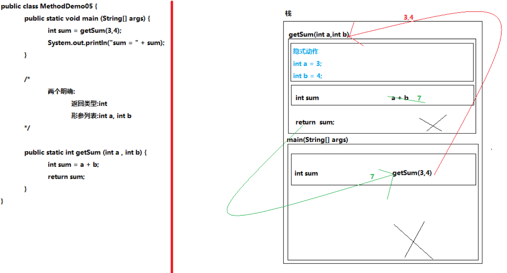

```java
/*
	栈内存(本地方法栈)
		含义:
			JVM内存中存储"正在运行方法"的内存区域
		解释:
			进栈(压栈):方法进行栈内存的过程
			出栈(弹栈):方法在栈内存中消失的过程
		特点:
			1.方法的出栈是立即出栈
			2.方法进栈和出栈遵循"先进后出,后进先出"规则
*/

public class MethodDemo06 {
	
}
```

```java
/*
	需求:通过方法实现两个整数比较是否相同功能
*/

public class MethodDemo07 {
	public static void main (String[] args) {
		boolean result = compare(3,4);

		System.out.println(result);
	}

	/*
		两个明确:
			返回类型:boolean
			形参列表:int a,int b
	*/
	public static boolean compare (int a,int b) {
		/*
		if (a == b) {
			return true;
		} else {
			return false;
		}
		*/
		//return a == b ? true : false;

		return a == b;
	}
}
```

```java
/*
	通过方法实现1到100的累加和
*/

public class MethodDemo08 {
	public static void main (String[] args) {
		int sum = getSum();
		System.out.println("sum = " + sum);

		System.out.println("==========================");

		sum = getSum(1,100); 
		System.out.println("sum = " + sum);
	}

	/*
		两个明确:
			返回类型:int
			形参列表:int start , int end
	*/
	public static int getSum (int start , int end) {
		//声明并初始化求和变量
		int sum = 0;

		for (int i = start; i <= end ; i++) {
			sum += i;
		}

		return sum;
	}

	/*
		两个明确:
			返回类型:int
			形参列表:没有形参
	*/
	public static int getSum () {
		//声明并初始化求和变量
		int sum = 0;

		for (int i = 1; i <= 100 ; i++ ) {
			sum += i;
		}

		return sum;
	}
}
```

```java
/*
	需求:通过方法实现打印指定次数的HelloWorld

	void关键字:
		含义:
			方法没有返回值
		作用:
			当方法没有返回值时,返回类型的位置也不能空着,需要使用void关键字进行占位
		注意:
			1.当方法的返回类型为void时,调用方式只能使用单独调用(直接调用)
			2.当方法的返回类型为void时,方法的return关键字可以省略不写
*/

public class MethodDemo09 {
	public static void main (String[] args) {
		printHW(10);
	}

	/*
		两个明确:
			返回类型:没有返回类型
			形参列表:int num
	*/
	public static void printHW (int num) {
		for (int i = 1; i <= num ; i++ ) {
			System.out.println("HelloWorld");
		}

		//return;
	}
}
```

### 方法的小结

```java
/*
	方法的小结:
		1.方法的声明位置必须在类中方法外,不能形成方法的嵌套
		2.当方法没有返回值的时候,返回类型的位置也不能空着,需要使用void关键字进行占位
		3.当方法的返回类型是void时,方法的return关键字可以省略不写
		4.方法核心特点:不调用,不执行
		5.进行方法调用的时候,实参列表和形参列表必须一一进行对应
		6.当方法的返回类型不是void时,调用方式推荐使用赋值调用
		7.当方法的返回类型为void时,调用方式只能使用单独调用(直接调用)
*/
```

### 方法的重载

```java
/*
	方法的重载:
		含义:在同一个类中(或子父类继承关系中),出现了方法名相同,形参列表不同的现象

	方法重载的前提条件:
		1.必须在同一个类中(或子父类继承关系中)
		2.方法名必须相同
		3.形参列表必须不同(至少满足以下一点)
			(1)形参个数不同
			(2)形参的数据类型不同
			(3)形参数据类型的顺序不同
*/

public class MethodDemo11 {
	
	//声明打印两个整数之和的方法
	public static void printSum (int a, int b) {}

	//声明打印两个浮点数之和的方法
	public static void printSum (double a, double b) {}

	//声明打印三个整数之和的方法
	public static void printSum (int a, int b, int c) {}

	//声明打印一个整数和一个浮点数之和的方法
	public static void printSum (int a, double b) {}

	//声明打印一个浮点数和一个整数之和的方法
	public static void printSum (double a, int b) {}
}
```

```java
/*
	方法重载的注意事项:
		执行重载方法时,具体执行哪个方法取决于调用方法时的实参
*/

public class MethodDemo12 {
	public static void main (String[] args) {
		//method((byte)123);
		method(3,4);
	}

	public static void method (double a , int b) {
		System.out.println("double,int");
	}

	public static void method (int a , double b) {
		System.out.println("int,double");
	}

	/*
	public static void method (byte num) {
		System.out.println("byte");
	}
	*/

	public static void method (short num) {
		System.out.println("short");
	}

	public static void method (int num) {
		System.out.println("int");
	}

	public static void method (long num) {
		System.out.println("long");
	}
}
```

### 方法的递归

```java
/*
	方法的递归:
		含义:
			在程序中,方法自身调用自身的现象
		分类:
			直接递归:
				在a方法中调用a方法
			间接递归:
				在a方法中调用b方法,在b方法中调用c方法,在c方法中调用a方法
		注意:
			1.使用递归需要给递归添加结束条件,否则会发生栈内存溢出(StackOverflowError)
			2.使用递归即使添加了结束条件,也不能递归层数过多,否则会发生栈内存溢出(StackOverflowError)
		好处:
			方法的递归和循环类似,可以帮助我们解决一些循环语句无法解决的问题
			例如:
				遍历多级文件夹
	
*/

public class MethodDemo13 {
	static int num = 1;

	public static void main (String[] args) {
		method();
	}

	public static void method () {
		System.out.println(num++);

		if (num == 100000) {
			return;	
		}

		method();
	}
}
```

```java
/*
	需求:通过方法的递归实现1到指定数的求和运算
*/

public class MethodDemo14 {
	public static void main (String[] args) {
		int value = getValue(5);
		System.out.println("sum = " + value);

		System.out.println("============================");

		int sum = getSum(5);
		System.out.println("sum = " + sum);
	}

	/*
		两个明确:
			返回类型:int
			形参列表:int num
	*/
	public static int getSum(int num) {
		//给递归添加限定的条件
		if (num == 1) {
			return 1;
		}

		return num + getSum(num - 1);
	}


	/*
		两个明确:
			返回类型:int
			形参列表:int num
	*/
	public static int getValue(int num) {
		//声明并初始化求和变量
		int sum = 0;

		//累加求和
		for (int i = 1; i <= num ; i++) {
			sum += i;
		}

		return sum;
	}
}
```

```java
/*
  需求：
  		有一对兔子，从出生后第3个月起每个月都生一对兔子，小兔子长到第三个月后每个月又生一对兔子，
  		假如兔子都不死，问指定月份的兔子对数为多少？ 
  
  规律：
  		第一个月：1
  		第二个月：1
  		第三个月：2
  		第四个月：3
  		第五个月：5
  		第六个月：8
  		...
  
  		规律：从第三个月开始，每个月的兔子对数是前两个月的兔子对数之和
           第一个月和第二个月的兔子对数都是1
*/

public class MethodDemo15 {
	public static void main (String[] args) {
		long num = getNum(7);
		System.out.println("兔子的总对数:" + num);
	}

	/*
		两个明确:
			返回类型:long
			形参列表:int month
	*/
	public static long getNum (int month) {
		//给递归添加限定的条件
		if (month == 1 || month == 2) {
			return 1;
		}

		return getNum(month - 1) + getNum(month - 2);
	}
}
```

```java
/*
	方法递归的弊端:
		递归层数越多程序的执行效率越低
*/

public class MethodDemo16 {
	//声明并初始化方法调用次数的计数器变量
	static long count = 0;

	public static void main (String[] args) {

		//获取此时的纳秒时间
		long start = System.nanoTime();

		long num = getNum(50);

		//获取此时的纳秒时间
		long end = System.nanoTime();

		System.out.println("兔子的总对数:" + num);
		System.out.println("方法调用次数:" + count);
		System.out.println("程序运算时间:" + (end - start));
	}

	/*
		动态规划:
	*/
	public static long getNum (int month) {
		//方法调用次数的计数器累加
		count++;

		//给递归添加限定的条件
		if (month == 1 || month == 2) {
			return 1;
		}

		//声明并初始化当前月份兔子对数变量
		long num = 0;
		//声明并初始化上个月份兔子对数变量
		long a = 1;
		//声明并初始化上上个月份兔子对数变量
		long b = 1;

		//遍历月份
		for (int i = 3; i <= month ; i++) {
			num = a + b;
			//为下次循环操作进行准备
			b = a;
			a = num;
		}

		return num;
	}

	/*
		两个明确:
			返回类型:long
			形参列表:int month

		兔子的总对数:125.86269025
		方法调用次数:251.72538049
		程序运算时间:32.731882900
	
	public static long getNum (int month) {
		count++;

		//给递归添加限定的条件
		if (month == 1 || month == 2) {
			return 1;
		}

		return getNum(month - 1) + getNum(month - 2);
	}
	*/
}
```

## 数组

### IDEA层级

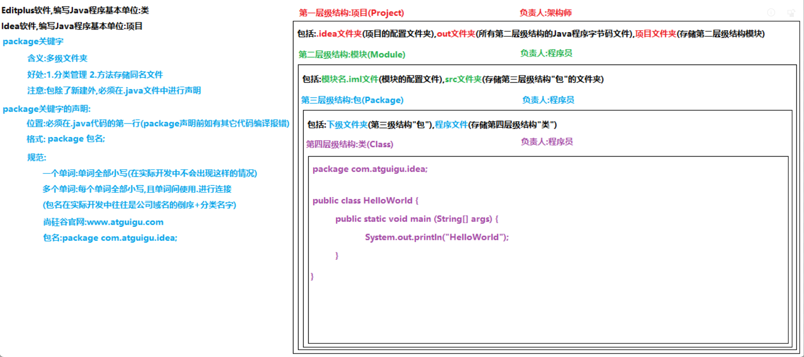

```java
/**
 * 数组:
 *      含义:
 *          在程序中存储同一种数据类型多个元素的固定容器
 *      特点:
 *          1.数组一旦初始化其长度是固定不变的
 *          2.数组中存储的数据类型必须一致,否则编译报错
 *          3.数组中存储的元素必须是多个(如果一个元素不存或者只存储一个元素,这样的数组也不会报错,只不过没有实际意义)
 *
 *
 */
public class ArrayDemo01 {
}
```

### 数组的声明初始化

```java
/**
 * 数组的声明初始化
 *
 *
 * 数组的声明:
 *      含义:
 *          数组的定义
 *      格式:
 *          数据类型[] 数组名;(推荐)
 *          数据类型 数组名[];
 *
 * 数组的初始化:
 *      含义:
 *          在内存中创建数组或者说给数组变量进行赋值
 *      分类:
 *          动态初始化:
 *              在初始化数组时,只初始化数组的长度(大小),不会初始化具体的元素数据,JVM可以直接获取数组的长度
 *          静态初始化
 *              在初始化数组时,不会初始化数组的长度(大小),只初始化具体的元素数据,JVM可以间接获取数组的长度
 *      格式:
 *          动态初始化:
 *              数据类型[] 数组名 = new 数据类型[数组长度];
 *          静态初始化1:
 *              数据类型[] 数组名 = new 数据类型[]{元素1,元素2,......,元素n};
 *          静态初始化2:
 *              数据类型[] 数组名 = {元素1,元素2,......,元素n};
 *      解释:
 *          数据类型[]:数组的数据类型
 *          数据类型:数组中存储元素的数据类型
 *          new:向内存申请并开辟内存空间
 *          数组长度:数组中元素的个数
 */
public class ArrayDemo02 {
    public static void main(String[] args) {
        //数据类型[] 数组名;
        int[] arr01;

        //数据类型 数组名[];
        int arr02[];

        //数据类型[] 数组名 = new 数据类型[数组长度];
        int[] arr03 = new int[3];

        //数据类型[] 数组名 = new 数据类型[]{元素1,元素2,......,元素n};
        int[] arr04 = new int[]{11,22,33};

        //数据类型[] 数组名 = {元素1,元素2,......,元素n};
        int[] arr05 = {11,22,33};
    }
}

```

```java

/**
 * 数组初始化的注意事项:
 *      1.通过动态初始化数组时,数组的长度不能为负数,否则会发生非法数组长度异常(NegativeArraySizeException)
 *      2.数组无法通过动静结合的方式进行初始化操作
 *      3.数组中的元素支持数据类型转换
 *      4.数组的静态初始化的简化版不可以先声明后初始化;
 *          原因:直接声明的静态初始化简化版,JVM的编译器会根据数组名前面的数据类型进行自动代码补全操作(new 数据类型[]),一旦
 *          先声明后静态初始化简化版,JVM的编译器无法直接获取到数组名前面的数据类型,无法提供代码自动补全操作,导致编译报错
 *
 */
public class ArrayDemo03 {
    public static void main(String[] args) {
        //通过动态初始化数组时,数组的长度不能为负数,否则会发生非法数组长度异常(NegativeArraySizeException)
        //int[] arr01 = new int[-3];

        //数组无法通过动静结合的方式进行初始化操作
        //int[] arr02 = new int[5]{11,22,33};

        int[] arr03 = {11,22,33,'a'};
        int[] arr04 = {11,22,33,(int)3.14};

        //动态初始化
        int[] arr05;
        arr05 = new int[3];

        //静态初始化1:
        int[] arr06;
        arr06 = new int[]{11,22,33};

        //静态初始化2:
        int[] arr07;
        //arr07 = {11,22,33};
    }
}
```

### 数组的元素的访问

```java

/**
 * 数组的元素的访问
 *      需要通过数组的索引值进行访问
 *
 * 索引值:
 *      含义:
 *          JVM针对数组中元素进行的动态编号
 *      特点:
 *          数组的索引值从0开始,依次递增,一直到数组的长度-1
 *      格式:
 *          数组名[索引值]
 *      注意:
 *          1.在访问数组中元素时,提供索引值不能是非法或不存在的索引,否则会发生索引越界异常
 *          2.长度为0的数组,不存在索引
 */
public class ArrayDemo04 {
    public static void main(String[] args) {
        //声明并初始化数组
        int[] arr = {11,22,33};

        System.out.println(arr.toString());//[I@1b6d3586,其实时人工模拟的地址值的字符串拼接(可以将其理解为地址值,但是这并不是真实的数据在内存中的地址)
        System.out.println(arr[0]);
        System.out.println(arr[1]);
        System.out.println(arr[2]);

        //修改数组中的元素
        arr[0] = 100;
        arr[2] = 300;

        System.out.println(arr[0]);
        System.out.println(arr[1]);
        System.out.println(arr[2]);
        //System.out.println(arr[-3]);
    }
}
```

### 数组长度的访问

```java
/**
 * 数组长度的访问
 *      格式:
 *          数组名.length
 */
public class ArrayDemo05 {
    public static void main(String[] args) {
        //声明并初始化数组
        int[] arr = {11,22,33,44,55};

        System.out.println(arr[0]);
        System.out.println(arr[1]);
        System.out.println(arr[2]);

        System.out.println("=======================");

        for (int i = 0; i < 3; i++) {
            System.out.println(arr[i]);
        }

        System.out.println("=======================");

        System.out.println(arr.length);

        System.out.println("=======================");

        for (int i = 0; i < arr.length; i++) {
            System.out.println(arr[i]);
        }
    }
}
```

### JVM内存的划分

```java
/**
 * JVM内存的划分:
 *      JDK6.0(包含)以前:
 *          程序计数器(寄存器)
 *          本地方法栈
 *          虚拟机栈
 *          堆
 *          方法区
 *      JDK8.0(包含)以后:JVM内存+元空间
 *          程序计数器(寄存器)
 *          本地方法栈
 *          虚拟机栈
 *          堆:方法区并入堆
 *
 * 程序计数器(寄存器):
 *      作用:和计数器底层硬件有关,和开发没有直接联系,目前无需关注程序计数器
 *
 * 本地方法栈:
 *      作用:存储正在运行的本地方法(被native关键字修饰,且没有方法实体的方法,其实就是调用C语言的函数)的内存
 *
 * 虚拟机栈:
 *      作用:存储正在运行的Java方法的内存
 *      特点:
 *          1.方法的出栈是立即出栈
 * 			2.方法进栈和出栈遵循"先进后出,后进先出"规则
 *
 * 方法区:
 *      作用:存储需要使用到的字节码文件对象,方法,常量等的内存
 *      特点:运行期间,使用java命令运行字节码文件,就是将字节码文件对象加载到方法区
 *
 * 堆:
 *      作用:存储显式或隐式new出来的东西
 *      特点:
 *          1.堆内存中的每块区域都有独立的内存地址值
 *          2.堆内存中的每块区域中的元素都有默认值(JVM的堆内存自动给其进行隐式初始化)
 *              整数型     默认初始化值:0
 *              浮点型     默认初始化值:0.0
 *              字符型     默认初始化值:'\u0000'(Unicode码表中第一个字符)
 *              布尔型     默认初始化值:false
 *              引用型     默认初始化值:null
 *          3.堆内存中有一块独立的内存区域,该区域存储"垃圾回收器对象"
 *              作用:垃圾回收器对象可以理解为生活中的"扫地机器人",负责清理堆内存中的垃圾数据,在堆内存中new出来的内存区域在和
 *              其它内存区域没有任何关联时,JVM会将这块内存区域标记为垃圾数据,等待垃圾回收器对象的回收,因为垃圾回收器对象会按
 *              照自己的清理内存的轨迹进行运动,当垃圾回收器对象扫描到该"垃圾数据"时,该内存区域才在堆内存中彻底消失
 *
 * 名词解释:
 *      创建:在堆内存中进行空间的申请和开辟
 *      加载:将内容加载到堆内存或方法区的过程
 *
 */
public class ArrayDemo06 {
    public static void main(String[] args) {
        int[] arr01 = new int[3];
        System.out.println(arr01[0]);

        double[] arr02 = new double[3];
        System.out.println(arr02[0]);

        char[] arr03 = new char[3];
        System.out.println(arr03[0]);

        boolean[] arr04 = new boolean[3];
        System.out.println(arr04[0]);

        String[] arr05 = new String[3];
        System.out.println(arr05[0]);
    }
}
```

### 数组初始化的内存图解

```java
/**
 * 数组动态初始化的内存图解
 */
public class ArrayDemo07 {
    public static void main(String[] args) {
        int[] arr = new int[3];

        System.out.println(arr);
        System.out.println(arr[0]);
        System.out.println(arr[1]);
        System.out.println(arr[2]);

        arr[0] = 100;
        arr[2] = 300;

        System.out.println(arr);
        System.out.println(arr[0]);
        System.out.println(arr[1]);
        System.out.println(arr[2]);
    }
}
```

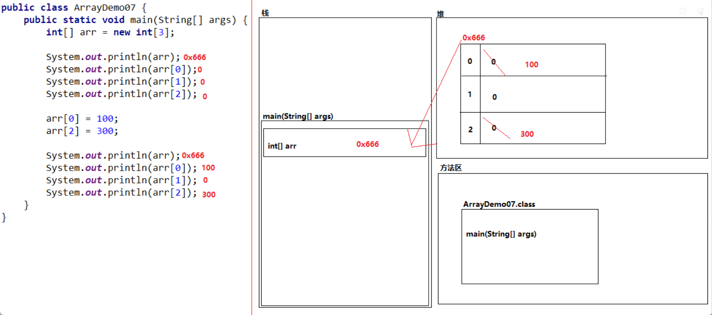

```java
/**
 * 数组静态初始化的内存图解
 */
public class ArrayDemo08 {
    public static void main(String[] args) {
        int[] arr = {11,22,33};

        System.out.println(arr);
        System.out.println(arr[0]);
        System.out.println(arr[1]);
        System.out.println(arr[2]);
    }
}

```

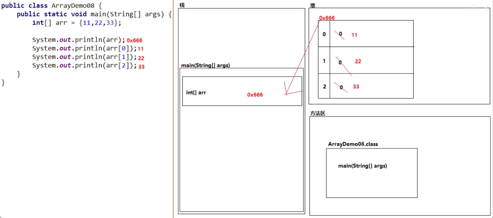

```java
/**
 * 两个数组指向同一地址值的内存图解
 */
public class ArrayDemo09 {
    public static void main(String[] args) {
        int[] arr1 = {11,22,33};

        System.out.println(arr1);
        System.out.println(arr1[0]);
        System.out.println(arr1[1]);
        System.out.println(arr1[2]);

        int[] arr2 = arr1;

        System.out.println(arr2);
        System.out.println(arr2[0]);
        System.out.println(arr2[1]);
        System.out.println(arr2[2]);

        arr2[0] = 100;
        arr2[2] = 300;

        System.out.println(arr2);
        System.out.println(arr2[0]);
        System.out.println(arr2[1]);
        System.out.println(arr2[2]);

        System.out.println(arr1);
        System.out.println(arr1[0]);
        System.out.println(arr1[1]);
        System.out.println(arr1[2]);
    }
}
```

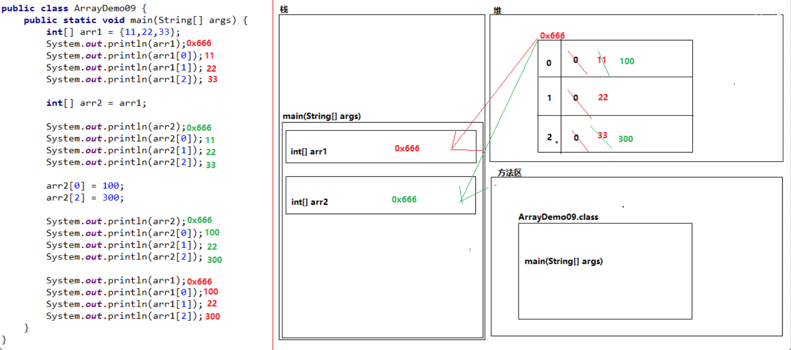

### 数组的应用

```java
/**
 * 数组的应用:
 *      基础应用:针对数组中元素进行查询操作,但不会改变元素在数组中的索引位置
 *          举例:求数组元素的累加和,求数组元素最值,......
 *      高级应用:针对数组中元素的索引位置进行有规则的改变,不依赖其它数组
 *          举例:数组的反转,数组的排序
 *      综合应用:针对数组和方法进行综合练习
 *          举例:二分法,数组的动态扩容,动态插入,动态删除
 */
public class ArrayDemo10 {
}

```

```java
/**
 * 按照固定格式打印数组中元素
 *      固定格式:
 *          数组:[元素1, 元素2, ......, 元素n]
 */
public class ArrayDemo11 {
    public static void main(String[] args) {
        //声明并初始化数组
        int[] arr = {11,22,33,44,55};

        System.out.print("数组:[");

        for (int i = 0; i < arr.length; i++) {
            //判断当前索引是否为最大索引
            if (i == arr.length - 1) {
                System.out.println(arr[i] + "]");
            } else {
                System.out.print(arr[i] + ", ");
            }
        }
    }
}

```

```java
/**
 * 获取数组中所有元素的累加和
 */
public class ArrayDemo12 {
    public static void main(String[] args) {
        //声明并初始化数组
        int[] arr = {11,22,33};

        //声明并初始化求和变量
        int sum = 0;

        //遍历数组
        for (int i = 0; i < arr.length; i++) {
            sum += arr[i];
        }

        //打印求和变量
        System.out.println("sum = " + sum);
    }
}

```

```java
/**
 * 获取数组中所有元素的最大值
 */
public class ArrayDemo13 {
    public static void main(String[] args) {
        //声明并初始化数组
        int[] arr = {5,15,2000,10000,100,4000};

        //声明并初始化最大值变量
        int max = arr[0];

        //遍历数组
        for (int i = 1; i < arr.length; i++) {
            if (max < arr[i]) {
                max = arr[i];
            }
        }

        //打印最大值变量
        System.out.println("max = " + max);
    }
}

```

```java
/**
 * 分析以下需求，并用代码实现：
 *  （1）在编程竞赛中，有10位评委为参赛的选手打分，分数分别为：5，4，6，8，9，0，1，2，7，3
 *  （2）求选手的最后得分（去掉一个最高分和一个最低分后其余8位评委打分的平均值）
 *
 */
public class ArrayDemo01 {
    public static void main(String[] args) {
        //声明并初始化数组保存评委所打的分数
        int[] arr = {5,4,6,8,9,0,1,2,7,3};
        
        //声明并初始化所有评委打的总分,最高分,最低分
        int sum = arr[0];
        int max = arr[0];
        int min = arr[0];

        for (int i = 1; i < arr.length; i++) {
            sum += arr[i];

            if (max < arr[i]) {
                max = arr[i];
            }

            if (min > arr[i]) {
                min = arr[i];
            }
        }
        
        //获取平均分
        double avg = (sum - max - min) * 1.0 / (arr.length - 2);
        
        //打印平均分
        System.out.println("avg = " + avg);
    }
}
```

```java
/**
 * 获取指定元素在数组中出现的第一次索引
 */
public class ArrayDemo02 {
    public static void main(String[] args) {
        //声明并初始化数组
        int[] arr = {5,4,6,8,9,0,1,2,7,3,3,5,1,5,3,6,1};

        //声明并初始化指定元素
        int num = 10;

        //声明并初始化索引变量
        int index = -1;

        //遍历数组
        for (int i = 0; i < arr.length; i++) {
            if (num == arr[i]) {
                index = i;
                break;
            }
        }

        //进行索引校验
        if (index == -1) {
            System.out.println("指定元素在数组中不存在");
        } else {
            System.out.println("指定元素在数组中索引为:" + index);
        }
    }
}
```

### 数组的反转

```java
/**
 * 数组的反转:
 *      含义:
 *          将数组中首尾对应的元素按照反转规则进行交换
 *      分析:
 *          1.确认待交换元素的首次索引位置
 *              int i = 0
 *              int j = arr.length - 1
 *          2.索引变量移动规则
 *              i++
 *              j--
 *          3.交换元素步骤
 *              int temp = arr[i];
 *              arr[i] = arr[j];
 *              arr[j] = temp;
 *          4.交换的规则条件:
 *              当数组长度为奇数个时:
 *                  i < j
 *              当数组长度为偶数个时:
 *                  i < j
 */
public class ArrayDemo03 {
    public static void main(String[] args) {
        //声明并初始化数组
        int[] arr = {11,22,33,44,55};

        System.out.print("反转前:[");

        for (int i = 0; i < arr.length; i++) {
            if (i == arr.length - 1) {
                System.out.println(arr[i] + "]");
            } else {
                System.out.print(arr[i] + ", ");
            }
        }

        for (int i = 0 , j = arr.length - 1 ; i < j; i++ , j--) {
            int temp = arr[i];
            arr[i] = arr[j];
            arr[j] = temp;
        }

        System.out.print("反转后:[");

        for (int i = 0; i < arr.length; i++) {
            if (i == arr.length - 1) {
                System.out.println(arr[i] + "]");
            } else {
                System.out.print(arr[i] + ", ");
            }
        }
    }
}
```

```java
/**
 * 数组反转的优化:
 *      1.确定索引变量i和j之间的关系
 *          i + j = arr.length - 1
 *              j = arr.length - 1 - i
 *      2.优化表达式i < arr.length - 1 - i
 *          i + i < arr.length - 1
 *          2 * i < arr.length - 1
 *              i < (arr.length - 1)/2
 *              i < arr.length/2 - 1/2
 *              i < arr.length/2
 */
public class ArrayDemo04 {
    public static void main(String[] args) {
        //声明并初始化数组
        int[] arr = {11,22,33,44,55};

        System.out.print("反转前:[");

        for (int i = 0; i < arr.length; i++) {
            if (i == arr.length - 1) {
                System.out.println(arr[i] + "]");
            } else {
                System.out.print(arr[i] + ", ");
            }
        }

        for (int i = 0 ; i < arr.length/2; i++) {
            int temp = arr[i];
            arr[i] = arr[arr.length - 1 - i];
            arr[arr.length - 1 - i] = temp;
        }

        System.out.print("反转后:[");

        for (int i = 0; i < arr.length; i++) {
            if (i == arr.length - 1) {
                System.out.println(arr[i] + "]");
            } else {
                System.out.print(arr[i] + ", ");
            }
        }
    }
}
```

### 数组的排序

```java
/**
 * 数组的排序
 *      含义:
 *          按照指定的规则将数组中元素进行升序或降序操作
 *      分类:
 *          冒泡排序
 *          选择排序
 *          插入排序
 *          希尔排序
 *          快速排序
 *          基数排序
 *          归并排序
 *          ......
 *
 * 冒泡排序:
 *      含义:
 *          查找最大值的排序
 */
public class ArrayDemo05 {
    public static void main(String[] args) {
        //声明并初始化数组
        int[] arr = {5,4,6,8,9,0,1,2,7,3};

        System.out.print("排序前:[");

        for (int i = 0; i < arr.length; i++) {
            if (i == arr.length - 1) {
                System.out.println(arr[i] + "]");
            } else {
                System.out.print(arr[i] + ", ");
            }
        }

        System.out.println("============================================");

        System.out.println("数组的排序操作");
        
        //外层循环变量:获取几次最大值并交换至右侧
        for (int count = 1; count < arr.length; count++) {
            //内层循环变量:获取一次最大值并交换至右侧需要几次判断
            //[5, 4, 6, 8, 9, 0, 1, 2, 7, 3]
            for (int i = 0; i < arr.length - count; i++) {
                //比较两个相邻元素
                if (arr[i] > arr[i+1]) {
                    int temp = arr[i];
                    arr[i] = arr[i+1];
                    arr[i+1] = temp;
                }
            }
        }

        System.out.println("============================================");

        System.out.print("排序后:[");

        for (int i = 0; i < arr.length; i++) {
            if (i == arr.length - 1) {
                System.out.println(arr[i] + "]");
            } else {
                System.out.print(arr[i] + ", ");
            }
        }
    }
}
```

```java
/**
 * 冒泡排序的优化:
 *      方式:减少交换次数
 */
public class ArrayDemo06 {
    public static void main(String[] args) {
        //声明并初始化数组
        int[] arr = {5,4,6,8,9,0,1,2,7,3};

        System.out.print("排序前:[");

        for (int i = 0; i < arr.length; i++) {
            if (i == arr.length - 1) {
                System.out.println(arr[i] + "]");
            } else {
                System.out.print(arr[i] + ", ");
            }
        }

        System.out.println("============================================");

        System.out.println("数组的排序操作");
        
        //外层循环变量:获取几次最大值并交换至右侧
        for (int count = 1; count < arr.length; count++) {
            /*
                 数组:[5, 4, 6, 8, 9, 0, 1, 2, 7, 3]
                 第1次遍历时,需要将最大值交换至索引9(arr.length - 1)处
                 第2次遍历时,需要将最大值交换至索引8(arr.length - 2)处
                 第3次遍历时,需要将最大值交换至索引7(arr.length - 3)处
                 第4次遍历时,需要将最大值交换至索引6(arr.length - 4)处
                 第5次遍历时,需要将最大值交换至索引5(arr.length - 5)处
                 第6次遍历时,需要将最大值交换至索引4(arr.length - 6)处
                 第7次遍历时,需要将最大值交换至索引3(arr.length - 7)处
                 第8次遍历时,需要将最大值交换至索引2(arr.length - 8)处
                 第9次遍历时,需要将最大值交换至索引1(arr.length - 9)处
            */
            //声明并初始化此次遍历的最大值待交换的索引位置
            int maxNumIndex = arr.length - count;

            //内层循环变量:获取一次最大值至右侧需要几次判断
            for (int i = 0; i < arr.length - count; i++) {
                if (arr[maxNumIndex] < arr[i]) {
                    maxNumIndex = i;
                }
            }

            //判断最大值索引位置有没有改变
            if (maxNumIndex != arr.length - count) {
                int temp = arr[maxNumIndex];
                arr[maxNumIndex] = arr[arr.length - count];
                arr[arr.length - count] = temp;
            }
        }

        System.out.println("============================================");

        System.out.print("排序后:[");

        for (int i = 0; i < arr.length; i++) {
            if (i == arr.length - 1) {
                System.out.println(arr[i] + "]");
            } else {
                System.out.print(arr[i] + ", ");
            }
        }
    }
}
```

冒泡排序


(简单)选择排序

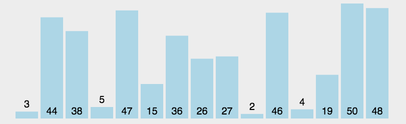

(直接)插入排序


希尔排序

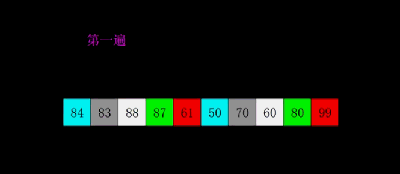

快速排序


基数排序


计数排序

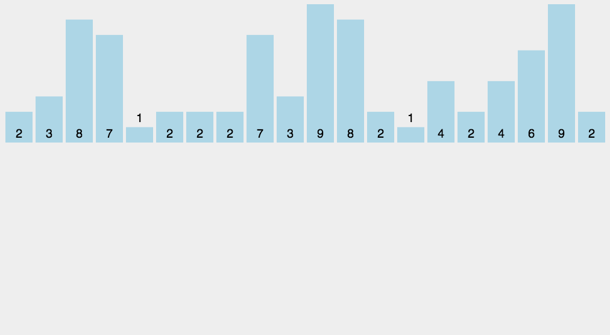

归并排序

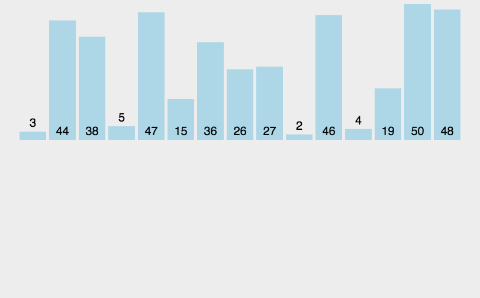

堆排序

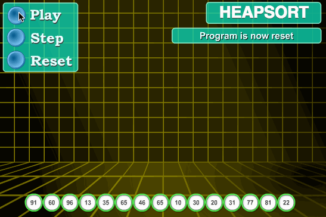


### 方法参数

```java
/**
 * 方法参数的特点:
 *      当方法的形式参数是基本类型时:
 *          1.参数传递的是数据的数据值
 *          2.形式参数数据值的改变,不会影响实际参数的数据值
 *      当方法的形式参数是引用类型时:
 *          1.参数传递的是数据的地址值
 *          2.形式参数地址值的改变,不会影响实际参数的地址值
 *          3.形式参数地址值不会改变,形式参数地址值中的内容改变,会影响实际参数地址值中的内容
 */
public class ArrayDemo07 {
    public static void main(String[] args) {
        int a = 10;
        int b = 20;
        System.out.println("a1 = " + a);
        System.out.println("b1 = " + b);
        System.out.println("=================");
        method01(a,b);
        System.out.println("=================");
        System.out.println("a4 = " + a);
        System.out.println("b4 = " + b);

        System.out.println("=======================================");

        int[] arr = new int[3];
        System.out.println("arr1 = " + arr);
        System.out.println("=================");
        method02(arr);
        System.out.println("=================");
        System.out.println("arr4 = " + arr);

        System.out.println("=======================================");

        arr = new int[]{11,22,33};
        System.out.println("arr1 = " + arr);
        for (int i = 0; i < arr.length; i++) {
            System.out.println(arr[i]);
        }

        System.out.println("=================");

        method03(arr);

        System.out.println("=================");

        System.out.println("arr4 = " + arr);
        for (int i = 0; i < arr.length; i++) {
            System.out.println(arr[i]);
        }

    }

    public static void method03 (int[] arr) {
        System.out.println("arr2 = " + arr);
        for (int i = 0; i < arr.length; i++) {
            System.out.println(arr[i]);
        }

        System.out.println("=================");

        arr[0] = 100;
        arr[2] = 300;

        System.out.println("arr3 = " + arr);
        for (int i = 0; i < arr.length; i++) {
            System.out.println(arr[i]);
        }
    }


    public static void method02 (int[] arr) {
        System.out.println("arr2 = " + arr);
        System.out.println("=================");

        arr = new int[5];

        System.out.println("arr3 = " + arr);
    }

    public static void method01 (int a , int b) {
        System.out.println("a2 = " + a);
        System.out.println("b2 = " + b);
        System.out.println("=================");

        a = b;
        b += a;

        System.out.println("a3 = " + a);
        System.out.println("b4 = " + b);
    }
}
```

### 可变参数

```java
/**
 * 可变参数(JDK5.0)
 *      含义:
 *          在程序中,以实参为元素进行隐式静态初始化的数组
 *      格式:
 *          数据类型... 可变参数名
 *      注意:
 *          1.当方法除外可变参数外还有其他参数时,需要将可变参数声明在形参列表的最后一个位置,否则编译报错
 *          2.一个方法最多只能有一个可变参数
 */
public class ArrayDemo08 {
    public static void main(String[] args) {
        method();
        method(11);
        method(11,22);
        method(11,22,33);
        method(11,22,33,44);
        method(11,22,33,44,55);

        System.out.println("=======================");

        show(11,22,33,44,55);
    }

    public static void show (double num,int... arr ) {}

    public static void method (int... arr) {
        System.out.println(arr);

        for (int i = 0; i < arr.length; i++) {
            System.out.println(arr[i]);
        }
    }
}
```

```java
/**
 * 方法参数的健壮性判断
 */
public class ArrayDemo09 {
    public static void main(String[] args) {
        printArr(new int[]{});

        System.out.println("=====================");

        getNum(9, null);
    }

    public static void printArr (int... arr) {
        //非空判断
        if (arr == null) {
            System.out.println("程序报错:数组不能为空");
            return;
        }

        //特殊数据判断
        if (arr.length == 0) {
            System.out.println("数组:[]");
            return;
        }

        System.out.print("数组:[");

        for (int i = 0; i < arr.length; i++) {
            if (i == arr.length - 1) {
                System.out.println(arr[i] + "]");
            } else {
                System.out.print(arr[i] + ", ");
            }
        }
    }

    public static int getNum (int index,int... arr) {
        //非空判断
        if (arr == null) {
            System.out.println("程序报错:数组不能为空");
            return 0;
        }

        //索引校验
        if (index < 0 || index >= arr.length) {
            System.out.println("程序报错:索引非法或索引不存在");
            return 0;
        }

        return arr[index];
    }
}
```

### 二分查找法(折半查找法)

```java
/**
 * 通过方法完成二分查找法(折半查找法)
 *      需求:
 *          获取指定元素在数组中出现的第一次索引
 *      含义:
 *          查找元素时,不断获取待查找范围中间的元素,从而可以快速找到元素所在的位置
 *      前提:
 *          如果使用二分查找法必须保证数组中的元素是升序或降序
 */
public class ArrayDemo10 {
    public static void main(String[] args) {
        //声明并初始化数组
        int[] arr = {2,5,7,8,10,15,18,20,22,25,28};//数组必须是有序的

        //声明并初始化指定元素
        int num = 18;

        int index = getIndex(arr, num);

        //进行索引校验
        if (index == -1) {
            System.out.println("指定元素在数组中不存在");
        } else {
            System.out.println("指定元素在数组中索引为:" + index);
        }
    }

    public static int getIndex(int[] arr, int num) {

        //声明并初始化索引变量
        int index = -1;

        //非空校验
        if (arr == null) {
            System.out.println("程序报错:数组不能为空");
            return index;
        }

        //声明并初始化待查找元素的索引范围变量
        int start = 0;
        int end = arr.length - 1;

        //声明并初始化中间位置的索引变量
        int mid = (start + end) / 2;

        //考虑不知道多少次进行对折,选择while循环
        while (start <= end) {
            if (num < arr[mid]) {
                end = mid - 1;
            } else if (num > arr[mid]) {
                start = mid + 1;
            } else {
                index = mid;
                break;
            }

            mid = (start + end) / 2;
        }

        return index;
    }
}
```

### 数组的动态操作

```java
/**
 * 数组的动态操作
 *      动态扩容:
 *          将指定的元素存储至数组的结尾处
 *      动态删除
 *          根据指定的索引删除数组中对应位置的元素
 *      动态插入
 *          将指定的元素存储至数组中指定的索引位置处
 */
public class ArrayDemo11 {
    public static void main(String[] args) {
        //声明并初始化数组
        int[] arr = {11,22,33};

        //动态扩容
        System.out.print("数组动态扩容前:");
        print(arr);

        arr = add(arr,44);

        System.out.print("数组动态扩容后:");
        print(arr);

        System.out.println("==========================");

        //动态插入
        System.out.print("数组动态插入前:");
        print(arr);

        arr = insert(arr,2,55);

        System.out.print("数组动态插入后:");
        print(arr);

        System.out.println("==========================");

        //动态删除
        System.out.print("数组动态删除前:");
        print(arr);

        arr = remove(arr,2);

        System.out.print("数组动态删除后:");
        print(arr);
    }

    /*
        数组动态删除操作的两个明确:
            返回类型:int[]
            形参列表:int[] oldArr , int index
    */
    public static int[] remove (int[] oldArr , int index) {
        //非空校验
        if (oldArr == null) {
            System.out.println("程序错误:数组不能为空");
            return oldArr;
        }

        //索引校验
        if (index < 0 || index >= oldArr.length) {
            System.out.println("程序错误:索引错误或非法");
            return oldArr;
        }

        //根据原数组创建新数组
        int[] newArr = new int[oldArr.length - 1];

        //针对新旧数组进行数据的迁移
        for (int i = 0; i < newArr.length; i++) {
            /*
                原数组:[11,22,33]
                新数组:[0,0]
                如果index=0时
                    原数组索引1上的数据==>新数组索引0位置
                    原数组索引2上的数据==>新数组索引1位置
                如果index=1时
                    原数组索引0上的数据==>新数组索引0位置
                    原数组索引2上的数据==>新数组索引1位置
                如果index=2时
                    原数组索引0上的数据==>新数组索引0位置
                    原数组索引1上的数据==>新数组索引1位置
            */
            if (i < index) {
                //等索引位置迁移
                newArr[i] = oldArr[i];
            } else {
                //错索引位置迁移
                newArr[i] = oldArr[i+1];
            }
        }

        return newArr;
    }

    /*
        数组动态插入操作的两个明确:
            返回类型:int[]
            形参列表:int[] oldArr , int index , int num
    */
    public static int[] insert (int[] oldArr , int index , int num) {
        //非空校验
        if (oldArr == null) {
            System.out.println("程序错误:数组不能为空");
            return oldArr;
        }

        //索引校验
        if (index < 0 || index >= oldArr.length) {
            System.out.println("程序错误:索引错误或非法");
            return oldArr;
        }

        //根据原来的数组创建新数组
        int[] newArr = new int[oldArr.length + 1];

        //进行新旧数组的数据迁移
        for (int i = 0; i < oldArr.length; i++) {
            /*
                原数组:[11,22,33]
                新数组:[0,0,0,0]
                如果index=0时
                    原数组索引0上的数据==>新数组索引1位置
                    原数组索引1上的数据==>新数组索引2位置
                    原数组索引2上的数据==>新数组索引3位置
                如果index=1时
                    原数组索引0上的数据==>新数组索引0位置
                    原数组索引1上的数据==>新数组索引2位置
                    原数组索引2上的数据==>新数组索引3位置
                如果index=2时
                    原数组索引0上的数据==>新数组索引0位置
                    原数组索引1上的数据==>新数组索引1位置
                    原数组索引2上的数据==>新数组索引3位置
            */
            if (i < index) {
                //等索引位置迁移
                newArr[i] = oldArr[i];
            } else {
                //错索引位置迁移
                newArr[i+1] = oldArr[i];
            }
        }

        //需要将指定元素存储至指定索引位置处
        newArr[index] = num;

        return newArr;
    }

    /*
        数组动态扩容操作的两个明确:
            返回类型:int[]
            形参列表:int[] oldArr , int num
    */
    public static int[] add (int[] oldArr , int num) {
        //非空校验
        if (oldArr == null) {
            System.out.println("程序操作:数组不能为空");
            return oldArr;
        }

        //根据原来的数组创建新数组
        int[] newArr = new int[oldArr.length + 1];

        //进行新旧数组的数据迁移
        for (int i = 0; i < oldArr.length; i++) {
            /*
                原数组:[11,22,33]
                新数组:[0,0,0,0]
                原数组索引0上的数据==>新数组索引0位置
                原数组索引1上的数据==>新数组索引1位置
                原数组索引2上的数据==>新数组索引2位置
            */
            //等索引位置迁移
            newArr[i] = oldArr[i];
        }

        //将num存储至数组中最后一个位置处
        newArr[newArr.length - 1] = num;

        return newArr;
    }

    public static void print (int[] arr) {
        //非空校验
        if (arr == null) {
            System.out.println("程序错误:数组不能为空");
            return;
        }

        //特殊值校验
        if (arr.length == 0) {
            System.out.println("数组:[]");
            return;
        }

        System.out.print("[");

        for (int i = 0; i < arr.length; i++) {
            if (i == arr.length - 1) {
                System.out.println(arr[i] + "]");
            } else {
                System.out.print(arr[i] + ", ");
            }
        }
    }
}
```

### 多维数组

```java
/**
 * 多维数组:
 *      含义:
 *          数组中的元素依然是数组的数组
 *      分类:
 *          二维数组:一维数组中的元素依然是一维数组的数组
 *          三维数组:一维数组中的元素依然是二维数组的数组
 *          四维数组
 *          五维数组
 *          ......
 *
 * 二维数组:
 *      声明:
 *          数据类型[][] 数组名;(推荐)
 *          数据类型 数组名[][];
 *          数据类型[] 数组名[];
 *      初始化:
 *          动态初始化
 *              格式1:初始化二维数组的同时,初始化里面的每个一维数组
 *                  数据类型[][] 数组名 = new 数据类型[x][y];
 *                  x:二维数组的长度
 *                  y:一维数组的长度
 *              格式2:初始化二维数组的同时,不会初始化里面的一维数组
 *                  数据类型[][] 数组名 = new 数据类型[x][];
 *          静态初始化
 *              格式1:
 *                  数据类型[][] 数组名 = new 数据类型[][]{new 数据类型[]{元素1,元素2,......,元素n},new 数据类型[]{元素1,元素2,......,元素n},......,new 数据类型[]{元素1,元素2,......,元素n}};
 *              格式2:
 *                  数据类型[][] 数组名 = {new 数据类型[]{元素1,元素2,......,元素n},new 数据类型[]{元素1,元素2,......,元素n},......,new 数据类型[]{元素1,元素2,......,元素n}};
 *              格式3:
 *                  数据类型[][] 数组名 = new 数据类型[][]{{元素1,元素2,......,元素n},{元素1,元素2,......,元素n},......,{元素1,元素2,......,元素n}};
 *              格式4:
 *                  数据类型[][] 数组名 = {{元素1,元素2,......,元素n},{元素1,元素2,......,元素n},......,{元素1,元素2,......,元素n}};
 */
public class ArrayDemo12 {
    public static void main(String[] args) {
        //二维数组的声明
        int[][] arr1;
        int arr2[][];
        int[] arr3[];

        //动态初始化1:数据类型[][] 数组名 = new 数据类型[x][y];
        int[][] arr4 = new int[3][2];//4

        //动态初始化2:数据类型[][] 数组名 = new 数据类型[x]y];
        int[][] arr5 = new int[3][];//1

        //静态初始化1:数据类型[][] 数组名 = new 数据类型[][]{new 数据类型[]{元素1,元素2,......,元素n},new 数据类型[]{元素1,元素2,......,元素n},......,new 数据类型[]{元素1,元素2,......,元素n}};
        int[][] arr6 = new int[][]{new int[]{11,22,33},new int[]{44,55},new int[]{66,77,88,99}};//4

        //静态初始化2:数据类型[][] 数组名 = {new 数据类型[]{元素1,元素2,......,元素n},new 数据类型[]{元素1,元素2,......,元素n},......,new 数据类型[]{元素1,元素2,......,元素n}};
        int[][] arr7 = {new int[]{11,22,33},new int[]{44,55},new int[]{66,77,88,99}};//4

        //静态初始化3:数据类型[][] 数组名 = new 数据类型[][]{{元素1,元素2,......,元素n},{元素1,元素2,......,元素n},......,{元素1,元素2,......,元素n}};
        int[][] arr8 = new int[][]{{11,22,33},{44,55},{66,77,88,99}};//4

        //静态初始化4:数据类型[][] 数组名 = {{元素1,元素2,......,元素n},{元素1,元素2,......,元素n},......,{元素1,元素2,......,元素n}};
        int[][] arr9 = {{11,22,33},{44,55},{66,77,88,99}};//4
    }
}
```

### 二维数组的元素访问和遍历

```java
/**
 * 二维数组的元素访问和遍历
 *      格式:
 *          数组名[x][y]
 *      解释:
 *          x:元素所在一维数组在二维数组中的索引
 *          y:元素在一维数组中的索引
 */
public class ArrayDemo13 {
    public static void main(String[] args) {
        //声明并初始化二维数组
        int[][] arr = {{11,22,33},{44,55},{66,77,88,99}};
        System.out.println(arr);
        System.out.println(arr[0]);
        System.out.println(arr[0][0]);
        System.out.println(arr[0][1]);
        System.out.println(arr[0][2]);
        System.out.println(arr[1]);
        System.out.println(arr[1][0]);
        System.out.println(arr[1][1]);
        System.out.println(arr[2]);
        System.out.println(arr[2][0]);
        System.out.println(arr[2][1]);
        System.out.println(arr[2][2]);
        System.out.println(arr[2][3]);

        System.out.println("====================================");

        for (int i = 0; i < arr.length; i++) {
            for (int j = 0; j < arr[i].length; j++) {
                System.out.println(arr[i][j]);
            }
        }
    }
}

```

```java
public class ArrayDemo14 {
    public static void main(String[] args) {
        String[][] employees = {
                {"10", "1", "段誉", "22", "3000"},
                {"13", "2", "令狐冲", "32", "18000", "15000", "2000"},
                {"11", "3", "任我行", "23", "7000"},
                {"11", "4", "张三丰", "24", "7300"},
                {"12", "5", "周芷若", "28", "10000", "5000"},
                {"11", "6", "赵敏", "22", "6800"},
                {"12", "7", "张无忌", "29", "10800","5200"},
                {"13", "8", "韦小宝", "30", "19800", "15000", "2500"},
                {"12", "9", "杨过", "26", "9800", "5500"},
                {"11", "10", "小龙女", "21", "6600"},
                {"11", "11", "郭靖", "25", "7100"},
                {"12", "12", "黄蓉", "27", "9600", "4800"}
        };

        System.out.println("员工类型\t\t编号\t姓名\t\t年龄\t工资\t\t奖金\t\t股票");

        for (int i = 0; i < employees.length; i++) {
            String type = employees[i][0];
            switch (type) {
                case "10":
                    System.out.print("普通员工");
                    break;
                case "11":
                    System.out.print("程序员");
                    break;
                case "12":
                    System.out.print("设计师");
                    break;
                case "13":
                    System.out.print("架构师");
                    break;
                default:
                    System.out.print("暂无该岗位");
                    break;
            }

            for (int j = 1; j < employees[i].length; j++) {
                System.out.print("\t\t" + employees[i][j]);
            }

            System.out.println();
        }
    }
}
```

## 面向对象

```java
/**
 * OOP(Object Oriented Programming)
 *      面向对象程序设计(核心:设计)
 *
 * 面向对象思想的分类:
 *      第一阶段:面向对象基础思想(JavaSE阶段,JDBC,Web阶段),掌握时间:前1个月
 *      第二阶段:面向接口思想(Web阶段,框架,项目),掌握时间:前6个月
 *      第三阶段:面向切面思想(Spring框架源码),掌握时间:至少5-8年
 *
 * 面向过程思想:
 *      代表语言:C语言
 *      核心单位:函数(其实就是Java中方法)
 *      思想体现:比喻"执行者"身份,强调的是"过程",偏重事情"怎么做"
 *
 * 面向对象思想:
 *      代表语言:Java语言
 *      核心单位:类
 *      思想体现:比喻"指挥者"身份,强调的是"对象",偏重事情"找谁做"
 *
 * 思想的实际应用
 *      如果解决一些较小的问题,往往选择"面向过程思想";
 *      如果解决一些较大的问题,往往选择"面向对象思想";
 *      无论是面向过程思想还是面向对象思想没有好坏之分,都是人们解决问题的思考习惯;
 *
 * 面向对象三大特征:
 *      封装,继承,多态
 */
public class OOPDemo01 {
}
```

### 类和对象

```java
/**
 * 类和对象
 *
 * 类:
 *      含义:
 *          事物在程序中抽象的表现形式
 *      举例:
 *          人类,猫类,......
        属性:事物的属性信息
 *          人类:姓名,年龄,身份证号,地址,性别,.......
 *      行为:事物的行为动作
 *          人类:吃,睡,喝,玩,工作,学习,.......
 *
 * 对象:
 *      含义:
 *          是这一类事物的具体体现
 *      属性:
 *          人类:蒋小苗,18,123456789123456789,陕西西安雁塔和发智能大厦,女
 *      行为:
 *          人类:
 *              怎么吃,怎么睡,怎么喝,怎么玩,怎么工作,怎么学习......
 *
 * 类与对象的关系:
 *      类是对象的抽象,模版
 *      对象是类的实例,实体
 *      对象是通过类进行创建,先有类,后有对象
 */
public class OOPDemo02 {
}
```

```java
/**
 * 类的分类:
 *      1.API系统中提供好的类
 *      2.程序员自行设计类(自定义类)
 *
 * 类的设计
 *      步骤:
 *          1.根据事物的属性和行为设计最基础的"模版类"
 *          2.在模版类的基础上添加封装思想
 *          3.根据实际需求,加入构造器,完成最基础的JavaBean标准类的设计
 *          4.根据实际需求,加入静态的概念
 *          5.根据实际需求,加入继承思想
 *          6.根据实际需求,加入抽象概念
 *          7.根据实际需求,加入"最终"概念
 *          8.根据实际需求,加入接口概念
 *          9.根据实际需求,加入内部类的概念
 *          10.根据实际需求,加入枚举类的概念
 *          11.根据实际需求,加入注解概念
 *          12.根据实际需求,加入构造器代码块
 *          13.根据实际需求,加入静态代码块
 *      成员:类作为模版的一部分
 *          字段(成员量)
 *          成员方法
 *          成员内部类
 *      内容:写在类中,但不会作为模块的一部分,只作为工具进行使用
 *          构造器
 *          构造器代码块
 *          静态代码块
 *
 *
 * 类的成员
 *      成员量(属性)
 *          含义:类中成员变量和成员常量的统称
 *      成员方法(行为)
 *          含义:类中实例方法和静态方法的统称
 *      成员内部类(暂不涉及)
 *
 * 成员量:
 *      成员变量:声明在类中代码块外的变量,包含"实例变量"和"静态变量"
 *          实例变量:声明在类中代码块外,且没有static关键字修饰的成员变量,实例变量归属于"对象"
 *          静态变量:声明在类中代码块外,且含有static关键字修饰的成员变量,静态变量归属于"类"(暂不涉及)
 *      成员常量:声明在类中代码块外的常量,包含"实例常量"和"静态常量"(暂不涉及)
 *          实例常量:声明在类中代码块外,且没有static关键字修饰的成员常量,实例常量归属于"对象"(暂不涉及)
 *          静态常量:声明在类中代码块外,且含有static关键字修饰的成员常量,静态常量归属于"类"(暂不涉及)
 *
 * 成员方法:
 *      实例方法:
 *          声明在类中且没有static关键字修饰的成员方法,实例方法归属于"对象"
 *      静态方法(暂不涉及)
 *          声明在类中且含有static关键字修饰的成员方法,静态方法归属于"类"
 *
 * 类的设计格式
 *      public class 类名 {
 *          实例变量
 *          实例方法
 *      }
 */
public class OOPDemo03 {
    public static void main(String[] args) {

    }
}

```

```java
/**
 * 学生类的设计
 */
public class Student {
    //实例变量
    String name;
    int age;

    //实例方法
    public void study () {
        System.out.println(age + "岁的" + name + "正在学习HelloWorld!!!");
    }
}
```

### 对象的创建和使用

```java
/**
 * 对象的创建和使用
 *      创建格式:
 *          类名 对象名 = new 类名(实参);
 *      使用格式:
 *          对象名.实例变量名;
 *          对象名.实例方法名(实参);
 */
public class OOPDemo04 {
    public static void main(String[] args) {
        //创建学生对象
        Student s1 = new Student();
        System.out.println(s1);

        //获取s1对象的姓名和年龄
        System.out.println(s1.name);
        System.out.println(s1.age);

        //给s1对象进行赋值
        s1.name = "蒋小苗";
        s1.age = 18;

        //获取s1对象的姓名和年龄
        System.out.println(s1.name);
        System.out.println(s1.age);

        //获取s1对象的study()
        s1.study();

        System.out.println("===========================================================");

        //创建第2个学生对象
        Student s2 = new Student();
        s2.study();
    }
}
```

```java
/**
 * 学生类的设计
 */
public class Student {
    //实例变量
    String name;
    int age;

    //实例方法
    public void study () {
        System.out.println(age + "岁的" + name + "正在学习HelloWorld!!!");
    }
}
```

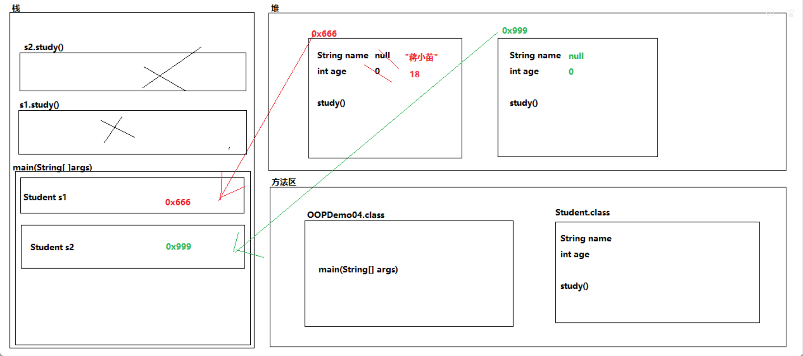

### 实例变量和局部变量的区别

```java
/**
 * 实例变量:声明在类中代码块外,且没有static关键字修饰的成员变量
 * 局部变量:声明在代码块内或者方法声明上的变量
 *
 * 实例变量和局部变量的区别
 *      代码中的位置不同:
 *          实例变量:类中代码块外
 *          局部变量:代码块内或方法声明上(形参列表)
 *      内存中的位置不同:
 *          实例变量:堆内存
 *          局部变量:栈内存
 *      变量是否含有默认值不同:
 *          实例变量:含有默认值
 *          局部变量:没有默认值
 *      代码中的作用域不同:
 *          实例变量:所属类中(静态成员除外)
 *          局部变量:所属方法中
 *      内存中的生命周期不同:
 *          实例变量:随着对象的创建而加载,随着对象的回收而消失
 *          局部变量:随着方法的调用而加载,随着方法的出栈而消失
 *      加载方式和次数不同
 *          实例变量:随着对象的创建而加载,每创建一次对象就会加载一次
 *          局部变量:随着方法的调用而加载,每调用一次方法就会加载一次
 *      修饰符的使用不同
 *          实例变量:程序中各种修饰符可以根据需求进行修饰
 *          局部变量:只能使用final进行修饰
 */
public class OOPDemo05 {
    public static void main(String[] args) {
       int num = 10;
    }
}
```

### this关键字的第一种用法

```java
/**
 * 回顾:在同一作用域内,不可以声明同名的变量
 * 推论:实例变量和局部变量不在同一作用域,在一个类中可以同时声明实例变量和局部变量
 *
 * this关键字的第一种用法:
 *      场景:
 *          子类的构造器中或子类的实例方法
 *      格式:
 *          this.实例变量名;
 *          this.实例方法名(实参);
 *      作用:
 *          用来区分同一个类中同名的实例变量和局部变量
 *      含义:
 *          哪个对象调用了this关键字所在的构造器或实例方法,this关键字就代表哪个对象
 */
public class OOPDemo06 {
    public static void main(String[] args) {
        Var var = new Var();
        var.method();

        System.out.println("=======================");

        Var var1 = new Var();
        System.out.println("var1 = " + var1);
        var1.show();

        System.out.println("============");

        Var var2 = new Var();
        System.out.println("var2 = " + var2);
        var2.show();
    }
}
```

```java
public class Var {
    //实例变量
    int num = 10;

    public void method () {
        //局部变量
        int num = 20;

        System.out.println("num = " + num);//就近原则
        System.out.println("num = " + this.num);
    }


    public void show () {
        System.out.println("this = " + this);
    }
}
```

### 封装

```java
/**
 * 封装:
 *      含义:
 *          在程序中给不同的声明内容添加不同的权限访问级别,使之提高程序的安全性和访问性
 *      核心:
 *          四种权限访问级别
 *
 * 权限访问级别:
 *      分类(按照从小到大):
 *          private < 缺省(sheng,什么都不写) < protected < public
 *
 * private关键字:
 *      含义:
 *          私有的
 *      修饰:
 *          实例变量,静态变量,实例常量,静态常量,实例方法,静态方法,实例成员内部类,静态成员内部类,构造器
 *      特点:
 *          被private修饰的内容,只能在本类中进行访问和使用,在本类之外无法进行使用,否则编译报错
 */
public class OOPDemo07 {
    public static void main(String[] args) {
        //创建学生对象
        Student s = new Student();

        //给学生对象进行赋值
        s.name = "蒋小苗";
        //逆生长
        s.age = -18;

        System.out.println(s.name + "=" + s.age);
    }
}
```

```java
public class Student {
    String name;
    int age;

    /*if (age < 0) {

    }*/
}
```

```java
/**
 * 私有实例变量:
 *      含义:
 *          被private关键字修饰的实例变量
 *      特点:
 *          被private修饰的实例变量,只能在本类中进行访问和使用,在本类之外无法进行使用,否则编译报错
 *      格式:
 *          private 数据类型 变量名;
 *      步骤:
 *          1.将"模版类"中所有的实例变量进行私有化
 *          2.针对每个被private修饰的变量对外提供一对的公共访问方式(get()和set())
 *              set()的两个明确:
 *                  返回类型:void
 *                  形参列表:存储数据的数据类型 变量名
 *              get()的两个明确:
 *                  返回类型:获取数据的数据类型
 *                  形参列表:()中什么都不写
 */
public class OOPDemo08 {
    public static void main(String[] args) {
        //创建学生对象
        Student s = new Student();

        //给学生对象进行赋值
        //s.name = "蒋小苗";
        s.setName("蒋小苗");
        //s.age = -18;
        s.setAge(-18);

        //System.out.println(s.name + "=" + s.age);
        System.out.println(s.getName() + "=" + s.getAge());
    }
}

```

```java
public class Student {
    private String name;
    private int age;


    //存储姓名
    public void setName (String n) {
        name = n;
    }

    //获取姓名
    public String getName () {
        return name;
    }

    //存储年龄
    public void setAge (int a) {
        age = a;
    }

    //获取年龄
    public int getAge () {
        return age;
    }
}

```

```java
/**
 * 使用this关键字优化模版类
 *
 * 代码自动生成快捷键
 *      Alt + Ins(ert)
 */
public class OOPDemo09 {
    public static void main(String[] args) {
        Student s = new Student();

        s.setName("蒋小苗");
        s.setAge(18);

        s.study();
    }
}
```

```java
public class Student {
    //私有化实例变量
    private String name;
    private int age;

    public String getName() {
        return name;
    }

    public void setName(String name) {
        this.name = name;
    }

    public int getAge() {
        return age;
    }

    public void setAge(int age) {
        this.age = age;
    }

    public void study () {
        System.out.println(age + "岁的" + name + "正在学习HelloWorld");
    }
}
```

### 构造器

```java
/**
 * 构造器(构造方法)
 *      含义:
 *          1.关键字new会通过构造器对对象进行堆内存区域的开辟
 *          2.针对对象的成员进行实例初始化
 *          3.如果是有参的构造器可以针对对象的属性进行赋值操作
 *      格式:
 *          修饰符 构造器名 () {}
 *      特点:
 *          1.构造器的名字必须与类名相同
 *          2.构造器没有返回类型,而且连void都没有
 *          3.构造器的格式和方法类似,也叫做构造方法;构造器有别于方法,构造器中的内容共有三个部分
 *              第一部分(暂不涉及):隐式或显式的super(实参)或显式的this(实参)
 *              第二部分(暂不涉及):隐式加载实例成员和构造器代码块
 *              第三部分:构造器中除this(实参)或super(实参)的显式代码
 *          4.当一个类没有任何的构造器时,JVM的编译器在编译时自动补全一个public的无参构造器,供其进行创建对象时初始化成员;
 *          当一个类含有任何的构造器时,JVM的编译器不会再隐式补全
 *          5.构造器支持方法的重载
 *      注意:
 *          set()和构造器的区别:
 *          1.set()只有赋值操作,有参构造器除了赋值操作外,初始化对象成员的作用
 *          2.set()可以反复调用多次,构造器只能在创建对象时使用唯一的一次
 *
 */
public class OOPDemo10 {
    public static void main(String[] args) {
        //类名 对象名 = new 类名(实参);
        Student s = new Student("张三",18);

        new Student();

        System.out.println(s.print());
    }
}
```

```java
public class Student {
    private String name;
    private int age;

    public Student () {
        System.out.println("构造器");
    }

    public Student (String name, int age) {
        this.name = name;
        this.age = age;
    }

    public void setName(String name) {
        this.name = name;
    }

    public void setAge(int age) {
        this.age = age;
    }

    public String print () {
        return name + "=" + age;
    }
}
```

### JavaBean标准类

```java
/**
 * JavaBean标准类:
 *      含义:
 *          在实际开发中没有上级的特殊说明情况下,程序员间设计类的约定俗成的规范
 *      内容:
 *          必须有:
 *              1.类的声明必须由public修饰
 *              2.一个.java文件中只允许包含一个类
 *              3.无参构造器
 *              4.所有的成员量必须进行私有化
 *              5.针对每个被私有化的成员量提供一对的公共访问方式(set()和get())
 *          可以有
 *              1.根据实际需求添加合适有参构造器
 *              2.根据实际需求添加构造器代码块(暂不涉及)
 *              3.根据实例需求添加静态代码块(暂不涉及)
 *              4.根据实际需求添加toString(),hashCode(),equals()(暂不涉及)
 *              5.根据实际需求添加内部类
 */
public class OOPDemo11 {
    public static void main(String[] args) {
        //通过无参构造器创建对象
        Student s1 = new Student();

        s1.setName("蒋小苗");
        s1.setAge(18);

        s1.study();

        System.out.println("==============================");

        //通过有参构造器创建对象
        Student s2 = new Student("蒋大苗", 18);

        s2.study();
    }
}
```

```java
public class Student {
    private String name;
    private int age;

    public Student() {
    }

    public String getName() {
        return name;
    }

    public void setName(String name) {
        this.name = name;
    }

    public int getAge() {
        return age;
    }

    public void setAge(int age) {
        this.age = age;
    }

    public Student(String name, int age) {
        this.name = name;
        this.age = age;
    }

    public void study () {
        System.out.println(age + "岁的" + name + "正在学习HelloWorld!!!!");
    }
}
```

### 匿名对象

```java
/**
 * 匿名对象:
 *      含义:
 *          没有名字的对象
 *      格式:
 *          new 类名(实参);
 *      好处:
 *          降低对象在内存中的时间,提高内存的使用率
 *      弊端:
 *          匿名对象只能使用唯一的一次
 */
public class OOPDemo01 {
    public static void main(String[] args) {
        //类名 对象名 = new 类名(实参);
        Student s = new Student();
        method(s);//学生对象如果被垃圾回收器进行回收,需要被标记为垃圾数据,等到main()结束时,才会被标记为垃圾数据
        method(s);

        System.out.println("===============================");

        method(new Student());//学生对象如果被垃圾回收器进行回收,需要被标记为垃圾数据,等到method()结束时,才会被标记为垃圾数据
        method(new Student());

    }

    public static void method (Student s) {
        System.out.println(s);
    }
}
```

### 对象数组

```java
/**
 * 对象数组:
 *      含义:
 *          存储对象的数组
 *      初始化:
 *          动态初始化
 *              类名[] 数组名 = new 类名[数组长度];
 *          静态初始化:
 *              类名[] 数组名 = new 类名[]{对象名1,对象名2,......,对象名n};
 *              类名[] 数组名 = {对象名1,对象名2,......,对象名n};
 */
public class OOPDemo02 {
    public static void main(String[] args) {
        //对象数组的动态初始化
        Student[] stuArr1 = new Student[4];

        //创建对象
        Student s1 = new Student("去病", 18);
        Student s2 = new Student("卫小青", 18);
        Student s3 = new Student("张小骞", 18);
        Student s4 = new Student("韩小信", 18);

        stuArr1[0] = s1;
        stuArr1[1] = s2;
        stuArr1[2] = s3;
        stuArr1[3] = s4;

        for (int i = 0; i < stuArr1.length; i++) {
            System.out.println(stuArr1[i].print());
        }

        System.out.println("==================================");

        //对象数组的静态初始化
        Student stu1 = new Student("城小将",18);
        Student stu2 = new Student("唐小妃",18);
        Student stu3 = new Student("李小白",18);
        Student stu4 = new Student("波斯客",18);

        Student[] stuArr2 = {stu1,stu2,stu3,stu4};

        for (int i = 0; i < stuArr2.length; i++) {
            System.out.println(stuArr2[i].print());
        }
    }
}
```

```java
public class Student {
    private String name;
    private int age;

    public Student() {
    }

    public Student(String name, int age) {
        this.name = name;
        this.age = age;
    }

    public String getName() {
        return name;
    }

    public void setName(String name) {
        this.name = name;
    }

    public int getAge() {
        return age;
    }

    public void setAge(int age) {
        this.age = age;
    }

    public String print () {
        return name + "=" + age;
    }
}
```

### 类中的私有方法

```java
public class ClassPrivateMethod {
    public void method01 () {
        /*System.out.println("你好");
        System.out.println("我好");
        System.out.println("大家好");*/
        method();
        System.out.println("苗苗老师好");
    }

    public void method02 () {
        /*System.out.println("你好");
        System.out.println("我好");
        System.out.println("大家好");*/
        method();
        System.out.println("沙沙老师好");
    }

    private void method () {
        System.out.println("你好");
        System.out.println("我好");
        System.out.println("大家好");
    }
}
```

```java
/**
 * 类中的私有方法
 *      含义:
 *          被private修饰的方法
 *      特点:
 *          被private修饰的方法只能在本类中进行调用使用,不能在本类之外进行调用,如果调用编译报错
 *      格式:
 *          private 修饰符 返回类型 方法名 () {}
 */
public class OOPDemo03 {
    public static void main(String[] args) {
        //创建ClassPrivateMethod对象
        ClassPrivateMethod cpm = new ClassPrivateMethod();

        cpm.method01();
        System.out.println("====================");
        cpm.method02();
        System.out.println("====================");
        //cpm.method();
    }
}
```

### 构造器代码块

```java
public class ConstructorCodeBlock {
    public ConstructorCodeBlock() {

        /*System.out.println("你好");
        System.out.println("我好");
        System.out.println("大家好");*/
        System.out.println("苗苗老师好");
    }

    public ConstructorCodeBlock(int num) {

        /*System.out.println("你好");
        System.out.println("我好");
        System.out.println("大家好");*/
        System.out.println("沙沙老师好");
    }

    public ConstructorCodeBlock (int a , int b) {
        System.out.println("海江老师人生赢家");
    }

    {
        System.out.println("你好");
        System.out.println("我好");
        System.out.println("大家好");
    }
}
```

```java
/**
 * 构造器代码块
 *      位置:
 *          在类中代码块外
 *      格式:
 *          {
 *              所有构造器中相同的内容
 *          }
 *      特点:
 *          1.构造器代码块优先于构造器中的显式代码执行
 *          2.将所有构造器中相同的内容抽取到构造器代码块,在实例初始化过程中的第二阶段调用构造器代码块
 */
public class OOPDemo04 {
    public static void main(String[] args) {
        new ConstructorCodeBlock();

        System.out.println("==============");

        new ConstructorCodeBlock(1);

        System.out.println("==============");

        new ConstructorCodeBlock(1,2);
    }
}
```

### this关键字的第二种用法

```java
/**
 * this关键字的第二种用法:
 *      场景:
 *          (子类的)构造器中
 *      格式:
 *          this(实参);
 *      作用:
 *          调用本类中其它的构造器完成对象成员的初始化操作
 *      含义:
 *          当构造器无法进行对象成员初始化时,通过this(实参)调用其它的构造器完成对象成员的初始化
 */
public class OOPDemo05 {
    public static void main(String[] args) {
        Student s1 = new Student();
        System.out.println(s1.print());

        System.out.println("====================");

        Student s2 = new Student("张三");
        System.out.println(s2.print());

        System.out.println("====================");

        Student s3 = new Student("李四", 18);
        System.out.println(s3.print());

    }
}
```

```java
public class Student {
    private String name;
    private int age;

    public Student() {

    }

    public Student(String name) {
        //this.name = name;
        this(name,0);
    }

    public Student(String name, int age) {
        this.name = name;
        this.age = age;
    }

    public String print () {
        return name + "=" + age;
    }
}
```

```java
/**
 * this关键字第二种用法的注意事项
 *      1.this(实参)必须在构造器中的第一行,否则编译报错
 *      2.一旦构造器中含有this(实参),该构造器不会进行实例成员的初始化操作(构造器中第一阶段和第二阶段做的事情不会执行)
 */
public class OOPDemo06 {
    public static void main(String[] args) {
        new Student();
    }
}

```

```java
public class Student {
    public Student() {
        this(1);
        System.out.println("无参构造器");

    }

    public Student (int a) {
        this(1,2);
        System.out.println("一个参数的构造器");
    }

    public Student (int a,int b) {
        //实例成员的初始化
        System.out.println("两个参数的构造器");
    }

    {
        System.out.println("构造器代码块");
    }
}
```

## static关键字

```java
/**
 * static关键字:
 *      含义:
 *          静态的,共享的
 *      修饰:
 *          成员变量,成员常量(暂不涉及),成员方法,成员内部类(暂不涉及),成员代码块
 *      特点:
 *          1.被static关键字修饰的内容不再属于对象,而是归属于类,会被这个类创建的所有对象所共享
 *          2.被static关键字修饰的内容会随着类的加载而加载,只能加载唯一的一次
 */
public class StaticDemo01 {
    public static void main(String[] args) {

    }
}
```

### 静态变量

```java
/**
 * 静态变量:
 *      含义:
 *          被static关键字修饰的成员变量
 *      格式:
 *          修饰符 static 数据类型 变量名;
 *      特点:
 *          被static关键字修饰的成员变量不再属于对象,而是归属于类本身,会被这个类创建的所有对象共享
 *      调用:
 *          对象名.静态变量名;
 *          类名.静态变量名;
 */
public class StaticDemo02 {
    public static void main(String[] args) {
       /* Student s1 = new Student("郭靖",18,"射雕");
        Student s2 = new Student("黄蓉",16,"射雕");
        Student s3 = new Student("洪七公",50,"射雕");*/

        Student s1 = new Student("郭靖",18);
        Student s2 = new Student("黄蓉",16);
        Student s3 = new Student("洪七公",50);

        Student.classroom = "射雕";

        System.out.println(s1.print());
        System.out.println(s2.print());
        System.out.println(s3.print());
    }
}

```

```java
public class Student {
    private String name;
    private int age;
    /*private */static String classroom;

    public String getName() {
        return name;
    }

    public void setName(String name) {
        this.name = name;
    }

    public int getAge() {
        return age;
    }

    public void setAge(int age) {
        this.age = age;
    }

    public String getClassroom() {
        return classroom;
    }

    public void setClassroom(String classroom) {
        this.classroom = classroom;
    }

    public Student(String name, int age, String classroom) {
        this.name = name;
        this.age = age;
        this.classroom = classroom;
    }

    public Student(String name, int age) {
        this.name = name;
        this.age = age;
    }

    public Student() {
    }

    public String print () {
        return name + "=" + age + "=" + classroom;
    }
}
```

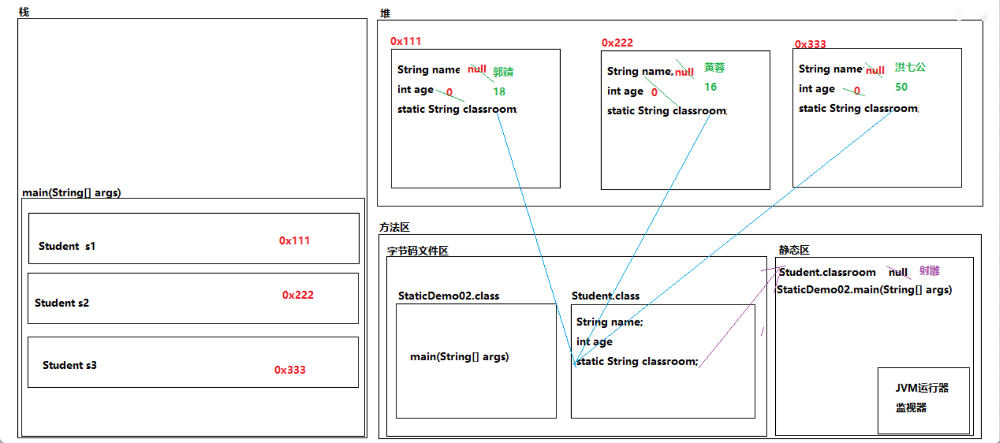

### 三种变量的区别

```java
/**
 * 静态变量:声明在类中代码块外,且含有static关键字修饰的成员变量
 * 实例变量:声明在类中代码块外,且没有static关键字修饰的成员变量
 * 局部变量:声明在代码块内或者方法声明上的变量
 *
 * 三种变量的区别
 *      代码中的位置不同:
 *          静态变量:类中代码块外
 *          实例变量:类中代码块外
 *          局部变量:代码块内或方法声明上(形参列表)
 *      内存中的位置不同:
 *          静态变量:
 *              JDK7.0(包含)之前:方法区
 *              JDK8.0(包含)之后:堆内存
 *          实例变量:堆内存
 *          局部变量:栈内存
 *      变量是否含有默认值不同:
 *          静态变量:含有默认值
 *          实例变量:含有默认值
 *          局部变量:没有默认值
 *      代码中的作用域不同:
 *          静态变量:所属类中
 *          实例变量:所属类中(静态成员除外)
 *          局部变量:所属方法中
 *      内存中的生命周期不同:
 *          静态变量:随着类的加载而加载,随着的类的回收而消失
 *          实例变量:随着对象的创建而加载,随着对象的回收而消失
 *          局部变量:随着方法的调用而加载,随着方法的出栈而消失
 *      加载方式和次数不同
 *          静态变量:随着类的加载而加载,因为类只会加载唯一的一次,也只加载唯一的一次
 *          实例变量:随着对象的创建而加载,每创建一次对象就会加载一次
 *          局部变量:随着方法的调用而加载,每调用一次方法就会加载一次
 *      修饰符的使用不同
 *          静态变量:程序中各种修饰符可以根据需求进行修饰
 *          实例变量:程序中各种修饰符可以根据需求进行修饰
 *          局部变量:只能使用final进行修饰
 */
public class StaticDemo03 {
}
```

```java
/**
 * 编号自增小案例
 */
public class StaticDemo04 {
    public static void main(String[] args) {
        Student s1 = new Student("去病", 18);
        Student s2 = new Student("卫小青", 18);
        Student s3 = new Student("张小骞", 18);
        Student s4 = new Student();
        s4.setName("韩小信");
        s4.setAge(18);

        System.out.println(s1.print());
        System.out.println(s2.print());
        System.out.println(s3.print());
        System.out.println(s4.print());
    }
}
```

```java
public class Student {
    private int id;
    private String name;
    private int age;
    private static int num = 220704001;

    {
        this.id = num++;
    }

    public Student() {
        //this.id = num++;
    }

    public Student(String name, int age) {
        //this.id = num++;
        this.name = name;
        this.age = age;
    }

    public int getId() {
        return id;
    }

    public void setId(int id) {
        this.id = id;
    }

    public String getName() {
        return name;
    }

    public void setName(String name) {
        this.name = name;
    }

    public int getAge() {
        return age;
    }

    public void setAge(int age) {
        this.age = age;
    }

    public String print () {
        return id + "=" + name + "=" + age;
    }
}

```

### 静态方法

```java
public class ArrayUtils {
    //按照固定格式打印(byte[])
    //按照固定格式打印(short[])
    //按照固定格式打印(int[])
    //......
    //排序


    private ArrayUtils() {
    }

    public static void print (int... arr) {
        //非空校验
        if (arr == null) {
            System.out.println("程序有误:数组为null,无法进行打印");
            return;
        }

        //特殊值判断
        if (arr.length == 0) {
            System.out.println("数组:[]");
            return;
        }

        System.out.print("数组:[");

        for (int i = 0; i < arr.length; i++) {
            if (i == arr.length - 1) {
                System.out.println(arr[i] + "]");
            } else {
                System.out.print(arr[i] + ", ");
            }
        }
    }
}
```

```java
/**
 * 静态方法
 *      含义:
 *          被static修饰的成员方法
 *      格式:
 *          修饰符 static 返回类型 方法名 () {}
 *      特点:
 *          1.被static关键字修饰的成员方法不再属于对象,而是归属于类本身,会被这个类创建的所有对象共享
 *          2.当创建一个对象只是为了使用里面大量的实例方法进行操作,和对象本身无关,导致对象本身在堆内存中一直驻留,浪费内存空间,
 *          在实际应用过程中,可以将这些实例方法修饰成静态的,被static修饰的方法不再属于对象,而是归属于类本身,使用里面的工具方法
 *          无需再进行对象的创建,直接通过类名即可访问.同时将构造器进行私有化
 *      调用:
 *          对象名.静态方法名(实参);
 *          类名.静态方法名(实参);(推荐)
 */
public class StaticDemo05 {
    public static void main(String[] args) {
        //创建ArrayUtils工具类对象
        //ArrayUtils au = new ArrayUtils();

       /* au.print(11,22,33);
        au.print(11,22,33,44);
        au.print(11,22,33,44,55);*/

        System.out.println("=======================");

        ArrayUtils.print(11,22,33);
        ArrayUtils.print(11,22,33,44);
        ArrayUtils.print(11,22,33,44,55);
    }
}
```

```java
/**
 * 静态方法的注意事项:
 *      1.静态方法随着类的加载而加载,而且只加载唯一的一次
 *          静态方法的加载:进静态区,只有唯一的一次
 *          静态方法的调用:进栈内存,可以调用很多次
 *      2.静态方法可以通过类名调用,也可以通过对象名调用,更推荐使用类名进行调用
 *      3.静态方法中不可以使用非静态成员
 *      4.静态方法中不可以使用this关键字和super关键字
 */
public class StaticDemo06 {
    public static void main(String[] args) {
    }

    public void method01() {
        //实例方法中使用实例成员
        method02();
    }

    public void method02() {
        //实例方法中使用静态成员
        method03();
    }

    public static void method03() {
        //静态方法中使用静态成员
        method04();
    }

    public static void method04() {
        //静态方法中使用实例成员
        //method01();
    }
}
```

### 静态代码块

```java
public class StaticCodeBlock {
    int num = 10;


    static {
        //System.out.println(num);
        //System.out.println(this);
    }
}

```

```java
/**
 * 静态代码块:
 *      含义:
 *          被static修饰的代码块
 *      格式:
 *          static {
 *
 *          }
 *      目的:
 *          1.封装工具类,提高部分代码加载时机(暂不涉及)
 *          2.类和实例成员初始化过程的笔试题(暂不涉及)
 *          3.给静态常量进行初始化赋值操作(暂不涉及)
 *      注意:
 *          1.静态代码块随着类的加载而加载,而且只加载唯一的一次
 *          2.静态代码块中不可以使用非静态成员
 *          3.静态方法中不可以使用this关键字和super关键字
 */
public class StaticDemo07 {
    public static void main(String[] args) {

    }
}
```

### 设计模式和框架

```java
public class CEO {
    private static CEO ceo = new CEO();

    private CEO () {}

    public static CEO getCEO() {
        return ceo;
    }
}

```

```java
/**
 * 设计模式和框架
 *      设计模式:解决某一类问题的固定的解决方案
 *      框架:半成品项目
 *
 * 单例设计模式
 *      含义:
 *          创建唯一对象的解决方案
 *      分类:
 *          立即加载模式(饿汉式)
 *          延迟加载模式(懒汉式)
 *
 * 立即加载模式
 *      1.将创建唯一对象的类构造器进行私有化
 *      2.在创建唯一对象的类中声明并初始化唯一对象
 *      3.为了可以在外界进行访问,将其进行static修饰
 *      4.为了唯一对象的安全性,将其进行private修饰
 *      5.为了可以在外界进行访问,提供公共获取方式
 *
 */
public class StaticDemo08 {
    public static void main(String[] args) {
        CEO ceo1 = CEO.getCEO();
        System.out.println(ceo1);

        CEO ceo2 = CEO.getCEO();
        System.out.println(ceo2);

        CEO ceo3 = CEO.getCEO();
        System.out.println(ceo3);
    }
}
```

```java
public class CEO {
    private static CEO ceo;

    private CEO () {}

    public static CEO getCEO() {

        if (ceo == null) {
            ceo = new CEO();
        }

        return ceo;
    }
}

```

```java
/**
 * 立即加载模式的弊端:
 *      部分场景中,不需要使用对象,但是可能加载该类,导致对象的创建,在一段时间内浪费堆内存中空间
 *
 * 延迟加载模式
 *      1.将创建唯一对象的类构造器进行私有化
 *      2.在创建唯一对象的类中声明唯一对象变量
 *      3.为了可以在外界进行访问,将其进行static修饰
 *      4.为了唯一对象的安全性,将其进行private修饰
 *      5.为了可以在外界进行访问,提供公共获取方式,并且在第一次获取时创建唯一对象
 */
public class StaticDemo09 {
}
```

## import关键字

```java
/**
 * import关键字
 *      含义:
 *          导包
 *      位置:
 *          package后面,class前面
 *      格式:
 *          import 包名.类名;(推荐)
 *          import 包名.*;(笔试实在没有办法时)
 *      作用:
 *          跨包使用类文件
 */
public class ImportDemo {
    public static void main(String[] args) {
        Student s = new Student();
    }
}
```

```java
public class Person {
    static {
        System.out.println("Person");
    }
}
```

```java
public class Student {
    static {
        System.out.println("Student");
    }
}
```

## API

```java
/**
 * API(应用程序接口)
 *      含义:
 *          提供的类和接口
 * Java API:
 *      含义:
 *          Java系统中提供的类和接口
 *
 * Java API文档:
 *      含义:
 *          查询Java系统中提供的类和接口的文档
 *      关注点:
 *          如果查询类:
 *              类的特点
 *              类的位置
 *                  注意:如果是java.lang,无需进行导包
 *              类的构造器
 *              类的方法
 *          如果查询接口:
 *              接口的特点
 *              接口的位置
 *              接口的方法
 *
 */
public class APIDemo {
}
```

### System类

```java
/**
 * System类
 *      类的特点
 *          针对程序中常用的字段和方法进行封装的工具类
 *      类的位置
 *          java.lang
 *      类的构造器
 *          构造器私有化
 *      类的成员
 *          public static final PrintStream out
 *              “标准”输出流。此流已打开并准备接受输出数据
 *          public static final InputStream in
 *              “标准”输入流。此流已打开并准备提供输入数据。
 *          public static long currentTimeMillis()
 *              返回以毫秒为单位的当前时间。
 *          public static void gc()
 *              运行垃圾回收器。
 *          public static void setOut(PrintStream out)
 *              重新分配“标准”输出流。
 *          public static long nanoTime()
 *              返回最准确的可用系统计时器的当前值，以毫微秒为单位。
 */
public class SystemDemo {
    public static void main(String[] args) {
        //获取此时的时间
        long start = System.nanoTime();

        for (int i = 0; i < 10000; i++) {

        }

        long end = System.nanoTime();

        System.out.println(end - start);
    }
}
```

### Scanner类

```java
/**
 * Scanner类
 *      类的特点
 *          针对基本类型和字符串类型进行扫描操作的工具类
 *      类的位置
 *          java.util
 *      类的构造器
 *          public Scanner(InputStream source)
 *              构造一个新的 Scanner，它生成的值是从指定的输入流扫描的。
 *      类的方法
 *          public void close()
 *              关闭此扫描器。
 *          public int nextXxx()
 *              将输入信息的下一个标记扫描为一个 xxx (xxx为基本类型单词,不包括char)。
 *          public String next()
 *              查找并返回来自此扫描器的下一个完整标记。
 *          public String nextLine()
 *              此扫描器执行当前行，并返回跳过的输入信息。
 *
 */
public class ScannerDemo01 {
    public static void main(String[] args) {
    }
}

```

```java
import java.util.Scanner;

/**
 * 通过Scanner对象扫描键盘录入的基本类型数据
 *
 * 注意:
 *      1.Scanner类没有提供针对char类型扫描的工具方法
 *      2.使用Scanner类中方法进行扫描的时候,待扫描数据必须在扫描数据的数据类型的取值范围内
 */
public class ScannerDemo02 {
    public static void main(String[] args) {
        //创建Scanner对象
        Scanner sc = new Scanner(System.in);

        //扫描键盘录入int类型数据
        System.out.println("请输入一个整数:");
        int num = sc.nextInt();
        System.out.println("num = " + num);

        //关闭资源
        sc.close();
    }
}
```

```java
import java.io.BufferedReader;
import java.io.FileReader;
import java.io.IOException;
import java.io.InputStreamReader;
import java.util.Scanner;

/**
 * 通过Scanner对象扫描键盘录入的字符串类型数据
 *
 * 注意事项:
 *      1.next()在扫描字符串时遇到"空白符号"会自动停止扫描
 *      2.在使用nextLine()之前不能使用非nextLine()
 */
public class ScannerDemo03 {
    public static void main(String[] args){
        method04();
    }

    public static void method04 () {
        //创建Scanner对象
        Scanner sc = new Scanner(System.in);

        System.out.println("请输入学生对象的学号:");
        int id = sc.nextInt();
        System.out.println("请输入学生对象的姓名:");
        String name = sc.nextLine();
        System.out.println("请输入学生对象的年龄:");
        int age = sc.nextInt();

        //通过键盘录入的数据创建学生对象
        Student s = new Student(id, name, age);

        System.out.println(s.print());
    }

    public static void method03 () {
        //创建Scanner对象
        Scanner sc = new Scanner(System.in);

        System.out.println("请输入学生对象的学号:");
        int id = sc.nextInt();
        System.out.println("请输入学生对象的姓名:");
        String name = sc.next();
        System.out.println("请输入学生对象的年龄:");
        int age = sc.nextInt();

        //通过键盘录入的数据创建学生对象
        Student s = new Student(id, name, age);

        System.out.println(s.print());
    }

    public static void method02() {
        Scanner sc = new Scanner(System.in);

        System.out.println("请输入待扫描的字符串:");
        String str = sc.nextLine();
        System.out.println("str = " + str);

        sc.close();
    }

    public static void method01() {
        Scanner sc = new Scanner(System.in);

        System.out.println("请输入待扫描的字符串:");
        String str = sc.next();
        System.out.println("str = " + str);

        sc.close();
    }
}

```

```java
public class Student {
    private int id;
    private String name;
    private int age;

    public Student(int id, String name, int age) {
        this.id = id;
        this.name = name;
        this.age = age;
    }

    public Student() {
    }

    public String getName() {
        return name;
    }

    public void setName(String name) {
        this.name = name;
    }


    public int getId() {
        return id;
    }

    public void setId(int id) {
        this.id = id;
    }

    public int getAge() {
        return age;
    }

    public void setAge(int age) {
        this.age = age;
    }

    public String print () {
        return id + "=" + name + "=" + age;
    }
}
```

### Math类

```java
import java.util.Random;

/**
 * Math类
 *      类的特点
 *          针对数学运行进行操作的工具类
 *      类的位置
 *          java.lang
 *      类的构造器
 *          构造器私有化
 *      类的方法
 *          public static double random()
 *              返回带正号的 double 值，该值大于等于 0.0 且小于 1.0。
 *
 * 获取指定范围内整数的小技巧
 *      (int)(Math.random() * a + b)
 *      a:这个范围内总共数据的个数
 *      b:这个范围内起始数据
 */
public class MathDemo01 {
    public static void main(String[] args) {
        //获取0~9之间的整数
        System.out.println((int)(Math.random() * 10));

        //获取1~100之间的整数
        System.out.println((int)(Math.random() * 100 + 1));

        //获取5~8之间的整数
        System.out.println((int)(Math.random() * 4 + 5));

        //获取8~15之间的整数
        System.out.println((int)(Math.random() * 8 + 8));
    }
}

```

```java

import java.util.ArrayList;
import java.util.Collections;

/**
 * 彩票小案例
 */
public class MathDemo02 {
    public static void main(String[] args) {
        //创建长度为7的数组
        int[] arr = new int[7];

        /*for (int i = 0; i < arr.length; i++) {


            arr[i] = random;
        }*/

        //声明并初始化数组存储的索引变量
        int index = 0;

        while (arr[arr.length - 1] == 0) {
            //随机生成1~35之间的整数
            int random = (int) (Math.random() * 35 + 1);

            //判断随机数字在数组中是否存储
            boolean flag = getFlag(arr, random);

            if (!flag) {
                //将random存储至数组中
                arr[index++] = random;
            }
        }

        System.out.print("彩票:[");

        for (int i = 0; i < arr.length; i++) {
           if (i == arr.length - 1) {
               System.out.println(arr[i] + "]");
           } else {
               System.out.print(arr[i] + ", ");
           }
        }
    }

    //判断指定数字在数组中是否存储
    public static boolean getFlag (int[] arr, int num) {
        //默认每个元素在数组中不存在(不存在false,存在true)
        boolean flag = false;

        //非空校验
        if (arr == null) {
            System.out.println("程序有误:数组不能为空");
            return true;
        }

        for (int i = 0; i < arr.length; i++) {
            if (num == arr[i]) {
                flag = true;
                break;
            }
        }

        return flag;
    }
}
```

```java
/**
 * 验证码案例
 */
public class MathDemo03 {
    public static void main(String[] args) {
        //创建验证存储的元素的数组
        String[] arr = new String[62];//26+26+10

        //将验证码内容存储至数组中
        for (int i = 0; i < arr.length; i++) {
            if (i >= 0 && i <= 9) {
                arr[i] = (char)(i + 48) + "";
            } else if (i >= 10 && i <= 35) {
                arr[i] = (char)(i + 55) + "";
            } else {
                arr[i] = (char)(i + 61) + "";
            }
        }

        //声明并初始化验证码变量
        String code = "";

        for (int i = 0; i < 6; i++) {
            int index = (int)(Math.random() * arr.length);
            code += arr[index];
        }

        System.out.println("验证码:" + code);
    }
}
```

```java
import java.util.Map;
import java.util.Scanner;

/**
 * 数字炸弹
 *      随机生成一个1~100之间的整数,玩家通过键盘录入的方式在指定范围内进行猜,每次猜的结果系统会进行提示,直到玩家猜中为止,游戏结束
 *          如果"键盘录入数字 > 随机整数",
 *              提示猜大了
 *          如果"键盘录入数字 < 随机整数",
 *              提示猜小了
 *          如果"键盘录入数字 = 随机整数",
 *              提示猜中了
 *
 *
 */
public class MathDemo04 {
    public static void main(String[] args) {
        //随机生成一个1~100之间的整数
        int random = (int)(Math.random() * 100 + 1);

        //创建Scanner扫描器对象
        Scanner sc = new Scanner(System.in);

        //声明并初始化猜数字的范围变量
        int start = 1;
        int end = 100;

        while (true) {
            System.out.println("请输入一个" + start + "~" + end + "之间的整数:");
            int num = sc.nextInt();

            //进行健壮性判断
            if (num < start || num > end) {
                System.out.println("很遗憾,你猜的数字有误,请重新输入数字......");
                continue;
            }

            //进行数字的判断
            if (num > random) {
                System.out.println("很遗憾,你猜的数字太大了,请重新输入数字......");
                end = num - 1;
            } else if (num < random) {
                System.out.println("很遗憾,你猜的数字太小了,请重新输入数字......");
                start = num + 1;
            } else {
                System.out.println("恭喜你,猜中了,中午可以给自己加个大鸡腿!!!");
                break;
            }
        }

        //关闭资源
        sc.close();
    }
}
```

### Arrays类

```java

import java.util.Arrays;

/**
 * Arrays类
 *      类的特点
 *          针对数组进行操作的工具类
 *      类的位置
 *          java.util
 *      类的构造器
 *          构造器私有化
 *      类的方法
 *          public static String toString(int[] a)
 *              返回指定数组内容的字符串表示形式。
 *          public static int[] copyOf(int[] original,int newLength)
 *              复制指定的数组，截取或用 0 填充（如有必要），以使副本具有指定的长度。
 *          public static int binarySearch(int[] a,int key)
 *              使用二分搜索法来搜索指定的 int 型数组，以获得指定的值。
 *          public static void sort(int[] a)
 *              对指定的 int 型数组按数字升序进行排序。
 *          public static <T> void sort(T[] a,Comparator<? super T> c)
 *              根据指定比较器产生的顺序对指定对象数组进行排序
 *
 * 注意事项:
 *      如果使用Arrays.sort()进行自定义对象数组排序,需要手动给其指定比较规则(定义比较器)
 *          比较器实现方式分类:
 *              自然顺序比较器:
 *                  实现Comparable<T>接口,重写compareTo(T o)
 *              定制顺序比较器
 *                  实现Comparator<? super T>接口,重写compare(T o1,T o2)
 */
public class ArraysDemo {
    public static void main(String[] args) {
        //声明并初始化数组
        int[] arr1 = {5,4,6,8,9,0,1,2,7,3};
        String[] arr2 = {"cba","bac","acb","cab","abc","bca","中文","0","ABC"};

        Student stu1 = new Student("城小将",18);
        Student stu2 = new Student("唐小妃",18);
        Student stu3 = new Student("李小白",18);
        Student stu4 = new Student("波斯客",18);

        Student[] arr3 = {stu1,stu2,stu3,stu4};

        //以固定格式打印数组中元素
        System.out.println(Arrays.toString(arr1));
        System.out.println(Arrays.toString(arr2));
        System.out.println(Arrays.toString(arr3));

        System.out.println("===========================================");

        //以指定的长度复制新数组
        int[] newArr1 = Arrays.copyOf(arr1, 5);
        int[] newArr2 = Arrays.copyOf(arr1, 15);
        String[] newArr3 = Arrays.copyOf(arr2,10);

        System.out.println(Arrays.toString(newArr1));
        System.out.println(Arrays.toString(newArr2));
        System.out.println(Arrays.toString(newArr3));

        System.out.println("===========================================");

        //使用二分查找方式查询指定元素出现的第一次索引
        int index = Arrays.binarySearch(arr1, 5);
        System.out.println("index = " + index);

        System.out.println("===========================================");

        //针对数组进行排序
        Arrays.sort(arr1);
        System.out.println(Arrays.toString(arr1));

        Arrays.sort(arr2);
        System.out.println(Arrays.toString(arr2));

        Arrays.sort(arr3);
        System.out.println(Arrays.toString(arr3));
    }
}
```

```java
public class Student {
    private String name;
    private int age;

    public Student() {
    }

    public Student(String name, int age) {
        this.name = name;
        this.age = age;
    }

    public String getName() {
        return name;
    }

    public void setName(String name) {
        this.name = name;
    }

    public int getAge() {
        return age;
    }

    public void setAge(int age) {
        this.age = age;
    }

    public String print () {
        return name + "=" + age;
    }
}
```

### BigInteger类

```java
import java.math.BigInteger;

/**
 * BigInteger类
 *      类的特点
 *          针对不可变精确的整数进行封装的工具类
 *      类的位置
 *          java.math
 *      类的构造器
 *          public BigInteger(String val)将 BigInteger 的十进制字符串表示形式转换为 BigInteger。
 *      类的方法
 *
 */
public class BigDemo01 {
    public static void main(String[] args) {
        //创建BigInteger对象
        BigInteger big1 = new BigInteger("12345678901234567890");
        BigInteger big2 = new BigInteger("1");

        BigInteger result = big1.add(big2);

        System.out.println(result);
    }
}
```

### BigDecimal类

```java
import java.math.BigDecimal;

/**
 * BigDecimal类
 *      类的特点
 *          不可变的、任意精度的有符号十进制数。
 *      类的位置
 *          java.math
 *      类的构造器
 *          public BigDecimal(String val)
 *              将 BigDecimal 的字符串表示形式转换为 BigDecimal。
 *      类的方法
 */
public class BigDemo02 {
    public static void main(String[] args) {
        double var1 = 2.0;
        double var2 = 1.1;
        System.out.println(var1 - var2);

        BigDecimal big1 = new BigDecimal(var1);
        BigDecimal big2 = new BigDecimal(var2);
        System.out.println(big1.subtract(big2));

        BigDecimal big3 = new BigDecimal("2.0");
        BigDecimal big4 = new BigDecimal("1.1");
        System.out.println(big3.subtract(big4));
    }
}
```

## 继承

```java
public class Cat {
    private String name;
    private int age;

    public Cat() {
    }

    public Cat(String name, int age) {
        this.name = name;
        this.age = age;
    }

    //猫吃东西方法
    public void eat () {
        System.out.println("吃东东");
    }

    //猫睡觉方法
    public void sleep() {
        System.out.println("睡觉觉");
    }

    //猫抓老鼠
    public void catchMouse () {
        System.out.println("抓老鼠");
    }
}
```

```java
public class Dog {
    private String name;
    private int age;

    public Dog() {
    }

    public Dog(String name, int age) {
        this.name = name;
        this.age = age;
    }

    //狗吃东西方法
    public void eat () {
        System.out.println("吃东东");
    }

    //狗睡觉方法
    public void sleep() {
        System.out.println("睡觉觉");
    }

    //狗看家
    public void lookHome() {
        System.out.println("看家");
    }
}
```

```java
/**
 * 继承:
 *      含义:
 *          子类继承父类的属性和行为,使子类对象具有和父类相同的属性和相同的行为
 *      好处:
 *          1.提高代码的复用性,从而提高开发效率
 *          2.提高程序的扩展性
 *          3.学习"继承关系"是学习"实现关系"的前提条件
 *          4.学习"继承关系"是学习"多态思想"的前提条件之一
 *
 */
public class ExtendsDemo01 {
}
```

### 继承的格式

```java
public class Animal {
    private String name;
    private int age;

    public Animal() {
    }

    public String getName() {
        return name;
    }

    public void setName(String name) {
        this.name = name;
    }

    public int getAge() {
        return age;
    }

    public void setAge(int age) {
        this.age = age;
    }

    //吃东西行为
    public void eat () {
        System.out.println("吃东东");
    }

    //睡觉行为
    public void sleep () {
        System.out.println("睡觉觉");
    }
}
```

```java
public class Cat extends Animal {
    public Cat() {
    }

    //猫的特有方法
    public void catchMouse () {
        System.out.println(getAge() + "岁的" + getName() + "正在抓老鼠");
    }
}

```

```java
public class Dog extends Animal {
    public Dog() {
    }

    //狗的特有方法
    public void lookHome () {
        System.out.println(getAge() + "岁的" + getName() + "正在看家");
    }
}
```

```java
/**
 * 继承的格式:
 *      public class 父类类名 {}
 *
 *      public class 子类类名 extends 父类类名 {}
 */
public class ExtendsDemo02 {
    public static void main(String[] args) {
        //创建猫对象
        Cat cat = new Cat();
        cat.setName("Tom");
        cat.setAge(2);

        cat.catchMouse();
        cat.eat();
        cat.sleep();

        System.out.println("============================");

        //创建狗对象
        Dog dog = new Dog();
        dog.setName("TwoHa");
        dog.setAge(3);

        dog.lookHome();
        dog.eat();
        dog.sleep();

    }
}
```

### 继承的注意事项

```java
public class A {
}
```

```java
public class B extends A {
}
```

```java
public class C extends B {
}
```

```java
public class D {
}

```

```java
/**
 * 继承的注意事项:
 *      1.类的继承关系只支持单继承,不支持多继承
 *      2.类的继承关系虽然不支持多继承,但支持多层继承
 *      3.继承关系中的子类和父类是一对相对的概念,有直接和间接之分
 *          举例:C类继承B类,B类继承A类
 *          C类是B类的直接子类,C类是A类的间接子类,B类是A类的直接子类
 *          A类是B类的直接父类,A类是C类的间接父类,B类是C类的直接父类
 *      4.一个子类只允许有一个直接父类,一个父类允许有多个直接子类
 *      5.Java中所有的类都直接或间接继承Object类(Object类是所有类的父类)
 */
public class ExtendsDemo03 {
}
```

```java
public class SubClass {
}

```

```java
public class SuperClass {
}
```

### 继承关系中静态成员的特点

```java
/**
 * 继承关系中静态成员的特点
 *      子类可以继承父类的静态成员
 */
public class ExtendsDemo05 {
    public static void main(String[] args) {
        System.out.println(SuperClass.num);
        SuperClass.method();

        System.out.println("===================");

        System.out.println(SubClass.num);
        SubClass.method();
    }
}
```

```java
public class SubClass extends SuperClass {
}

```

```java
public class SuperClass {
    static int num = 10;

    public static void method () {
        System.out.println("父类的静态方法");
    }
}
```

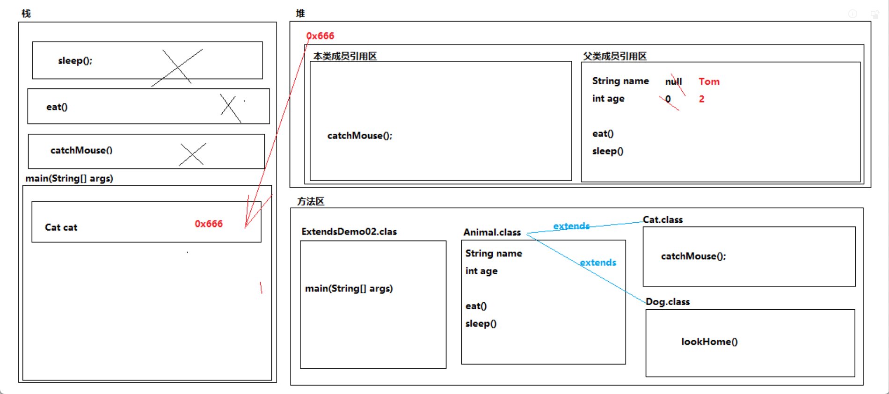

### 继承关系中实例变量的特点

```java
/**
 * 继承关系中实例变量的特点
 *      子类可以继承父类的实例变量
 */
public class ExtendsDemo01 {
    public static void main(String[] args) {
        //创建SubClass对象
        SubClass sc = new SubClass();
        System.out.println(sc.num);
    }
}
```

```java
public class SubClass extends SuperClass {
}
```

```java
public class SuperClass {
    //实例变量
    int num = 10;
}
```

### 回顾this关键字第一种用法

```java
/**
 * 回顾this关键字第一种用法:
 *      场景:
 *          子类的构造器中或子类的实例方法中
 *      格式:
 *          this.实例变量名;
 *          this.实例方法名(实参);
 *      作用:
 *          用来区分同一个类中同名的实例变量和局部变量
 *      含义:
 *          哪个对象调用了this关键字所在的实例方法或构造器,this关键字就代表哪个对象
 *
 * super关键字第一种用法:
 *      场景:
 *          子类的构造器中或子类的实例方法中
 *      格式:
 *          super.实例变量名;
 *          super.实例方法名(实参);
 *      作用:
 *          用来区分子父类继承关系中同名的实例变量
 *          用来区分子父类继承关系中重写的实例方法
 *      含义:
 *          哪个对象调用了super关键字所在的实例方法或构造器,super关键字就代表哪个对象的父类引用
 *
 */
public class ExtendsDemo02 {
    public static void main(String[] args) {
        //创建SubClass对象
        SubClass sc = new SubClass();

        sc.method();
    }
}
```

```java
public class SubClass extends SuperClass {
    int num = 20;
    public void method () {
        int num = 30;

        System.out.println(num);//30
        System.out.println(this.num);//20
        System.out.println(super.num);//10
    }
}
```

```java
public class SuperClass {
    int num = 10;
}
```

### 继承关系中实例方法的特点

```java
/**
 * 继承关系中实例方法的特点
 *      子类可以继承父类的实例方法
 */
public class ExtendsDemo03 {
    public static void main(String[] args) {
        //创建SubClass对象
        SubClass sc = new SubClass();

        sc.method();
    }
}

```

```java
public class SubClass extends SuperClass {

}
```

```java
public class SuperClass {
    public void method () {
        System.out.println("父类的实例方法");
    }
}
```

### 方法的重写

```java
public class A {
}
```

```java
public class B extends A{
}

```

```java
public class C extends B {
}
```

```java
/**
 * 方法的重写:
 *      含义:
 *          在子父类继承关系中(或实现关系中),出现了方法名相同,形参列表相同,权限访问级别和返回类型遵循相关规则的现象
 *      目的:
 *          1.为了后期进行功能的扩展
 *          2.方法的重写是学习多态,接口,匿名内部类的核心条件
 *      前提条件:
 *          1.必须存在子父类继承关系(或实现关系)
 *          2.父类被重写方法和子类重写后方法的方法名必须相同
 *          3.父类被重写方法和子类重写后方法的形参列表必须相同
 *          4.子类重写后方法的权限访问级别必须大于等于父类被重写方法,且遵循权限访问级别的修饰范围(详见方法重写的注意事项)
 *          5.子类重写后方法的返回类型和父类被重写方法的返回类型在内存中必须相同
 *      注意事项:
 *          1.Java语言针对方法的重写提供了语法格式检测工具(方法重写的注解),验证是否满足方法重写的条件
 *              方法重写注解:
 *                  含义:用来验证子类方法是否满足方法重写的条件,如果不满足"编译报错"
 *                  位置:
 *                      子类中
 *                  格式:
 *                      @Override
 *                      修饰符 返回类型 方法名() {}
 *          2.父类的私有方法不可以被重写
 *          3.子父类不在同一个包下,父类的缺省方法不可以被子类进行重写
 *          4.父类的静态方法不可以被重写,编写代码时需要遵循方法重写前提条件
 *          5.子类重写后方法的返回类型在代码中:
 *              如果当父类的返回类型为void时,子类重写后方法的返回类型也必须是void;
 *              如果当父类的返回类型为基本类型时,子类重写后方法的返回类型也必须是该基本类型;
 *              如果当父类的返回类型为引用类型时,子类重写后方法的返回类型也必须是该引用类型或该引用类型的子类类型
 */
public class ExtendsDemo04 {
    public static void main(String[] args) {
        //创建SubClass
        SubClass sc = new SubClass();
        sc.method();
    }
}
```

```java
public class SubClass extends SuperClass {
    @Override
    public C method () {
        System.out.println("子类的实例方法");
        return null;
    }
}

```

```java
public class SuperClass {
    public B method () {
        System.out.println("父类的实例方法");
        return null;
    }
}
```

```java
public class SuperClass {
    void method () {
        System.out.println("demo00父类的实例方法");
    }
}
```

###  继承关系中构造器的特点

```java
/**
 * 继承关系中构造器的特点
 *      1.子类无法继承父类的构造器
 *      2.当构造器没有任何的super(实参)或者this(实参)时,JVM的编译器自动在构造器中填补一个super(),用来创建子类对象的同时,初
 *      始化子类对象的父类成员
 */
public class Extendsdemo05 {
    public static void main(String[] args) {
        SubClass sc = new SubClass();
    }
}

```

```java
public class SubClass extends SuperClass{
    public SubClass() {
        super();
        System.out.println("子类的构造器中显式代码");
    }
}

```

```java
public class SuperClass {
    public SuperClass() {
        System.out.println("父类的构造器中显式代码");
    }
}
```

### 回顾this关键字的第二种用法

```java
/**
 * 回顾this关键字的第二种用法:
 *      场景:
 *          子类的构造器中
 *      格式:
 *          this(实参);
 *      作用:
 *          调用本类中其它的构造器
 *      含义:
 *          当构造器无法进行初始化(人为操作)时,使用this(实参)调用本类中其它的构造器完成对象成员的初始化操作
 *
 * super关键字的第二种用法:
 *      场景:
 *          子类的构造器中
 *      格式:
 *          super(实参);
 *      作用:
 *          调用父类中的构造器
 *      含义:
 *          创建子类对象时,初始化子类成员前,先初始化父类的成员
 *
 */
public class ExtendsDemo06 {
}
```

### this关键字和super关键字的注意事项

```java
/**
 * this关键字和super关键字的注意事项
 *      1.this关键字在内存中是含有地址值的,可以直接进行打印操作,但是super关键字在内存中只能子类对象地址值中的一部分,没有独立
 *      的地址值,super关键字无法进行打印操作
 *      2.在静态成员中无法使用this关键字和super关键字
 *      3.在构造器中,super(实参)和this(实参)必须在第一行
 *      4.在同一个构造器中,super(实参)和this(实参)不可以同时调用
 */
public class ExtendsDemo07 {
}

```

```java
public class SubClass extends SuperClass {
    public SubClass() {
        System.out.println("子类的构造器");
    }
}
```

```java
public class SuperClass {
}
```

### 猫狗案例(继承版)

```java
public class Animal {
    private String name;
    private int age;

    public Animal(String name, int age) {
        this.name = name;
        this.age = age;
    }

    public Animal() {
    }

    public String getName() {
        return name;
    }

    public void setName(String name) {
        this.name = name;
    }

    public int getAge() {
        return age;
    }

    public void setAge(int age) {
        this.age = age;
    }

    //需要子类们进行重写的方法(子类们共同拥有方法,但各自执行过程不一样)
    public void eat () {
        System.out.println("吃东东");
    }

    //不需要子类们进行重写的方法(子类们共同拥有方法,执行过程一样)
    public void sleep () {
        System.out.println("睡觉觉");
    }
}
```

```java
public class Cat extends Animal {
    public Cat(String name, int age) {
        super(name, age);
    }

    public Cat() {
    }

    //重写父类的eat()
    public void eat () {
        System.out.println(getAge() + "岁的" + getName() + "正在吃鱼");
    }

    //猫的特有方法catchMouse()
    public void catchMouse () {
        System.out.println(getAge() + "岁的" + getName() + "正在抓老鼠");
    }

}
```

```java
public class Dog extends Animal {
    public Dog(String name, int age) {
        super(name, age);
    }

    public Dog() {
    }

    //重写父类的eat()
    public void eat () {
        System.out.println(getAge() + "岁的" + getName() + "正在吃shit");
    }

    //狗的特有方法lookHome()
    public void lookHome () {
        System.out.println(getAge() + "岁的" + getName() + "正在看家");
    }

}
```

```java
/**
 * 猫狗案例(继承版)
 */
public class ExtendsDemo08 {
    public static void main(String[] args) {
        //创建Cat对象
        Cat cat = new Cat("Tom", 2);
        cat.catchMouse();
        cat.eat();
        cat.sleep();

        System.out.println("==============================");

        //创建Dog对象
        Dog dog = new Dog("TwoHa", 3);
        dog.lookHome();
        dog.eat();
        dog.sleep();
    }
}
```

### Object类

```java
/**
 * Object类
 *      类的特点
 *          1.Object类是所有类的顶级父类
 *          2.所有的对象(包括数组)都可以调用Object类中的方法
 *          3.所有的接口都继承Object类中方法的抽象形式(暂不涉及)
 *      类的位置
 *          java.lang
 *      类的构造器
 *          public Object()
 *      类的方法
 *          public String toString()
 *              返回该对象的字符串表示。
 *          public boolean equals(Object obj)
 *              指示其他某个对象是否与此对象“相等”。
 *
 * toString()的注意事项:
 *      使用输出语句打印对象名或数组名时,其实就是打印该对象或数组调用toString()的返回值,char类型数组除外
 *
 * ==和equals()的区别:
 *      1.比较内容的数据类型不同:
 *          ==既可以比较基本类型数据,也可以比较引用类型数据
 *          equals()只能比较引用类型数据
 *      2.比较内容的方式不同:
 *          ==比较基本类型数据时,比较的是基本类型的数据值是否相等;而比较引用类型时,比较的是引用类型的地址值是否相等;
 *          equals()比较的是引用类型的地址值是否相等,如果调用equals()是重写Object类后的方法,需要按照重写后的规则进行比较
 */
public class ObjectDemo {
    public static void main(String[] args) {
        //创建Student对象
        Student s = new Student();
        System.out.println(s);
        System.out.println(s.toString());

        System.out.println("===================================================");

        int[] ints = {11,22,33};
        System.out.println(ints);
        System.out.println(ints.toString());

        System.out.println("===================================================");

        char[] chars = {'a','b','c'};
        System.out.println(chars);
        System.out.println(chars.toString());

        System.out.println("===================================================");

        Student s1 = new Student();
        Student s2 = new Student();

        System.out.println(s1.equals(s2));

    }
}

```

```java
public class Student {

    @Override
    public String toString () {
        return "HelloWorld";
    }
}
```

## 权限访问级别

```java
public class SubClass {
    public int num = 10;
}
```

```java
public class SuperClass {
    public int num = 10;
}
```

```java
/**
 * 权限访问级别:
 *      含义:
 *          权限访问级别其实就是封装思想的核心体现
 *      分类(从小到大):
 *          private < 缺省 < protected < public
 *      修饰范围:
 *          private权限访问级别:
 *              修饰范围:被private修饰的内容只能在本类中进行访问和使用,在本类之外无法进行访问和使用,否则编译报错
 *          "缺省"权限访问级别:
 *              修饰范围:
 *                  1.兼容private权限访问级别的修饰范围
 *                  2.权限访问级别是"缺省"的内容,只能在本包中进行访问和使用,在本包之外无法进行访问和使用,否则编译报错
 *          protected权限访问级别:
 *              修饰范围:
 *                  1.兼容"缺省"权限访问级别的修饰范围
 *                  2.被protected修饰的内容只能在同一个项目中且具有子父类继承关系中使用,如果跨包访问且没有继承关系编译报错
 *                  (如果涉及同一个项目但不同模块,需要修改项目的配置文件workspace.xml,暂不涉及)
 *          public权限访问级别:
 *              修饰范围:
 *                  1.兼容"protected"权限访问级别的修饰范围
 *                  2.被public修饰的内容只能在同一个项目中进行访问和使用,超出项目之外无法进行访问和使用,否则编译报错
 *                  (如果涉及同一个项目但不同模块,需要修改项目的配置文件workspace.xml,暂不涉及)
 *
 * 思考题:如需进行跨项目的数据访问,怎么办?
 *      序列化和反序列化(在JavaSE部分在IO流部分讲解序列化和反序列化的第一种形式:对象流)
 */
class AuthorizeDemo01 {
    public static void main(String[] args) {
        //创建SubClass对象
        SubClass sc = new SubClass();
        System.out.println(sc.num);
    }
}

```

```java
public class SubClass extends SuperClass{
    //int num = 10;

    public void method () {
        System.out.println(num);
    }
}
```

```java
public class SuperClass {
    int num = 10;
}
```

```java
/**
 * 权限访问级别基础应用小结
 *      类文件(class,interface,enum)
 *          权限访问级别:
 *              public和缺省,推荐public
 *      类中的成员量
 *          权限访问级别:
 *              四种都可以,推荐private
 *      类中的成员方法
 *          权限访问级别,
 *              四种都可以,推荐public和private
 *      类中的成员内部类
 *          权限访问级别:
 *              四种都可以,推荐private和缺省
 *      类中的构造器
 *          权限访问级别:
 *              四种都可以,推荐public和private
 *      类中的构造器代码块
 *          权限访问级别:
 *              只能缺省
 *      类中的静态代码块
 *          权限访问级别:
 *              只能缺省
 *      接口中的静态常量,抽象方法,默认方法,静态方法,内部接口:
 *          权限访问级别:
 *              只能public,无论显式还是隐式都是public
 *      接口中的私有方法:
 *          权限访问级别:
 *              只能private
 *      枚举类中的枚举对象:
 *          权限访问级别:
 *              只能是public,而且必须是隐式的public
 *      枚举类中的成员量(除枚举对象):
 *          权限访问级别:
 *              四种都可以,推荐private
 *      枚举类中的成员方法
 *          权限访问级别,
 *              四种都可以,推荐public和private
 *      枚举类中的成员内部类
 *          权限访问级别:
 *              四种都可以,推荐private和缺省
 *      枚举类中的构造器
 *          权限访问级别:
 *              只能private,无论显式还是隐式都是private
 *      枚举类中的构造器代码块
 *          权限访问级别:
 *              只能缺省
 *      枚举类中的静态代码块
 *          权限访问级别:
 *              只能缺省
 *      局部成员:
 *          权限访问级别:
 *              只能缺省
 *
 */
public class AuthorizeDemo02 {
    public static void main(String[] args) {

    }
}
```

## 抽象

```java
/**
 * 抽象:
 *      含义:
 *          抽象其实就是为了解决继承关系中的安全隐患
 *      分类:
 *          抽象类
 *          抽象方法
 *
 * 继承关系中的安全隐患:
 *      1.在继承关系中,父类是多个子类抽取出来的共同属性和行为,希望该类在外界不可以被创建成对象,实际上可以被创建对象
 *      2.在继承关系中,子类重写父类的方法,最终执行的是子类重写后的方法,不会执行父类被重写方法中的内容,希望声明父类被重写方法
 *      的时候,无需编写方法体,实际上如果不写方法体,编译报错
 *      3.在继承关系中,子类重写父类的方法,程序员可能忘记某个字节重写父类的方法,希望忘记重写时,编译报错进行提示,实际上忘记重写
 *      没有任何提示
 */
public class AbstractDemo01 {
    public static void main(String[] args) {
        //创建Cat对象
        Cat cat = new Cat("Tom", 2);
        cat.catchMouse();
        cat.eat();
        cat.sleep();

        System.out.println("==============================");

        //创建Dog对象
        Dog dog = new Dog("TwoHa", 3);
        dog.lookHome();
        dog.eat();
        dog.sleep();

        System.out.println("==============================");

        Animal animal = new Animal();
    }
}
```

```java
public class Animal {
    private String name;
    private int age;

    public Animal(String name, int age) {
        this.name = name;
        this.age = age;
    }

    public Animal() {
    }

    public String getName() {
        return name;
    }

    public void setName(String name) {
        this.name = name;
    }

    public int getAge() {
        return age;
    }

    public void setAge(int age) {
        this.age = age;
    }

    //需要子类们进行重写的方法(子类们共同拥有方法,但各自执行过程不一样)
    public void eat () {
        System.out.println("吃东东");
    }

    //不需要子类们进行重写的方法(子类们共同拥有方法,执行过程一样)
    public void sleep () {
        System.out.println("睡觉觉");
    }
}
```

```java
public class Cat extends Animal {
    public Cat(String name, int age) {
        super(name, age);
    }

    public Cat() {
    }

    //重写父类的eat()
    public void eat () {
        System.out.println(getAge() + "岁的" + getName() + "正在吃鱼");
    }

    //猫的特有方法catchMouse()
    public void catchMouse () {
        System.out.println(getAge() + "岁的" + getName() + "正在抓老鼠");
    }

}

```

```java
public class Dog extends Animal {
    public Dog(String name, int age) {
        super(name, age);
    }

    public Dog() {
    }

    //重写父类的eat()
    /*public void eat () {
        System.out.println(getAge() + "岁的" + getName() + "正在吃shit");
    }*/

    //狗的特有方法lookHome()
    public void lookHome () {
        System.out.println(getAge() + "岁的" + getName() + "正在看家");
    }

}
```

### 抽象类

```java
/**
 * 抽象类:
 *      含义:
 *          被abstract关键字修饰的父类,也称之为抽象父类(加强版父类)
 *      格式:
 *          public abstract 父类类名 {}
 *      注意事项:
 *          1.抽象类不可以被实例化对象
 *          2.抽象类中可以含有构造器,构造器的作用用来创建子类对象时,初始化父类成员
 */
public class AbstractDemo02 {
    public static void main(String[] args) {
        //SuperClass superClass = new SuperClass();
    }
}
```

```java
public class SubClass extends SuperClass {

}
```

```java
public abstract class SuperClass {
    public SuperClass() {
    }
}
```

### 抽象方法

```java
/**
 * 抽象方法:
 *      含义:
 *          被abstract修饰且没有方法实体的方法
 *      格式:
 *          修饰符 abstract 返回类型 方法名();
 *      注意:
 *          1.抽象类中可以没有抽象方法,但是含有抽象方法的类一定是抽象类
 *          2.抽象类的子类必须重写抽象父类中的所有抽象方法,否则编译报错,除非该子类也是抽象类
 */
public class AbstractDemo03 {
}
```

```java
public class SubClass extends SuperClass {
    @Override
    public void method() {

    }
}
```

```java
public abstract class SuperClass {
    public abstract void method ();
}
```

### 猫狗案例(抽象版)

```java
public class AbstractDemo04 {
    public static void main(String[] args) {
        //创建Cat对象
        Cat cat = new Cat("Tom", 2);
        cat.catchMouse();
        cat.eat();
        cat.sleep();

        System.out.println("===================================");

        //创建Dog对象
        Dog dog = new Dog("TwoHa", 3);
        dog.lookHome();
        dog.eat();
        dog.sleep();
    }
}
```

```java
public abstract class Animal {
    private String name;
    private int age;

    public Animal() {
    }

    public Animal(String name, int age) {
        this.name = name;
        this.age = age;
    }

    public String getName() {
        return name;
    }

    public void setName(String name) {
        this.name = name;
    }

    public int getAge() {
        return age;
    }

    public void setAge(int age) {
        this.age = age;
    }

    //需要子类们进行重写的方法(子类们共同拥有方法,但各自执行过程不一样)
    public abstract void eat();

    //不需要子类们进行重写的方法(子类们共同拥有方法,执行过程一样)
    public void sleep () {
        System.out.println("睡觉觉");
    }
}
```

```java
public class Cat extends Animal {
    public Cat() {
    }

    public Cat(String name, int age) {
        super(name, age);
    }

    @Override
    public void eat() {
        System.out.println(getAge() + "岁的" + getName() + "正在吃鱼");
    }

    //猫的特有方法:抓老鼠
    public void catchMouse () {
        System.out.println(getAge() + "岁的" + getName() + "正在抓老鼠");
    }
}
```

```java
public class Dog extends Animal {
    public Dog() {
    }

    public Dog(String name, int age) {
        super(name, age);
    }

    @Override
    public void eat() {
        System.out.println(getAge() + "岁的" + getName() + "正在吃骨头");
    }

    //狗的特有方法:看家
    public void lookHome () {
        System.out.println(getAge() + "岁的" + getName() + "正在看家");
    }
}
```

## final关键字

```java
/**
 * final关键字:
 *      含义:
 *          最终的,不可改变的
 *      修饰:
 *          类,方法,变量
 *      作用:
 *          被final修饰的类,被称之"最终类,不可改变类",不能被继承
 *          被final修饰的方法,被称之"最终方法,不可改变方法",不能被重写
 *          被final修饰的变量,被称之"自定义常量",不能被二次赋值
 */
public class FinalDemo01 {
}
```

### 最终类,不可改变类

```java
/**
 * 最终类,不可改变类:
 *      含义:
 *          被final修饰的类
 *      格式:
 *          public final class 类名 {
 *
 *          }
 *      特点:
 *          被final修饰的类,不能被继承
 *      场景:
 *          在开发中,某些类仅提供使用,并不想被修改,将其声明为最终类
 *      注意:
 *          final关键字和abstract关键字不可以修饰同一个类
 */
public class FinalDemo02 {
    public static void main(String[] args) {

    }
}
```

```java
public class SubClass /*extends SuperClass */{
}
```

```java
public /*final abstract*/ class SuperClass {
}
```

### 最终方法,不可改变方法

```java
/**
 * 最终方法,不可改变方法:
 *      含义:
 *          被final修饰的方法
 *      格式:
 *          修饰符 final 返回类型 方法名 () {}
 *      特点:
 *          被final修饰的方法,不能被重写
 *      场景:
 *          在实际开发中,一个类的某个或某些方法不想被子类所重写,将其声明为最终方法
 *      注意:
 *          final关键字和abstract关键字不可以同时修饰一个方法
 *
 */
public class FinalDemo03 {
}
```

```java
public class SubClass extends SuperClass {

    //public void method () {}
}
```

```java
public abstract class SuperClass {
    public void method () {}
}
```

### 自定义常量

```java
import java.util.HashMap;

/**
 * 自定义常量:
 *      含义:
 *          被final修饰的变量
 *      格式:
 *          修饰符 final 数据类型 常量名 = 初始化值;
 *      特点:
 *          被final修饰的变量不可以被二次赋值
 *      场景:
 *          在实际开发中需要使用不可改变且带有数据类型的常量时
 *      分类:
 *          自定义局部常量
 *          自定义实例常量
 *          自定义静态常量
 *      注意:
 *          1.JVM的编译器会将被final修饰且通过直接声明初始化的常量,当成字面值常量进行编译和使用
 *          2.常量有常量的命名规范:
 *              一个单词:
 *                  单词字母全部大写
 *              多个单词
 *                  每个单词字母全部大写,且每个单词间使用_进行连接
 */
public class FinalDemo04 {
    public static void main(String[] args) {
    }
}
```

### 局部常量

```java
/**
 * 局部常量:
 *      含义:
 *          声明在代码块中或方法形参列表中的自定义常量
 *
 */
public class FinalDemo05 {
    public static void main(String[] args) {
        //直接声明初始化局部常量
        final int NUM1 = 123;

        //先声明后初始化局部常量
        final int NUM2;

        byte b1 = 3;
        byte b2 = 4;
        //byte b3 = b1 + b2;
        byte b3 = 3 + 4;//将运算由运行时期提前至编译时期

        final byte VAR1 = 3;
        final byte VAR2 = 4;
        byte sum = VAR1 + VAR2;

        final byte VAR3;
        VAR3 = 3;
        final byte VAR4;
        VAR4 = 4;

        //byte result = VAR3 + VAR4;
    }

    public static void method (final int NUM) {}
}
```

### 实例常量

```java
/**
 * 实例常量:
 *      含义:
 *          被final修饰的实例变量
 *      注意:
 *          1.被final修饰的实例变量在进行初始化时,JVM的堆内存不会给其赋默认值操作
 *          2.被final修饰的实例变量如果先声明后初始化,需要在所有构造器中给其进行初始化赋值操作
 *              如果每个构造器初始化赋的值相同,可以向上抽取到构造器代码块中;
 *              如果每个构造器初始化赋的值不同,还是在每个构造器中进行初始化赋值操作
 *
 */
public class FinalDemo06 {
}

```

```java
public class FinalObjectVar {
    //直接声明初始化实例常量
    final int NUM = 10;

    //先声明后初始化实例变量
    final int VALUE;

    public FinalObjectVar() {
        VALUE = 10;
    }

    public FinalObjectVar(String a) {
        VALUE = 20;
    }

    public FinalObjectVar(String a , String b) {
        VALUE = 30;
    }
}
```

### 静态常量

```java
/**
 * 静态常量:
 *      含义:
 *          被final修饰的静态变量
 *      注意:
 *          1.被final修饰的静态变量在进行初始化时,JVM的堆内存不会给其赋默认值操作
 *          2.被final修饰的静态变量如果先声明后初始化,需要在静态代码块中给其进行初始化赋值操作
 */
public class FinalDemo07 {
}
```

```java
public class StaticFinalVar {
    //先声明后初始化静态常量
    static final int NUM = 123;

    //先声明后初始化静态常量
    static final int VALUE;

    static {
        VALUE = 10;
    }
}
```

## 接口

```java
/**
 * 接口:
 *      含义:
 *          Java中的引用数据类型,在程序中是一组数据和行为的标准
 *      好处:
 *          1.程序设计的标准,用来扩展功能
 *          2.提高程序的复用性,从而提高开发效率
 *          3.学习接口是学习多态,匿名内部类的前提条件
 */
public class InterfaceDemo01 {
}
```

```java
/**
 * 实现关系:
 *      含义:
 *          程序中的类和接口之间的关系,和继承关系高度类似
 *      角色:
 *          实现类:实现接口的类,和继承关系中的子类类似
 *          父接口:实现类实现的接口,和继承关系中的父类类似
 *      步骤:
 *          1.声明需要的接口
 *          2.声明接口的实现类
 *          3.在实现类中重写接口的抽象方法
 *          4.在测试类中创建实现类对象调用重写后方法完成需求
 *      关键字:
 *          interface(接口声明关键字)
 *          implements(实现接口关键字)
 *
 */
public class InterfaceDemo02 {
}
```

```java
/**
 * 接口声明的格式:
 *      public interface 接口名 {
 *          接口的成员
 *      }
 *
 * 接口的成员:
 *      1.静态常量
 *      2.抽象方法
 *      3.默认方法(JDK8.0)
 *      4.静态方法(JDK8.0)
 *      5.私有方法(JDK9.0)
 *      6.内部接口(暂不涉及)
 *
 * 接口的实现格式:
 *      实现类实现接口的同时,也继承父类:
 *          public class 实现类类名 extends 父类类名 implements 父接口名1,父接口名2,.......,父接口名n {
 *
 *          }
 *      实现类只实现接口,没有显式继承父类:
 *          public class 实现类类名 implements 父接口名1,父接口名2,.......,父接口名n {
 *
 *          }
 */
public class InterfaceDemo03 {
    public static void main(String[] args) {

    }
}
```

### 接口的注意事项

```java
public interface A {
}
```

```java
public interface B {
}
```

```java
public interface C extends A,B {
}
```

```java
/**
 * 接口的注意事项:
 *      1.接口中没有构造器,无法实例化对象
 *      2.类,接口间的三种关系:
 *          类与类之间的关系:单继承关系
 *          类与接口之间的关系:多实现关系
 *          接口与接口之间的关系:多继承关系
 *              格式:
 *                  public interface 接口名 extends 父接口名1,父接口名2,......,父接口名n {}
 *      3.如果遇到接口,无法直接进行使用,需要声明接口的实现类
 *      4.接口中的成员最多支持六大成员,除了六大成员外,其它内容无法在接口中进行声明
 *
 */
public class InterfaceDemo04 {
    public static void main(String[] args) {

        //SuperInterface si = new SuperInterface();
    }
}
```

### 接口中的静态常量

```java
/**
 * 接口中的静态常量
 *      含义:
 *          声明在接口中的静态常量
 *      格式:
 *          public static final 数据类型 常量名 = 初始化值;
 *      调用:
 *          接口名.静态常量名
 *      注意:
 *          1.接口中的静态常量不可以先声明后初始化,因为接口中不能使用静态代码块
 *          2.public,static,final这三个关键字缺少哪个,JVM的编译器会在编译时自动进行补全
 *
 */
public class InterfaceDemo05 {
    public static void main(String[] args) {
        System.out.println(SuperInterface.NUM);
    }
}
```

```java
public interface SuperInterface {
    //声明静态常量
    /*public*/ /*static*/ /*final*/ int NUM = 10;

}
```

### 接口中的抽象方法

```java
/**
 * 接口中的抽象方法
 *      含义:
 *          声明在接口中的抽象方法
 *      格式
 *          public abstract 返回类型 方法名 ();
 *      注意:
 *          public和abstract这两个关键字缺少哪个,JVM的编译器会在编译时自动进行补全
 *
 */
public class InterfaceDemo06 {
    public static void main(String[] args) {
        //创建接口的实现类对象
        SubClass sc = new SubClass();

        sc.method();
    }
}
```

```java
public class SubClass implements SuperInterface {
    @Override
    public void method() {
        System.out.println("HelloWorld");
    }
}
```

```java
public interface SuperInterface {
    void method ();
}
```

### 接口中的默认方法

```java
/**
 * 接口中的默认方法(JDK8.0)
 *      含义:
 *          多个实现类中共同含有且不需要重写以默认方法的形式存储在接口中的实例方法
 *      格式:
 *          public default 返回类型 方法名 () {}
 *      注意:
 *          public可以省略不写,如果省略JVM的编译器会在编译时期自动补全
 */
public class InterfaceDemo07 {
    public static void main(String[] args) {
        SubClass sc = new SubClass();

        sc.method();
    }
}
```

```java
public class SubClass extends SuperClass {

}
```

```java
public class SuperClass implements SuperInterface {

}
```

```java
public interface SuperInterface {
    public default void method () {
        System.out.println("多个子类含有的共同方法,且不需要重写");
    }
}
```

### 猫狗案例(接口版)

```java
public abstract class Animal implements AnimalInterface {
    private String name;
    private int age;

    public Animal() {
    }

    public Animal(String name, int age) {
        this.name = name;
        this.age = age;
    }

    public String getName() {
        return name;
    }

    public void setName(String name) {
        this.name = name;
    }

    public int getAge() {
        return age;
    }

    public void setAge(int age) {
        this.age = age;
    }
}
```

```java
public interface AnimalInterface {
    //需要子类们进行重写
    void eat();

    //不需要子类们进行重写
    default void sleep () {
        System.out.println("睡觉觉");
    }
}
```

```java
public class Cat extends Animal {
    public Cat() {
    }

    public Cat(String name, int age) {
        super(name, age);
    }

    public void catchMouse() {
        System.out.println(getAge() + "岁的" + getName() + "正在抓老鼠");
    }

    @Override
    public void eat() {
        System.out.println(getAge() + "岁的" + getName() + "正在吃鱼");
    }
}
```

```java
public class Dog extends Animal {
    public Dog() {
    }

    public Dog(String name, int age) {
        super(name, age);
    }

    public void lookHome() {
        System.out.println(getAge() + "岁的" + getName() + "正在看家");
    }

    @Override
    public void eat() {
        System.out.println(getAge() + "岁的" + getName() + "正在吃骨头");
    }
}
```

```java
/**
 * 猫狗案例(接口版)
 */
public class InterfaceDemo08 {
    public static void main(String[] args) {
        //创建猫对象
        Cat cat = new Cat("Tom", 2);

        cat.catchMouse();
        cat.eat();
        cat.sleep();

        System.out.println("==============================");

        //创建狗对象
        Dog dog = new Dog("TwoHa", 3);

        dog.lookHome();
        dog.eat();
        dog.sleep();
    }
}
```

### 默认方法的注意事项

```java
public interface A {
    default void method() {
        System.out.println("接口A的默认方法");
    }
}
```

```java
public interface B {
    default void method() {
        System.out.println("接口B的默认方法");
    }
}
```

```java
public interface C {
    default void method() {
        System.out.println("接口C的默认方法");
    }
}
```

```java
/**
 * 默认方法的注意事项:
 *      1.当子类同时继承和实现,父类中的实例方法和父接口中的默认方法发生同名的时候,当子类对象调用这个方法时,继承的是父类的实例
 *      方法
 *      2.当子类不继承父类,但实现多个父接口,多个父接口中出现了同名的默认方法,子类需要以实例方法形式重写该默认方法
 *      3.如果在重写的默认方法中调用某个接口被重写的默认方法,需要使用"接口名.super.默认方法名"
 */
public class InterfaceDemo09 {
    public static void main(String[] args) {
        SubClass sc = new SubClass();

        sc.method();
    }
}
```

```java
public class SubClass implements A,B,C {
    @Override
    public void method () {
        A.super.method();
    }
}

```

```java
public class SuperClass {
    public void method () {
        System.out.println("父类的实例方法");
    }
}
```

```java
public interface SuperInterface {
    default void method () {
        System.out.println("接口的默认方法");
    }
}
```

### super关键字的第三种用法

```java
/**
 * super关键字的第三种用法:
 *      场景:
 *          实现类中的构造器或者实例方法
 *      格式:
 *          父接口名.super.默认方法(实参);
 *      作用:
 *          用来区分多个父接口中同名的默认方法
 *      含义:
 *          哪个对象调用"父接口名.super"的构造器或实例方法,"父接口名.super"就代表哪个对象的父接口的引用
 *
 */
public class InterfaceDemo10 {
}
```

### 接口中的静态方法

```java
/**
 * 接口中的静态方法:
 *      含义:
 *          声明在接口中的静态方法
 *      格式:
 *          public static 返回类型 方法名 () {}
 *      调用:
 *          接口名.静态方法名(实参);
 *      注意:
 *          public关键字可以省略不写,如果不写,JVM的编译器在编译时期自动补全
 *
 *
 */
public class InterfaceDemo11 {
    public static void main(String[] args) {
        SuperInterface.method();
    }
}
```

```java
public interface SuperInterface {
    public static void method () {
        System.out.println("接口的静态方法");
    }
}
```

### 继承关系和实现关系的区别

```java
/**
 * 继承关系和实现关系的区别:
 *      1.关系的角色不一样:
 *          继承关系:
 *              类与类或接口与接口
 *          实现关系:
 *              类与接口
 *      2.继承的个数不一样
 *          继承关系:
 *              如果是类与类,是单继承
 *              如果是接口与接口,是多继承
 *          实现关系:
 *              类与接口是多实现
 *      3.静态方法的继承性:
 *          继承关系:
 *              如果是类与类之间的继承关系:静态方法可以继承
 *              如果是接口与接口之间的继承关系:静态方法不可以继承
 *          实现关系:
 *              静态方法不可以继承
 */
public class InterfaceDemo12 {
    public static void main(String[] args) {
        //SubInterface.method();
    }
}
```

```java
public class SubClass implements SuperInterface{
}
```

```java
public interface SubInterface extends SuperInterface {
}
```

```java
public class SuperClass {
    public static void method () {
        System.out.println("父类的静态方法");
    }
}
```

```java
public interface SuperInterface {
    public static void method () {
        System.out.println("父接口中的静态方法");
    }
}
```

### 接口中的私有方法

```java
/**
 * 接口中的私有方法:
 *      含义:
 *          声明在接口中的私有方法
 *      格式:
 *          private 返回类型 方法名 () {}
 *          private static 返回类型 方法名 () {}
 *
 */
public class InterfaceDemo13 {
    public static void main(String[] args) {
        SubClass sc = new SubClass();

        sc.method01();

        System.out.println("====================");

        sc.method02();

        System.out.println("====================");

        //sc.method();
    }
}
```

```java
public class SubClass implements SuperInterface {
}

```

```java
public interface SuperInterface {
    default void method01 () {
        /*System.out.println("你好");
        System.out.println("我好");
        System.out.println("大家好");*/
        //method();
        System.out.println("苗苗老师好");
    }

    default void method02 () {
        /*System.out.println("你好");
        System.out.println("我好");
        System.out.println("大家好");*/
        //method();
        System.out.println("沙沙老师好");
    }

    /*private void method () {
        System.out.println("你好");
        System.out.println("我好");
        System.out.println("大家好");
    }*/
}
```

## 多态

```java
/**
 * 多态:
 *      含义:事物的多种形态(对象的多种形态)
 *
 * 生活中的多态:
 *      西游记中的"白骨精":
 *          妖怪形态的"白骨精"(数据类型:妖怪)
 *          老爷爷形态的"白骨精"(数据类型:老爷爷)
 *          老奶奶形态的"白骨精"(数据类型:老奶奶)
 *          小姐姐形态的"白骨精"(数据类型:小姐姐)
 *
 * 名词解释:
 *      编译时状态:对象在内存中保存的本质形态
 *      运行时状态:对象在使用过程中的状态
 *      单态:编译时状态和运行时状态一致的时候
 *          举例:
 *              Student s = new Student();
 *
 * 程序中的多态:
 *      编译时状态和运行时状态不一致的时候
 *          举例:
 *              Animal a = new Cat();
 *
 * 多态的前提条件:
 *      1.必须要有继承关系或实现关系
 *      2.必须要有方法的重写(如果没有重写,也可以构成多态,不会出现编译报错,这样的多态没有实际意义)
 *      3.多态的语法格式(三选一)
 *          (1)父类的引用指向子类对象
 *              格式:
 *                  父类类名 多态对象名 = new 子类类名(实参);
 *          (2)父接口的引用指向实现类对象
 *              格式:
 *                  父接口名 多态对象名 = new 实现类类名(实参);
 *          (3)特殊的多态形式:this关键字的第三种用法(暂不涉及)
 *              格式:
 *                  在父类中构造器中或实现方法
 */
public class PolyDemo01 {
}
```

### 多态关系中构造器的特点

```java
/**
 * 多态关系中构造器的特点
 *      和之前的构造器使用或执行顺序一模一样,没有任何改变
 */
public class PolyDemo02 {
    public static void main(String[] args) {
        //父类new父类
        SuperClass superClass = new SuperClass();
        System.out.println(superClass);

        System.out.println("=======================");

        //子类new子类
        SubClass subClass = new SubClass();
        System.out.println(subClass);

        System.out.println("=======================");

        //父类new子类(多态)
        SuperClass sc = new SubClass();
        System.out.println(sc);
    }
}
```

```java
public class SubClass extends SuperClass {
    public SubClass() {
        System.out.println("子类的无参构造器中显式代码");
    }
}

```

```java
public class SuperClass {
    public SuperClass() {
        System.out.println("父类的无参构造器中显式代码");
    }
}
```

### 多态关系中实例变量的特点

```java
/**
 * 多态关系中实例变量的特点
 *      和之前变量的使用一模一样,没有任何改变
 *          补充:变量的结果最终是什么,不是取决于最开始的初始化值,而是取决于数据的数据类型
 */
public class PolyDemo03 {
    public static void main(String[] args) {
        //父类new父类
        SuperClass superClass = new SuperClass();
        System.out.println(superClass);
        System.out.println(superClass.num);//10

        System.out.println("=============================");

        //子类new子类
        SubClass subClass = new SubClass();
        System.out.println(subClass);
        System.out.println(subClass.num);//20

        System.out.println("=============================");

        //父类new子类(多态)
        SuperClass sc = new SubClass();
        System.out.println(sc);
        System.out.println(sc.num);//10

        System.out.println("=============================");

        char var1 = 97;
        System.out.println(var1);//'a'

        int var2 = 'a';
        System.out.println(var2);//97

        double var3 = 4;
        System.out.println(var3);//4.0
    }
}
```

```java
public class SubClass extends SuperClass {
    int num = 20;
}
```

```java
public class SuperClass {
    int num = 10;
}
```

### Java中的方法调用

```java
/**
 * Java中的方法调用:
 *      虚调用:判断该方法是否存在,存在执行后续操作,不存在编译报错
 *      实调用:执行具体的方法体内容
 *
 * 多态关系中实例方法的特点
 *      多态对象调用方法,先虚调用父类的该方法(判断父类中是否存在该方法),
 *          如果虚调用成功,再执行子类重写后的方法;
 *          如果虚调用失败,编译报错
 */
public class PolyDemo04 {
    public static void main(String[] args) {
        //父类new父类
        SuperClass superClass = new SuperClass();
        superClass.method();

        System.out.println("==========================");

        //子类new子类
        SubClass subClass = new SubClass();
        subClass.method();

        System.out.println("==========================");

        //父类new子类(多态)
        SuperClass sc = new SubClass();
        sc.method();

    }
}
```

```java
public class SubClass extends SuperClass{
    public void method () {
        System.out.println("子类的实例方法");
    }
}
```

```java
public class SuperClass {
    public void method () {
        System.out.println("父类的实例方法");
    }
}
```

### 多态的好处

```java
/**
 * 多态的好处:
 *      当声明某个类的重载方法时,这些重载方法的形参列表的数据类型都继承某一个父类或实现某个父接口,将其进行简化,无需声明这么
 *      多的重载方法了,直接声明一个父类或父接口作为形参的方法接口,再调用方式时,只需要传递给该父类的子类对象或该父接口的实现
 *      类对象即可,多态的出现,提高方法内容的复用性,从而提高开发效率
 *
 */
public class PolyDemo05 {
    public static void main(String[] args) {
        //创建Person对象
        Person p = new Person("张三", 18);

        //创建猫对象和狗对象
        Cat cat = new Cat(2, "白");
        Dog dog = new Dog(3, "黑");

        //执行操作
        cat.catchMouse();
        p.keepPet(cat,"鱼");
        cat.sleep();

        System.out.println("=========================");

        dog.lookHome();
        p.keepPet(dog,"骨头");
        dog.sleep();

        System.out.println();
    }
}
```

```java
/**
 * 定义动物类
 * 		属性：
 * 			年龄，颜色
 * 		行为:
 * 			eat(String something)方法(无具体行为,不同动物吃的方式和东西不一样,
 * 			something表示吃的东西)生成空参有参构造，set和get方法
 */
public abstract class Animal {
    private int age;
    private String color;

    public Animal() {
    }

    public Animal(int age, String color) {
        this.age = age;
        this.color = color;
    }

    public int getAge() {
        return age;
    }

    public void setAge(int age) {
        this.age = age;
    }

    public String getColor() {
        return color;
    }

    public void setColor(String color) {
        this.color = color;
    }

    public abstract void eat(String something);

    public void sleep () {
        System.out.println("睡觉觉");
    }
}
```

```java
/**
 * 行为:eat(String something)方法,逮老鼠catchMouse方法(无参数)
 */
public class Cat extends Animal{
    public Cat() {
    }

    public Cat(int age, String color) {
        super(age, color);
    }

    @Override
    public void eat(String something) {
        System.out.println(getAge() + "岁" + getColor() + "色的小猫正在吃" + something);
    }

    public void catchMouse () {
        System.out.println(getAge() + "岁" + getColor() + "色的小猫正在抓老鼠");
    }
}
```

```java
/**
 * eat(String something)方法,看家lookHome方法(无参数)
 */
public class Dog extends Animal{
    public Dog() {
    }

    public Dog(int age, String color) {
        super(age, color);
    }

    @Override
    public void eat(String something) {
        System.out.println(getAge() + "岁" + getColor() + "色的小狗正在吃" + something);
    }

    public void lookHome () {
        System.out.println(getAge() + "岁" + getColor() + "色的小狗正在看家");
    }
}
```

```java
public class Person {
    private String name;
    private int age;

    public Person(String name, int age) {
        this.name = name;
        this.age = age;
    }

    public Person() {
    }

    public String getName() {
        return name;
    }

    public void setName(String name) {
        this.name = name;
    }

    public int getAge() {
        return age;
    }

    public void setAge(int age) {
        this.age = age;
    }

    /*//功能：喂养宠物猫，something表示喂养的东西
    public void keepPet(Cat cat,String something) {
        System.out.println(getAge() + "岁的主人" + getName() + "拿来了" + something);
        cat.eat(something);
    }

    //功能：喂养宠物狗，something表示喂养的东西
    public void keepPet(Dog dog,String something) {
        System.out.println(getAge() + "岁的主人" + getName() + "拿来了" + something);
        dog.eat(something);
    }*/

    //功能：喂养宠物动物，something表示喂养的东西
    public void keepPet(Animal a,String something) {
        System.out.println(getAge() + "岁的主人" + getName() + "拿来了" + something);
        a.eat(something);
    }
}
```

### 多态在实际开发中的演示

```java
/**
 * 多态在实际开发中的演示:
 */
public class PolyDemo06 {
    public static void main(String[] args) {
        //方式1:接口的基本使用
        Utils.method(new SubClass());

        System.out.println("====================");

        //方式2:匿名内部类(明天讲解)
        Utils.method(new SuperInterface() {
            @Override
            public void print(String str) {
                System.out.println(str);
            }
        });

        System.out.println("====================");

        //方式3:Lambda表达式(day23讲解)
        Utils.method(str -> System.out.println(str));

        System.out.println("====================");

        //方式4:方法引用(day23讲解)
        Utils.method(System.out::println);
    }
}
```

```java
public class SubClass implements SuperInterface {
    @Override
    public void print(String str) {
        System.out.println(str);
    }
}
```

```java
/**
 * 该接口用来模拟API中提供的接口
 */
public interface SuperInterface {
    void print(String str);
}
```

```java
/**
 * 该类用来表示API提供含有接口作为方法形参的工具类
 */
public class Utils {
    private Utils () {}


    public static void method (SuperInterface si) {
        si.print("HelloWorld");
    }
}
```

### 多态的弊端

```java
/**
 * 定义动物类
 * 		属性：
 * 			年龄，颜色
 * 		行为:
 * 			eat(String something)方法(无具体行为,不同动物吃的方式和东西不一样,
 * 			something表示吃的东西)生成空参有参构造，set和get方法
 */
public abstract class Animal {
    private int age;
    private String color;

    public Animal() {
    }

    public Animal(int age, String color) {
        this.age = age;
        this.color = color;
    }

    public int getAge() {
        return age;
    }

    public void setAge(int age) {
        this.age = age;
    }

    public String getColor() {
        return color;
    }

    public void setColor(String color) {
        this.color = color;
    }

    public abstract void eat(String something);

    public void sleep () {
        System.out.println("睡觉觉");
    }
}
```

```java
/**
 * 行为:eat(String something)方法,逮老鼠catchMouse方法(无参数)
 */
public class Cat extends Animal {
    public Cat() {
    }

    public Cat(int age, String color) {
        super(age, color);
    }

    @Override
    public void eat(String something) {
        System.out.println(getAge() + "岁" + getColor() + "色的小猫正在吃" + something);
    }

    public void catchMouse () {
        System.out.println(getAge() + "岁" + getColor() + "色的小猫正在抓老鼠");
    }
}
```

```java
/**
 * eat(String something)方法,看家lookHome方法(无参数)
 */
public class Dog extends Animal {
    public Dog() {
    }

    public Dog(int age, String color) {
        super(age, color);
    }

    @Override
    public void eat(String something) {
        System.out.println(getAge() + "岁" + getColor() + "色的小狗正在吃" + something);
    }

    public void lookHome () {
        System.out.println(getAge() + "岁" + getColor() + "色的小狗正在看家");
    }
}
```

```java
/**
 * 多态的弊端
 *      多态对象无法调用自己的特有方法
 */
public class PolyDemo07 {
    public static void main(String[] args) {
        //创建猫对象
        Animal cat = new Cat(2, "白");

        //cat.catchMouse();
        cat.eat("鱼");
        cat.sleep();
    }
}
```

### 向上转型和向下转型

```java
/**
 * 向上转型和向下转型:
 *      向上转型:
 *          将子类类型的对象转换成父类类型的对象(其实就是多态)
 *      向下转型:
 *          将父类类型的对象转换成子类类型的对象
 *
 * 向下转型的格式:
 *      子类类名 对象名 = (子类类名)父类类型的对象;
 *
 * 向下转型的注意事项:
 *      将父类类型对象向下转型为不是该对象内存中本质类型时,导致"类型转换异常ClassCastException"
 */
public class PolyDemo08 {
    public static void main(String[] args) {
        //创建猫对象
        Animal tom = new Cat(2, "白");

        //进行向下转型
        Cat cat = (Cat)tom;
        cat.catchMouse();

        System.out.println("======================================");

        //宏愿:狗抓老鼠(即将达成)

        //使用多态的形式创建狗对象
        Animal twoHa = new Dog(3, "黑");

        //将多态形式的狗对象向下转型为猫对象
        Cat c = (Cat)twoHa;

        //操作狗抓老鼠
        c.catchMouse();
    }
}
```

```java
/**
 * 定义动物类
 * 		属性：
 * 			年龄，颜色
 * 		行为:
 * 			eat(String something)方法(无具体行为,不同动物吃的方式和东西不一样,
 * 			something表示吃的东西)生成空参有参构造，set和get方法
 */
public abstract class Animal {
    private int age;
    private String color;

    public Animal() {
    }

    public Animal(int age, String color) {
        this.age = age;
        this.color = color;
    }

    public int getAge() {
        return age;
    }

    public void setAge(int age) {
        this.age = age;
    }

    public String getColor() {
        return color;
    }

    public void setColor(String color) {
        this.color = color;
    }

    public abstract void eat(String something);

    public void sleep () {
        System.out.println("睡觉觉");
    }
}
```

```java
/**
 * 行为:eat(String something)方法,逮老鼠catchMouse方法(无参数)
 */
public class Cat extends Animal {
    public Cat() {
    }

    public Cat(int age, String color) {
        super(age, color);
    }

    @Override
    public void eat(String something) {
        System.out.println(getAge() + "岁" + getColor() + "色的小猫正在吃" + something);
    }

    public void catchMouse () {
        System.out.println(getAge() + "岁" + getColor() + "色的小猫正在抓老鼠");
    }
}
```

```java
/**
 * eat(String something)方法,看家lookHome方法(无参数)
 */
public class Dog extends Animal {
    public Dog() {
    }

    public Dog(int age, String color) {
        super(age, color);
    }

    @Override
    public void eat(String something) {
        System.out.println(getAge() + "岁" + getColor() + "色的小狗正在吃" + something);
    }

    public void lookHome () {
        System.out.println(getAge() + "岁" + getColor() + "色的小狗正在看家");
    }
}
```

### instanceof关键字

```java
/**
 * instanceof关键字:
 *      含义:
 *          包含
 *      格式:
 *          对象名 instanceof 类名
 *      作用:
 *          判断对象在内存中的本质是否为该类型本身或者其子类类型,如果是,返回true,如果不是,返回false
 */
public class PolyDemo09 {
    public static void main(String[] args) {
        //创建猫对象
        Animal tom = new Cat(2, "白");

        if (tom instanceof Cat) {
            //进行向下转型
            Cat cat = (Cat)tom;
            cat.catchMouse();
        } else {
            System.out.println("对象tom在内存中不是Cat类型,无法进行向下转型");
        }

        System.out.println("======================================");

        //宏愿:狗抓老鼠(即将达成)

        //使用多态的形式创建狗对象
        Animal twoHa = new Dog(3, "黑");

        if (twoHa instanceof Cat) {
            //将多态形式的狗对象向下转型为猫对象
            Cat c = (Cat)twoHa;

            //操作狗抓老鼠
            c.catchMouse();
        } else {
            System.out.println("对象twoHa在内存中不是Cat类型,无法进行向下转型");
        }
    }
}
```

```java
/**
 * 定义动物类
 * 		属性：
 * 			年龄，颜色
 * 		行为:
 * 			eat(String something)方法(无具体行为,不同动物吃的方式和东西不一样,
 * 			something表示吃的东西)生成空参有参构造，set和get方法
 */
public abstract class Animal {
    private int age;
    private String color;

    public Animal() {
    }

    public Animal(int age, String color) {
        this.age = age;
        this.color = color;
    }

    public int getAge() {
        return age;
    }

    public void setAge(int age) {
        this.age = age;
    }

    public String getColor() {
        return color;
    }

    public void setColor(String color) {
        this.color = color;
    }

    public abstract void eat(String something);

    public void sleep () {
        System.out.println("睡觉觉");
    }
}
```

```java
/**
 * 行为:eat(String something)方法,逮老鼠catchMouse方法(无参数)
 */
public class Cat extends Animal {
    public Cat() {
    }

    public Cat(int age, String color) {
        super(age, color);
    }

    @Override
    public void eat(String something) {
        System.out.println(getAge() + "岁" + getColor() + "色的小猫正在吃" + something);
    }

    public void catchMouse () {
        System.out.println(getAge() + "岁" + getColor() + "色的小猫正在抓老鼠");
    }
}
```

```java
/**
 * eat(String something)方法,看家lookHome方法(无参数)
 */
public class Dog extends Animal {
    public Dog() {
    }

    public Dog(int age, String color) {
        super(age, color);
    }

    @Override
    public void eat(String something) {
        System.out.println(getAge() + "岁" + getColor() + "色的小狗正在吃" + something);
    }

    public void lookHome () {
        System.out.println(getAge() + "岁" + getColor() + "色的小狗正在看家");
    }
}
```

## 内部类

```java
/**
 * 内部类:
 *      含义:
 *          在一个类中声明另外的一个类
 *      解释:
 *          外部类:在嵌套过程中外面的类
 *          内部类:在嵌套过程中里面的类
 *          外部类和内部类是一对相对的概念
 *      分类:
 *          成员内部类
 *              实例成员内部类
 *              静态成员内部类
 *          局部内部类
 *              标准局部内部类
 *              匿名局部内部类
 *      技巧:
 *          关注内部类的学习目的
 *          关注内部类的权限访问级别
 *          关注内部类的格式
 *          关注内部类的注意事项
 */
public class InnerClassDemo01 {
}
```

### 实例成员内部类

```java
/**
 * 实例成员内部类(实例内部类)
 *      目的:
 *          在实际开发中,某些类不想被本类之外或者本包之外进行访问,只供本类进行使用或本包内部进行使用,现有的知识点满足不了我们
 *          需求,可以将这些类声明在某一个类的成员位置,既然是成员位置,可以使用权限访问级别进行修饰,从而达到限制使用的目的,且内
 *          部类的成员没有静态成员时,选择实例成员内部类
 *      权限:
 *          四种权限访问级别都可以,推荐使用private和缺省
 *      格式:
 *          public class 外部类类名 {
 *              修饰符 class 内部类类名 {
 *
 *              }
 *          }
 *      注意
 *          1.实例成员内部类对象的创建方式
 *              当实例成员内部类权限访问级别是"缺省"时:
 *                  (1)在本包其它类中,后期需要使用外部类对象时
 *                      外部类类名 外部类对象名 = new 外部类类名(实参);
 *                      外部类类名.内部类类名 内部类对象名 = 外部类对象名.new 内部类类名(实参);
 *                  (2)在本包其它类中,后期不需要使用外部类对象时
 *                      外部类类名.内部类类名 内部类对象名 = new 外部类类名(实参).new 内部类类名(实参);
 *                  (3)在外部类的构造器中或实例方法中(不推荐)
 *                      内部类类名 对象名 = new 内部类类名();
 *             当实例成员内部类权限访问级别是"private"时:
 *                  在外部类的构造器中或实例方法中
 *                        内部类类名 对象名 = new 内部类类名();
 *          2.在实例成员内部类中不能声明静态成员,如果强行进行声明,需要将实例成员内部类更改为"静态成员内部类"
 *          3.在外部类中可以访问内部类的私有成员
 *          4.当内部类的实例变量或局部变量和外部类的实例变量或外部类父类的实例变量发生同名的时候,需要使用"外部类类名.this"和
 *          "外部类类名.super"进行区分
 *
 */
public class InnerClassDemo02 {
    public static void main(String[] args) {
        /*//创建外部类类对象
        Outer outer = new Outer();
        //根据外部类对象创建内部类
        Outer.Inner inner = outer.new Inner();

        //直接创建内部类对象
        inner = new Outer().new Inner();*/


        //创建外部类类对象
        Outer outer = new Outer();

        outer.method();
    }
}

```

```java
public class Outer extends SuperOuter {
    //外部类的实例变量
    int num = 20;


    private class Inner {
        private int a = 10;
        int b = 10;
        //static int c = 10;
        //内部类的实例变量
        int num = 30;

        public void show () {
            //内部类的局部变量
            int num = 40;
            System.out.println(num);//40
            System.out.println(this.num);//30
            System.out.println(Outer.this.num);//20
            System.out.println(Outer.super.num);//10
        }
    }

    public void method () {
        Inner inner = new Inner();
        //System.out.println(inner.a);

        inner.show();
    }
}
```

```java
public class SuperOuter {
    //外部类父类的实例变量
    int num = 10;
}
```

### this关键字的第四种用法

```java
/**
 * this关键字的第四种用法
 *      场景:
 *          内部类的构造器中或实例方法中
 *      格式:
 *          外部类类名.this.实例变量名;
 *          外部类类名.this.实例方法名(实参);
 *      作用:
 *          用来区分同名的外部类实例变量和内部类实例变量或局部变量
 *          用来区分同名的外部类实例方法和内部类实例方法
 *      含义:
 *          哪个对象调用"外部类类名.this"所在的构造器或实例方法,"外部类类名.this"就代码哪个对象的外部类对象
 *
 * super关键字的第四种用法
 *      场景:
 *          内部类的构造器中或实例方法中
 *      格式:
 *          外部类类名.super.实例变量名;
 *          外部类类名.super.实例方法名(实参);
 *      作用:
 *          用来区分同名的外部类父类的实例变量和内部类实例变量或局部变量
 *          用来区分同名的外部类父类的实例方法和内部类实例方法
 *      含义:
 *          哪个对象调用"外部类类名.super"所在的构造器或实例方法,"外部类类名.super"就代码哪个对象外部类对象的父类引用
 *
 */
public class InnerClassDemo03 {
}
```

### 静态成员内部类

```java
/**
 * 静态成员内部类(静态内部类)
 *      目的:
 *          在实际开发中,某些类不想被本类之外或者本包之外进行访问,只供本类进行使用或本包内部进行使用,现有的知识点满足不了我们
 *          需求,可以将这些类声明在某一个类的成员位置,既然是成员位置,可以使用权限访问级别进行修饰,从而达到限制使用的目的,且内
 *          部类的成员含有静态成员时,选择静态成员内部类
 *      权限:
 *          四种权限访问级别都可以,推荐使用private和缺省
 *      格式:
 *          public class 外部类类名 {
 *              修饰符 static class 内部类类名 {
 *
 *              }
 *          }
 *      注意:
 *          1.在静态成员内部类中既可以声明实例成员,也可以声明静态成员
 *          2.静态成员内部类中的实例成员如果进行获取,参考实例成员内部类
 *          3.在外部类中可以访问内部类的私有成员
 */
public class InnerClassDemo04 {
}

```

```java
public class Outer {

    private static class Inner {
        int a = 10;
        static int b = 10;
    }

    public void method () {
        Inner inner = new Inner();
    }
}
```

### 标准局部内部类

```java
/**
 * 标准局部内部类(局部内部类)
 *      目的:
 *          1.学习标准局部内部类为了学习匿名局部内部类做铺垫
 *          2.笔试题
 *      权限:
 *          只能缺省
 *      格式:
 *          public class 外部类类名 {
 *              修饰符 返回类型 方法名 () {
 *                  class 内部类类名 {
 *
 *                  }
 *              }
 *          }
 *      注意
 *          1.标准局部内部类可以使用abstract或final进行修饰,不能使用static进行修饰
 *          2.创建标准局部内部类对象只能在标准局部内部类所属方法中,且创建对象的代码必须在标准局部内部类的下面
 *          3.当标准局部内部类的实例变量或局部变量和标准局部内部类所属方法的外部类局部变量发生同名的时候,在标准局部内部类中
 *          无法获取该同名的外部类局部变量
 *          4.外部类的局部变量如果在所属方法的标准局部内部类中进行使用,该外部类局部变量无法在方法中进行更改,一旦在局部内部类
 *          中进行使用,JVM的编译器隐式添加final关键字进行修饰
 */
public class InnerClassDemo05 {
    public static void main(String[] args) {
        new Outer().method();
    }
}

```

```java
public class Outer {
    //外部类的实例变量
    int a = 10;
    int num = 10;

    public void method () {
        //外部类的局部变量
        int b = 20;
        int num = 20;

        int var = 20;
        var = 22;

        //b = 22;


        class Inner {
            //内部类的实例变量
            int c = 30;
            int num = 30;

            public void show () {
                //内部类的局部变量
                int d = 40;
                int num = 40;

                System.out.println(d);
                System.out.println(c);
                System.out.println(b);
                System.out.println(a);

                System.out.println("====================");

                System.out.println(num);//40
                System.out.println(this.num);//30
                //System.out.println(method.num);//20 外部类局部变量
                System.out.println(Outer.this.num);//10

                System.out.println("====================");

                d = 44;
                c = 33;
                //b = 22;
                a = 11;
            }
        }

        Inner inner = new Inner();
        inner.show();
    }
}
```

### 匿名局部内部类

```java
/**

 * 匿名局部内部类(匿名内部类)
 *      目的:
 *          1.针对接口的使用进行简化操作
 *          2.学习匿名内部类是学习"Lambda表达式"的前提条件
 *      格式:
 *          接口名 接口实现类对象名 = new 接口名(){
 *              接口实现类的类体
 *          };
 *      注意:
 *          匿名内部类匿名的是"接口的实现类"
 *      好处:
 *          在实际应用中,调用抽象父类或者父接口作为形参的方法时,无需声明该抽象父类的子类或该接口的实现类,直接传递给抽象父类或
 *          父接口的匿名内部类即可,匿名内部类即该抽象父类的子类对象或该父接口的实现类对象;
 */
public class InnerClassDemo06 {
    public static void main(String[] args) {
        //使用多态的形式创建接口的实现类对象
        SuperInterface si1 = new SubClass();
        si1.method();

        System.out.println("=======================");

        SuperInterface si2 = new SuperInterface(){
            @Override
            public void method () {
                System.out.println("HelloWorld");
            }

        };

        System.out.println(si2);

        //多态对象调用方法
        si2.method();

       /* SuperInterface si3 = new SuperInterface(){
            @Override
            public void method() {
                System.out.println("HelloWorld");
            }
        };

        System.out.println(si3);*/
    }
}
```

```java
public class SubClass implements SuperInterface {
    @Override
    public void method() {
        System.out.println("HelloWorld");
    }
}
```

```java
public interface SuperInterface {
    void method ();
}
```

## 枚举类

```java
/**
 * 枚举类(JDK5.0)
 *      含义:
 *          创建固定数量对象简化方式
 *
 */
public class EnumDemo01 {
    public static void main(String[] args) {
        Gender boy1 = Gender.getBoy();
        Gender boy2 = Gender.getBoy();
        System.out.println(boy1 == boy2);
    }
}

```

```java
public class Gender {
    private static Gender boy;
    private static Gender girl;

    private Gender () {}

    public static Gender getBoy() {

        if (boy == null) {
            boy = new Gender();
        }

        return boy;
    }

    public static Gender getGirl() {

        if (girl == null) {
            girl = new Gender();
        }

        return girl;
    }
}
```

### 枚举类的格式

```java
/**
 * 枚举类的格式:
 *      public enum 枚举类类名 {
 *          枚举对象名1(实参),枚举对象名2(实参),......,枚举对象名n(实参);
 *      }
 */
public class EnumDemo02 {
    public static void main(String[] args) {
        Gender boy1 = Gender.BOY;
        Gender boy2 = Gender.BOY;

        System.out.println(boy1 == boy2);
    }
}
```

```java
public enum Gender {
    BOY(),GRIL();
}
```

### 枚举类的注意事项

```java
/**
 * 枚举类的注意事项:
 *      1.枚举是JDK5.0的新特性,JDK1.4(包含)以前无法进行使用
 *      2.枚举类无法通过new实例化对象
 *      3.当枚举类没有任何的构造器时,JVM的编译器自动填充一个私有无参的构造器,供其创建枚举对象进行使用;一旦枚举含有任何的构造器
 *      JVM的编译器不会提供
 *      4.枚举类的构造器权限访问级别只能是私有,但private可以省略不写,JVM的编译器会在编译时期进行填充
 *      5.在枚举类中使用无参构造器创建枚举对象时,枚举对象后的()可以省略不写
 *      6.在程序中所有的枚举类都直接隐式继承Enum类
 *      7.在程序中所有的枚举类无法直接显示继承其它类,唯一单继承继承了Enum类
 *      8.枚举类可以直接显示实现多个接口
 *      9.在程序中所有的枚举类不能拥有子类
 *      10.在枚举类的构造器中无法使用super(实参)访问Enum类的构造器
 *      11.在程序中所有的枚举类中一旦有"内容",必须声明枚举对象,省略private的无参构造器除外
 *      12.在程序中所有枚举对象必须声明在枚举类的第一行
 *      13.枚举类中所有枚举对象都被隐式修饰成public static final,但是显式修饰编译报错
 *      14.因为枚举类中所有枚举对象被隐式的final修饰,所需枚举对象是常量,枚举对象名遵循常量的命名方式
 */
public class EnumDemo03 {
    public static void main(String[] args) {
        System.out.println(Gender.BOY);
    }
}
```

```java
public enum Gender  {
    BOY(),GRIL();
}
```

```java
public class SubClass extends SuperClass {
    public SubClass() {
        super();
    }
}
```

```java
public class SuperClass {
    protected SuperClass() {
    }
}
```

## 初始化

```java
/**
 * 初始化过程:
 *      含义:
 *          "实例初始化过程"和"类初始化过程"的统称
 *      分类:
 *          实例初始化过程
 *              含义:
 *                  对象创建后的成员初始化过程
 *          类初始化过程
 *              含义:
 *                  字节码对象创建后的成员初始化过程
 */
public class InitDemo01 {
}
```

### 没有继承关系的实例初始化过程

```java
/**
 * 没有继承关系的实例初始化过程
 *      1.隐式加载实例成员和构造器代码块(实例成员和构造器代码块优先级一样,谁在前优先加载谁)
 *      2.构造器中的显式代码(除了显式的super(实参)和this(实参))
 */
public class InitDemo02 {
    public static void main(String[] args) {
        new SubClass();
        /*
            1
            构造器代码块
            2
            无参构造器中的显式代码
            3
        */
    }
}
```

```java
public class SubClass {
    int num = getNum();

    public int getNum () {
        System.out.println("实例变量的显式赋值操作");
        return 10;
    }

    public SubClass() {
        System.out.println("无参构造器中的显式代码");
    }

    {
        System.out.println("构造器代码块");
    }


}
```

### 含有继承关系的实例初始化过程

```java
/**
 * 含有继承关系的实例初始化过程
 *      1.显式或隐式的super(实参)
 *      2.隐式加载实例成员和构造器代码块(实例成员和构造器代码块优先级一样,谁在前优先加载谁)
 *      3.构造器中的显式代码(除了显式的super(实参)和this(实参))
 */
public class InitDemo03 {
    public static void main(String[] args) {
        SubClass sc = new SubClass();
    }
}
```

```java
public class SubClass extends SuperClass{
    int subNum = getSubNum();

    public int getSubNum () {
        System.out.println("子类的实例变量显式赋值操作");
        return 10;
    }

    public SubClass() {

        System.out.println("子类的无参构造器中显式代码");
    }

    {
        System.out.println("子类的构造器代码块");
    }
}
```

```java
public class SuperClass {
    int superNum = getSuperNum();

    public int getSuperNum () {
        System.out.println("父类的实例变量显式赋值操作");
        return 10;
    }

    public SuperClass() {
        System.out.println("父类的无参构造器中显式代码");
    }

    {
        System.out.println("父类的构造器代码块");
    }
}
```

```java
public class InitDemo04 {
    public static void main(String[] args) {
        SubClass subClass = new SubClass();
    }
}
```

```java
public class SubClass extends SuperClass {
    int superNum = getSubNum();
    SubClass sc = new SubClass();

    public int getSubNum () {
        System.out.println("子类的实例变量显式赋值操作");
        return 10;
    }

    public SubClass() {
        super();
        System.out.println("子类的无参构造器中显式代码");
    }

    {
        System.out.println("子类的构造器代码块");
    }
}
```

```java
public class SuperClass {
    int superNum = getSuperNum();

    public int getSuperNum () {
        System.out.println("父类的实例变量显式赋值操作");
        return 10;
    }

    public SuperClass() {
        System.out.println("父类的无参构造器中显式代码");
    }

    {
        System.out.println("父类的构造器代码块");
    }
}
```

### this关键字的第三种用法

```java
/**
 * this关键字的第三种用法
 *      场景:
 *          父类的构造器中或实例方法中,成员
 *      格式:
 *          this.实例变量名;
 *          this.实例方法名(实参);
 *      作用:
 *          多态形式的子类对象
 *      含义:
 *          该this关键字就代表所在父类类型的子类对象
 *
 */
public class InitDemo05 {
    public static void main(String[] args) {
        SubClass sc = new SubClass();
    }
}

```

```java
public class SubClass extends SuperClass {
    int num = getNum();

    public int getNum () {
        System.out.println("子类的实例变量显式赋值操作");
        return 10;
    }

    public SubClass() {
        super();
        System.out.println("子类的无参构造器中显式代码");
    }

    {
        System.out.println("子类的构造器代码块");
    }
}
```

```java
public class SuperClass {
    int num = getNum();

    public int getNum () {
        System.out.println("父类的实例变量显式赋值操作");

        return 10;
    }

    public SuperClass() {

        System.out.println("父类的无参构造器中显式代码");
    }

    {
        System.out.println("父类的构造器代码块");
    }
}
```

```java
public class InitDemo06 {
    public static void main(String[] args) {
        SubClass subClass = new SubClass();
    }
}
```

```java
public class SubClass extends SuperClass {
    int num = 20;

    public SubClass() {
        super();
    }

    public void method () {
        System.out.println("num = " + num);
    }
}

```

```java
public class SuperClass {
    int num = 10;

    public SuperClass() {
        method();
    }

    public void method () {
        System.out.println("num = " + num);
    }
}
```

### 没有继承关系的类初始化过程

```java
/**
 * 没有继承关系的类初始化过程
 *      静态成员和静态代码块加载的优先级一样,谁在前就优先加载谁
 */
public class InitDemo07 {
    public static void main(String[] args) {
        SubClass subClass = new SubClass();
    }
}
```

```java
public class SubClass {
    static int num = method();

    public static int method () {
        System.out.println("静态变量的显式赋值操作");
        return 10;
    }

    static {
        System.out.println("静态代码块");
    }
}
```

### 含有继承关系的类初始化过程

```java
/**
 * 含有继承关系的类初始化过程
 *
 */
public class InitDemo08 {
    public static void main(String[] args) {
        new SubClass();
    }
}
```

```java
public class SubClass extends SuperClass{
    static int subNum = getSubNum();

    public static int getSubNum () {
        System.out.println("子类的静态变量显式赋值操作");
        return 10;

    }

    static {
        System.out.println("子类的静态代码块");
    }
}
```

```java
public class SuperClass {
    static int superNum = getSuperNum();

    public static int getSuperNum () {
        System.out.println("父类的静态变量显式赋值操作");
        return 10;

    }

    static {
        System.out.println("父类的静态代码块");
    }
}
```

```java
public class InitDemo09 {
    public static void main(String[] args) {
        SubClass sc = new SubClass();
    }
}
```

```java
public class SubClass extends SuperClass{
    int subVar = getSubVar();
    static int subNum = getSubNum();
    static SubClass sc = new SubClass();

    public int getSubVar () {
        System.out.println("子类的实例变量显式赋值操作");
        return 10;
    }

    public static int getSubNum () {
        System.out.println("子类的静态变量显式赋值操作");
        return 10;
    }

    public SubClass() {
        System.out.println("子类的无参构造器中显式代码");
    }

    {
        System.out.println("子类的构造器代码块");
    }

    static {
        System.out.println("子类的静态代码块");
    }
}
```

```java
public class SuperClass {
    int superVar = getSuperVar();
    static int superNum = getSuperNum();

    public int getSuperVar () {
        System.out.println("父类的实例变量显式赋值操作");
        return 10;
    }

    public static int getSuperNum () {
        System.out.println("父类的静态变量显式赋值操作");
        return 10;
    }

    public SuperClass() {
        System.out.println("父类的无参构造器中显式代码");
    }

    {
        System.out.println("父类的构造器代码块");
    }

    static {
        System.out.println("父类的静态代码块");
    }
}
```

## 包装类

```java
/**
 * 包装类
 *      含义:
 *          八种基本类型对应的引用类型形式
 *      分类:
 *          整数型:
 *              Byte,Short,Integer,Long
 *          浮点型:
 *              Float,Double
 *          字符型:
 *              Character
 *          布尔型:
 *              Boolean
 *      目的:
 *          1.基本类型和包装类型之间的转换
 *          2.基本类型和字符串类型之间的转换
 *          3.笔试题和面试题(今天暂不涉及)
 */
public class IntegerDemo01 {
}
```

### 基本类型和包装类型之间的转换

```java
/**
 * 基本类型和包装类型之间的转换(装箱和拆箱)
 *      装箱:
 *          将基本类型的数据转换成包装类型的对象
 *      拆箱:
 *          将包装类型的对象转换成基本类型的数据
 *
 * 装箱方式:
 *      1.包装类型以基本类型作为形参的构造器
 *      2.包装类型以基本类型作为形参的静态方法valueOf()
 *      3.自动装箱(JDK5.0)(推荐)
 *          由JVM隐式调用包装类型以基本类型作为形参的静态方法valueOf()
 *
 * 拆箱方式:
 *      1.包装类型的实例方法xxxValue()(备注:xxx包装类型对应基本类型)
 *      2.自动拆箱(JDK5.0)(推荐)
 *          由JVM隐式调用包装类型的实例方法xxxValue()
 */
public class IntegerDemo02 {
    public static void main(String[] args) {
        //装箱1:包装类型以基本类型作为形参的构造器
        Integer num1 = new Integer(123);
        System.out.println(num1);

        //装箱2:包装类型以基本类型作为形参的静态方法valueOf()
        Integer num2 = Integer.valueOf(234);
        System.out.println(num2);

        //装箱3:自动装箱
        Integer num3 = 345;
        System.out.println(num3);

        System.out.println("============================================");

        //拆箱1:包装类型的实例方法xxxValue(备注:xxx包装类型对应基本类型)
        int num4 = new Integer(456).intValue();
        System.out.println(num4);


        //拆箱2:自动拆箱
        int num5 = new Integer(567);
        System.out.println(num5);
    }
}
```

### 基本类型和字符串类型之间的转换

```java
/**
 * 基本类型和字符串类型之间的转换
 *
 * 将基本类型的数据转换成字符串类型的对象
 *      1.字符串连接符
 *      2.包装类型的实例方法toString()
 *      3.包装类型以包装类型对应的基本类型作为形参的静态方法toString()
 *      4.String类以基本类型作为形参的静态方法valueOf()(推荐)
 * 将字符串类型的对象转换成基本类型的数据
 *      1.包装类型以字符串为形参的构造器,在进行拆箱操作
 *      2.包装类型以字符串为形参的静态方法parseXxx()(备注:Xxx待装换基本类型)(推荐)
 *
 * 注意事项:
 *      1.将字符串类型的对象转换成基本类型的数据时,""中的内容必须在待转换基本类型的取值范围
 *      2.包装类型Character并没有提供将字符串类型的对象转换成char类型数据的方式
 */
public class IntegerDemo03 {
    public static void main(String[] args) {
        //基本==>字符串1:字符串连接符
        String str1 = 123 + "";
        //String str1 = new StringBuilder().append(123).append("").toString();

        //基本==>字符串2:包装类型的实例方法toString()
        String str2 = new Integer(234).toString();

        //基本==>字符串3:包装类型以包装类型对应的基本类型作为形参的静态方法toString()
        String str3 = Integer.toString(345);

        //基本==>字符串4:String类以基本类型作为形参的静态方法valueOf()
        String str4 = String.valueOf(456);

        System.out.println("======================================");

        //字符串==>基本1:包装类型以字符串为形参的构造器,在进行拆箱操作
        int num1 = new Integer("567").intValue();

        //字符串==?基本2:包装类型以字符串为形参的静态方法parseXxx()(备注:Xxx待装换基本类型)
        int num2 = Integer.parseInt("678");

    }
}
```

## String类

```java
/**
 * String类
 *      类的特点
 *          1.String类代表字符串
 *          2.Java程序中的所有字符串字面值都是String对象,包括""
 *          3.Java程序中的所有字符串是常量,一旦初始化不能发生改变
 *          4.String类底层的数据结构是"数组结构"
 *          5.String类底层的数组结构是被final修饰,无法进行动态扩容
 *          6.String类底层数组的数据类型:
 *              JDK8.0(包含)以前:char[]
 *              JDK9.0(包含)以后:byte[]
 *          7.String类为什么将底层char[]的数组修改为byte[]的数组?
 *              从"时间复杂度"分析:
 *                  如果底层数组是char[],进行数组元素操作时,先将char类型元素转换为字节数据,再由字节转换为二进制数据
 *                  如果底层数组是byte[],进行数组元素操作时,可以将byte类型元素直接转换为二进制数据
 *              从"空间复杂度"分析:
 *                  如果底层数组是char[],会根据"内码规则"进行字符和字节的转换:
 *                      字符串存储内容"abc",将"abc"拆分成3个字符存储到数组中,每个字符占2个字节,总共占用6个字节
 *                      字符串存储内容"中文",将"中文"拆分成3个字符存储到数组中,每个字符占2个字节,总共占用6个字节
 *                  如果底层数组是byte[],会根据"开发编码环境"进行字符和字节转换
 *                      当编码环境为GBK时,字符串存储内容"abc",在GBK编码中每个字母字符占2个字节,总共占用6个字节
 *                      当编码环境为GBK时,字符串存储内容"中文",在GBK编码中每个中文字符占2个字节,总共占用6个字节
 *                      当编码环境为utf8时,字符串存储内容"abc",在utf8编码中每个字母字符占1个字节,总共占用3个字节
 *                      当编码环境为utf8时,字符串存储内容"中文",在utf8编码中每个中文字符占3个字节,总共占用9个字节
 *          8.String为什么可以存储中文?
 *              JVM的底层是UTF-16的编码方式,只要是Unicode码表中的中文都支持
 *          9.String内容的最大长度是多少?
 *              65535
 *      类的位置
 *          java.lang
 *      类的构造器
 *          public String()
 *              初始化一个新创建的 String 对象，使其表示一个空字符序列。
 *          public String(byte[] bytes)
 *              通过使用平台的默认字符集解码指定的 byte 数组，构造一个新的 String
 *          public String(byte[] bytes,int offset,int length)
 *              通过使用平台的默认字符集解码指定的 byte 子数组，构造一个新的 String
 *          public String(char[] value)
 *              分配一个新的 String，使其表示字符数组参数中当前包含的字符序列
 *          public String(char[] value,int offset,int count)
 *              分配一个新的 String，它包含取自字符数组参数一个子数组的字符。
 *          public String(String original)
 *              初始化一个新创建的 String 对象，使其表示一个与参数相同的字符序列
 *          public String(StringBuffer buffer)
 *              分配一个新的字符串，它包含字符串缓冲区参数中当前包含的字符序列。
 *          public String(StringBuilder builder)
 *              分配一个新的字符串，它包含字符串生成器参数中当前包含的字符序列。
 *      类的方法
 *          判断功能的方法
 *          获取功能的方法
 *          转换功能的方法
 *          分割功能的方法
 *
 * String对象创建方式:
 *      1.字符串字面值直接初始化
 *      2.通过new和构造器的方式
 *
 */
public class StringDemo01 {
    public static void main(String[] args) {
        //字符串字面值直接初始化
        String str1 = "abcdefg";
        System.out.println("str1 = " + str1);

        //通过无参构造器创建对象
        String str2 = new String();
        System.out.println("str2 = " + str2);//类似于"",有本质的不同

        //通过字节数组创建String对象
        byte[] bytes = {97,98,99,100,101,102,103};
        String str3 = new String(bytes);
        System.out.println("str3 = " + str3);

        //通过指定范围的字节数组创建String对象
        String str4 = new String(bytes,3,3);
        System.out.println("str4 = " + str4);

        //通过字符数组创建String对象
        char[] chars = {'a','b','c','d','e','f','g'};
        String str5 = new String(chars);
        System.out.println("str5 = " + str5);

        //通过指定范围的字节数组创建String对象
        String str6 = new String(chars,3,3);
        System.out.println("str6 = " + str6);

        //通过指定字符串对象创建字符串对象
        String str7 = new String("abcdefg");
        System.out.println("str7 = " + str7);
    }
}
```

### String类判断功能的方法

```java
/**
 * String类判断功能的方法:
 *      public boolean equals (Object anObject)
 *          将此字符串与指定对象进行比较。
 *      public boolean equalsIgnoreCase (String anotherString)
 *          将此字符串与指定对象进行比较，忽略大小写。
 *      public boolean contains(CharSequence s)
 *          当且仅当此字符串包含指定的 char 值序列时，返回 true。
 * 		public boolean endsWith(String suffix)
 * 	   	    测试此字符串是否以指定的后缀结束。
 * 		public boolean isEmpty()
 * 	        当且仅当 length() 为 0 时返回 true。
 * 		public boolean startsWith(String prefix)
 * 	   	    测试此字符串是否以指定的前缀开始。
 * 	   	public boolean startsWith(String prefix,int toffset)
 * 	   	    测试此字符串从指定索引开始的子字符串是否以指定前缀开始。
 */
public class StringDemo02 {
    public static void main(String[] args) {
        String str1 = new String("abc");
        String str2 = new String("abc");
        String str3 = new String("ABC");
        String str4 = new String("cba");
        String str5 = "abcdefg";

        //判断字符串的内容是否相等,且区分大小写
        System.out.println(str1.equals(str2));
        System.out.println(str1.equals(str3));
        System.out.println(str1.equals(str4));

        System.out.println("==================");

        //判断字符串的内容是否相等,且不区分大小写
        System.out.println(str1.equalsIgnoreCase(str2));//abc和abc
        System.out.println(str1.equalsIgnoreCase(str3));//abc和ABC
        System.out.println(str1.equalsIgnoreCase(str4));//abc和cba

        System.out.println("==================");

        //判断当前字符串对象是否包含指定字符串对象
        System.out.println(str5.contains("def"));
        System.out.println(str5.contains("HelloWorld"));

        System.out.println("==================");

        //判断当前字符串对象是否以指定字符串作为结尾
        System.out.println(str5.endsWith("defg"));
        System.out.println(str5.endsWith("HelloWorld"));

        System.out.println("==================");

        //判断当前字符串对象是否长度为0
        System.out.println("".isEmpty());
        System.out.println(str5.isEmpty());

        System.out.println("==================");

        //判断当前字符串对象是否以指定字符串作为开始
        System.out.println(str5.startsWith("abc"));
        System.out.println(str5.startsWith("HelloWorld"));

        System.out.println("==================");

        //判断当前字符串从指定索引开始的子字符串对象是否以指定字符串作为开始
        System.out.println(str5.startsWith("def",3));//defg
        System.out.println(str5.startsWith("abc",3));
    }
}
```

### 登录案例

```java
import java.util.Scanner;

/**
 *  登录案例
 */
public class StringDemo03 {
    public static void main(String[] args) {
        //method01();
        method02();
    }

    public static String getCode () {
        //创建验证存储的元素的数组
        String[] arr = new String[62];//26+26+10

        //将验证码内容存储至数组中
        for (int i = 0; i < arr.length; i++) {
            if (i >= 0 && i <= 9) {
                arr[i] = (char)(i + 48) + "";
            } else if (i >= 10 && i <= 35) {
                arr[i] = (char)(i + 55) + "";
            } else {
                arr[i] = (char)(i + 61) + "";
            }
        }

        //声明并初始化验证码变量
        String code = "";

        for (int i = 0; i < 4; i++) {
            int index = (int)(Math.random() * arr.length);
            code += arr[index];
        }


        return code;
    }

    private static void method02() {
        //声明数据库中已存在的用户名和密码
        String databaseUsername = "zhangsan";
        String datebasePassword = "123456";

        //创建Scanner对象
        Scanner sc = new Scanner(System.in);
        String databaseCode = getCode();
        System.out.println("验证码:" + databaseCode);
        System.out.println("请输入账号:");
        String username = sc.next();
        System.out.println("请输入密码:");
        String password = sc.next();
        System.out.println("请输入验证码:");
        String code = sc.next();

        //判断是否登录成功
        if (databaseUsername.equalsIgnoreCase(username) && datebasePassword.equals(password) && databaseCode.equalsIgnoreCase(code)) {
            System.out.println("登录成功");
        } else {
            System.out.println("登录失败");
        }

        //关闭资源
        sc.close();
    }

    private static void method01() {
        //声明数据库中已存在的用户名和密码
        String databaseUsername = "zhangsan";
        String datebasePassword = "123456";

        //创建Scanner对象
        Scanner sc = new Scanner(System.in);
        System.out.println("请输入账号:");
        String username = sc.next();
        System.out.println("请输入密码:");
        String password = sc.next();

        //判断是否登录成功
        if (databaseUsername.equalsIgnoreCase(username) && datebasePassword.equals(password)) {
            System.out.println("登录成功");
        } else {
            System.out.println("登录失败");
        }

        //关闭资源
        sc.close();
    }
}
```

### String类的获取功能方法

```java
/**
 * String类的获取功能方法
 *      public int length ()
 *          返回此字符串的长度。
 *      public String concat (String str)
 *          将指定的字符串连接到该字符串的末尾
 *      public char charAt (int index)
 *          返回指定索引处的 char值
 *      public int indexOf (String str)
 *          返回指定子字符串第一次出现在该字符串内的索引。
 *      public int lastIndexOf(String str)
 *          返回指定子字符串在此字符串中最右边出现处的索引。
 *      public String substring (int beginIndex)
 *          返回一个子字符串，从beginIndex开始截取字符串到字符串结尾。
 *      public String substring (int beginIndex, int endIndex)
 *          返回一个子字符串，从beginIndex到endIndex截取字符串。含beginIndex，不含endIndex。
 *      public String replace(CharSequence target,CharSequence replacement)
 *          使用指定的字面值替换序列替换此字符串所有匹配字面值目标序列的子字符串。
 */
public class StringDemo04 {
    public static void main(String[] args) {
        String str = "abcdefg";

        //获取字符串的长度
        System.out.println(str.length());

        //将指定的字符串追加至字符串的结尾,获取新字符串
        System.out.println(str.concat("HelloWorld"));

        //获取字符串对象指定索引处的char值
        System.out.println(str.charAt(0));

        //获取指定字符串在字符串对象中出现的第一次索引
        System.out.println(str.indexOf("def"));
        System.out.println(str.indexOf("HelloWorld"));

        //获取指定字符串在字符串对象中出现的最后一次索引
        System.out.println(str.lastIndexOf("def"));
        System.out.println(str.lastIndexOf("HelloWorld"));

        //根据指定索引进行截取,获取截取后的新字符串
        System.out.println(str.substring(3));

        //根据指定索引范围进行截取,获取截取后的新字符串
        System.out.println(str.substring(3,6));

        //使用指定字符串替换字符串中指定的内容,获取新的字符串
        System.out.println(str.replace("def","HelloWorld"));
    }
}
```

### String类转换功能的方法

```java
import java.util.Arrays;

/**
 * String类转换功能的方法
 *      public byte[] getBytes()
 *          使用平台的默认字符集将此 String 编码为 byte 序列，并将结果存储到一个新的 byte 数组中。
 *      public char[] toCharArray()
 *          将此字符串转换为一个新的字符数组。
 *      public String toLowerCase()
 *          使用默认语言环境的规则将此 String 中的所有字符都转换为小写。
 *      public String toUpperCase()
 *          使用默认语言环境的规则将此 String 中的所有字符都转换为大写。
 */
public class StringDemo05 {
    public static void main(String[] args) {
        String str = "abcdefg";

        //将字符串转换成字节数组
        System.out.println(Arrays.toString(str.getBytes()));
        System.out.println(Arrays.toString("中文".getBytes()));

        //将字符串转换字符数组
        System.out.println(Arrays.toString(str.toCharArray()));

        //将字符串中所有字母内容转换成小写
        System.out.println("HelloWorld".toLowerCase());
        System.out.println("壹贰叁肆伍".toLowerCase());//一二三四五

        //将字符串中所有字母内容转换成大写
        System.out.println("HelloWorld".toUpperCase());
    }
}
```

### String类分割功能的方法

```java
import java.util.Arrays;

/**
 * String类分割功能的方法
 *      public String[] split(String regex)
 *          根据给定"内容"的匹配拆分此字符串。
 *
 * 注意事项:
 *      1."分割规则"在分割后不复存在
 *      2."分割规则"如果在最后,忽略不计
 */
public class StringDemo06 {
    public static void main(String[] args) {
        String str1 = "abc@def@g";
        String[] arr1 = str1.split("@");
        System.out.println(Arrays.toString(arr1));

        String str2 = "abc@@@def@g";
        String[] arr2 = str2.split("@");
        System.out.println(Arrays.toString(arr2));

        String str3 = "@@abc@def@g@@@";
        String[] arr3 = str3.split("@");
        System.out.println(Arrays.toString(arr3));
    }
}
```

```java
import java.util.Scanner;

/**
 * 统计各类字符的个数
 *      键盘录入一个字符串，统计字符串中大小写字母及数字字符个数
 */
public class StringDemo07 {
    public static void main(String[] args) {
        //method01();
        method02();
    }

    public static void method02() {
        //创建Scanner对象
        Scanner sc = new Scanner(System.in);
        System.out.println("请输入一个字符串:");
        String str = sc.next();

        //声明并初始化各类字符的计数器变量
        int bigCount = 0;
        int smallCount = 0;
        int numCount = 0;
        int otherCount = 0;

        //遍历字符串
        for (int i = 0; i < str.length(); i++) {
            //获取当前正在遍历操作的字符
            char c = str.charAt(i);

            //针对当前正在编译操作的字符进行范围范围
            if (c >= 'A' && c <= 'Z') {
                bigCount++;
            } else if (c >= 'a' && c <= 'z') {
                smallCount++;
            } else if (c >= '0' && c <= '9') {
                numCount++;
            } else {
                otherCount++;
            }
        }

        //打印计数器变量
        System.out.println("大写字符个数:" + bigCount);
        System.out.println("小写字符个数:" + smallCount);
        System.out.println("数字字符个数:" + numCount);
        System.out.println("其它字符个数:" + otherCount);

        //关闭资源
        sc.close();
    }

    public static void method01() {
        //创建Scanner对象
        Scanner sc = new Scanner(System.in);
        System.out.println("请输入一个字符串:");
        String str = sc.next();

        //声明并初始化各类字符的计数器变量
        int bigCount = 0;
        int smallCount = 0;
        int numCount = 0;
        int otherCount = 0;

        //将字符串转换成字符数组
        char[] chars = str.toCharArray();

        //遍历数组
        for (int i = 0; i < chars.length; i++) {
            //获取当前正在遍历操作的字符
            char c = chars[i];

            //针对当前正在编译操作的字符进行范围范围
            if (c >= 'A' && c <= 'Z') {
                bigCount++;
            } else if (c >= 'a' && c <= 'z') {
                smallCount++;
            } else if (c >= '0' && c <= '9') {
                numCount++;
            } else {
                otherCount++;
            }
        }

        //打印计数器变量
        System.out.println("大写字符个数:" + bigCount);
        System.out.println("小写字符个数:" + smallCount);
        System.out.println("数字字符个数:" + numCount);
        System.out.println("其它字符个数:" + otherCount);

        //关闭资源
        sc.close();
    }
}
```

### StringBuffer类和StringBuilder类相同点和不同点

```java
/**
 * StringBuffer类和StringBuilder类相同点和不同点:
 *      相同点:
 *          1.二者共同继承AbstractStringBuilder类
 *          2.二者都是可变的字符串
 *          3.二者拥有相同的功能的方法
 *      不同点:
 *          1.StringBuffer虽然和StringBuilder类的功能方法相同,但是方法都被synchronized关键字进行修饰
 *          2.StringBuffer类是线程安全的,适用于多线程程序,如果在单线程程序中使用,StringBuffer类执行效率要比StringBuilder更低
 *          3.StringBuilder类是线程不安全,适用于单线程程序,如果在多线程程序中使用,需要手动添加线程安全
 */
public class StringDemo08 {
    public static void main(String[] args) {
    }
}
```

### StringBuilder类

```java
/**
 * StringBuilder类
 *      类的特点
 *          1.StringBuilder类是可变的字符串
 *              原因:底层数组没有被final进行修饰
 *          2.StringBuilder类是线程不安全,适用于单线程程序,如果在多线程程序中使用,需要手动添加线程安全
 *      类的位置
 *          java.lang
 *      类的构造器
 *          public StringBuilder()
 *              构造一个不带任何字符的字符串生成器，其初始容量为 16 个字符。
 *      类的方法
 *          public StringBuilder append(String str)
 *              将指定的字符串追加到此字符序列。
 *          public StringBuilder insert(int offset,String str)
 *              将字符串插入此字符序列。
 *          public StringBuilder reverse()
 *              将此字符序列用其反转形式取代。
 *
 */
public class StringDemo09 {
    public static void main(String[] args) {
        String s = new String();
        //在字符串的结尾处追加"HelloWorld"
        s.concat("HelloWorld");
        System.out.println(s);

        System.out.println("=============================");

        StringBuilder sb = new StringBuilder();
        //在字符串的结尾处追加"HelloWorld"
        sb.append("HelloWorld");
        System.out.println(sb);

        System.out.println("=============================");

        //在可变字符串指定索引位置处插入指定的字符串
        sb.insert(5,"Java");
        System.out.println(sb);

        System.out.println("=============================");

        //针对可变的字符串进行反转
        sb.reverse();
        System.out.println(sb);
    }
}

```

```java
/**
 * StringBuilder类的存储过程的源码分析
 *      1.StringBuilder类底层数组的初始容量是多少?
 *          StringBuilder类底层数组的初始容量是多少取决于创建对象时选择的构造器
 *          (1)StringBuilder()
 *              初始容量:16
 *          (2)StringBuilder(CharSequence seq)
 *              初始容量:参数长度 + 16
 *          (3)StringBuilder(int capacity)
 *              初始容量:自定义
 *          (4)StringBuilder(String str)
 *              初始容量:参数长度 + 16
 *      2.StringBuilder类底层数组的扩容规则是什么?
 *          JDK8.0(包含)以后:
 *              扩容规则:(原来底层数组长度 << 1) + 2;
 *          JDK7.0(包含):
 *              扩容规则: 原来底层数组长度 * 2 + 2;
 *          JDK6.0(包含)以前:
 *              扩容规则:(原来底层数组长度 + 1) * 2
 *      3.StringBuilder类底层数组扩容规则为什么+2?
 *          防止特殊情况下的扩容,底层数组长度为0时
 */
public class StringDemo10 {
    public static void main(String[] args) {
        StringBuilder sb = new StringBuilder();

        sb.append("HelloWorld");
        sb.append("hhh");

        System.out.println(sb);
    }
}
```

### String类的笔试题1:地址值比较问题

```java
/**
 * String类的笔试题1:地址值比较问题
 *
 * 常量池:
 *      位置:方法区中
 *      含义:存储常量的内存区域
 *      分类:
 *          字符串常量池
 *              存储字符串的字面值常量
 *          整数常量池
 *              除了short取值范围内的65536个数据外
 *          浮点常量池
 *      特点:
 *          提高数据的复用性,如果常量池中没有,在常量池中进行创建,如果常量池中已有,拿已有数据进行复用
 *      好处:
 *          提高数据的复用性,节约内存空间
 */
public class StringDemo11 {
    public static void main(String[] args) {
        String str1 = new String("HelloWorld");
        String str2 = new String("HelloWorld");
        System.out.println(str1 == str2);//false

        System.out.println("=========================");

        String str3 = "HelloWorld";//字符串常量池
        String str4 = "HelloWorld";//字符串常量池
        System.out.println(str3 == str4);//true

        System.out.println("=========================");

        String str5 = new String("Hello");
        String str6 = new String("World");
        System.out.println(str1 == str5 + str6);//false

        System.out.println("=========================");

        String str7 = "Hello";
        String str8 = "World";
        System.out.println(str3 == str7 + str8);//false

        System.out.println("=========================");

        System.out.println(str3 == "Hello" + "World");//str3 == "HelloWorld"
    }
}
```

### String类的笔试题2:自定义常量地址值问题

```java
/**
 * String类的笔试题2:自定义常量地址值问题
 */
public class StringDemo12 {
    public static final String str1 = "HelloWorld";
    public static final String str2 = "HelloWorld";
    public static final String str3 = "Hello";
    public static final String str4 = "World";
    public static final String str5;
    public static final String str6;
    public static final String str7;
    public static final String str8;

    static {
        str5 = "HelloWorld";
        str6 = "HelloWorld";
        str7 = "Hello";
        str8 = "World";
    }

    public static void main(String[] args) {
        System.out.println(str1 == str2);//true
        System.out.println(str5 == str6);//true
        System.out.println(str1 == str5);//true

        System.out.println("==================================");

        System.out.println(str1 == str3 + str4);//编译时期拼接完成
        System.out.println(str5 == str7 + str8);//运行时期拼接完成
    }
}
```

### String类的笔试题3:String对象个数问题

```java
/**
 * String类的笔试题3:String对象个数问题
 */
public class StringDemo13 {
    public static void main(String[] args) {
        String str1 = "HelloWorld";
        //String对象个数:1个(常量池)

        String str2 = new String("HelloWorld");
        //String对象个数:2个(一个堆,一个常量池)

        String str3 = "H" + "e" + "l" + "l" + "o" + "W" + "o" + "r" + "l" + "d";
        //String对象个数:1个(常量池)

        String s1 = "H";
        String s2 = "e";
        String s3 = "l";
        String s4 = "l";
        String s5 = "o";
        String s6 = "W";
        String s7 = "o";
        String s8 = "r";
        String s9 = "l";
        String s10 = "d";

        String str4 = s1 + s2 + s3 + s4 + s5 + s6 + s7 + s8 + s9 + s10;
        //String对象个数:8个(7个常量池,1个堆)
    }
}
```

## 异常和异常处理

```java
/**
 * 异常和异常处理
 */
public class ExceptionDemo01 {
    public static void main(String[] args) {
        System.out.println("开始");

        try {
            System.out.println(1/0);
        } catch (Exception e) {
            System.out.println("出现该异常的解决方案");
        }

        System.out.println("结束");
    }
}
```

### Throwable类

```java
/**
 * Throwable类
 *      类的特点
 *          Throwable 类是 Java 语言中所有错误或异常的父类
 *          错误(Error):程序在运行过程中出现了无法预判的问题,无法事前避免,只能事后处理.举例:堆栈内存溢出错误
 *          异常(Exception):程序在运行过程中出现了可以预判的问题,可以进行事前避免,无需事后处理.
 *      类的位置
 *          java.lang
 *      类的构造器
 *          public Throwable()
 *              构造一个将 null 作为其详细消息的新 throwable。
 *          public Throwable(String message)
 *              构造带指定详细消息的新 throwable。
 *      类的方法
 *          public void printStackTrace()
 *              将此 throwable 及其追踪输出至标准错误流。
 *          public String getMessage()
 *              返回此 throwable 的详细消息字符串。
 */
public class ExceptionDemo02 {
    public static void main(String[] args) {
        //创建Throwable对象
        Throwable t = new Throwable("自定义Throwable对象");

        //打印异常的详细信息(给程序员看的)
        t.printStackTrace();

        //获取异常的详细信息(给用户看的)
        System.out.println(t.getMessage());
    }
}
```

```java
import java.io.FileInputStream;

/**
 * 异常:
 *      含义:
 *          在程序编译或运行的过程中,代码没有出现语法格式问题,但发生了非正常情况,导致编译报错或运行报错
 *      分类:
 *          编译时异常
 *          运行时异常
 *      注意:
 *          无论编译时异常还是运行时异常,都必须进行异常的处理
 *
 * 编译时异常:
 *      含义:
 *          在程序编译的过程中,代码没有出现任何语法格式问题,但发生了编译报错
 *      位置:
 *          java.lang.Exception类及其子类(RuntimeException类及其子类除外)
 *      处理:
 *          必须由程序员手动进行处理(声明处理和捕获处理二选一)
 *
 * 运行时异常:
 *      含义:
 *          在程序运行的过程中,diam没有出现任何语法格式问题,但发生了运行报错
 *      位置:
 *          java.lang.RuntimeException类及其子类除外
 *      处理:
 *          可以由程序员手动进行处理(声明处理和捕获处理二选一)
 *          程序员也可以不处理,如果程序不进行处理,JVM会自行处理
 *              JVM的处理方案:
 *                  (1)终止JVM(2)终止的同时调用Throwable类中printStackTrace()
 */
public class ExceptionDemo03 {
    public static void main(String[] args) {
        System.out.println("开始");
        System.out.println(1/0);
        System.out.println("结束");
    }
}
```

### 异常的处理

```java
/**
 * 异常的处理:
 *      含义:
 *          处理异常
 *      分类:
 *          异常声明处理
 *              特点:方法内部不进行处理,交给该方法的调用进行处理(自己不处理,交给他人处理)
 *          异常捕获处理
 *              特点:代码块内部尝试捕获,根据捕获到的异常进行处理(自己独立处理)
 *      前提:
 *          异常处理只能处理抛出来的异常对象(throw出异常对象)
 */
public class ExceptionDemo04 {
    public static void main(String[] args) {

    }
}
```

### throw关键字

```java
import java.io.IOException;

/**
 * throw关键字
 *      含义:
 *          抛出异常对象
 *      格式:
 *          throw new 异常类名(实参);
 */
public class ExceptionDemo05 {
    public static void main(String[] args) {
        method();
    }

    private static void method() {
        //throw new IOException("自定义IO异常对象");
    }
}
```

### 异常声明处理

```java
import java.io.IOException;

/**
 * 异常声明处理:
 *      含义:
 *          在异常发生代码所在的方法上进行声明,交给该方法的调用者进行解决
 *      格式:
 *          修饰符 返回类型 方法名 () throws 异常类名1,异常类名2,......,异常类名n {
 *
 *          }
 *
 */
public class ExceptionDemo06 {
    public static void main(String[] args) throws IOException {
        method();
    }

    private static void method() throws IOException{
        throw new IOException("自定义IO异常对象");
    }
}
```

### 异常声明处理的注意事项:继承

```java
import java.io.FileNotFoundException;
import java.io.IOException;

/**
 * 异常声明处理的注意事项:继承
 *      声明的异常类存在子父类继承关系
 *          1.进行异常声明处理时,存在子父类继承关系的异常类没有声明先后顺序之分
 *          2.进行含有子父类继承关系的异常类声明时,直接声明异常父类即可
 *      异常所在的类存在子父类继承关系
 *          1.异常在父类被重写的方法中
 *              子类重写父类含有异常的方法时,无需处理该异常信息
 *          2.异常在子类重写后的方法中
 *              处理异常的方案只有唯一的一种:异常捕获处理
 *
 */
public class ExceptionDemo07 {
    public static void main(String[] args) {

    }

    private static void method(int a, int b) throws IOException{
        if (a == 1) {
            throw new FileNotFoundException("自定义文件没有找到异常对象");
        }

        if (b == 1) {
            throw new IOException("自定义IO异常对象");
        }
    }
}
```

```java
public class SubClass extends SuperClass {

    @Override
    public void method () {
        //throw new IOException("自定义IO异常对象");
    }
}
```

```java
public class SuperClass {
    public void method ()  {

    }
}
```

### 异常捕获处理

```java
import java.io.IOException;

/**
 * 异常捕获处理:
 *      含义:
 *          针对程序中的异常信息进行捕获,再进行处理,从而保障程序后续可以正常运行
 *      格式:针对单个异常进行捕获处理
 *          try {
 *              可能出现异常的代码
 *          } catch (捕获异常类名 对象名) {
 *              该捕获到异常的后续处理方案
 *          }
 *
 */
public class ExceptionDemo08 {
    public static void main(String[] args)  {

        System.out.println("开始");

        method(1);

        System.out.println("结束");
    }

    private static void method(int a) {

        try {
            if (a == 1) {
                throw new IOException("自定义IO异常对象");
            }
        } catch (IOException e) {
            System.out.println("IO异常的解决方案");
            e.printStackTrace();
        }
    }
}
```

### 异常捕获处理的注意事项:继承

```java
import java.io.FileNotFoundException;
import java.io.IOException;

/**
 * 异常捕获处理的注意事项:继承
 *      抛出的异常类存在子父类继承关系
 *          分别捕获,分别处理
 *              场景:每个异常信息都是独立解决,互不影响
 *          一起捕获,分别处理
 *              场景:每个异常信息都是独立解决,互有影响
 *              注意:处理异常时,先处理异常子类,再处理异常父类
 *          一起捕获,一起处理
 *              场景:每个异常信息处理方法相同
 *      异常所在的类存在子父类继承关系
 *          1.异常在父类被重写的方法中
 *              子类重写父类含有异常的方法时,无需处理该异常信息
 *          2.异常在子类重写后的方法中
 *              处理异常的方案只有唯一的一种:异常捕获处理
 */
public class ExceptionDemo09 {
    public static void main(String[] args) {

    }

    public static void method03 (int a , int b) {
        try {
            if (a == 1) {
                throw new FileNotFoundException("自定义文件找不到异常对象");
            }

            if (b == 1) {
                throw new IOException("自定义IO异常对象");
            }
        } catch (IOException e) {
            e.printStackTrace();
        }
    }

    public static void method02 (int a , int b) {
        try {
            if (a == 1) {
                throw new FileNotFoundException("自定义文件找不到异常对象");
            }

            if (b == 1) {
                throw new IOException("自定义IO异常对象");
            }
        } catch (FileNotFoundException e) {
            e.printStackTrace();
        } catch (IOException e) {
            e.printStackTrace();
        }
    }

    public static void method01 (int a , int b) {
        if (a == 1) {
            try {
                throw new FileNotFoundException("自定义文件找不到异常对象");
            } catch (FileNotFoundException e) {
                e.printStackTrace();
            }
        }

        if (b == 1) {
            try {
                throw new IOException("自定义IO异常对象");
            } catch (IOException e) {
                e.printStackTrace();
            }
        }
    }

    /*public static void method (int a , int b) {
        if (a == 1) {
            throw new FileNotFoundException("自定义文件找不到异常对象");
        }

        if (b == 1) {
            throw new IOException("自定义IO异常对象");
        }
    }*/
}
```

### finally关键字

```java
import java.io.FileInputStream;
import java.util.Scanner;

/**
 * finally关键字
 *      含义:
 *          必须执行的代码片段
 *      格式:
 *          try {
 *              可能出现异常的代码片段
 *          } catch (捕获异常类型 对象名) {
 *              捕获异常的处理
 *          } finally {
 *              必须执行的代码块
 *          }
 *      场景:
 *          存储关闭资源的代码
 */
public class ExceptionDemo10 {
    public static void main(String[] args) {
        //声明Scanner对象变量
        Scanner sc = null;

        try {
            //初始化Scanner对象变量
            sc = new Scanner(System.in);

            //扫描键盘录入的整数数据
            System.out.println("请输入一个整数:");
            int num = sc.nextInt();

            System.out.println("num = " + num);
        } catch (Exception e) {
            System.out.println("Scanner异常的解决方案");
        } finally {
            //关闭资源
            if (sc != null) {
                System.out.println("关闭资源");
                sc.close();
            }
        }
    }
}
```

```java
/**
 * finally关键字的注意事项:
 *      在try,catch,finally避免使用return
 */
public class ExceptionDemo11 {
    public static void main(String[] args) {
        int result = method05();
        System.out.println("result = " + result);
    }

    private static int method05() {
        int a = 10;
        int b = 20;

        try {
            System.out.println("try");
            return a;
        } catch (Exception e) {
            System.out.println("catch");
            return b;
        } finally {
            System.out.println("finally");
            a = a + b; //a += b;
        }
    }

    private static int method04() {
        int a = 10;
        int b = 20;

        try {
            System.out.println("try");
            return a;
        } catch (Exception e) {
            System.out.println("catch");
            return b;
        } finally {
            System.out.println("finally");
        }
    }

    private static int method03() {
        int a = 10;
        int b = 20;

        try {
            System.out.println("try");
            return a;
        } catch (Exception e) {
            System.out.println("catch");
            return b;
        } finally {
            System.out.println("finally");
            return a + b;
        }
    }

    private static int method02() {
        try {
            System.out.println("try");
            return 10;//执行return 10,finally预警,将10存储到栈内存中返回区,等待finally执行完毕
        } catch (Exception e) {
            System.out.println("catch");
            return 20;
        } finally {
            System.out.println("finally");
            return 30;
        }
    }

    private static int method01() {
        try {
            System.out.println("try");
            return 10;
        } catch (Exception e) {
            System.out.println("catch");
            return 20;
        }
    }
}
```

### JDK7.0新增的异常捕获处理

```java
import java.util.Scanner;

/**
 * JDK7.0新增的异常捕获处理
 *      含义:
 *          针对含有关闭资源代码的try...catch...finally的简化
 *      格式:
 *          try (
 *              创建需要关闭资源的对象
 *          ) {
 *              可能发生异常的代码
 *          } catch (捕获异常类型 对象名) {
 *              捕获异常对象的解决方案
 *          }
 */
public class ExceptionDemo12 {
    public static void main(String[] args) {
        method02();
    }

    private static void method02() {
        try (
            //声明并初始化Scanner对象
            Scanner sc = new Scanner(System.in);
        ) {
            //扫描键盘录入的整数数据
            System.out.println("请输入一个整数:");
            int num = sc.nextInt();

            System.out.println("num = " + num);
        } catch (Exception e) {
            System.out.println("Scanner异常的解决方案");
        }
    }

    private static void method01() {
        //声明Scanner对象变量
        Scanner sc = null;

        try {
            //初始化Scanner对象变量
            sc = new Scanner(System.in);

            //扫描键盘录入的整数数据
            System.out.println("请输入一个整数:");
            int num = sc.nextInt();

            System.out.println("num = " + num);
        } catch (Exception e) {
            System.out.println("Scanner异常的解决方案");
        } finally {
            //关闭资源
            if (sc != null) {
                System.out.println("关闭资源");
                sc.close();
            }
        }
    }
}
```

### 自定义异常类

```java
/**
 * 自定义异常类
 *      分类:
 *          自定义编译时异常类(实际)
 *          自定义运行时异常类
 *
 * 自定义编译时异常类
 *      1.创建Exception类的子类
 *      2.根据父类生成所需的构造器(至少2个,一个无参,一个String参数)
 *
 * 自定义运行时异常类
 *      1.创建RuntimeException类的子类
 *      2.根据父类生成所需的构造器(至少2个,一个无参,一个String参数)
 */
public class ExceptionDemo13 {
    public static void main(String[] args) {

    }
}
```

```java
public class MyException extends Exception{
    public MyException() {
    }

    public MyException(String message) {
        super(message);
    }
}
```

```java
public class MyRuntimeException extends RuntimeException {
    public MyRuntimeException() {
    }

    public MyRuntimeException(String message) {
        super(message);
    }
}
```

## 日期时间类

```java
/**
 * 日期时间类:
 *      第一代(JDK1.0):Date类,DateFormat类,SimpleDateFormat类
 *      第二代(JDK1.1):Calendar类
 *      第三代(JDK8.0):LocalDate类,LocalTime类,LocalDateTime类,DateTimeFormatter类
 */
public class DateDemo01 {
}
```

### Date类

```java
import java.util.Date;

/**
 * Date类
 *      类的特点
 *          类 Date 表示特定的瞬间，精确到毫秒。
 *      类的位置
 *          java.util
 *      类的构造器
 *          public Date()
 *              分配 Date 对象并初始化此对象，以表示分配它的时间（精确到毫秒）。
 *          public Date(long date)
 *              分配 Date 对象并初始化此对象，以表示自从标准基准时间（称为“历元（epoch）”，即 1970 年 1 月 1 日 00:00:00 GMT）以来的指定毫秒数。
 *      类的方法
 *          public long getTime()
 *              返回自 1970 年 1 月 1 日 00:00:00 GMT 以来此 Date 对象表示的毫秒数。
 */
public class DateDemo02 {
    public static void main(String[] args) {
        //创建Date对象
        Date d1 = new Date();
        //获取该Date对象的毫秒值
        System.out.println(d1.getTime());

        //创建Date对象
        Date d2 = new Date(0L);
        System.out.println(d2);
    }
}
```

### DateFormat类

```java
/**
 * 第一代日期时间类的格式化和解析:
 *      格式化:Date对象==>String文本
 *      解析:String文本==>Date对象
 *
 * DateFormat类
 *      类的特点
 *          针对Date对象进行格式化和解析工具类的抽象父类
 *      类的位置
 *          java.text
 *      类的构造器
 *          该类为抽象类
 *      类的方法
 *          public final String format(Date date)
 *              将一个 Date 格式化为日期/时间字符串。
 *          public Date parse(String source)
 *              从给定字符串的开始解析文本，以生成一个日期
 *
 * SimpleDateFormat类
 *      类的特点
 *          针对Date对象进行格式化和解析操作的工具类
 *      类的位置
 *          java.text
 *      类的构造器
 *          public SimpleDateFormat(String pattern)
 *              用给定的模式和默认语言环境的日期格式符号构造 SimpleDateFormat。
 *      类的方法
 *          详见DateFormat类的常用方法
 *
 *
 */
public class DateDemo03 {
}
```

### Date类的格式化

```java
import java.text.SimpleDateFormat;
import java.util.Date;

/**
 * Date类的格式化:
 *      1.创建Date对象
 *      2.根据给定的格式创建SimpleDateFormat对象
 *      3.进行格式化操作
 */
public class DateDemo04 {
    public static void main(String[] args) {
        //1.创建Date对象
        Date date = new Date();

        //2.根据给定的格式创建SimpleDateFormat对象
        SimpleDateFormat sdf = new SimpleDateFormat("yyyy年MM月dd日 HH时mm分ss秒SSS毫秒");

        //3.进行格式化操作
        String format = sdf.format(date);

        System.out.println(format);
    }
}
```

### Date对象的解析

```java
import java.text.ParseException;
import java.text.SimpleDateFormat;
import java.util.Date;

/**
 * Date对象的解析
 *      1.创建存储日期时间的文本
 *      2.根据给定的格式创建SimpleDateFormat对象
 *      3.进行解析操作
 */
public class DateDemo05 {
    public static void main(String[] args) throws ParseException {
        //1.创建存储日期时间的文本
        String dt = "2022年07月12日 15时07分32秒931毫秒";

        //2.根据给定的格式创建SimpleDateFormat对象
        SimpleDateFormat sdf = new SimpleDateFormat("yyyy年MM月dd日 HH时mm分ss秒SSS毫秒");

        //3.进行解析操作
        Date parse = sdf.parse(dt);

        System.out.println(parse);
    }
}
```

### Calendar类

```java
import java.util.Calendar;

/**
 * Calendar类
 *      类的特点
 *          针对第二代日期时间类操作的工具抽象类
 *      类的位置
 *          java.util
 *      类的构造器
 *          该类为抽象类
 *      类的方法
 *          public static Calendar getInstance()
 *              使用默认时区和语言环境获得一个日历。
 *          public int get(int field)
 *              返回给定日历字段的值。
 */
public class DateDemo06 {
    public static void main(String[] args) {
        Calendar c = Calendar.getInstance();

        int year = c.get(Calendar.YEAR);

        int month = c.get(Calendar.MONTH);

        int day = c.get(Calendar.DAY_OF_MONTH);

        System.out.println(year + "年" + month + "月" + day + "日");
    }
}
```

### LocalDateTime类

```java
import java.time.LocalDateTime;

/**
 * LocalDateTime类
 *      类的特点
 *          针对第三代日期时间操作的工具类
 *      类的位置
 *          java.time
 *      类的构造器
 *          构造器私有化
 *      类的方法
 *          public static LocalDateTime now()
 *              从默认时区中的系统时钟中获取当前日期时间
 *          public int getXxx()
 *              获取日期时间对应的字段。
 *          public static LocalDateTime parse(CharSequence text,DateTimeFormatter formatter)
 *              获得 LocalDateTime实例从使用特定格式的文本字符串。
 */
public class DateDemo07 {
    public static void main(String[] args) {
        //获取LocalDateTime对象
        LocalDateTime ldt = LocalDateTime.now();

        int year = ldt.getYear();
        int month = ldt.getMonthValue();
        int day = ldt.getDayOfMonth();

        System.out.println(year + "年" + month + "月" + day + "日");

    }
}
```

### DateTimeFormatter类

```java
import java.time.LocalDateTime;
import java.time.format.DateTimeFormatter;

/**
 * DateTimeFormatter类
 *      类的特点
 *          针对第三代日期时间类进行格式化解析操作的工具类
 *      类的位置
 *          java.time.format
 *      类的构造器
 *          构造器私有化
 *      类的方法
 *          public static DateTimeFormatter ofPattern(String pattern)
 *              创建一个格式化程序使用指定的模式。
 *          public String format(TemporalAccessor temporal)
 *              使用此格式化程序格式的日期时间对象。
 *
 * LocalDateTime类的格式化操作:
 *      1.获取LocalDateTime对象
 *      2.获取DateTimeFormatter对象并指定格式
 *      3.进行格式化操作
 */
public class DateDemo08 {
    public static void main(String[] args) {
        //1.获取LocalDateTime对象
        LocalDateTime ldt = LocalDateTime.now();

        //2.获取DateTimeFormatter对象并指定格式
        DateTimeFormatter dtf = DateTimeFormatter.ofPattern("yyyy年MM月dd日");

        //3.进行格式化操作
        String format = dtf.format(ldt);

        System.out.println(format);
    }
}
```

### LocalDateTime类的解析操作

```java
import java.time.LocalDateTime;
import java.time.format.DateTimeFormatter;
import java.time.temporal.TemporalAccessor;

/**
 * LocalDateTime类的解析操作:
 *      1.创建存储日期时间的文本
 *      2.获取DateTimeFormatter对象并指定格式
 *      3.进行解析操作
 */
public class DateDemo09 {
    public static void main(String[] args) {
        //1.创建存储日期时间的文本
        String dt = "2022年07月12日 15时07分32秒931毫秒";

        //2.获取DateTimeFormatter对象并指定格式
        DateTimeFormatter dtf = DateTimeFormatter.ofPattern("yyyy年MM月dd日 HH时mm分ss秒SSS毫秒");

        //3.进行解析操作
        LocalDateTime parse = LocalDateTime.parse(dt, dtf);

        System.out.println(parse);
    }
}
```

## 集合

```java
/**
 * 数组:
 *      含义:存储同一种数据类型多个元素的固定容器
 *
 * 集合:
 *      含义:存储同一种数据类型多个对象元素的容器
 *
 * 数组和集合的区别:
 *      1.存储元素的数据类型
 *          数组:既可以是基本类型元素,也可以是引用类型元素
 *          集合:只能是引用类型元素
 *      2.容器长度
 *          数组:一旦初始化,长度不可改变
 *          集合:长度是可以改变的
 *
 */
public class CollectionDemo01 {
}
```

### 集合框架体系结构

```java
/**
 * 集合框架体系结构
 *      单列集合
 *          含义:在程序中存储元素以"个"为单位的集合
 *
 *      双列集合
 *          含义:在程序红存储元素以"对"为单位的集合
 *
 * 单列集合体系:
 *      Collection接口
 *          List接口
 *              ArrayList类
 *              Vector类
 *              LinkedList类
 *          Set接口
 *              HashSet类
 *              LinkedHashSet类
 *              TreeSet类
 * 双列集合体系:
 *      Map接口:
 *          HashMap类
 *          LinkedHashMap类
 *          TreeMap类
 *          Hashtable类
 *          Properties类(IO流完事讲解)
 */
public class CollectionDemo02 {
}
```

### Collection接口

```java
import java.util.ArrayList;
import java.util.Collection;

/**
 * Collection接口
 *      接口的特点
 *          单列集合的顶级接口
 *      接口的位置
 *          java.util
 *      接口的方法
 *          boolean add(E e)
 *              确保此 collection 包含指定的元素（可选操作）
 *          void clear()
 *              移除此 collection 中的所有元素（可选操作）
 *          boolean contains(Object o)
 *              如果此 collection 包含指定的元素，则返回 true
 *          boolean isEmpty()
 *              如果此 collection 不包含元素，则返回 true
 *          Iterator<E> iterator()
 *              返回在此 collection 的元素上进行迭代的迭代器
 *          boolean remove(Object o)
 *              从此 collection 中移除指定元素的单个实例，如果存在的话（可选操作）
 *          int size()
 *              返回此 collection 中的元素数
 *          default Stream<E> stream()
 *              返回一个序列 Stream与集合的来源
 *          default void forEach(Consumer<? super T> action)
 *              执行特定动作的每一个元素的 Iterable直到所有元素都被处理或操作抛出异常。
 */
public class CollectionDemo03 {
    public static void main(String[] args) {
        //使用多态的形式创建Collection对象
        Collection coll = new ArrayList();

        //打印集合对象
        System.out.println(coll);

        //添加元素
        coll.add("abc");
        coll.add("def");
        coll.add("123");
        coll.add(123);

        System.out.println(coll);

        //删除集合的Integer类型123
        coll.remove(123);

        System.out.println(coll);

        //获取集合的长度
        System.out.println(coll.size());

        //判断集合中是否包含指定元素
        System.out.println(coll.contains("def"));
        System.out.println(coll.contains("HelloWorld"));

        //判断集合中元素的个数是否为0
        System.out.println(coll.isEmpty());

        //删除集合中所有元素
        coll.clear();
        System.out.println(coll);

        //判断集合中元素的个数是否为0
        System.out.println(coll.isEmpty());
    }
}

```

```java
import java.lang.reflect.Array;
import java.util.ArrayList;
import java.util.Collection;

/**
 * Collection面试题:
 *      使用多态的形式创建Collection集合对象,如果使用对象调用方法,先虚调用Collection接口中的方法(判断Collection接口是否存在
 *      该方法),如果存在,实调用Collection接口实现类重写后的方法,目前使用Collection接口的多态对象调用toString(),先虚调用
 *      Collection接口中的toString方法(判断Collection接口是否存在toString方法),通过查看源码发现Collection接口及其父接口
 *      没有发现toString方法,多态对象无法调用子类或者实现类特有方法,理论上应该编译报错,但实际上没有报错,为什么?
 *          答案:所有的接口都直接或间接继承Object类的接口形式,从而所有的接口中包含Object类中方法的抽象形式
 *
 */
public class CollectionDemo04 {
    public static void main(String[] args) {
        //使用多态的形式创建Collection对象
        Collection coll = new ArrayList();

        //添加元素
        coll.add("abc");
        coll.add("def");
        coll.add("ghi");

        //打印集合对象
        System.out.println(coll.toString());
    }
}
```

### Collection集合通用方式1:迭代器

```java
import java.util.ArrayList;
import java.util.Collection;
import java.util.Iterator;

/**
 * Collection集合通用方式1:迭代器
 *      原理:
 *          迭代器本身是对象,将集合所有元素给到迭代器,从而一个一个进行迭代
 *      步骤:
 *          1.通过单列集合的iterator()获取迭代器对象
 *          2.通过while循环针对迭代器对象进行迭代操作
 *
 * Iterator接口
 *      接口的特点:
 *          对 Collection 进行迭代的迭代器
 *      接口的位置:
 *          java.util
 *      接口的方法:
 *          boolean hasNext()
 *              如果仍有元素可以迭代，则返回 true。
 *          E next()
 *              返回迭代的下一个元素。
 *          void remove()
 *              从迭代器指向的 collection 中移除迭代器返回的最后一个元素（可选操作）。
 */
public class CollectionDemo05 {
    public static void main(String[] args) {
        //使用多态的形式创建集合对象
        Collection coll = new ArrayList();

        //添加元素
        coll.add("城小将");
        coll.add("唐小妃");
        coll.add("李小白");
        coll.add("波斯客");

        //获取迭代器对象
        Iterator it = coll.iterator();

        //考虑到无法获取迭代的次数,选择while语句
        while (it.hasNext()) {
            Object obj = it.next();
            System.out.println(obj);
        }
    }
}
```

```java
import java.util.ArrayList;
import java.util.Collection;
import java.util.Iterator;

/**
 * 迭代器的注意事项:
 *      1.迭代器对象只能遍历唯一的一次,如果需要二次遍历,要重新获取迭代器对象,否则会发生"NoSuchElementException没有元素异常"
 *      2.迭代器迭代的过程中针对集合中元素的个数不推荐修改,可能发生"ConcurrentModificationException并发修改异常"
 */
public class CollectionDemo06 {
    public static void main(String[] args) {
        //使用多态的形式创建集合对象
        Collection coll = new ArrayList();

        //添加元素
        coll.add("城小将");
        coll.add("唐小妃");
        coll.add("李小白");
        coll.add("波斯客");


        //获取迭代器对象
        Iterator it = coll.iterator();

        coll.add("不倒翁小姐姐");

        //考虑到无法获取迭代的次数,选择while语句
        while (it.hasNext()) {
            Object obj = it.next();
            System.out.println(obj);
        }
    }
}
```

### Collection集合通用方式2:增强for

```java
/**
 * Collection集合通用方式2:增强for(JDK5.0)
 *      原理:
 *          底层其实就是迭代器
 *      格式:
 *          for (容器中元素数据类型 元素名 : 容器名) {
 *              循环体语句
 *          }
 *      好处:
 *          增强for的出现,将手动获取迭代器对象改为底层自动获取,避免使用迭代器过程中的"NoSuchElementException没有元素异常"
 */
public class CollectionDemo07 {
    public static void main(String[] args) {
        //使用多态的形式创建集合对象
        Collection coll = new ArrayList();

        //添加元素
        coll.add("城小将");
        coll.add("唐小妃");
        coll.add("李小白");
        coll.add("波斯客");


        //使用增强for遍历集合
        for (Object obj: coll) {
            System.out.println(obj);
        }
    }
}

```

```java
import java.util.ArrayList;
import java.util.Collection;

/**
 * 增强for的注意事项:
 *      1.增强for迭代的过程中针对集合中元素的个数不能修改,否则发生"ConcurrentModificationException并发修改异常"
 *      2.增强for既可以遍历单列集合,也可以遍历数组,但是不推荐使用增强for遍历数组
 *          如果使用增强for遍历基本类型元素的数组,JVM的编译器会自动将增强for修改为普通for;
 *          如果使用增强for遍历引用类型元素的数组,JVM的编译器会自动将其转换为集合,在进行迭代器;
 *
 */
public class CollectionDemo08 {
    public static void main(String[] args) {
        //使用多态的形式创建集合对象
        Collection coll = new ArrayList();

        //添加元素
        coll.add("城小将");
        coll.add("唐小妃");
        coll.add("李小白");
        coll.add("波斯客");

        for (Object o : coll) {
            System.out.println(o);
        }

        System.out.println("=============================");

        int[] ints = {11,22,33,44,55};

        for (int i : ints) {
            System.out.println(i);
        }
    }
}
```

### Collection集合通用方式3:forEach()

```java
import java.util.ArrayList;
import java.util.Collection;
import java.util.function.Consumer;

/**
 * Collection集合通用方式3:forEach()
 */
public class CollectionDemo09 {
    public static void main(String[] args) {
        //使用多态的形式创建集合对象
        Collection coll = new ArrayList();

        //添加元素
        coll.add("城小将");
        coll.add("唐小妃");
        coll.add("李小白");
        coll.add("波斯客");

        coll.forEach(new Consumer() {
            @Override
            public void accept(Object o) {
                System.out.println(o);
            }
        });

    }
}
```

### Collection集合通用方式4:Stream流的forEach()

```java
import java.util.ArrayList;
import java.util.Collection;
import java.util.function.Consumer;
import java.util.stream.Stream;

/**
 * Collection集合通用方式4:Stream流的forEach()
 */
public class CollectionDemo10 {
    public static void main(String[] args) {
        //使用多态的形式创建集合对象
        Collection coll = new ArrayList();

        //添加元素
        coll.add("城小将");
        coll.add("唐小妃");
        coll.add("李小白");
        coll.add("波斯客");

        //获取集合的Stream流对象(Stream流针对集合和数组操作的工具接口)
        Stream stream = coll.stream();

        //调用Stream流的forEach()
        stream.forEach(new Consumer() {
            @Override
            public void accept(Object o) {
                System.out.println(o);
            }
        });
    }
}
```

## 泛型

```java
import java.util.ArrayList;
import java.util.Collection;

/**
 * 泛型(JDK5.0):
 *      含义:
 *          未知的数据类型(类似于小学时期的设变量x)
 *      好处:
 *          将程序运行时期可能发生的问题,前提至编译时期
 *      声明:
 *          泛型如果使用必须提前在声明类,接口,方法时进行声明
 *          <泛型>
 *      注意:
 *          1.使用含有泛型的类,接口,方法必须在合适的时机确认泛型,如果不确认,JVM会将其确认为Object类型
 *          2.泛型在确认时前后必须一致,否则编译报错
 *
 * 集合确认泛型的时机:
 *      创建集合对象时
 * 集合确认泛型的格式:
 *      完整版(JDK5.0和6.0)
 *          集合类型<泛型类型> 对象名 = new 集合类型<泛型类型>();
 *      简化版(JDK7.0以后):
 *          集合类型<泛型类型> 对象名 = new 集合类型<>();
 */
public class CollectionDemo11 {
    public static void main(String[] args) {
        //使用多态的形式创建集合对象
        Collection<String> coll = new ArrayList<>();

        coll.add("马伟杰");
        coll.add("马化腾");
        coll.add("马云");
        //coll.add(123);
        coll.add("马伊琍");
        coll.add("刘云翔");
        coll.add("古晓杰");


        //获取班级姓马且3个字的同学
        for (String name : coll) {
            if (name.startsWith("马") && name.length() == 3) {
                System.out.println(name);
            }
        }

        /*for (Object obj : coll) {
            //针对Object类型的对象进行"向下转型"
            if (obj instanceof String) {
                String name = (String)obj;

                //针对名字进行判断
                if (name.startsWith("马") && name.length() == 3) {
                    System.out.println(name);
                }
            }
        }*/
    }
}
```

```java
import java.util.ArrayList;
import java.util.Collection;

/**
 * 泛型的基础应用:
 *      含有泛型的接口
 *      含有泛型的类
 *      含有泛型的方法
 *
 * 含有泛型的接口:
 *      声明格式:
 *          public interface 接口名<泛型> {}
 *      确认时机:
 *          (1)创建接口的实现类对象时
 *          (2)声明某个类实现含有泛型接口时
 *      确认格式:
 *          (1)接口名<泛型类型> 对象名 = new 接口的实现类名<>(实参);
 *          (2)public class 接口实现类名 implements 接口名<泛型类型> {
 *
 *          }
 *
 * 含有泛型的类:
 *      声明格式:
 *          public class 类名<泛型> {
 *
 *          }
 *      确认时机:
 *          创建该类的对象时
 *      确认格式:
 *          类名<泛型类型> 对象名 = new 类名<>();
 *
 * 含有泛型的方法:
 *      声明格式:
 *          修饰符 <泛型> 返回类型 方法名 () {}
 *      确认时机:
 *          调用方法时
 *
 */
public class CollectionDemo12 {
    public static void main(String[] args) {
        //MyCollection.method();
    }
}
```

### 泛型的通配符

```java
import java.util.ArrayList;
import java.util.Collection;

/**
 * 泛型的高级应用:
 *      泛型的通配符
 *
 * 泛型的通配符:
 *      含义:
 *          当方法的形参是含有泛型的类或者接口,可以使用泛型的通配符进行简化
 *      声明格式:
 *          简化前:
 *              修饰符 <泛型> 返回类型 方法名 (接口名<泛型>或者类名<泛型> 对象名) {}
 *          简化后:
 *              修饰符 返回类型 方法名 (接口名<?>或者类名<?> 对象名) {}
 *
 * 泛型通配符的受限:
 *      通配符的上限:
 *          格式:
 *              <? extends 泛型>
 *          含义:
 *              只能是泛型类型的本身或者其子类类型
 *      通配符的下限:
 *          格式:
 *              <? super 泛型>
 *          含义:
 *              只能是泛型类型的本身或者其父类类型
 */
public class CollectionDemo13 {
    public static void main(String[] args) {
        //创建5个集合对象
        Collection<Object> obj = new ArrayList<>();
        Collection<String> str = new ArrayList<>();
        Collection<A> a = new ArrayList<>();
        Collection<B> b = new ArrayList<>();
        Collection<C> c = new ArrayList<>();

        //调用含有泛型的方法method01(Collection<E> coll)
        MyCollection.method01(obj);
        MyCollection.method01(str);
        MyCollection.method01(a);
        MyCollection.method01(b);
        MyCollection.method01(c);

        System.out.println("=======================");

        //调用method02(Collection<?> coll)
        MyCollection.method02(obj);
        MyCollection.method02(str);
        MyCollection.method02(a);
        MyCollection.method02(b);
        MyCollection.method02(c);

        System.out.println("=======================");

        //调用method03 (Collection<? extends B> coll)
        //MyCollection.method03(obj);
        //MyCollection.method03(str);
        //MyCollection.method03(a);
        MyCollection.method03(b);
        MyCollection.method03(c);

        System.out.println("=======================");

        //调用method04 (Collection<? super B> coll)
        MyCollection.method04(obj);
        //MyCollection.method04(str);
        MyCollection.method04(a);
        MyCollection.method04(b);
        //MyCollection.method04(c);
    }
}
```

```java
public class MyCollection {
    public static <E> void method01 (Collection<E> coll) {

    }

    public static void method02 (Collection<?> coll) {

    }

    public static void method03 (Collection<? extends B> coll) {

    }

    public static void method04 (Collection<? super B> coll) {

    }

}
```

```java
public interface MyInterface<E> {
    void method(E e);
}
public class A {
}
public class B extends A {
}
public class C extends B {
}
```

## List接口

```java
import java.util.ArrayList;
import java.util.List;

/**
 * List接口
 *      接口的特点
 *          1.List集合是有序的集合
 *              有序:存储元素的顺序和获取元素的顺序是一致的
 *              无序:存储元素的顺序和获取元素的数据不是一致的
 *          2.List集合是含有索引的集合
 *          3.List集合可以存储重复元素
 *          4.List集合中提供了四种索引的实现方式(涉及四种数据结构)
 *              数组结构
 *              链表结构
 *              队列结构(暂不涉及)
 *              栈结构(暂不涉及)
 *          5.List集合含有特有迭代器ListIterator
 *      接口的位置
 *          java.util
 *      接口的方法
 *          void add(int index,E element)
 *              在列表的指定位置插入指定元素（可选操作）。
 *          E get(int index)
 *              返回列表中指定位置的元素。
 *          int indexOf(Object o)
 *              返回此列表中第一次出现的指定元素的索引；如果此列表不包含该元素，则返回 -1。
 *          int lastIndexOf(Object o)
 *              返回此列表中最后出现的指定元素的索引；如果列表不包含此元素，则返回 -1。
 *          ListIterator<E> listIterator()
 *              返回此列表元素的列表迭代器（按适当顺序）。
 *          E remove(int index)
 *              移除列表中指定位置的元素（可选操作）。将所有的后续元素向左移动（将其索引减 1）。
 *          E set(int index,E element)
 *              用指定元素替换列表中指定位置的元素（可选操作）。
 *          List<E> subList(int fromIndex,int toIndex)
 *              返回列表中指定的 fromIndex（包括 ）和 toIndex（不包括）之间的部分视图
 */
public class ListDemo01 {
    public static void main(String[] args) {
        //使用多态的形式创建List集合对象
        List<Integer> list = new ArrayList<>();

        list.add(33);
        list.add(11);
        list.add(44);
        list.add(55);
        list.add(22);
        list.add(22);

        System.out.println(list);
    }
}
```

### List接口的常用方法

```java
import java.util.ArrayList;
import java.util.List;

/**
 * List接口的常用方法
 */
public class ListDemo02 {
    public static void main(String[] args) {
        //使用多态的形式创建List集合对象
        List<String> list = new ArrayList<>();

        //添加元素
        list.add("abc");
        list.add("def");
        list.add("123");

        System.out.println(list);

        //将指定元素存储到集合的指定索引位置
        list.add(0,"123");

        System.out.println(list);

        //获取指定索引位置上的元素
        System.out.println(list.get(0));

        //获取指定元素在集合中出现的第一次索引
        System.out.println(list.indexOf("123"));
        System.out.println(list.indexOf("HelloWorld"));

        //获取指定元素在集合中出现的最后一次索引
        System.out.println(list.lastIndexOf("123"));
        System.out.println(list.lastIndexOf("HelloWorld"));

        //删除指定索引位置上的元素
        list.remove(0);

        System.out.println(list);

        //将集合中指定的索引位置上的元素进行替换为指定元素
        list.set(2,"ghi");

        System.out.println(list);

        //获取通过指定索引范围截取后的子集合(包含开始,不包含结束)
        System.out.println(list.subList(1,2));
    }
}
```

### List集合的六种遍历方式

```java
import java.util.ArrayList;
import java.util.Iterator;
import java.util.List;
import java.util.ListIterator;
import java.util.function.Consumer;

/**
 * List集合的六种遍历方式
 *      1.迭代器
 *      2.增强for
 *      3.forEach()
 *      4.Stream流的forEach()
 *      5.List集合特有迭代器
 *      6.普通for
 */
public class ListDemo03 {
    public static void main(String[] args) {
        //使用多态的形式创建集合对象
        List<String> list = new ArrayList<>();

        //添加元素
        list.add("城小将");
        list.add("唐小妃");
        list.add("李小白");
        list.add("波斯客");

        //遍历方式1:迭代器
        Iterator<String> it = list.iterator();
        while (it.hasNext()) {
            System.out.println(it.next());
        }

        System.out.println("==========================");

        //遍历方式2:增强for
        for (String s : list) {
            System.out.println(s);
        }

        System.out.println("==========================");

        //遍历方式3:forEach()
        list.forEach(new Consumer<String>() {
            @Override
            public void accept(String s) {
                System.out.println(s);
            }
        });

        System.out.println("==========================");

        //遍历方式4:Stream流的forEach()
        list.stream().forEach(new Consumer<String>() {
            @Override
            public void accept(String s) {
                System.out.println(s);
            }
        });

        System.out.println("==========================");

        //遍历方式5:List集合特有迭代器
        ListIterator<String> li = list.listIterator();

        while (li.hasNext()) {
            System.out.println(li.next());
        }

        System.out.println("==========================");

        //遍历方式6:普通for
        for (int i = 0; i < list.size(); i++) {
            System.out.println(list.get(i));
        }
    }
}
```

### 学生管理系统

```java
import java.util.Scanner;

public class ListDemo04 {
    private static Scanner sc = new Scanner(System.in);
    //创建学生操作实现类对象
    private static SutdentInterfaceImpl sil = new SutdentInterfaceImpl();

    public static void main(String[] args) {
        //声明并初始化循环变量
        boolean flag = true;

        while (flag) {
            System.out.println("========欢迎使用JavaSE版的学习管理系统========");
            System.out.println("\t\t\t\t1.添加学生");
            System.out.println("\t\t\t\t2.删除学生");
            System.out.println("\t\t\t\t3.修改学生");
            System.out.println("\t\t\t\t4.查询学生列表");
            System.out.println("\t\t\t\t5.查询指定学生");
            System.out.println("\t\t\t\t6.退出");
            System.out.println("\t\t\t\t请选择功能:");
            int key = sc.nextInt();

            //针对key进行判断
            switch (key) {
                case 1:
                    addStudent();
                    break;
                case 2:
                    delStudent();
                    break;
                case 3:
                    updStudent();
                    break;
                case 4:
                    getStudents();
                    break;
                case 5:
                    getStudent();
                    break;
                case 6:
                    flag = false;
                    sc.close();
                    break;
                default:
                    System.out.println("输入功能按键有误,请重新输入......");
                    break;
            }

        }
    }

    private static void getStudent() {
        System.out.println("查询指定学生");
    }

    private static void getStudents() {
        System.out.println("查询学生列表");
    }

    private static void updStudent() {
        System.out.println("修改学生");
    }

    private static void delStudent() {
        System.out.println("删除学生");
    }

    private static void addStudent() {
        System.out.println("添加学生");
    }
}
```

```java
public class Student {
    private int id;
    private String name;
    private int age;
    private String gender;
    private String phone;
    private static int num = 220714001;

    public Student() {
    }

    public Student(String name, int age, String gender, String phone) {
        this.name = name;
        this.age = age;
        this.gender = gender;
        this.phone = phone;
    }

    {
        this.id = num++;
    }

    public int getId() {
        return id;
    }

    public void setId(int id) {
        this.id = id;
    }

    public String getName() {
        return name;
    }

    public void setName(String name) {
        this.name = name;
    }

    public int getAge() {
        return age;
    }

    public void setAge(int age) {
        this.age = age;
    }

    public String getGender() {
        return gender;
    }

    public void setGender(String gender) {
        this.gender = gender;
    }

    public String getPhone() {
        return phone;
    }

    public void setPhone(String phone) {
        this.phone = phone;
    }

    @Override
    public String toString() {
        return "Student{" +
                "id=" + id +
                ", name='" + name + '\'' +
                ", age=" + age +
                ", gender='" + gender + '\'' +
                ", phone='" + phone + '\'' +
                '}';
    }
}

```

```java
public interface StudentInterface {
    //添加学生对象
    boolean addStudent(Student s);
    //删除学生对象
    boolean delStudent(int id);
    //修改学生对象
    boolean updStudent(int id , Student s);
    //查询所有学生
    List<Student> getStudents();
    //查询指定学生
    Student getStudent (int id);
}
```

```java
public class SutdentInterfaceImpl implements StudentInterface {
    //声明存储学生对象的集合
    private List<Student> list = new ArrayList<>();

    @Override
    public boolean addStudent(Student s) {
        //针对待添加学生对象进行非空校验
        if (s == null) {
            return false;
        }

        //添加学生到集合中
        list.add(s);
        return true;
    }

    @Override
    public boolean delStudent(int id) {
        /*//遍历学生集合
        for (int i = 0; i < list.size(); i++) {
            //获取当前遍历学生的学号
            int sid = list.get(i).getId();
            if (sid == id) {
                list.remove(i);
                return true;
            }
        }*/

        //获取待删除学生索引
        int index = getIndex(id);

        //针对索引进行健壮性判断
        if (index == -1) {
            return false;
        } else {
            list.remove(index);
            return true;
        }
    }

    @Override
    public boolean updStudent(int id, Student s) {
        //针对新学生对象进行非空校验
        if (s == null) {
            return false;
        }

        int index = getIndex(id);

        //针对索引进行健壮性判断
        if (index == -1) {
            return false;
        } else {
            list.set(index,s);
            return true;
        }
    }

    private int getIndex(int id) {
        int index = -1;

        //遍历集合
        for (int i = 0; i < list.size(); i++) {
            //获取当前遍历学生的学号
            int sid = list.get(i).getId();

            if (sid == id) {
                index = i;
                break;
            }
        }

        return index;
    }

    @Override
    public List<Student> getStudents() {
        return list;
    }

    @Override
    public Student getStudent(int id) {

        //根据id获取查询学生索引
        int index = getIndex(id);

        //针对索引进行健壮性判断
        if (index == -1) {
            return null;
        } else {
            return list.get(index);
        }
    }
}

```

```java
import java.util.List;
import java.util.Scanner;

public class ListDemo01 {
    private static Scanner sc = new Scanner(System.in);
    //创建学生操作实现类对象
    private static SutdentInterfaceImpl sil = new SutdentInterfaceImpl();

    public static void main(String[] args) {
        //声明并初始化循环变量
        boolean flag = true;

        while (flag) {
            System.out.println("========欢迎使用JavaSE版的学习管理系统========");
            System.out.println("\t\t\t\t1.添加学生");
            System.out.println("\t\t\t\t2.删除学生");
            System.out.println("\t\t\t\t3.修改学生");
            System.out.println("\t\t\t\t4.查询学生列表");
            System.out.println("\t\t\t\t5.查询指定学生");
            System.out.println("\t\t\t\t6.退出");
            System.out.println("\t\t\t\t请选择功能:");
            int key = sc.nextInt();

            //针对key进行判断
            switch (key) {
                case 1:
                    addStudent();
                    break;
                case 2:
                    delStudent();
                    break;
                case 3:
                    updStudent();
                    break;
                case 4:
                    getStudents();
                    break;
                case 5:
                    getStudent();
                    break;
                case 6:
                    flag = false;
                    sc.close();
                    break;
                default:
                    System.out.println("输入功能按键有误,请重新输入......");
                    break;
            }

        }
    }

    private static void getStudent() {
        //键盘录入查询学生对象的ID
        System.out.println("请输入查询学生对象的ID:");
        int id = sc.nextInt();

        //根据学生的ID获取查询的学生对象
        Student student = sil.getStudent(id);

        //针对待修改学生对象进行健壮性判断
        if (student == null) {
            System.out.println("查询失败:通过ID没有查找到学生对象");
            return;
        } else {
            System.out.println(student);
        }
    }

    private static void getStudents() {
        //获取学生对象集合
        List<Student> students = sil.getStudents();

        //遍历集合信息
        for (Student s : students) {
            System.out.println(s);
        }
    }

    private static void updStudent() {
        //键盘录入修改学生对象的ID
        System.out.println("请输入修改学生对象的ID:");
        int id = sc.nextInt();

        //根据学生的ID获取待修改的学生对象
        Student student = sil.getStudent(id);

        //针对待修改学生对象进行健壮性判断
        if (student == null) {
            System.out.println("修改失败:通过ID没有查找到学生对象");
            return;
        }

        //显示学生原来的信息
        System.out.println("学生原有信息如下:");
        System.out.println(student);

        //键盘录入学生对象的修改后的数据
        System.out.println("请输入学生姓名:");
        String name = sc.next();
        System.out.println("请输入学生年龄:");
        int age = sc.nextInt();
        System.out.println("请输入学生性别:");
        String gender = sc.next();
        System.out.println("请输入学生手机:");
        String phone = sc.next();
        //使用修改后的数据创建学生对象
        Student s = new Student(name,age,gender,phone);
        s.setId(student.getId());

        //为了减少num的浪费,进行学号回收
        Student.setNum(Student.getNum() - 1);

        //替换集合中的学生对象
        boolean result = sil.updStudent(id, s);

        if (result) {
            System.out.println("修改成功");
        } else {
            System.out.println("修改失败");
        }
    }

    private static void delStudent() {
        //键盘录入删除学生对象的ID
        System.out.println("请输入删除学生对象的ID:");
        int id = sc.nextInt();

        //根据学生的学号删除索引对象
        boolean result = sil.delStudent(id);

        if (result) {
            System.out.println("删除成功");
        } else {
            System.out.println("删除失败");
        }
    }

    private static void addStudent() {
        //键盘录入创建学生对象所需的数据
        System.out.println("请输入学生姓名:");
        String name = sc.next();
        System.out.println("请输入学生年龄:");
        int age = sc.nextInt();
        System.out.println("请输入学生性别:");
        String gender = sc.next();
        System.out.println("请输入学生手机:");
        String phone = sc.next();

        //创建学生对象
        Student s = new Student(name,age,gender,phone);

        //将学生对象进行添加
        boolean result = sil.addStudent(s);

        if (result) {
            System.out.println("添加成功");
        } else {
            System.out.println("添加失败");
        }
    }
}
```

### ArrayList类

```java
import java.util.LinkedList;

/**
 * 数组结构:
 *      含义:集合底层使用数组来存储数据
 *      特点:
 *          "数组结构"的查询效率相比"链表结构"高
 *          "数组结构"的增删效率相比"链表结构"低
 *
 * 链表结构:
 *      含义:其实就是Java程序中的"类",不断进行"套娃"的类
 *      分类:
 *          单向链表结构
 *              链表类含有至少两个属性:
 *                  当前元素(泛型类型)
 *                  下一个链表对象(链表类的类型)
 *          双向链表结构
 *              链表类含有至少三个属性:
 *                  当前元素(泛型类型)
 *                  下一个链表对象(链表类的类型)
 *                  上一个链表对象(链表类的类型)
 *      特点:
 *          "链表结构"的查询效率相比"数组结构"要低
 *          "链表结构"的增删效率相比"数组结构"要高
 *          "链表结构"可以快速操作首尾两个链表对象
 *      注意:
 *          链表结构越长,链表效率越低
 */
public class ListDemo02 {
    public static void main(String[] args) {

    }
}
```

```java
/**
 * ArrayList类
 *      类的特点
 *          1.ArrayList集合底层的数据结构是"数组结构"
 *          2.ArrayList集合是有序的集合
 *          3.ArrayList集合是含有索引的集合
 *          4.ArrayList集合可以存储重复元素
 *          5.ArrayList集合可以存储null元素,当遍历集合中的元素时,需要进行非空校验,防止使用元素时的空指针异常
 *          6.ArrayList集合是线程不安全的,适用于单线程程序,如果在多线程程序中进行使用,需要手动添加线程安全
 *          7.ArrayList集合遍历方式有6种
 *      类的位置
 *          java.util
 *      类的构造器
 *          public ArrayList()
 *              构造一个初始容量为 10 的空列表。
 *      类的方法
 *          详见Collection接口和List集合的常用方法
 *      应用场景:
 *          适用于针对集合中元素做"查询操作"较多的情况
 *
 */
public class ListDemo03 {
}
```

### ArrayList集合存储元素过程的源码分析

```java
import java.util.ArrayList;

/**
 * ArrayList集合存储元素过程的源码分析(基于JDK8.0):
 *      1.ArrayList集合底层数组的初始容量是多少
 *          底层数组的初始容量是多少取决于创建对象时所选择的构造器
 *          (1)ArrayList()
 *              初始容量:0
 *          (2)ArrayList(Collection<? extends E> c)
 *              初始容量:参数集合的长度
 *          (3)ArrayList(int initialCapacity)
 *              初始容量:自定义
 *      2.底层数组的扩容规则:
 *          当底层数组长度为0时,首次添加元素时:
 *              扩容规则:10
 *          非首次添加元素时:
 *              扩容规则:原来底层数组长度 +  (原来底层数组长度 >> 1)
 *      3.JDK6.0(包含)以前和JDK7.0(包含)以后的区别:
 *          (1)无参构造器底层数组的初始容量不同
 *              JDK6.0(包含)以前:
 *                  初始容量:10
 *              JDK7.0(包含)以后:
 *                  初始容量:0
 *          (2)扩容规则不同
 *              JDK6.0(包含)以前:
 *                  扩容规则:(原来底层数组长度 * 3)/2 + 1;
 *              JDK7.0(包含)以后:
 *                  当底层数组长度为0时:
 *                      扩容规则:10
 *                  当底层数组长度非0时:
 *                      扩容规则:原来底层数组长度 +  (原来底层数组长度 >> 1)
 */
public class ListDemo04 {
    public static void main(String[] args) {
        ArrayList<String> list = new ArrayList<>();

        list.add("abc");
    }
}
```

### Vector类

```java
import java.util.Vector;

/**
 * Vector类:
 *      类的特点
 *          1.Vector集合底层的数据结构是"数组结构"
 *          2.Vector集合是有序的集合
 *          3.Vector集合是含有索引的集合
 *          4.Vector集合可以存储重复元素
 *          5.Vector集合可以存储null元素,当遍历集合中的元素时,需要进行非空校验,防止使用元素时的空指针异常
 *          6.Vector集合是线程安全的,适用于多线程程序,如果在单线程程序中进行使用,效率过低
 *          7.Vector集合遍历方式有6种
 *      类的位置
 *          java.util
 *      类的构造器
 *          public Vector()
 *              构造一个空向量，使其内部数据数组的大小为 10，其标准容量增量为零。
 *      类的方法
 *          详见Collection集合和List集合的常用方法
 *      应用场景:
 *          适用于针对集合中元素做"查询操作"较多的情况,且仅使用与多线程环境
 */
public class ListDemo05 {
    public static void main(String[] args) {
        Vector<String> list = new Vector<>();

        list.add(null);

        System.out.println(list);
    }
}
```

### Vector集合存储元素过程的源码分析

```java
import java.util.Vector;

/**
 * Vector集合存储元素过程的源码分析:
 *      1.Vector集合底层数组的初始容量和初始增量是多少
 *          底层数组的初始容量和初始增量是多少取决于创建对象时所选择的构造器
 *          (1)Vector():
 *              初始容量:10
 *              初始增量:0
 *          (2)Vector(Collection<? extends E> c)
 *              初始容量:参数集合的长度
 *              初始增量:0
 *          (3)Vector(int initialCapacity)
 *              初始容量:自定义
 *              初始增量:0
 *          (4)Vector(int initialCapacity, int capacityIncrement)
 *              初始容量:自定义
 *              初始增量:自定义
 *      2.Vector集合底层数组的扩容扩展:
 *          当初始增量为小于等于0时:
 *              扩容规则:原来底层数组长度 + 原来底层数组长度
 *          当初始增量大于0时:
 *              扩容规则:原来底层数组长度 + 初始增量
 */
public class ListDemo06 {
    public static void main(String[] args) {
        Vector<String> list = new Vector<>();

        list.add("abc");
    }
}
```

### LinkedList类

```java
import java.util.LinkedList;

/*
 * LinkedList类
 *      类的特点
 *          1.LinkedList集合底层的数据结构是"双向链表结构"
 *          2.LinkedList集合是有序的集合
 *          3.LinkedList集合是含有索引的集合
 *          4.LinkedList集合可以存储重复元素
 *          5.LinkedList集合可以存储null元素,当遍历集合中的元素时,需要进行非空校验,防止使用元素时的空指针异常
 *          6.LinkedList集合是线程不安全的,适用于单线程程序,如果在多线程程序中进行使用,需要手动添加线程安全
 *          7.LinkedList集合遍历方式有6种
 *      类的位置
 *          java.util
 *      类的构造器
 *          public LinkedList()构造一个空列表。
 *      类的方法
 *          public void addFirst(E e)
 *              将指定元素插入此列表的开头。
 *          public void addLast(E e)
 *              将指定元素添加到此列表的结尾。
 *          public E removeFirst()
 *              移除并返回此列表的第一个元素。
 *          public E removeLast()
 *              移除并返回此列表的最后一个元素。
 *          public E getFirst()
 *              返回此列表的第一个元素。
 *          public E getLast()
 *              返回此列表的最后一个元素。
 *
 * LinkedList存储元素过程的源码分析:
 */
public class ListDemo07 {
    public static void main(String[] args) {
        //创建LinkedList集合对象
        LinkedList<String> list = new LinkedList<>();

        //添加元素
        list.add("去病");
        list.add("卫小青");
        list.add("张小骞");
        list.add("韩小信");

        System.out.println(list);
    }
}
```

```java
public class Student {
    private int id;
    private String name;
    private int age;
    private String gender;
    private String phone;

    public static int getNum() {
        return num;
    }

    public static void setNum(int num) {
        Student.num = num;
    }

    private static int num = 220714001;

    public Student() {
    }

    public Student(String name, int age, String gender, String phone) {
        this.name = name;
        this.age = age;
        this.gender = gender;
        this.phone = phone;
    }

    {
        this.id = num++;
    }

    public int getId() {
        return id;
    }

    public void setId(int id) {
        this.id = id;
    }

    public String getName() {
        return name;
    }

    public void setName(String name) {
        this.name = name;
    }

    public int getAge() {
        return age;
    }

    public void setAge(int age) {
        this.age = age;
    }

    public String getGender() {
        return gender;
    }

    public void setGender(String gender) {
        this.gender = gender;
    }

    public String getPhone() {
        return phone;
    }

    public void setPhone(String phone) {
        this.phone = phone;
    }

    @Override
    public String toString() {
        return "Student{" +
                "id=" + id +
                ", name='" + name + '\'' +
                ", age=" + age +
                ", gender='" + gender + '\'' +
                ", phone='" + phone + '\'' +
                '}';
    }
}
```

```java
public interface StudentInterface {
    //添加学生对象
    boolean addStudent(Student s);
    //删除学生对象
    boolean delStudent(int id);
    //修改学生对象
    boolean updStudent(int id, Student s);
    //查询所有学生
    List<Student> getStudents();
    //查询指定学生
    Student getStudent(int id);
}
```

```java
public class SutdentInterfaceImpl implements StudentInterface {
    //声明存储学生对象的集合
    private List<Student> list = new ArrayList<>();

    @Override
    public boolean addStudent(Student s) {
        //针对待添加学生对象进行非空校验
        if (s == null) {
            return false;
        }

        //添加学生到集合中
        list.add(s);
        return true;
    }

    @Override
    public boolean delStudent(int id) {
        /*//遍历学生集合
        for (int i = 0; i < list.size(); i++) {
            //获取当前遍历学生的学号
            int sid = list.get(i).getId();
            if (sid == id) {
                list.remove(i);
                return true;
            }
        }*/

        //获取待删除学生索引
        int index = getIndex(id);

        //针对索引进行健壮性判断
        if (index == -1) {
            return false;
        } else {
            list.remove(index);
            return true;
        }
    }

    @Override
    public boolean updStudent(int id, Student s) {
        //针对新学生对象进行非空校验
        if (s == null) {
            return false;
        }

        int index = getIndex(id);

        //针对索引进行健壮性判断
        if (index == -1) {
            return false;
        } else {
            list.set(index,s);
            return true;
        }
    }

    private int getIndex(int id) {
        int index = -1;

        //遍历集合
        for (int i = 0; i < list.size(); i++) {
            //获取当前遍历学生的学号
            int sid = list.get(i).getId();

            if (sid == id) {
                index = i;
                break;
            }
        }

        return index;
    }

    @Override
    public List<Student> getStudents() {
        return list;
    }

    @Override
    public Student getStudent(int id) {

        //根据id获取查询学生索引
        int index = getIndex(id);

        //针对索引进行健壮性判断
        if (index == -1) {
            return null;
        } else {
            return list.get(index);
        }
    }
}
```

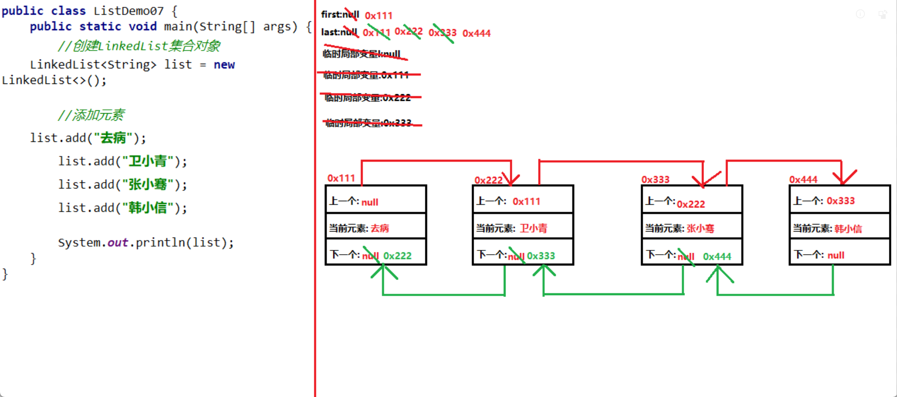

## Set接口

```java
import java.util.LinkedHashSet;
import java.util.Set;

/**
 * Set接口:
 *      接口的特点
 *          1.Set集合不可以存储重复元素
 *          2.Set集合中既有有序集合,也有无序集合
 *          3.Set集合没有索引
 *          4.Set集合遍历方式有4种
 *      接口的位置
 *          java.util
 *      接口的方法
 *          详见Collection集合的常用方法
 */
public class SetDemo01 {
    public static void main(String[] args) {
        //使用多态的方式创建Set集合对象
        Set<String> set = new LinkedHashSet<>();

        //添加元素
        set.add("abc");
        set.add(new String("abc"));
        set.add("a" + "b" + "c");

        //打印set集合
        System.out.println(set);
    }
}
```

### HashSet类

```java
import java.util.HashSet;

/**
 * HashSet类
 *      类的特点
 *          1.HashSet集合底层封装一个HashMap实例
 *              HashMap集合底层数据结构是"哈希表结构"
 *              哈希表结构:
 *                  JDK7.0(包含)以前:
 *                      哈希表结构是存储链表对象的数组
 *                  JDK8.0(包含)以后:
 *                      哈希表结构是存储链表对象或红黑树对象的数组
 *          2.HashSet集合是无序的集合
 *          3.HashSet集合无法保证存储集合中元素的顺序永远不会改变
 *              原因:元素的顺序和底层数组的长度有关,一旦底层数组长度改变,元素在集合中的位置就有可能发生变化
 *          4.HashSet集合可以存储null元素,获取集合中元素时需要进行非空校验,防止使用元素时出现空指针异常
 *          5.HashSet集合是线程不安全,适用于单线程程序,如果在多线程中进行使用需要手动添加线程安全
 *      类的位置
 *          java.util
 *      类的构造器
 *          public HashSet()
 *              构造一个新的空 set，其底层 HashMap 实例的默认初始容量是 16，加载因子是 0.75。
 *      类的方法
 *          详见Collection接口的常用方法
 */
public class SetDemo02 {
    public static void main(String[] args) {
        //创建HashSet实例
        HashSet<String> set = new HashSet<>();

        //添加元素
        while (set.size() < 12) {
            String str = "元素" + (int)(Math.random() * 100);
            set.add(str);
        }

        System.out.println("扩容前:" + set);

        set.add("元素666");

        System.out.println("扩容后:" + set);
    }
}
```

```java
import java.util.HashSet;

/**
 * HashSet集合面试题1:HashSet集合如何保证元素的唯一性
 *      1.和存储元素对象的地址值无关
 *      2.重写Object类的hashCode();
 *      3.重写Object类的equals();
 *
 * HashSet集合面试题2:String类重写hashCode方法时,计算的中间量为什么是31?
 *      1.该数不宜过大,也不宜过小(过小增大hashCode重复概率,过大增加计算量)
 *      2.该数的因数不宜过多,推荐质数
 *      3.通过"泊松分布",获取到质数29和31是较为合适的数字
 *      4.因为29可以改写成2^5-3,31可以改写为2^5-1,更符合整数取值范围的格式,最终确定为31
 */
public class SetDemo03 {
    public static void main(String[] args) {
        //创建HashSet集合
        HashSet<String> set = new HashSet<>();

        String str1 = new String("abc");
        String str2 = new String("abc");

        //添加元素
        /*
            往集合set中添加元素str1,底层获取str1的hashCode值96354,将hashCode重新计算成hash值96355,根据hash值和数组的长度
            计算str1在底层数组中存储的索引位置3,获取索引3处的元素(可能:null,链表对象,红黑树对象)为null,将str1封装成链表对象
            存储至索引3处
        */
        set.add(str1);


         /*
            往集合set中添加元素str2,底层获取str2的hashCode值96354,将hashCode重新计算成hash值96355,根据hash值和数组的长度
            计算str2在底层数组中存储的索引位置3,获取索引3处的元素(可能:null,链表对象,红黑树对象)为链表对象,将str2的hash值
            依次和链表对象每个链表对象的hash值进行一一比较,通过比较发现链表对象中元素str1和str2的hash值冲突(碰撞),调用str2的
            equals()判断二者的内容是否相同,通过判断返回true,程序认定为同一个元素,不会将str2存储到底层数组的索引3处
        */

        set.add(str2);

        System.out.println(set);

        System.out.println(str1 == str2);//二者地址值不同

        System.out.println(str1.hashCode());
        System.out.println(str2.hashCode());

        System.out.println("=============================================================");

        System.out.println("重地".hashCode());
        System.out.println("通话".hashCode());

        /*
            往集合set中添加元素"重地",底层获取"重地"的hashCode值1179395,将hashCode重新计算成hash值1179410,根据hash值和数
            组的长度计算"重地"在底层数组中存储的索引位置2,获取索引2处的元素(可能:null,链表对象,红黑树对象)为null,将"重地"封
            装成链表对象存储至索引2处
        */

        set.add("重地");

        /*
            往集合set中添加元素"通话",底层获取"通话"的hashCode值1179395,将hashCode重新计算成hash值1179410,根据hash值和数
            组的长度计算"通话"在底层数组中存储的索引位置2,获取索引2处的元素(可能:null,链表对象,红黑树对象)为链表对象,将"通话"
            的hash值依次和链表对象每个链表对象的hash值进行一一比较,通过比较发现链表对象中元素"重地"和"通话"的hash值冲突(碰撞),
            调用"通话"的equals()判断二者的内容是否相同,通过判断返回false,程序认定不是同一个元素,将"通话"封装成链表对象存储至
            底层数组索引2处链表对象的最后一位
        */

        set.add("通话");

        System.out.println(set);
    }
}

```

```java
import java.util.HashSet;

/**
 * 使用HashSet集合存储自定义对象
 */
public class SetDemo04 {
    public static void main(String[] args) {
        //创建学生对象
        Student s1 = new Student(220715001,"去病",18);
        Student s2 = new Student(220715002,"卫小青",18);
        Student s3 = new Student(220715003,"张小骞",18);
        Student s4 = new Student(220715004,"韩小信",18);
        Student s5 = new Student(220715001,"去病",18);

        System.out.println(s1.hashCode());
        System.out.println(s5.hashCode());

        //创建存储学生对象的集合
        HashSet<Student> set = new HashSet<>();

        //将学生对象存储到集合
        set.add(s1);
        set.add(s2);
        set.add(s3);
        set.add(s4);
        set.add(s5);

        //遍历集合
        for (Student s : set) {
            System.out.println(s);
        }
    }
}
```

```java
public class Student {
    private int id;
    private String name;
    private int age;

    public Student() {
    }

    public Student(int id, String name, int age) {
        this.id = id;
        this.name = name;
        this.age = age;
    }

    public int getId() {
        return id;
    }

    public void setId(int id) {
        this.id = id;
    }

    public String getName() {
        return name;
    }

    public void setName(String name) {
        this.name = name;
    }

    public int getAge() {
        return age;
    }

    public void setAge(int age) {
        this.age = age;
    }

    @Override
    public String toString() {
        return "Student{" +
                "id=" + id +
                ", name='" + name + '\'' +
                ", age=" + age +
                '}';
    }

    @Override
    public boolean equals(Object o) {
        if (this == o) {
            return true;
        }

        if (o == null || getClass() != o.getClass()) {
            return false;
        }

        Student student = (Student) o;

        if (id != student.id) {
            return false;
        }

        return name != null ? name.equals(student.name) : student.name == null;
    }

    @Override
    public int hashCode() {
        int result = id;
        result = 31 * result + (name != null ? name.hashCode() : 0);
        return result;
    }
}
```

### LinkedHashSet类

```java
import java.util.HashSet;
import java.util.LinkedHashSet;

/**
 * LinkedHashSet类:
 *      类的特点
 *          1.LinkedHashSet类是HashSet类的子类
 *          2.LinkedHashSet类是有序的集合
 *          3.LinkedHashSet类底层封装了一个LinkedHashMap对象
 *              LinkedHashMap类底层数据结构是"哈希表 + 链表"
 *              哈希表:用来存储元素的链表对象或者红黑树对象
 *              链表:维护元素的有序性
 *          4.LinkedHashSet类可以存储null元素,获取元素的需要进行非空校验,防止使用元素时出现空指针异常
 *          5.LinkedhashSet类是线程不安全的,适用于单线程程序,如果在多线程中进行使用,需要手动添加线程安全
 *      类的位置
 *          java.util
 *      类的构造器
 *          public LinkedHashSet()构造一个带默认初始容量 (16) 和加载因子 (0.75) 的新空链接哈希 set。
 *      类的方法
 *          详见Collection集合的特有方法
 */
public class SetDemo01 {
    public static void main(String[] args) {
        LinkedHashSet<String> set = new LinkedHashSet<>();

        set.add("郭靖");
        set.add("杨过");
        set.add("张无忌");
        set.add(null);

        System.out.println(set);

        System.out.println("=============================");

        HashSet<String> hashSet = new HashSet<>();

        hashSet.add("郭靖");
        hashSet.add("杨过");
        hashSet.add("张无忌");

        System.out.println(hashSet);
    }
}
```

### 红黑树结构

```java
import java.util.TreeMap;

/**
 * 红黑树结构
 *      含义:
 *          红黑树结构是树型结构的一种,在程序中其实就是封装的内部类
 *      结构:
 *          当前存储元素(泛型类型)
 *          父树型结点对象(树型结点类型)
 *          子左树型结点对象(树型结点类型)
 *          子右树型结点对象(树型结点类型)
 *          颜色标记(布尔类型)
 *      特点:
 *          1.针对树型结构中各结点对象中元素进行升序或降序排序
 *          2.查询效率和增删效率提高
 */
public class SetDemo02 {
    public static void main(String[] args) {

    }
}
```

### TreeSet类

```java
import java.util.TreeSet;

/**
 * TreeSet类
 *      类的特点
 *          1.TreeSet集合的底层封装了一个TreeMap实例
 *              TreeMap的底层数据结构是"红黑树结构"
 *          2.TreeSet集合是无序的集合
 *              无序:存储元素的顺序和获取元素的顺序不是一致的
 *          3.TreeSet集合可以根据元素的"自然顺序"或"定制顺序"进行排序操作
 *          4.TreeSet集合不可以存储null元素,存储元素是需要进行非空校验,防止往集合中添加元素时出现空指针异常
 *          5.TreeSet集合不是线程安全的,只适用于单线程程序,如果在多线程中进行使用,需要手动添加线程安全
 *      类的位置
 *          java.util
 *      类的构造器
 *          public TreeSet()
 *              构造一个新的空 set，该 set 根据其元素的自然顺序进行排序。
 *          public TreeSet(Comparator<? super E> comparator)
 *              构造一个新的空 TreeSet，它根据指定比较器进行排序。
 *      类的方法
 *          详见Collection集合的常用方法
 */
public class SetDemo03 {
    public static void main(String[] args) {
        //创建TreeSet集合对象
        TreeSet<String> set = new TreeSet<>();

        //添加元素
        //set.add(null);

        //System.out.println(set);

    }
}
```

### 使用TreeSet集合针对自定义对象进行排序

```java
import java.util.TreeSet;

/**
 * 使用TreeSet集合针对自定义对象进行排序
 *      如果存储对象是包装类型,会按照包装类型的数值大小进行升序排序(Boolean除外)
 *      如果存储对象是String类型,会按照Unicode码表对应的数值进行升序排序
 *      如果存储对象是自定义类型,必须手动定义比较器(自然顺序或指定顺序)
 *
 * 自然顺序比较器:
 *      1.比较对象的数据类型实现Comparable<T>接口
 *      2.重写Comparable<T>接口的抽象方法compareTo(T o)
 */
public class SetDemo04 {
    public static void main(String[] args) {
        method03();
    }

    private static void method03() {
        //创建4个学生对象
        Student s1 = new Student(220716003, "城小将", 18);
        Student s2 = new Student(220716001, "唐小妃", 18);
        Student s3 = new Student(220716002, "李小白", 18);
        Student s4 = new Student(220716004, "波斯客", 18);

        //创建集合
        TreeSet<Student> set = new TreeSet<>();

        //添加元素
        set.add(s1);
        set.add(s2);
        set.add(s3);
        set.add(s4);

        for (Student s : set) {
            System.out.println(s);
        }
    }

    private static void method02() {
        TreeSet<String> set = new TreeSet<>();

        set.add("bca");
        set.add("cba");
        set.add("abc");
        set.add("cab");
        set.add("bac");
        set.add("acb");
        set.add("中文");
        set.add("0");
        set.add("ABC");

        System.out.println(set);
    }

    private static void method01() {
        TreeSet<Integer> set = new TreeSet<>();

        set.add(55);
        set.add(22);
        set.add(33);
        set.add(11);
        set.add(44);

        System.out.println(set);
    }
}
```

```java
public class Student implements Comparable<Student> {
    private int id;
    private String name;
    private int age;

    public Student() {
    }

    public Student(int id, String name, int age) {
        this.id = id;
        this.name = name;
        this.age = age;
    }

    public int getId() {
        return id;
    }

    public void setId(int id) {
        this.id = id;
    }

    public String getName() {
        return name;
    }

    public void setName(String name) {
        this.name = name;
    }

    public int getAge() {
        return age;
    }

    public void setAge(int age) {
        this.age = age;
    }

    @Override
    public String toString() {
        return "Student{" +
                "id=" + id +
                ", name='" + name + '\'' +
                ", age=" + age +
                '}';
    }

    @Override
    public int compareTo(Student o) {
        int result = this.age - o.age;

        //针对result进行判断
        if (result == 0) {
            result = this.id - o.id;
        }

        return result;
    }
}
```

### 指定顺序比较器

```java
import java.util.Comparator;
import java.util.HashMap;
import java.util.TreeSet;

/**
 * 指定顺序比较器:
 *      1.创建TreeSet集合对象时给其指定顺序比较器Comparator<T>接口的实现类对象
 *      2.在实现类中重写compare(T o1,T o2)
 */
public class SetDemo05 {
    public static void main(String[] args) {


         //创建4个学生对象
        Student s1 = new Student(220716003, "城小将", 18);
        Student s2 = new Student(220716001, "唐小妃", 18);
        Student s3 = new Student(220716002, "李小白", 18);
        Student s4 = new Student(220716004, "波斯客", 18);

        //创建集合
        TreeSet<Student> set = new TreeSet<>(new Comparator<Student>(){
            @Override
            public int compare (Student stu1,Student stu2) {
                return stu1.getId() - stu2.getId();
            }
        });

        //添加元素
        set.add(s1);
        set.add(s2);
        set.add(s3);
        set.add(s4);

        //遍历集合
        for (Student s : set) {
            System.out.println(s);
        }


    }
}
```

```java
public class Student{
    private int id;
    private String name;
    private int age;

    public Student() {
    }

    public Student(int id, String name, int age) {
        this.id = id;
        this.name = name;
        this.age = age;
    }

    public int getId() {
        return id;
    }

    public void setId(int id) {
        this.id = id;
    }

    public String getName() {
        return name;
    }

    public void setName(String name) {
        this.name = name;
    }

    public int getAge() {
        return age;
    }

    public void setAge(int age) {
        this.age = age;
    }

    @Override
    public String toString() {
        return "Student{" +
                "id=" + id +
                ", name='" + name + '\'' +
                ", age=" + age +
                '}';
    }
}
```

## Collections类

```java
import java.util.ArrayList;
import java.util.Collections;

/**
 * Collections类
 *      类的特点
 *          针对Collection集合进行操作的工具类
 *      类的位置
 *          java.util
 *      类的构造器
 *          构造器私有化
 *      类的方法
 *          public static <T> boolean addAll(Collection<? super T> c, T... elements)
 *              将所有指定元素添加到指定 collection 中。
 *          public static void reverse(List<?> list)
 *              反转指定列表中元素的顺序。
 *          public static void shuffle(List<?> list)
 *              使用默认随机源对指定列表进行置换。
 *          public static <T extends Comparable<? super T>> void sort(List<T> list)
 *              根据元素的自然顺序 对指定列表按升序进行排序
 *          public static <T> void sort(List<T> list,Comparator<? super T> c)
 *              根据指定比较器产生的顺序对指定列表进行排序。
 *
 */
public class CollectionsDemo {
    public static void main(String[] args) {
        //创建集合对象
        ArrayList<String> list = new ArrayList<>();

        //批量将元素添加到集合中
        Collections.addAll(list,"11","22","33","44","55","66","77");

        System.out.println(list);

        //将集合中元素进行反转
        Collections.reverse(list);

        System.out.println(list);

        //将集合中元素的顺序进行打乱
        Collections.shuffle(list);

        System.out.println(list);

        //将集合中元素进行排序
        Collections.sort(list);

        System.out.println(list);
    }
}
```

## Map接口

```java
import java.util.Collection;
import java.util.LinkedHashMap;
import java.util.Map;
import java.util.Set;

/**
 * Map接口
 *      接口的特点
 *          1.Map集合以"键值对"的形式进行存储,一个key(键),一个值(value)
 *          2.key和value之间的关系是映射关系
 *          3.Map集合的key和value的泛型可以一样,也可以不一样
 *          4.Map集合中key不能重复,每个keyi最多只能映射到一个value
 *          5.Map集合中value可以重复
 *          6.Map集合中提供了三种单列集合,分别是键集,值集,键值对集
 *      接口的位置
 *          java.util
 *      接口的方法
 *          V put(K key,V value)
 *              将指定的值与此映射中的指定键关联（可选操作）。
 *          void clear()
 *              从此映射中移除所有映射关系（可选操作）
 *          boolean containsKey(Object key)
 *              如果此映射包含指定键的映射关系，则返回 true。
 *          boolean containsValue(Object value)
 *              如果此映射将一个或多个键映射到指定值，则返回 true。
 *          V get(Object key)
 *              返回指定键所映射的值；如果此映射不包含该键的映射关系，则返回 null。
 *          boolean isEmpty()
 *              如果此映射未包含键-值映射关系，则返回 true。
 *          V remove(Object key)
 *              如果存在一个键的映射关系，则将其从此映射中移除（可选操作）。
 *          int size()
 *              返回此映射中的键-值映射关系数。
 *          Set<K> keySet()
 *              返回此映射中包含的键的 Set 视图。
 *          Collection<V> values()
 *              返回此映射中包含的值的 Collection 视图。
 *          Set<Map.Entry<K,V>> entrySet()
 *              返回此映射中包含的映射关系的 Set 视图
 */
public class MapDemo01 {
    public static void main(String[] args) {
        //使用多态的形式创建Map集合对象
        Map<String,String> map = new LinkedHashMap<>();

        //添加元素
        map.put("郭靖","华筝");
        map.put("杨过","小龙女");
        map.put("张无忌","赵敏");

        map.put("郭靖","黄蓉");
        map.put("尹志平","小龙女");

        System.out.println(map);

        System.out.println("======================");

        //判断集合中是否包含指定的key
        System.out.println(map.containsKey("郭靖"));
        System.out.println(map.containsKey("韦小宝"));

        System.out.println("======================");

        //判断集合中是否包含指定的value
        System.out.println(map.containsValue("黄蓉"));
        System.out.println(map.containsValue("华筝"));

        System.out.println("======================");

        //根据指定的key获取指定value
        System.out.println(map.get("郭靖"));
        System.out.println(map.get("韦小宝"));

        System.out.println("======================");

        System.out.println("删除前:" + map);

        //根据指定key删除映射关系
        map.remove("尹志平");

        System.out.println("删除后:" + map);

        System.out.println("======================");

        //获取集合的长度(获取集合中映射关系的对数)
        System.out.println(map.size());

        System.out.println("======================");

        //获取所有键的集合
        Set<String> keys = map.keySet();
        System.out.println(keys);

        System.out.println("======================");

        //获取所有值的集合
        Collection<String> values = map.values();
        System.out.println(values);

        System.out.println("======================");

        //获取所有映射关系(键值对)的集合
        Set<Map.Entry<String, String>> entries = map.entrySet();
        System.out.println(entries);

        System.out.println("======================");

        //判断集合的长度是否为0
        System.out.println(map.isEmpty());

        System.out.println("======================");

        //移除map集合中所有的映射关系
        map.clear();
        System.out.println(map);

        System.out.println("======================");

        //判断集合的长度是否为0
        System.out.println(map.isEmpty());
    }
}
```

### Map集合的遍历方式1:键找值

```java
import java.util.LinkedHashMap;
import java.util.Map;
import java.util.Set;

/**
 * Map集合的遍历方式1:键找值
 */
public class MapDemo02 {
    public static void main(String[] args) {
        //使用多态的形式创建Map集合对象
        Map<String,String> map = new LinkedHashMap<>();

        //添加元素
        map.put("探险家","伊泽瑞尔");
        map.put("光辉女郎","拉克丝");
        map.put("蛮族之王","泰达米尔");
        map.put("寒冰射手","艾希");

        //获取Map的键集
        Set<String> keys = map.keySet();

        //遍历键集
        for (String key : keys) {
            //根据key获取value
            String value = map.get(key);

            System.out.println(key + "=" + value);
        }
    }
}
```

### Map集合的遍历方式2:键值对对象

```java
import java.util.LinkedHashMap;
import java.util.Map;
import java.util.Set;

/**
 * Map集合的遍历方式2:键值对对象
 *
 * Map.Entry接口
 *      接口的特点
 *          映射项（键-值对）。
 *      接口的位置
 *          java.util
 *      接口的方法
 *          K getKey()
 *              返回与此项对应的键。
 *          V getValue()
 *              返回与此项对应的值
 */
public class MapDemo03 {
    public static void main(String[] args) {
        //使用多态的形式创建Map集合对象
        Map<String,String> map = new LinkedHashMap<>();

        //添加元素
        map.put("探险家","伊泽瑞尔");
        map.put("光辉女郎","拉克丝");
        map.put("蛮族之王","泰达米尔");
        map.put("寒冰射手","艾希");

        //获取键值对的集合
        Set<Map.Entry<String, String>> entries = map.entrySet();

        for (Map.Entry<String, String> entry : entries) {
            //根据键值对对象获取key
            String key = entry.getKey();
            //根据键值对对象获取value
            String value = entry.getValue();

            System.out.println(key + "=" + value);
        }
    }
}
```

### Map集合的遍历方式3:forEach()

```java
import java.util.LinkedHashMap;
import java.util.Map;
import java.util.function.BiConsumer;

/**
 * Map集合的遍历方式3:forEach()
 *
 */
public class MapDemo04 {
    public static void main(String[] args) {
        //使用多态的形式创建Map集合对象
        Map<String,String> map = new LinkedHashMap<>();

        //添加元素
        map.put("探险家","伊泽瑞尔");
        map.put("光辉女郎","拉克丝");
        map.put("蛮族之王","泰达米尔");
        map.put("寒冰射手","艾希");

        map.forEach(new BiConsumer<String, String>() {
            @Override
            public void accept(String key, String value) {
                System.out.println(key + "=" + value);
            }
        });
    }
}
```

### HashMap类

```java
/**
 * HashMap类
 *      类的特点
 *          1.HashMap集合底层的数据结构是"哈希表"
 *          2.HashMap集合可以存储null键和null值,获取key和value时需要进行非空校验,防止使用key或value时出现空指针异常
 *          3.HashMap集合是无序的集合
 *          4.HashMap集合无法保证元素的顺序永远不会改变
 *          5.HashMap集合是线程不安全,只适用于单线程程序,如果在多线程中进行使用,需要手动添加线程安全
 *      类的位置
 *          java.util
 *      类的构造器
 *          public HashMap()
 *              构造一个具有默认初始容量 (16) 和默认加载因子 (0.75) 的空 HashMap。
 *      类的方法
 *          详见Map集合的常用方法
 */
public class MapDemo05 {
}
```

### HashMap集合存储元素过程的源码分

```java
import java.util.HashMap;

/**
 * HashMap集合存储元素过程的源码分析(基于JDK8.0)
 *      1.分析源码时的名词解释
 *          初始容量:底层数组的初始容量
 *          加载因子:获取阈值的重要参数
 *              加载因子过高虽然减少了空间开销,但同时也增加了查询成本
 *              加载因子过低虽然减少了查询成本,但同时也增加了空间开销
 *              默认加载因子 (0.75) 在时间和空间成本上寻求一种折衷
 *          桶元素:底层数组中的元素,可能为:null,链表对象,红黑树对象
 *          阈值:底层数组进行扩容前的标准(阈值的下一位就是扩容标准)
 *              阈值 = (int)(底层数组长度 * 加载因子)
 *      2.HashMap集合成员常量,成员变量,局部变量的备忘录
 *          成员变量和成员常量:
 *              serialVersionUID(long):API中针对类的编号
 *              DEFAULT_INITIAL_CAPACITY(int):底层数组默认的初始化长度
 *              MAXIMUM_CAPACITY(int):底层数组默认最大的长度
 *              DEFAULT_LOAD_FACTOR(float):默认加载因子
 *              TREEIFY_THRESHOLD(int):底层数组中链表对象进行红黑树化的标准之一
 *              UNTREEIFY_THRESHOLD(int):底层数组中红黑树对象进行链表化的标准
 *              MIN_TREEIFY_CAPACITY(int):底层数组中链表对象进行红黑树化的标准之一
 *              table(Node<K,V>[]):底层数组
 *              entrySet(Set<Map.Entry<K,V>>):键值对集合
 *              size(int):桶元素中映射关系的个数
 *              modCount(int):桶元素中映射关系操作的计数器变量
 *              threshold(int):底层数组的阈值
 *              loadFactor(float):加载因子变量
 *          putVal():
 *              hash(int):key的hashCode计算后hash值
 *              key(泛型):待添加元素的key
 *              value(泛型):待添加元素的value
 *              tab(Node<K,V>[]):添加元素时进行操作的底层数组变量
 *              p(Node<K,V>):待添加元素在底层数组中待存储索引位置上的桶元素
 *              n(int):添加元素时进行操作的底层数组长度变量
 *              i(int):待添加元素在底层数组中存储的索引位置变量
 *              e(Node<K,V>):待添加元素在存储数组中待存储索引位置上桶元素的下一个链表对象
 *              k(泛型):待添加元素在存储数组中待存储索引位置上桶元素的key
 *          resize():
 *              oldTab(Node<K,V>[]):重置底层数组长度前进行操作的底层数组变量
 *              oldCap(int):重置底层数组长度前进行操作的底层数组长度变量
 *              oldThr(int):重置底层数组长度前进行操作的底层数组阈值变量
 *              newCap(int):重置底层数组长度时即将重置的底层数组长度变量
 *              newThr(int):重置底层数组长度时即将重置的底层数组阈值变量
 *              newTab (Node<K,V>[]):重置底层数组长度后进行操作的底层数组变量
 *          treeifyBin():
 *              tab(Node<K,V>[]):准备红黑树化前的待操作底层数组变量
 *              hash(int):添加元素的hash值
 *              n(int):准备红黑树化前的待操作底层数组长度变量
 *
 *      3.HashMap集合底层数组的初始容量以及加载因子
 *          HashMap集合底层数组的初始容量以及加载因子取决于创建HashMap对象时所选择的构造器
 *          (1)HashMap()
 *              初始容量:创建对象时没有进行初始化,第一次添加元素时初始化16
 *              加载因子:0.75
 *          (2)HashMap(int initialCapacity)
 *              初始容量:自定义
 *              加载因子:0.75
 *          (3)HashMap(int initialCapacity, float loadFactor)
 *              初始容量:自定义
 *              加载因子:自定义
 *          (4)HashMap(Map<? extends K,? extends V> m)
 *              初始容量:参数集合的长度
 *              加载因子:0.75
 *      4.HashMap集合首次添加元素的扩容规则
 *          创建HashMap对象时底层数组没有进行初始化,第一次添加元素时初始化16
 *      5.HashMap集合如何确认待存储元素的索引位置
 *          (1)根据key的hashCode值计算hash值
 *              代码:key.hashCode() ^ (key.hashCode() >>> 16)
 *              描述:将key的hashCode值与key的hashCode值无符号右移16位后的值进行按位异或
 *              分析:
 *                  hash值的高16位:
 *                      与hashCode值的高16位相同
 *                  hash值的低16位:
 *                      hashCode值的低16位与hashCode值的高16位进行按位异或
 *              目的:
 *                  将待添加元素可以更加均匀的分布到各桶元素之间
 *          (2)根据key的hash值和底层数组长度-1的值进行按位与获取索引
 *              代码:(底层数组长度 - 1) & hash
 *      6.HashMap集合非首次添加元素的扩容规则
 *          扩容规则:原来底层数组长度 << 1
 *      7.HashMap集合底层数组中的链表对象红黑树化标准
 *          (1)链表对象长度达到8时
 *          (2)底层数组长度达到64时
 *      8.HashMap集合底层数组中的红黑树对象链表化标准
 *          红黑树结点对象降到6个时
 *      9.HashMap集合JDK7.0(包含)以前和JDK8.0(包含)以后源码区别
 *          (1)使用无参构造器底层数组初始时机不同:
 *              JDK7.0(包含)以前:
 *                  直接初始化长度为16的底层数组
 *              JDK8.0(包含)以后:
 *                  创建HashMap对象时底层数组没有进行初始化,第一次添加元素时初始化16
 *          (2)底层哈希表结构不同:
 *              JDK7.0(包含)以前:
 *                  存储链表对象的数组
 *              JDK8.0(包含)以后:
 *                  存储链表对象或者红黑树对象的数组
 *          (3)扩容规则:
 *              JDK7.0(包含)以前:
 *                  2 * 原来底层数组长度
 *              JDK8.0(包含)以后:
 *                  原来底层数组长度 << 1
 *          (4)hash算法不同:
 *              JDK7.0(包含)以前:
 *                  h ^= k.hashCode();
 *                  h ^= (h >>> 20) ^ (h >>> 12);
 *                  h ^ (h >>> 7) ^ (h >>> 4)
 *              JDK8.0(包含)以后:
 *                  key.hashCode() ^ (key.hashCode() >>> 16)
 */
public class MapDemo06 {
    public static void main(String[] args) {
        HashMap<String, String> map = new HashMap<>();

        for (int i = 1; i <= 12; i++) {
            map.put("键" + i , "值" + i);
        }

        map.put("键13","值13");
    }
}

```

```java
key.hashCode():1183939
原码:00000000 00010010 00010000 11000011
反码:00000000 00010010 00010000 11000011
补码:00000000 00010010 00010000 11000011

key.hashCode() >>> 16
补码:00000000 00000000 00000000 00010010
反码:00000000 00000000 00000000 00010010
原码:00000000 00000000 00000000 00010010

key.hashCode() ^ key.hashCode() >>> 16
	 hashCode()补码:00000000 00010010 00010000 11000011
	^
hashCode()>>>16补码:00000000 00000000 00000000 00010010
===========================================================
					00000000 00010010 00010000 11010001

hash值:
原码:00000000 00010010 00010000 11010001
反码:00000000 00010010 00010000 11010001
补码:00000000 00010010 00010000 11010001

					
15
原码:00000000 00000000 00000000 00001111
反码:00000000 00000000 00000000 00001111
补码:00000000 00000000 00000000 00001111

15 & hash
hash补码:00000000 00010010 00010000 11010001
	&
  15补码:00000000 00000000 00000000 00001111
=====================================================
		 00000000 00000000 00000000 00000001(长度为16时,范围的可能性:0~15)
```

### LinkedHashMap类

```java
import java.util.LinkedHashMap;

/**
 * LinkedHashMap类
 *      类的特点
 *          1.LinkedHashMap类是HashMap类的子类
 *          2.LinkedHashMap类底层数据结构是"哈希表 + 链表"
 *              链表:维护集合中映射关系的有序性
 *          3.LinkedHashMap类是有序的集合
 *          4.LinkedHashMap类是线程不安全,适用于单线程程序,如果在多线程中进行使用,需要手动添加线程安全
 *      类的位置
 *          java.util
 *      类的构造器
 *          public LinkedHashMap()
 *              构造一个带默认初始容量 (16) 和加载因子 (0.75) 的空插入顺序 LinkedHashMap 实例。
 *          public LinkedHashMap(int initialCapacity,float loadFactor,boolean accessOrder)
 *              构造一个带指定初始容量、加载因子和排序模式的空 LinkedHashMap 实例。
 *      类的方法
 *          详见Map集合的常用方法
 */
public class MapDemo01 {
    public static void main(String[] args) {
        LinkedHashMap<String, String> map = new LinkedHashMap<>();

        map.put("郭靖","");
        map.put("杨过","");
        map.put("张无忌","");

        System.out.println(map);
    }
}
```

### TreeMap类

```java
import java.util.TreeMap;

/**
 * TreeMap类
 *      类的特点
 *          1.TreeMap类底层的数据结构是"红黑树结构"
 *          2.TreeMap类可以针对集合中的元素按照"自然顺序"或"指定顺序"进行排序操作
 *          3.TreeMap类是无序集合
 *          4.TreeMap类不可以存储null键,但可以存储null值,在存储元素的时候需要针对键和获取元素时需要针对值进行非空判断,防止
 *          空指针异常
 *          5.TreeMap类是线程不安全的,适用于单线程程序,如果在多线程中进行使用,需要手动添加线程安全
 *      类的位置
 *          java.util
 *      类的构造器
 *          public TreeMap()
 *              使用键的自然顺序构造一个新的、空的树映射。插入该映射的所有键都必须实现 Comparable 接口。
 *          public TreeMap(Comparator<? super K> comparator)
 *              构造一个新的、空的树映射，该映射根据给定比较器进行排序
 *      类的方法
 *          详见Map接口的常用方法
 */
public class MapDemo02 {
    public static void main(String[] args) {
        TreeMap<String, String> map = new TreeMap<>();

        //map.put(null,"值");
        map.put("键",null);

        System.out.println(map);
    }
}
```

### Hashtable类

```java
import java.util.Hashtable;

/**
 * Hashtable类
 *      类的特点
 *          1.Hashtable集合底层的数据结构是"哈希表"
 *          2.Hashtable集合不可以存储null键和null值
 *          3.Hashtable集合是无序的集合
 *          4.Hashtable集合无法保证元素的顺序永远不会改变
 *          5.Hashtable集合是线程安全,只适用于多线程程序,如果在单线程中进行使用,效率过低
 *      类的位置
 *          java.util
 *      类的构造器
 *          public Hashtable()
 *              用默认的初始容量 (11) 和加载因子 (0.75) 构造一个新的空哈希表。
 *      类的方法
 *          详见Map集合的常用方法
 */
public class MapDemo03 {
    public static void main(String[] args) {
        Hashtable<String, String> map = new Hashtable<>();

        //map.put("键",null);
        //map.put(null,"值");
    }
}
```

### HashMap集合和Hashtable集合区别

```java
import java.util.Hashtable;

/**
 * HashMap集合和Hashtable集合区别:
 *      1.null键和null值存储不同
 *          HashMap集合:可以存储null键和null值
 *          Hashtable集合:不可以存储null键和null值
 *      2.线程安全性不同
 *          HashMap集合:线程不安全
 *          Hashtable集合:线程安全
 *      3.无参构造器的初始容量不同
 *          HashMap集合:16
 *          Hashtable集合:11
 *      4.底层数组的扩容规则不同:
 *          HashMap集合:
 *              JDK7.0(包含)以前:
 *                  2*原来底层数组长度
 *              JDK8.0(包含)以后:
 *                  原来底层数组长度 << 1
 *          Hashtable集合:
 *              JDK6.0(包含)以前:
 *                  原来底层数组长度*2 + 1
 *              JDK7.0(包含)以后
 *                  (原来底层数组长度 << 1) + 1;
 *      5.底层数组的桶元素不同:
 *          HashMap集合:
 *              JDK7.0(包含)以前:桶元素是null或链表对象
 *              JDK8.0(包含)以后:桶元素是null,链表对象或红黑树对象
 *          Hashtable集合:
 *              桶元素是null或链表对象
 */
public class MapDemo04 {
    public static void main(String[] args) {

    }
}
```

## File类

```java
import java.io.File;

/**
 * File类
 *      类的特点
 *          针对文件和目录进行操作的工具类
 *      类的位置
 *          java.io
 *      类的构造器
 *          public File(String pathname)
 *              通过将给定路径名字符串转换为抽象路径名来创建一个新 File 实例
 *      类的方法
 *          public String getAbsolutePath()
 *              返回此抽象路径名的绝对路径名字符串。
 *          public String getPath()
 *              将此抽象路径名转换为一个路径名字符串。
 *          public String getName()
 *              返回由此抽象路径名表示的文件或目录的名称
 *          public long length()
 *              返回由此抽象路径名表示的文件的长度。
 *          public boolean exists()
 *              测试此抽象路径名表示的文件或目录是否存在。
 *          public boolean isDirectory()
 *              测试此抽象路径名表示的文件是否是一个目录。
 *          public boolean isFile()
 *              测试此抽象路径名表示的文件是否是一个标准文件。
 *          public boolean createNewFile()
 *              当且仅当不存在具有此抽象路径名指定名称的文件时，不可分地创建一个新的空文件。
 *          public boolean mkdir()
 *              创建此抽象路径名指定的目录。
 *          public boolean mkdirs()
 *              创建此抽象路径名指定的目录，包括所有必需但不存在的父目录。
 *          public File[] listFiles()
 *              返回一个抽象路径名数组，这些路径名表示此抽象路径名表示的目录中的文件。
 */
public class FileDemo01 {
    public static void main(String[] args) {
        //创建File对象
        File f1 = new File("G:\\abc\\a");
        File f2 = new File("G:\\abc\\a.txt");

        System.out.println(f1);
        System.out.println(f2);
    }
}
```

```java
import java.io.File;

/**
 * 绝对路径,相对路径,构造路径
 *      构造路径:
 *          调用构造器时实参的路径,该路径可能是"绝对路径"或"相对路径"
 *      绝对路径:
 *          从盘符开始的路径,是完整的路径
 *      相对路径:
 *          路径不是从盘符开始,是不完整的,相对于项目的路径
 */
public class FileDemo02 {
    public static void main(String[] args) {
        //创建File对象
        File f1 = new File("G:\\abc");
        File f2 = new File("abc");

        //获取构造路径
        System.out.println(f1.getPath());
        System.out.println(f2.getPath());

        System.out.println("=======================");

        //获取绝对路径
        System.out.println(f1.getAbsolutePath());
        System.out.println(f2.getAbsolutePath());
    }
}
```

```java
import java.io.File;
import java.io.IOException;

public class FileDemo03 {
    public static void main(String[] args) throws IOException {
        //创建File对象
        File f1 = new File("G:\\abc\\a");//真实存在的文件夹
        File f2 = new File("G:\\abc\\a.txt");//真实存在的文件
        File f3 = new File("G:\\abc\\b");//不存在的文件夹
        File f4 = new File("G:\\abc\\b.txt");//不存在的文件
        File f5 = new File("G:\\abc\\a\\b\\c");

        //获取文件或目录的名字
        System.out.println(f1.getName());
        System.out.println(f2.getName());
        System.out.println(f3.getName());
        System.out.println(f4.getName());

        System.out.println("===============================");

        //获取文件的大小
        System.out.println(f1.length());
        System.out.println(f2.length());
        System.out.println(f3.length());
        System.out.println(f4.length());

        System.out.println("===============================");

        //判断文件或目录是否存在
        System.out.println(f1.exists());
        System.out.println(f2.exists());
        System.out.println(f3.exists());
        System.out.println(f4.exists());

        System.out.println("===============================");

        //判断File是否为真实存在的目录
        System.out.println(f1.isDirectory());
        System.out.println(f2.isDirectory());
        System.out.println(f3.isDirectory());
        System.out.println(f4.isDirectory());

        System.out.println("===============================");

        //判断File是否为真实存在的文件
        System.out.println(f1.isFile());
        System.out.println(f2.isFile());
        System.out.println(f3.isFile());
        System.out.println(f4.isFile());

        System.out.println("===============================");

        //将File构造路径中的不是真实存在的文件进行创建
        /*System.out.println(f1.createNewFile());
        System.out.println(f2.createNewFile());
        System.out.println(f3.createNewFile());
        System.out.println(f4.createNewFile());*/

        System.out.println("===============================");

        //将File构造路径中的不是真实存在的单级文件夹进行创建
        /*System.out.println(f1.mkdir());
        System.out.println(f2.mkdir());
        System.out.println(f3.mkdir());
        System.out.println(f4.mkdir());
        System.out.println(f5.mkdir());*/

        System.out.println("===============================");

        //将File构造路径中的不是真实存在的单级或多级文件夹进行创建
        System.out.println(f1.mkdirs());
        System.out.println(f2.mkdirs());
        System.out.println(f3.mkdirs());
        System.out.println(f4.mkdirs());
        System.out.println(f5.mkdirs());
    }
}
```

### 遍历单级文件夹

```java
import java.io.File;

/**
 * 遍历单级文件夹
 */
public class FileDemo04 {
    public static void main(String[] args) {
        File file = new File("D:\\develop\\Java\\jdk1.8.0_202");

        File[] files = file.listFiles();

        for (int i = 0; i < files.length; i++) {
            //获取当前正在遍历的File对象路径
            File path = files[i];

            //针对path进行判断
            if (path.isFile()) {
                System.out.println("文件:" + path);
            } else {
                System.out.println("目录:" + path);
            }
        }
    }
}
```

### 遍历多级文件夹

```java
import java.io.File;

/**
 * 遍历多级文件夹
 */
public class FileDemo05 {
    public static void main(String[] args) {
        File file = new File("D:\\develop\\Java\\jdk1.8.0_202");

        printPath(file);
    }

    /*
        声明遍历单级文件夹的方法
    */
    public static void printPath (File path) {
        //针对path进行非空判断
        if (path == null) {
            return;
        }

        //获取path路径下单级所有的文件及文件夹
        File[] files = path.listFiles();

        //遍历files数组
        for (int i = 0; i < files.length; i++) {
            //获取当前正在遍历操作的File对象
            File file = files[i];

            //针对file对象进行判断
            if (file.isFile()) {
                System.out.println("文件:" + file);
            } else {
                System.out.println("目录:" + file);
                printPath(file);
            }
        }
    }
}
```

## IO流

```java
/**
 * IO流:
 *      含义:数据输入和输出的流动
 *      解释:
 *          输入:
 *              其它设备的数据==>内存
 *          输出:
 *              内存的数据==>其它设备
 *      分类:
 *          根据数据的流动方向进行分类:
 *              输入流
 *              输出流
 *          根据数据的流动单位进行分类:
 *              字节流
 *              字符流
 *          根据上述两种分类重新组合分类(四大基本流,抽象流):
 *              字节输入流
 *                  InputStream类
 *              字节输出流
 *                  OutputStream类
 *              字符输入流
 *                  Reader类
 *              字符输出流
 *                  Writer类
 *
 * 针对操作数据内容不同,将IO流程进行分类
 *      文件流:针对文件以字节或字符为单位进行输入或输出的IO流
 *          文件字节输入流
 *          文件字节输出流
 *          文件字符输入流
 *          文件字符输出流
 *      缓冲流:针对其它流添加高效读写操作的IO流
 *          缓冲字节输入流
 *          缓冲字节输出流
 *          缓冲字符输入流
 *          缓冲字符输出流
 *      转换流:针对读写过程中可以指定文件编码的IO流
 *          转换输入流
 *          转换输出流
 *      对象流:针对对象进行读写操作的IO流
 *          对象输入流
 *          对象输出流
 */
public class FileDemo01 {
}
```

### FileInputStream类

```java
import java.io.FileInputStream;
import java.io.FileNotFoundException;
import java.io.IOException;

/**
 * FileInputStream类(文件字节输入流)
 *      类的特点
 *          针对文件以字节为单位进行读取操作的工具类
 *      类的位置
 *          java.io
 *      类的构造器
 *          public FileInputStream(File file)
 *              通过打开一个到实际文件的连接来创建一个 FileInputStream，该文件通过文件系统中的 File 对象 file 指定。
 *          public FileInputStream(String name)
 *              通过打开一个到实际文件的连接来创建一个 FileInputStream，该文件通过文件系统中的路径名 name 指定。
 *      类的方法
 *          public void close()
 *              关闭此文件输入流并释放与此流有关的所有系统资源。
 *          public int read()
 *              从此输入流中读取一个数据字节。
 *          public int read(byte[] b)
 *              从此输入流中将最多 b.length 个字节的数据读入一个 byte 数组中。
 */
public class FileDemo02 {
    public static void main(String[] args) throws IOException {
        //创建文件字节输入流对象
        FileInputStream fis = new FileInputStream("day18_code\\src\\com\\test\\io\\file\\FileInputStream.txt");

        //以单个字节读取操作
        /*System.out.println(fis.read());
        System.out.println(fis.read());
        System.out.println(fis.read());
        System.out.println(fis.read());*/

        /* int len;

        while ((len = fis.read()) != -1) {
            System.out.println(len);
        }
        */

        //以字节数组的方式读取操作
        int len;
        byte[] bytes = new byte[2];//在实际开发中,推荐1024的整数倍,往往使用8192(时间成本和空间成本的折中方案)

        while ((len = fis.read(bytes)) != -1) {
            System.out.println(new String(bytes,0,len));
        }

        // 第一次,将a存储索引0,将b存储索引1,[a,b]
        // 第二次,将c存储索引0,[c,b]

        //关闭资源
        fis.close();
    }
}
```

### FileOutputStream类

```java
import java.io.File;
import java.io.FileNotFoundException;
import java.io.FileOutputStream;
import java.io.IOException;
import java.util.Arrays;

/**
 * FileOutputStream类(文件字节输出流)
 *      类的特点
 *          针对文件以字节为单位进行写出操作的工具类
 *      类的位置
 *          java.io
 *      类的构造器
 *          public FileOutputStream(File file)
 *              创建一个向指定 File 对象表示的文件中写入数据的文件输出流。
 *          public FileOutputStream(File file,boolean append)
 *              创建一个向指定 File 对象表示的文件中写入数据的文件输出流。
 *          public FileOutputStream(String name)
 *              创建一个向具有指定名称的文件中写入数据的输出文件流
 *          public FileOutputStream(String name,boolean append)
 *              创建一个向具有指定 name 的文件中写入数据的输出文件流。
 *      类的方法
 *          public void close()
 *              关闭此文件输出流并释放与此流有关的所有系统资源
 *          public void write(int b)
 *              将指定字节写入此文件输出流
 *          public void write(byte[] b)
 *              将 b.length 个字节从指定 byte 数组写入此文件输出流中。
 *          public void write(byte[] b,int off,int len)
 *              将指定 byte 数组中从偏移量 off 开始的 len 个字节写入此文件输出流。
 */
public class FileDemo03 {
    public static void main(String[] args) throws IOException {
        //创建文件字节输出流对象
        FileOutputStream fos = new FileOutputStream("day18_code\\src\\com\\test\\io\\file\\FileOutputStream.txt");

        //以单个字节的方式写出内容
        fos.write(97);
        fos.write(98);
        fos.write(99);

        //以字节数组的方式写出内容
        fos.write("中文".getBytes());

        //以指定范围的字节数组方式写出内容
        fos.write("abcdefg".getBytes(),3,3);//def

        //关闭资源
        fos.close();
    }
}
```

### 文件的续写

```java
import java.io.FileNotFoundException;
import java.io.FileOutputStream;
import java.io.IOException;

/**
 * 文件的续写
 */
public class FileDemo04 {
    public static void main(String[] args) throws IOException {
        //创建文件字节输出流
        FileOutputStream fos = new FileOutputStream("day18_code\\src\\com\\test\\io\\file\\FileOutputStream.txt",true);

        //进行写出操作
        fos.write("中文".getBytes());

        //关闭资源
        fos.close();
    }
}
```

### 输出回车换行符

```java
import java.io.FileOutputStream;
import java.io.IOException;

/**
 * 输出回车换行符
 */
public class FileDemo05 {
    public static void main(String[] args) throws IOException {
        //创建文件字节输出流
        FileOutputStream fos = new FileOutputStream("day18_code\\src\\com\\test\\io\\file\\FileOutputStream.txt");

        //进行写出操作
        fos.write("给".getBytes());
        fos.write("\r\n".getBytes());
        fos.write("个".getBytes());
        fos.write("\r\n".getBytes());
        fos.write("跟".getBytes());

        //关闭资源
        fos.close();
    }
}
```

### 文件的复制

```java
import java.io.FileInputStream;
import java.io.FileOutputStream;
import java.io.IOException;

/**
 * 文件的复制:
 *    以单个字节为单位复制文件
 *    以字节数组为单位复制文件
 */
public class FileDemo06 {
    public static void main(String[] args) throws IOException {
        //创建文件字节输入流和文件字节输出流
        FileInputStream fis = new FileInputStream("G:\\20220623\\day18\\resources\\girl2.mp4");
        FileOutputStream fos = new FileOutputStream("G:\\20220623\\day18\\resources\\copy.mp4");

        //以单个字节为单位进行文件的复制
        int len;
        while ((len = fis.read()) != -1) {
            fos.write(len);
        }

        //关闭资源(先开后关,后开先关)
        fos.close();
        fis.close();
    }
}
```

```java
import java.io.FileInputStream;
import java.io.FileOutputStream;
import java.io.IOException;

/**
 * 文件的复制:
 *    以单个字节为单位复制文件
 *    以字节数组为单位复制文件
 */
public class FileDemo07 {
    public static void main(String[] args) throws IOException {
        //创建文件字节输入流和文件字节输出流
        FileInputStream fis = new FileInputStream("G:\\20220623\\day18\\resources\\girl2.mp4");
        FileOutputStream fos = new FileOutputStream("G:\\20220623\\day18\\resources\\copy.mp4");

        //以字节数组为单位进行文件的复制
        int len;
        byte[] bytes = new byte[8192];

        while ((len = fis.read(bytes)) != -1) {
            fos.write(bytes,0,len);
        }


        //关闭资源(先开后关,后开先关)
        fos.close();
        fis.close();
    }
}
```

### FileReader类

```java
import java.io.FileNotFoundException;
import java.io.FileReader;
import java.io.IOException;

/**
 * 学习文件字符流的目的:
 *      避免编码和解码的过程中出现转换乱码情况
 *          编码:文本==>字节
 *          解码:字节==>文本
 *
 * 文件字节流:
 *      适用于读写操作视频,音频,图片等
 * 文件字符流:
 *      适用于读写文本文件
 *
 * FileReader类(文件字符输入流)
 *      类的特点
 *          针对文件以字符为单位进行读取操作的工具类
 *      类的位置
 *          java.io
 *      类的构造器
 *          public FileReader(File file)
 *              在给定从中读取数据的 File 的情况下创建一个新 FileReader。
 *          public FileReader(String fileName)
 *              在给定从中读取数据的文件名的情况下创建一个新 FileReader。
 *      类的方法
 *          public void close()
 *              关闭该流并释放与之关联的所有资源。
 *          public int read()
 *              读取单个字符。
 *          public int read(char[] cbuf)
 *              将字符读入数组。
 */
public class FileDemo08 {
    public static void main(String[] args) throws IOException {
        //创建文件字符输入流对象
        FileReader fr = new FileReader("day18_code\\src\\com\\test\\io\\file\\FileReader.txt");

        //以单个字符读取操作
        /*int len;
        while ((len = fr.read()) != -1) {
            System.out.println((char)len);
        }*/

        //以字符数组的方式读取操作
        int len;
        char[] chars = new char[8192];
        while ((len = fr.read(chars)) != -1) {
            System.out.println(new String(chars,0,len));
        }

        //关闭资源
        fr.close();
    }
}
```

### FileWriter类

```java
import java.io.FileWriter;
import java.io.IOException;

/**
 * FileWriter类(文件字符输出流)
 *      类的特点
 *          针对文件以字符为单位进行写出操作的工具类
 *      类的位置
 *          java.io
 *      类的构造器
 *          public FileWriter(File file)
 *              根据给定的 File 对象构造一个 FileWriter 对象。
 *          public FileWriter(File file,boolean append)
 *              根据给定的 File 对象构造一个 FileWriter 对象。如果第二个参数为 true，则将字节写入文件末尾处，而不是写入文件开始处。
 *          public FileWriter(String fileName)
 *              根据给定的文件名构造一个 FileWriter 对象。
 *          public FileWriter(String fileName,boolean append)
 *              根据给定的文件名以及指示是否附加写入数据的 boolean 值来构造 FileWriter 对象。
 *      类的方法
 *          public void close()
 *              关闭此流，但要先刷新它。
 *          public void flush()
 *              刷新该流的缓冲。
 *          public void write(int c)
 *              写入单个字符
 *          public void write(char[] cbuf)
 *              写入字符数组。
 *          public void write(char[] cbuf,int off,int len)
 *              写入字符数组的某一部分。
 *          public void write(String str)
 *              写入字符串。
 *          public void write(String str,int off,int len)
 *              写入字符串的某一部分。
 */
public class FileDemo09 {
    public static void main(String[] args) throws IOException {
        //创建文件字符输出流对象
        FileWriter fw = new FileWriter("day18_code\\src\\com\\test\\io\\file\\FileWriter.txt");

        //写入单个字符
        fw.write(97);
        fw.write(98);
        fw.write(99);

        fw.write("\r\n");

        //写入字符数组
        char[] chars = {'a','b','c','d','e','f','g'};
        fw.write(chars);

        fw.write("\r\n");

        //写入指定范围的字符数组
        fw.write(chars,3,3);

        fw.write("\r\n");

        //写入字符串
        fw.write("abcdefg");

        fw.write("\r\n");

        //写入指定范围的字符串
        fw.write("abcdefg",3,3);


        //如果后续需要再次使用fw对象,先进行刷新,不进行关闭
        //fw.flush();

        //关闭资源
        fw.close();
    }
}
```

### BufferedInputStream类

```java
import java.io.*;

/**
 * BufferedInputStream类(缓冲字节输入流)
 *      类的特点
 *          针对另外字节输入流对象添加缓冲功能,从而使其可以达到高效读取操作的工具类
 *      类的位置
 *          java.io
 *      类的构造器
 *          public BufferedInputStream(InputStream in)
 *              创建一个 BufferedInputStream 并保存其参数，即输入流 in，以便将来使用。
 *      类的方法
 *          详见InputStream常用方法
 *
 * BufferedOutputStream类(缓冲字节输出流)
 *      类的特点
 *          针对另外字节输出流对象添加缓冲功能,从而使其可以达到高效写入操作的工具类
 *      类的位置
 *          java.io
 *      类的构造器
 *          public BufferedOutputStream(OutputStream out)
 *              创建一个新的缓冲输出流，以将数据写入指定的底层输出流。
 *      类的方法
 *          详见OutputStream常用方法
 *
 * 缓冲字节流的注意事项:
 *      1.缓冲流之所以高效因为底层封装了一个长度为8192的字节数组
 *      2.针对文件复制操作的实际开发中不推荐使用缓冲字节流,更推荐使用文件字节流以长度为8192的字节数组方式
 */
public class BufferedDemo01 {
    public static void main(String[] args) throws IOException {
        //获取此时的纳秒时间
        long start = System.nanoTime();

        //使用文件字节流以单个字节为单位进行文件复制
        //method01();//约为16.5分钟
        //使用缓冲字节流以单个字节为单位进行文件复制
        //method02();//约为1.89秒

        //使用文件字节流以长度1024字节数组为单位进行文件复制
        //method03();//约为1.29秒
        //使用缓冲字节流以长度1024字节数组为单位进行文件复制
        //method04();//约为0.31秒

        //使用文件字节流以长度8192字节数组为单位进行文件复制
        //method05();//约为0.29秒
        //使用缓冲字节流以长度8192字节数组为单位进行文件复制
        //method06();//约为0.29秒

        //使用文件字节流以长度1024*1024字节数组为单位进行文件复制
        //method07();//约为0.19秒
        //使用缓冲字节流以长度1024*1024字节数组为单位进行文件复制
        //method08();//约为0.19秒

        //获取此时的纳秒时间
        long end = System.nanoTime();

        //获取程序执行的时间
        System.out.println(end - start);
    }

    private static void method08() throws IOException {
        //创建文件字节输入和输出流对象
        FileInputStream fis = new FileInputStream("G:\\jdk-8u202-windows-x64.exe");
        FileOutputStream fos = new FileOutputStream("G:\\jdk.exe");
        //创建缓冲字节输入和输出流对象
        BufferedInputStream bis = new BufferedInputStream(fis);
        BufferedOutputStream bos = new BufferedOutputStream(fos);

        //进行文件的读写操作
        int len;
        byte[] bytes = new byte[1024*1024];
        while ((len = bis.read(bytes)) != -1) {
            bos.write(bytes,0,len);
        }

        //关闭资源
        bos.close();
        bis.close();
        fos.close();
        fis.close();
    }

    private static void method07() throws IOException {
        //创建文件字节输入和输出流对象
        FileInputStream fis = new FileInputStream("G:\\jdk-8u202-windows-x64.exe");
        FileOutputStream fos = new FileOutputStream("G:\\jdk.exe");

        //进行文件的读写操作
        int len;
        byte[] bytes = new byte[1024*1024];
        while ((len = fis.read(bytes)) != -1) {
            fos.write(bytes,0,len);
        }

        //关闭资源
        fos.close();
        fis.close();
    }

    private static void method06() throws IOException {
        //创建文件字节输入和输出流对象
        FileInputStream fis = new FileInputStream("G:\\jdk-8u202-windows-x64.exe");
        FileOutputStream fos = new FileOutputStream("G:\\jdk.exe");
        //创建缓冲字节输入和输出流对象
        BufferedInputStream bis = new BufferedInputStream(fis);
        BufferedOutputStream bos = new BufferedOutputStream(fos);

        //进行文件的读写操作
        int len;
        byte[] bytes = new byte[8192];
        while ((len = bis.read(bytes)) != -1) {
            bos.write(bytes,0,len);
        }

        //关闭资源
        bos.close();
        bis.close();
        fos.close();
        fis.close();
    }

    private static void method05() throws IOException {
        //创建文件字节输入和输出流对象
        FileInputStream fis = new FileInputStream("G:\\jdk-8u202-windows-x64.exe");
        FileOutputStream fos = new FileOutputStream("G:\\jdk.exe");

        //进行文件的读写操作
        int len;
        byte[] bytes = new byte[8192];
        while ((len = fis.read(bytes)) != -1) {
            fos.write(bytes,0,len);
        }

        //关闭资源
        fos.close();
        fis.close();
    }

    private static void method04() throws IOException {
        //创建文件字节输入和输出流对象
        FileInputStream fis = new FileInputStream("G:\\jdk-8u202-windows-x64.exe");
        FileOutputStream fos = new FileOutputStream("G:\\jdk.exe");
        //创建缓冲字节输入和输出流对象
        BufferedInputStream bis = new BufferedInputStream(fis);
        BufferedOutputStream bos = new BufferedOutputStream(fos);

        //进行文件的读写操作
        int len;
        byte[] bytes = new byte[1024];
        while ((len = bis.read(bytes)) != -1) {
            bos.write(bytes,0,len);
        }

        //关闭资源
        bos.close();
        bis.close();
        fos.close();
        fis.close();
    }

    private static void method03() throws IOException {
        //创建文件字节输入和输出流对象
        FileInputStream fis = new FileInputStream("G:\\jdk-8u202-windows-x64.exe");
        FileOutputStream fos = new FileOutputStream("G:\\jdk.exe");

        //进行文件的读写操作
        int len;
        byte[] bytes = new byte[1024];
        while ((len = fis.read(bytes)) != -1) {
            fos.write(bytes,0,len);
        }

        //关闭资源
        fos.close();
        fis.close();
    }

    private static void method02() throws IOException {
        //创建文件字节输入和输出流对象
        FileInputStream fis = new FileInputStream("G:\\jdk-8u202-windows-x64.exe");
        FileOutputStream fos = new FileOutputStream("G:\\jdk.exe");
        //创建缓冲字节输入和输出流对象
        BufferedInputStream bis = new BufferedInputStream(fis);
        BufferedOutputStream bos = new BufferedOutputStream(fos);

        //进行文件的读写操作
        int len;
        while ((len = bis.read()) != -1) {
            bos.write(len);
        }

        //关闭资源
        bos.close();
        bis.close();
        fos.close();
        fis.close();
    }

    private static void method01() throws IOException {
        //创建文件字节输入和输出流对象
        FileInputStream fis = new FileInputStream("G:\\jdk-8u202-windows-x64.exe");
        FileOutputStream fos = new FileOutputStream("G:\\jdk.exe");

        //进行文件的读写操作
        int len;
        while ((len = fis.read()) != -1) {
            fos.write(len);
        }

        //关闭资源
        fos.close();
        fis.close();
    }
}
```

### BufferedReader类

```java
import java.io.BufferedReader;
import java.io.FileNotFoundException;
import java.io.FileReader;
import java.io.IOException;

/**
 * BufferedReader类(缓冲字符输入流)
 *      类的特点
 *          针对另外字符输入流对象添加缓冲功能,从而使其可以达到高效读取操作的工具类
 *      类的位置
 *          java.io
 *      类的构造器
 *          public BufferedReader(Reader in)
 *              创建一个使用默认大小输入缓冲区的缓冲字符输入流。
 *      类的方法
 *          public String readLine()
 *              读取一个文本行。
 */
public class BufferedDemo02 {
    public static void main(String[] args) throws IOException {
        //创建缓冲字符输入流对象
        BufferedReader fr = new BufferedReader(new FileReader("day19_code\\src\\com\\test\\io\\buffered\\BufferedReader.txt"));

        //读取操作
        String len;
        while ((len = fr.readLine()) != null) {
            System.out.println(len);
        }

        //关闭资源
        fr.close();
    }
}
```

### BufferedWriter类

```java
import java.io.BufferedWriter;
import java.io.FileWriter;
import java.io.IOException;

/**
 * BufferedWriter类(缓冲字符输出流)
 *      类的特点
 *          针对另外字符输出流对象添加缓冲功能,从而使其可以达到高效写入操作的工具类
 *      类的位置
 *          java.io
 *      类的构造器
 *          public BufferedWriter(Writer out)
 *              创建一个使用默认大小输出缓冲区的缓冲字符输出流。
 *      类的方法
 *          public void newLine()
 *              写入一个行分隔符。
 *
 */
public class BufferedDemo03 {
    public static void main(String[] args) throws IOException {
        //创建缓冲字符输出流对象
        BufferedWriter bw = new BufferedWriter(new FileWriter("day19_code\\src\\com\\test\\io\\buffered\\BufferedWriter.txt"));

        bw.write("哈");
        bw.newLine();
        bw.write("吼");
        bw.newLine();
        bw.write("嘻");


        //关闭资源
        bw.close();
    }
}
```

### IO关闭的注意事项

```java
import java.io.*;

/**
 * IO关闭的注意事项:
 *      1.关闭IO流遵循先开后关,后开先关的原则
 *      2.处理IO关系时建议使用try...catch语句
 */
public class CloseDemo {
    public static void main(String[] args)  {

    }

    private static void method04(){
        try (
            //创建缓冲字节输入和输出流对象
            BufferedInputStream bis = new BufferedInputStream(new FileInputStream("G:\\jdk-8u202-windows-x64.exe"));
            BufferedOutputStream bos = new BufferedOutputStream(new FileOutputStream("G:\\jdk.exe"));
        ) {
            //读写操作

        } catch (IOException e) {
            e.printStackTrace();
        }
    }

    private static void method03(){
        //创建缓冲字节输入和输出流对象变量
        BufferedInputStream bis = null;
        BufferedOutputStream bos = null;

        try {
            //创建缓冲字节输入和输出流对象
            bis = new BufferedInputStream(new FileInputStream("G:\\jdk-8u202-windows-x64.exe"));
            bos = new BufferedOutputStream(new FileOutputStream("G:\\jdk.exe"));
        } catch (IOException e) {
            e.printStackTrace();
        } finally {
            //关闭资源
            try {
                if (bos != null) {
                    bos.close();
                }
            } catch (IOException e) {
                e.printStackTrace();
            } finally {
                try {
                    if (bis != null) {
                        bis.close();
                    }
                } catch (IOException e) {
                    e.printStackTrace();
                }
            }
        }
    }

    private static void method02(){
        //创建文件字节输入和输出流对象变量
        FileInputStream fis = null;
        FileOutputStream fos = null;
        //创建缓冲字节输入和输出流对象变量
        BufferedInputStream bis = null;
        BufferedOutputStream bos = null;

        try {
            //创建文件字节输入和输出流对象
            fis = new FileInputStream("G:\\jdk-8u202-windows-x64.exe");
            fos = new FileOutputStream("G:\\jdk.exe");
            //创建缓冲字节输入和输出流对象
            bis = new BufferedInputStream(fis);
            bos = new BufferedOutputStream(fos);
        } catch (IOException e) {
            e.printStackTrace();
        } finally {
            //关闭资源
            try {
                if (bos != null) {
                    bos.close();
                }
            } catch (IOException e) {
                e.printStackTrace();
            } finally {
                try {
                    if (bis != null) {
                        bis.close();
                    }
                } catch (IOException e) {
                    e.printStackTrace();
                } finally {
                    try {
                        if (fos != null) {
                            fos.close();
                        }
                    } catch (IOException e) {
                        e.printStackTrace();
                    } finally {
                        try {
                            if (fis != null) {
                                fis.close();
                            }
                        } catch (IOException e) {
                            e.printStackTrace();
                        }
                    }
                }
            }
        }
    }

    private static void method01() throws IOException {
        //创建文件字节输入和输出流对象
        FileInputStream fis = new FileInputStream("G:\\jdk-8u202-windows-x64.exe");
        FileOutputStream fos = new FileOutputStream("G:\\jdk.exe");
        //创建缓冲字节输入和输出流对象
        BufferedInputStream bis = new BufferedInputStream(fis);
        BufferedOutputStream bos = new BufferedOutputStream(fos);

        //关闭资源
        bos.close();
        bis.close();
        fos.close();
        fis.close();
    }
}
```

### ObjectOutputStream类

```java
import java.io.FileNotFoundException;
import java.io.FileOutputStream;
import java.io.IOException;
import java.io.ObjectOutputStream;

/**
 * 序列化和反序列化
 *      序列化:ObjectOutputStream类
 *      反序列化:ObjectInputStream类
 *
 * ObjectOutputStream类
 *      类的特点
 *          针对对象实现序列化操作的工具类
 *      类的位置
 *          java.io
 *      类的构造器
 *          public ObjectOutputStream(OutputStream out)
 *              创建写入指定 OutputStream 的 ObjectOutputStream。
 *      类的方法
 *          public final void writeObject(Object obj)
 *              将指定的对象写入 ObjectOutputStream。
 *
 *
 * Serializable接口
 *      接口的特点
 *          类通过实现 java.io.Serializable 接口以启用其序列化功能
 *      接口的位置
 *          java.io
 *      接口的方法
 */
public class ObjectDemo01 {
    public static void main(String[] args) throws IOException {
        //创建对象输出流对象
        ObjectOutputStream oos = new ObjectOutputStream(new FileOutputStream("day19_code\\src\\com\\test\\io\\object\\student.txt"));

        //创建学生对象
        Student s = new Student("张三", 18);

        //往序列化文件中
        oos.writeObject(s);

        //关闭资源
        oos.close();
    }
}
```

### ObjectInputStream类

```java
import java.io.FileInputStream;
import java.io.IOException;
import java.io.ObjectInputStream;

/**
 * ObjectInputStream类
 *      类的特点
 *          针对对象实现反序列化操作的工具类
 *      类的位置
 *          java.io
 *      类的构造器
 *          public ObjectInputStream(InputStream in)
 *              创建从指定 InputStream 读取的 ObjectInputStream。从流读取序列化头部并予以验证
 *      类的方法
 *          public final Object readObject()
 *              从 ObjectInputStream 读取对象。
 */
public class ObjectDemo02 {
    public static void main(String[] args) throws IOException, ClassNotFoundException {
        //创建对象输入流对象
        ObjectInputStream ois = new ObjectInputStream(new FileInputStream("day19_code\\src\\com\\test\\io\\object\\student.txt"));

        //读取对象
        Object o = ois.readObject();

        //打印对象
        System.out.println(o);
    }
}
```

### 对象流的注意事项

```java
import java.io.*;
import java.util.ArrayList;
import java.util.Collections;
import java.util.HashMap;

/**
 * 对象流的注意事项:
 *      1.实现序列化和反序列化操作过程中,对象的类型必须是Serializable接口实现类
 *      2.实现序列化和反序列化操作过程中,处理的对象建议只处理唯一的对象,如果有多个对象,可以将其存储到集合对象中,再针对集合对象
 *      进行序列化和反序列化的操作
 *      3.实现序列化和反序列化操作过程中,针对序列化操作的JavaBean不能进行任何修改
 *      4.实现序列化和反序列化操作过程中,针对序列化文件不能进行任何修改
 *      5.实现序列化和反序列化操作过程中,针对序列化对象的某些属性不想被序列化操作时,将其"瞬态化"(被transient关键字进行修饰)
 *          transient关键字:
 *              含义:
 *                  瞬态的
 *              特点:
 *                  被transient关键字修饰的属性不可以被序列化操作
 *              格式:
 *                  修饰符 transient 数据类型 变量名;
 */
public class ObjectDemo03 {
    public static void main(String[] args) throws IOException, ClassNotFoundException {
        //writer();
        read();
    }

    private static void read() throws IOException, ClassNotFoundException {
        //创建对象输入流对象
        ObjectInputStream ois = new ObjectInputStream(new FileInputStream("day19_code\\src\\com\\test\\io\\object\\student.txt"));

        //读取对象
        Object o = ois.readObject();

        //针对序列化对象进行向下转型
        if (o instanceof ArrayList<?>) {
            ArrayList<Student> list = (ArrayList<Student>)o;

            for (int i = 0; i < list.size(); i++) {
                System.out.println(list.get(i));
            }
        }
    }

    private static void writer() throws IOException {
        //创建对象输出流对象
        ObjectOutputStream oos = new ObjectOutputStream(new FileOutputStream("day19_code\\src\\com\\test\\io\\object\\student.txt"));

        //创建学生对象
        Student s1 = new Student("张三", 18);
        Student s2 = new Student("李四", 18);
        Student s3 = new Student("王五", 18);

        //将学生对象存储到集合中
        ArrayList<Student> list = new ArrayList<>();

        Collections.addAll(list,s1,s2,s3);

        //往序列化文件中写入对象
        oos.writeObject(list);

        //关闭资源
        oos.close();
    }
}

```

```java
public class Student implements Serializable {
    private transient String name;
    private int age;

    public Student(String name, int age) {
        this.name = name;
        this.age = age;
    }

    public Student() {
    }

    public String getName() {
        return name;
    }

    public void setName(String name) {
        this.name = name;
    }

    public int getAge() {
        return age;
    }

    public void setAge(int age) {
        this.age = age;
    }

    @Override
    public String toString() {
        return "Student{" +
                "name='" + name + '\'' +
                ", age=" + age +
                '}';
    }
}
```

### 乱码出现的原因

```java
import java.io.FileInputStream;
import java.io.FileReader;
import java.io.IOException;

/**
 * 乱码出现的原因:
 *      编码方式和解码方式不一致时
 *
 * 学习转换流的目的
 *      在一定程序上解决文本中中文乱码情况
 *
 */
public class ShiftDemo01 {
    public static void main(String[] args) throws IOException {
        FileInputStream fis = new FileInputStream("G:\\20220623\\day19\\resources\\gbk.txt");
        //文本编码(gbk)==>读取解码(utf8)==>写入编码(utf8)==>文本解码(utf8)
        int len;
        byte[] bytes = new byte[8192];
        while ((len = fis.read(bytes)) != -1) {
            System.out.println(new String(bytes,0,len));
        }

        fis.close();

        System.out.println("=============================");

        FileReader fr = new FileReader("G:\\20220623\\day19\\resources\\gbk.txt");
        //文本编码(gbk)==>读取解码(utf8)==>写入编码(utf8)==>文本解码(utf8)
        int length;
        char[] chars = new char[8192];
        while ((length = fr.read(chars)) != -1) {
            System.out.println(new String(chars,0,length));
        }

        fr.close();
    }
}
```

### InputStreamReader类

```java
import java.io.*;

/**
 * InputStreamReader类(转换输入流)
 *      类的特点
 *          InputStreamReader是字节流通向字符流的桥梁：它使用指定的"字符编码"读取字节并将其解码为字符。
 *      类的位置
 *          java.io
 *      类的构造器
 *          public InputStreamReader(InputStream in)
 *              创建一个使用默认字符集的 InputStreamReader。
 *          public InputStreamReader(InputStream in,String charsetName)
 *              创建使用指定字符集的 InputStreamReader。
 *      类的方法
 *
 * OutputStreamWriter类(转换输出流)
 *      类的特点
 *          OutputStreamWriter 是字符流通向字节流的桥梁：可使用指定的"字符编码"将要写入流中的字符编码成字节
 *      类的位置
 *          java.io
 *      类的构造器
 *          public OutputStreamWriter(OutputStream out)
 *              创建使用默认字符编码的 OutputStreamWriter。
 *          public OutputStreamWriter(OutputStream out,String charsetName)
 *              创建使用指定字符集的 OutputStreamWriter。
 *      类的方法
 *
 * 需求:
 *      读取本地磁盘中utf8编码的文本文件,并以utf8编码进行文本文件复制,过程中需要保证文本文件中的内容"中文"不能出现乱码
 *      读取本地磁盘中utf8编码的文本文件,并以gbk编码进行文本文件复制,过程中需要保证文本文件中的内容"中文"不能出现乱码
 *      读取本地磁盘中gbk编码的文本文件,并以utf8编码进行文本文件复制,过程中需要保证文本文件中的内容"中文"不能出现乱码
 *      读取本地磁盘中gbk编码的文本文件,并以gbk编码进行文本文件复制,过程中需要保证文本文件中的内容"中文"不能出现乱码
 *
 */
public class ShiftDemo02 {
    public static void main(String[] args) throws IOException {
        //读取本地磁盘中utf8编码的文本文件,并以utf8编码进行文本文件复制,过程中需要保证文本文件中的内容"中文"不能出现乱码
        //method01();
        //读取本地磁盘中utf8编码的文本文件,并以gbk编码进行文本文件复制,过程中需要保证文本文件中的内容"中文"不能出现乱码
        //method02();
        //读取本地磁盘中gbk编码的文本文件,并以utf8编码进行文本文件复制,过程中需要保证文本文件中的内容"中文"不能出现乱码
        //method03();
        //读取本地磁盘中gbk编码的文本文件,并以gbk编码进行文本文件复制,过程中需要保证文本文件中的内容"中文"不能出现乱码
        method04();
    }

    private static void method04() throws IOException {
        //文本编码(gbk)==>读取解码(gbk)==>写入编码(gbk)==>文本解码(gbk)
        //创建转换输入输出流对象
        InputStreamReader isr = new InputStreamReader(new FileInputStream("G:\\20220623\\day19\\resources\\gbk.txt"),"gbk");
        OutputStreamWriter osw = new OutputStreamWriter(new FileOutputStream("G:\\20220623\\day19\\resources\\gbk_gbk.txt"),"gbk");

        //进行读写操作
        int len;
        char[] chars = new char[8192];
        while ((len = isr.read(chars)) != -1) {
            osw.write(chars,0,len);
        }

        //关闭资源
        osw.close();
        isr.close();
    }

    private static void method03() throws IOException {
        //文本编码(gbk)==>读取解码(gbk)==>写入编码(utf8)==>文本解码(utf8)
        //创建转换输入输出流对象
        InputStreamReader isr = new InputStreamReader(new FileInputStream("G:\\20220623\\day19\\resources\\gbk.txt"),"gbk");
        OutputStreamWriter osw = new OutputStreamWriter(new FileOutputStream("G:\\20220623\\day19\\resources\\gbk_utf8.txt"));

        //进行读写操作
        int len;
        char[] chars = new char[8192];
        while ((len = isr.read(chars)) != -1) {
            osw.write(chars,0,len);
        }

        //关闭资源
        osw.close();
        isr.close();
    }

    private static void method02() throws IOException {
        //文本编码(utf8)==>读取解码(utf8)==>写入编码(gbk)==>文本解码(gbk)
        //创建转换输入输出流对象
        InputStreamReader isr = new InputStreamReader(new FileInputStream("G:\\20220623\\day19\\resources\\utf8.txt"));
        OutputStreamWriter osw = new OutputStreamWriter(new FileOutputStream("G:\\20220623\\day19\\resources\\utf8_gbk.txt"),"gbk");

        //进行读写操作
        int len;
        char[] chars = new char[8192];
        while ((len = isr.read(chars)) != -1) {
            osw.write(chars,0,len);
        }

        //关闭资源
        osw.close();
        isr.close();
    }

    private static void method01() throws IOException {
        //文本编码(utf8)==>读取解码(utf8)==>写入编码(utf8)==>文本解码(utf8)
        //创建转换输入输出流对象
        InputStreamReader isr = new InputStreamReader(new FileInputStream("G:\\20220623\\day19\\resources\\utf8.txt"));
        OutputStreamWriter osw = new OutputStreamWriter(new FileOutputStream("G:\\20220623\\day19\\resources\\utf8_utf8.txt"));

        //进行读写操作
        int len;
        char[] chars = new char[8192];
        while ((len = isr.read(chars)) != -1) {
            osw.write(chars,0,len);
        }

        //关闭资源
        osw.close();
        isr.close();
    }
}
```

### 标准输入流

```java
import java.io.BufferedReader;
import java.io.IOException;
import java.io.InputStreamReader;

/**
 * 标准输入流:
 *      System.in
 * 标准输出流:
 *      System.out
 */
public class SystemDemo01 {
    public static void main(String[] args) throws IOException {
        //键盘录入字符串

        BufferedReader br = new BufferedReader(new InputStreamReader(System.in));

        System.out.println("请输入字符串:");
        String str = br.readLine();

        System.out.println(str);
    }
}
```

### PrintStream类

```java
import java.io.FileNotFoundException;
import java.io.PrintStream;

/**
 * 标准输出流
 *
 * PrintStream类
 *      类的特点
 *          针对数据进行快速打印的工具类
 *      类的位置
 *          java.io
 *      类的构造器
 *          public PrintStream(String fileName)
 *              创建具有指定文件名称且不带自动行刷新的新打印流。
 *          public PrintStream(OutputStream out)
 *              创建新的打印流。此流将不会自动刷新。
 *      类的方法
 */
public class SystemDemo02 {
    public static void main(String[] args) throws FileNotFoundException {
        //System.out.println(System.out);

        System.out.println("Hello");

        PrintStream ps = new PrintStream("day19_code\\src\\com\\test\\io\\system\\PrintStream.txt");

        ps.println("好好学习,天天向上");

        //重置System类中的输出流
        System.setOut(ps);

        System.out.println("World");

        //关闭资源
        ps.close();
    }
}
```

## Properties类

```java
import java.io.FileInputStream;
import java.io.FileNotFoundException;
import java.io.IOException;
import java.util.Properties;
import java.util.Set;

/**
 * Properties类
 *      类的特点
 *          Properties 类表示了一个持久的属性集。
 *          Properties 可保存在流中或从流中加载。
 *          属性列表中每个键及其对应值都是一个字符串。
 *      类的位置
 *          java.util
 *      类的构造器
 *          public Properties()
 *              创建一个无默认值的空属性列表。
 *      类的方法
 *          public void load(InputStream inStream)
 *              从输入流中读取属性列表（键和元素对）。
 *          public void load(Reader reader)
 *              按简单的面向行的格式从输入字符流中读取属性列表（键和元素对）。
 *          public Set<String> stringPropertyNames()
 *              返回此属性列表中的键集，其中该键及其对应值是字符串，如果在主属性列表中未找到同名的键，则还包括默认属性列表中不同的键。
 *          public String getProperty(String key)
 *              用指定的键在此属性列表中搜索属性。
 */
public class MapDemo {
    public static void main(String[] args) throws IOException {
        //创建属性集文件对象
        Properties pro = new Properties();

        //从"配置文件"中加载键值对到属性集对象中
        pro.load(new FileInputStream("day19_code\\src\\com\\test\\map\\pro.properties"));

        //遍历Properties属性集对象
        Set<String> keys = pro.stringPropertyNames();

        //遍历键集
        for (String key : keys) {
            //通过键获取值
            String value = pro.getProperty(key);
            System.out.println(key + "=" + value);
        }
    }
}

```

```java
#key=value
username=zhangsan
password=123456
```

## Thread类

```java
/**
 * 并发和并行:
 *      并发:多件事情在同一时间段内发生
 *      并行:多件事情在同一时间发生
 *
 * 硬件CPU的执行特点:
 *      CPU的执行就是多个核心在多个"进程"间做高速无规则的运动
 *
 * 进程和线程:
 *      进程:在系统中的应用程序的"执行单元",每个应用程序至少有1条进程,进程由硬件CPU中的核心进行控制
 *      线程:在系统中的"进程"的执行单元,每个进程至少有1条线程,软件中线程由硬件CPU核心中线程进行控制
 */
public class ThreadDemo01 {
}
```

```java
/**
 * Thread类
 *      类的特点
 *          程序中的执行线程
 *      类的位置
 *          java.lang
 *      类的构造器
 *          public Thread()
 *              分配新的 Thread 对象。
 *          public Thread(String name)
 *              分配新的 Thread 对象。
 *          public Thread(Runnable target)
 *              分配新的 Thread 对象。
 *          public Thread(Runnable target,String name)
 *              分配新的 Thread 对象。
 *      类的方法
 *          public static Thread currentThread()
 *              返回对当前正在执行的线程对象的引用。
 *          public final String getName()
 *              返回该线程的名称。
 *          public static void sleep(long millis)
 *              在指定的毫秒数内让当前正在执行的线程休眠（暂停执行），此操作受到系统计时器和调度程序精度和准确性的影响。
 *          public void start()
 *              使该线程开始执行；Java 虚拟机调用该线程的 run 方法。
 *          public void run()
 *              如果该线程是使用独立的 Runnable 运行对象构造的，则调用该 Runnable 对象的 run 方法；否则，该方法不执行任何操作并返回。
 *              Thread 的子类应该重写该方法。
 */
public class ThreadDemo02 {
    public static void main(String[] args) throws InterruptedException {
        //获取当前正在执行的线程对象
        Thread t = Thread.currentThread();

        //获取线程的名字
        System.out.println(t.getName());

        System.out.println("开始签到啦");

        for (int i = 15; i > 0; i--) {
            System.out.println(i);
            Thread.sleep(1000);
        }

        System.out.println("签到结束!!!");
    }
}
```

### 线程的开启方式

```java
/**
 * 线程的开启方式:
 *      1.继承Thread类
 *      2.实现Runnable接口
 *      3.实现Callable接口(暂不涉及)
 *      4.线程池(暂不涉及)
 */
public class ThreadDemo01 {
}

```

```java
public class SubThread extends Thread {
    public SubThread() {
    }

    public SubThread(String name) {
        super(name);
    }

    @Override
    public void run () {
        //获取当前线程对象的名字
        String name  = getName();

        for (int i = 1; i <= 30; i++) {
            System.out.println(name + ":" + i);
        }
    }
}
```

```java
/**
 * 线程开启方式1:继承Thread类
 *      1.声明Thread类的子类
 *      2.根据Thread类生成合适的构造器
 *      3.重写Thread类中的run(),run()就是创建线程对象的执行动作
 *      4.需要多条执行线程对象,就在测试类中创建多少个Thread类的子类对象
 *      5.开启线程
 */
public class ThreadDemo02 {
    public static void main(String[] args) {
        //创建Thread类的子类对象
        SubThread sub1 = new SubThread("自定义线程对象1");
        SubThread sub2 = new SubThread("自定义线程对象2");

        //开启线程
        sub1.start();
        sub2.start();
    }
}
```

```java
public class SubRunnable implements Runnable {
    @Override
    public void run() {
        //获取当前线程对象的名字
        String name  = Thread.currentThread().getName();

        for (int i = 1; i <= 30; i++) {
            System.out.println(name + ":" + i);
        }
    }
}
```

```java
/**
 * 线程开启方式2:实现Runnable接口
 *      1.声明Runnable接口的实现类
 *      2.重写Runnable接口中的run(),run()就是创建线程对象的执行动作
 *      3.创建Runnable接口的实现类对象
 *      4.需要多条执行线程对象,就在测试类中使用Runnable实现类对象作为实参创建多少个Thread对象
 *      5.开启线程
 */
public class ThreadDemo03 {
    public static void main(String[] args) {
        //创建Runnable接口的实现类对象
        SubRunnable sub = new SubRunnable();

        //创建Thread线程对象
        Thread t1 = new Thread(sub,"自定义线程对象1");
        Thread t2 = new Thread(sub,"自定义线程对象2");

        //开启线程
        t1.start();
        t2.start();
    }
}
```

### 使用匿名内部类简化线程开启方式2

```java
/**
 * 使用匿名内部类简化线程开启方式2
 */
public class ThreadDemo04 {
    public static void main(String[] args) {
        //使用匿名内部类的方式创建Runable接口的实现类对象,并重写方法
        Runnable run = new Runnable() {
            @Override
            public void run() {
                //获取当前执行线程的名字
                String name = Thread.currentThread().getName();

                for (int i = 1; i <= 30; i++) {
                    System.out.println(name + ":" + i);
                }
            }
        };

        //创建线程对象
        Thread t1 = new Thread(run, "自定义线程对象1");
        Thread t2 = new Thread(run, "自定义线程对象2");

        //开启线程
        t1.start();
        t2.start();
    }
}
```

### 线程安全问题

```java
/**
 * 线程安全问题:
 *      1.出现了不存在的数据
 *      2.出现了重复数据
 */
public class ThreadDemo05 {
    public static void main(String[] args) {
        //创建卖票的执行动作对象
        Ticket ticket = new Ticket();

        //创建三条线程进行卖票
        Thread t1 = new Thread(ticket,"窗口1");
        Thread t2 = new Thread(ticket,"窗口2");
        Thread t3 = new Thread(ticket,"窗口3");

        //开启线程
        t1.start();
        t2.start();
        t3.start();
    }
}
```

```java
public class Ticket implements Runnable{
    //声明并初始化票的剩余总张数
    private int ticket = 100;


    @Override
    public void run() {

       while (ticket > 0) {

           //模拟实际开发中执行N行代码所消耗的时间
           try {
               Thread.sleep(50);
           } catch (InterruptedException e) {
               e.printStackTrace();
           }


           //获取当前执行线程对象的名字
           String name = Thread.currentThread().getName();
           //线程1 线程2 线程3
           //开始卖票
           System.out.println(name + "卖了一张票,目前票数剩余" + --ticket + "张");
       }
    }
}
```

### 线程安全问题处理

```java
/**
 * 线程安全问题处理:
 *      1.同步
 *      2.Lock锁(暂不涉及)
 *
 * synchronized关键字
 *      含义:
 *          同步
 *      特点:
 *          被同步修饰的内容只能被多线程中的一条线程进行访问,其它线程在同步修饰内容的外面进行阻塞,等待访问同步内容的线程对象
 *          执行完毕后再进行抢夺资源
 *      修饰:
 *          同步代码块(重点),同步方法
 *
 * 同步代码块
 *      含义:
 *          被synchronized关键字修饰的代码块
 *      格式:
 *          synchronized (同步对象) {
 *              可能存在线程安全的代码
 *          }
 *      特点:
 *          多条线程执行程序,遇到同步代码块进行同步对象(必须唯一)的抢夺,其它没有抢夺到同步对象资源的线程在同步代码块外进行
 *          阻塞,等待同步对象资源使用完毕
 *      注意:
 *          1.多条线程执行同步代码块,抢夺的同步对象资源必须相同,也就是同一个同步对象
 *          2.当多条线程处理同一资源数据时,且多条线程执行线程动作相同,同步对象就是执行动作对象(run()中的this)
 *            当多条线程处理同一资源对象时,且多条线程执行线程动作不同,同步对象就是同一资源对象
 *            当多条线程处理同一字节码时,同步对象就是该字节码文件的对象(Class类型)
 *
 */
public class ThreadDemo06 {
    public static void main(String[] args) {
        //创建卖票的执行动作对象
        Ticket ticket = new Ticket();

        //创建三条线程进行卖票
        Thread t1 = new Thread(ticket,"窗口1");
        Thread t2 = new Thread(ticket,"窗口2");
        Thread t3 = new Thread(ticket,"窗口3");

        //开启线程
        t1.start();
        t2.start();
        t3.start();
    }
}

```

```java
public class Ticket implements Runnable{
    //声明并初始化票的剩余总张数
    private int ticket = 100;


    @Override
    public void run() {

        while (ticket > 0) {
            //线程1 线程2 线程3
            synchronized (this) {
                if (ticket > 0) {

                    //获取当前执行线程对象的名字
                    String name = Thread.currentThread().getName();

                    //开始卖票
                    System.out.println(name + "卖了一张票,目前票数剩余" + --ticket + "张");
                }
                //模拟实际开发中执行N行代码所消耗的时间
                try {
                    Thread.sleep(50);
                } catch (InterruptedException e) {
                    e.printStackTrace();
                }
            }
        }
    }
}
```

### 同步方法

```java
import java.util.Vector;

/**
 * 同步方法:
 *      含义:
 *          被synchronized关键字修饰的成员方法
 *      特点:
 *          1.同步方法是针对同步代码块的简化
 *          2.多条线程执行程序,遇到同步方法的调用时,同步方法只能被一条线程进行调用,其它线程需要在方法调用外进行阻塞,等待同步
 *          方法被调用完毕,其它线程对象就可以抢夺同步方法的调用
 *      前提:
 *          当多条线程处理同一资源数据时,且多条线程执行线程动作相同的情况
 *      格式:
 *          private synchronized 返回类型 方法名 () {}
 */
public class ThreadDemo07 {
    public static void main(String[] args) {
        //创建卖票的执行动作对象
        Ticket ticket = new Ticket();

        //创建三条线程进行卖票
        Thread t1 = new Thread(ticket,"窗口1");
        Thread t2 = new Thread(ticket,"窗口2");
        Thread t3 = new Thread(ticket,"窗口3");

        //开启线程
        t1.start();
        t2.start();
        t3.start();
    }
}
```

```java
public class Ticket implements Runnable{
    //声明并初始化票的剩余总张数
    private int ticket = 100;


    @Override
    public void run() {

       while (ticket > 0) {
           method();
       }
    }

    private synchronized void method () {
        if (ticket > 0) {
            //模拟实际开发中执行N行代码所消耗的时间
            try {
                Thread.sleep(50);
            } catch (InterruptedException e) {
                e.printStackTrace();
            }


            //获取当前执行线程对象的名字
            String name = Thread.currentThread().getName();
            //线程1 线程2 线程3
            //开始卖票
            System.out.println(name + "卖了一张票,目前票数剩余" + --ticket + "张");
        }
    }
}
```

### 线程间通信

```java
/**
 * 线程间通信(等待唤醒机制):
 *      含义:
 *          线程间进行内在联系,可以进行有规则的执行
 *      分类:
 *          生产者线程
 *              负责生产同一资源对象的线程
 *          消费者线程
 *              负责消费同一资源对象的线程
 *      依赖:
 *          public final void notify()
 *              唤醒在此对象监视器上等待的单个线程。
 *          public final void notifyAll()
 *              唤醒在此对象监视器上等待的所有线程
 *          public final void wait()
 *              在其他线程调用此对象的 notify() 方法或 notifyAll() 方法前，导致当前线程等待。
 */
public class ThreadDemo08 {
    public static void main(String[] args) {
        //创建包子资源对象
        BaoZi bz = new BaoZi();

        //创建包子铺和学生的线程对象
        Thread bzp = new Thread(new BaoZiPu(bz), "包子铺");
        Thread stu = new Thread(new Student(bz), "学生");

        //开启线程
        bzp.start();
        stu.start();
    }
}
```

```java
public class BaoZi {
    private boolean flag;//true表示有包子资源  false表示没有包子资源

    public boolean getFlag() {
        return flag;
    }

    public void setFlag(boolean flag) {
        this.flag = flag;
    }
}
```

```java
public class BaoZiPu implements Runnable {
    private BaoZi bz;

    public BaoZiPu(BaoZi bz) {
        this.bz = bz;
    }


    @Override
    public void run() {
        while (true) {
            synchronized (bz) {
                //针对包子资源的状态进行判断
                if (bz.getFlag()) {
                    //代码执行到这一行,说明有包子资源,包子铺可以休息一会
                    try {
                        bz.wait();
                    } catch (InterruptedException e) {
                        e.printStackTrace();
                    }
                } else {
                    //代码执行到这一行,说明没有包子资源,包子开始做包子
                    //获取线程的名字
                    String name = Thread.currentThread().getName();

                    System.out.println(name + ":开始做包子,包子做好了,开始吆喝卖包子啦......");

                    //模拟做包子所花费的时间
                    try {
                        Thread.sleep(1000);
                    } catch (InterruptedException e) {
                        e.printStackTrace();
                    }

                    //修改包子资源的状态
                    bz.setFlag(true);

                    //开始吆喝卖包子啦
                    bz.notify();
                }
            }
        }
    }
}
```

```java
public class Student implements Runnable {
    private BaoZi bz;

    public Student(BaoZi bz) {
        this.bz = bz;
    }


    @Override
    public void run() {
        while (true) {
            synchronized (bz) {
                //判断包子资源的状态
                if (bz.getFlag()) {
                    //代码执行到这一行,说明有包子资源,学生开始购买和吃包子
                    //获取当前执行线程的名字
                    String name = Thread.currentThread().getName();

                    System.out.println(name + ":开始吃包子了,包子真好吃,再来一个给苗苗老师带回去");

                    //模拟学生吃包子所花费的时间
                    try {
                        Thread.sleep(1000);
                    } catch (InterruptedException e) {
                        e.printStackTrace();
                    }

                    //修改包子的状态
                    bz.setFlag(false);

                    //唤醒包子铺线程对象
                    bz.notify();
                } else {
                    //代码执行到这一行,说明没有包子资源,学生开始等待购买包子
                    try {
                        bz.wait();
                    } catch (InterruptedException e) {
                        e.printStackTrace();
                    }
                }
            }
        }
    }
}

```

```java
public class ThreadDemo09 {
    public static void main(String[] args) {
        //创建包子资源对象
        BaoZi bz = new BaoZi();

        //创建包子铺和学生的线程对象
        Thread bzp = new Thread(new BaoZiPu(bz), "包子铺");

        //创建学生对象执行动作对象
        Student s = new Student(bz);

        Thread stu1 = new Thread(s, "学生1");
        Thread stu2 = new Thread(s, "学生2");
        Thread stu3 = new Thread(s, "学生3");

        //开启线程
        bzp.start();
        stu1.start();
        stu2.start();
        stu3.start();
    }
}
```

```java
public class BaoZi {
    private boolean flag;//true表示有包子资源  false表示没有包子资源

    public boolean getFlag() {
        return flag;
    }

    public void setFlag(boolean flag) {
        this.flag = flag;
    }
}
```

```java
public class BaoZiPu implements Runnable {
    private BaoZi bz;

    public BaoZiPu(BaoZi bz) {
        this.bz = bz;
    }


    @Override
    public void run() {
        while (true) {
            synchronized (bz) {
                //针对包子资源的状态进行判断
                if (bz.getFlag()) {
                    //代码执行到这一行,说明有包子资源,包子铺可以休息一会
                    try {
                        bz.wait();
                    } catch (InterruptedException e) {
                        e.printStackTrace();
                    }
                } else {
                    //代码执行到这一行,说明没有包子资源,包子开始做包子
                    //获取线程的名字
                    String name = Thread.currentThread().getName();

                    System.out.println(name + ":开始做包子,包子做好了,开始吆喝卖包子啦......");

                    //模拟做包子所花费的时间
                    try {
                        Thread.sleep(1000);
                    } catch (InterruptedException e) {
                        e.printStackTrace();
                    }

                    //修改包子资源的状态
                    bz.setFlag(true);

                    //开始吆喝卖包子啦
                    bz.notify();
                }
            }
        }
    }
}
```

```java
public class Student implements Runnable {
    private BaoZi bz;

    public Student(BaoZi bz) {
        this.bz = bz;
    }


    @Override
    public void run() {
        while (true) {
            synchronized (bz) {
                //判断包子资源的状态
                if (bz.getFlag()) {
                    //代码执行到这一行,说明有包子资源,学生开始购买和吃包子
                    //获取当前执行线程的名字
                    String name = Thread.currentThread().getName();

                    System.out.println(name + ":开始吃包子了,包子真好吃,再来一个给苗苗老师带回去");

                    //模拟学生吃包子所花费的时间
                    try {
                        Thread.sleep(1000);
                    } catch (InterruptedException e) {
                        e.printStackTrace();
                    }

                    //修改包子的状态
                    bz.setFlag(false);

                    //唤醒包子铺线程对象
                    bz.notifyAll();
                } else {
                    //代码执行到这一行,说明没有包子资源,学生开始等待购买包子
                    try {
                        bz.wait();
                    } catch (InterruptedException e) {
                        e.printStackTrace();
                    }
                }
            }
        }
    }
}
```

```java
public class ThreadDemo10 {
    public static void main(String[] args) {
        //创建线程执行动作对象
        SubRunnable sr = new SubRunnable();

        //创建3条线程对象
        Thread t1 = new Thread(sr);
        Thread t2 = new Thread(sr);
        Thread t3 = new Thread(sr);

        t1.start();
        t2.start();
        t3.start();
    }
}
```

```java
public class CEO {
    private static CEO ceo;

    private CEO() {
    }

    public static CEO getCEO() {
        //线程2 线程3
        if (ceo == null) {
            //线程1
            ceo = new CEO();
        }

        return ceo;
    }
}
```

```java
public class SubRunnable implements Runnable {
    @Override
    public void run() {
        System.out.println(CEO.getCEO());
    }
}
```

### 使用同步代码块解决单例设计模式线程安全问题

```java
/**
 * 使用同步代码块解决单例设计模式线程安全问题
 */
public class ThreadDemo11 {
    public static void main(String[] args) {
        //创建线程执行动作对象
        SubRunnable sr = new SubRunnable();

        //创建3条线程对象
        Thread t1 = new Thread(sr);
        Thread t2 = new Thread(sr);
        Thread t3 = new Thread(sr);

        t1.start();
        t2.start();
        t3.start();
    }
}
```

```java
public class SubRunnable implements Runnable {
    @Override
    public void run() {
        System.out.println(CEO.getCEO());
    }
}
```

```java
public class CEO {
    private static CEO ceo;

    private CEO() {
    }

    public static CEO getCEO() {

        if (ceo == null) {
            //线程1 线程2 线程3
            synchronized (CEO.class) {
                if (ceo == null) {
                    ceo = new CEO();
                }
            }
        }

        return ceo;
    }
}
public interface MyInterface {
}

```

### 线程的状态有几种

```java
/**
 * 线程的状态有几种?
 *      面向百度编程答案:5种或6种,早期百度还有一个答案7种
 *
 * 查询源码或Java API:
 *      线程的状态总共6种(正确)
 *          NEW(新建):
 *              线程对象被创建,并未执行start()的状态
 *          RUNNABLE(运行)
 *              线程正在运行的状态
 *          BLOCKED(阻塞)
 *              线程对象遇到同步并没有抢夺到同步资源的状态
 *          WAITING(无限等待)
 *              线程对象被资源对象调用了wait()
 *          TIMED_WAITING(计时等待)
 *              线程对象被执行sleep()的状态
 *          TERMINATED(终止)
 *              线程对象执行完毕run()后的状态
 *
 * 线程状态间的转换规则:
 *      新建状态转换关系:
 *          可以转换成"运行"状态:线程对象被执行了start()
 *      运行状态转换关系:
 *          可以转换成"阻塞"状态:线程对象遇到了同步,但没有抢夺到同步资源
 *          可以转换成"无限等待"状态:线程对象被调用了wait()
 *          可以转换成"计时等待"状态:线程对象被调用了sleep()
 *          可以转换成"终止"状态:线程对象执行完毕run()后的状态
 *      阻塞状态转换关系:
 *          可以转换成"运行"状态:线程对象抢夺到同步资源
 *      无限等待状态转换关系:
 *          如果是单线程程序:
 *              可以转换成"运行"状态:线程对象被调用了notify()或notifyAll()
 *          如果是多线程程序:
 *              可以转换成"运行"状态:线程对象被调用了notify()或notifyAll(),并且遇到同步抢夺到同步资源
 *              可以转换成"阻塞"状态:线程对象被调用了notify()或notifyAll(),并且遇到同步没有抢夺到同步资源
 *      计时等待状态转换关系:
 *          如果是单线程程序:
 *              可以转换成"运行"状态:线程对象指定休眠时间到
 *          如果是多线程程序:
 *              可以转换成"运行"状态:线程对象指定休眠时间到,并且遇到同步抢夺到同步资源
 *              可以转换成"阻塞"状态:线程对象指定休眠时间到,并且遇到同步没有抢夺到同步资源
 *
 * 聊聊网络上的线程5种状态和7种状态:
 *      7种状态:
 *          新建,就绪,运行,阻塞,无限等待,计时等待,终止
 *              就绪:线程对象被调用start(),JVM未调用run()的状态
 *              运行:线程对象被调用start(),JVM调用了run()的状态
 *      5种状态:
 *          新建,就绪,运行,等待,终止
 *              将阻塞,无限等待,计时等待合并为"等待"状态
 */
public class ThreadDemo12 {
    public static void main(String[] args) {

    }
}
```

## 反射机制

```java
public class Person extends Creature<String> implements Comparable, MyInterface{

    public String name;
    private Integer age;

    public Person() {
    }

    public Person(String name, Integer age) {
        this.name = name;
        this.age = age;
    }

    private Person(String name, Integer age, double score) {
        this.name = name;
        this.age = age;
    }

    public String getName() {
        return name;
    }

    public void setName(String name, double score, int age) {
        System.out.println(name);
        System.out.println(score);
        System.out.println(age);
        System.out.println("setName方法运行了……");
        this.name = name;
    }

    public Integer getAge() {
        return age;
    }

    public void setAge(Integer age) {
        this.age = age;
    }

    @Override
    public String toString() {
        return "Person{" +
                "name='" + name + '\'' +
                ", age=" + age +
                '}';
    }

    @Override
    public int compareTo(Object o) {
        return 0;
    }

    public void eat(){
        System.out.println("吃饭");
    }

    private String sleep() throws RuntimeException{
        System.out.println("睡觉");

        return "哈哈哈";
    }

    public class Computer{

    }

    private class Head{

    }
}
```

```java
public class Creature<T> {

    public String color;
    private Integer legs;

    public Creature() {
    }

    public Creature(String color, Integer legs) {
        this.color = color;
        this.legs = legs;
    }

    public String getColor() {
        return color;
    }

    public void setColor(String color) {
        this.color = color;
    }

    public Integer getLegs() {
        return legs;
    }

    public void setLegs(Integer legs) {
        this.legs = legs;
    }
}

public interface MyInterface {
}
```

```java
import org.junit.Test;

/*
一、
Java 程序的运行分为两种状态：
编译时: 通过 javac 命令，生成一个或多个 .class 字节码文件。（每个类对应着一个 .class）
运行时: 通过 java 命令，将生成 .class 字节码文件加载到内存中。（由JVM提供的类加载器）

二、
类用于描述现实生活中的一类事物，类是抽象的，通过 new 关键字创建对象，操作其属性，调用其方法。
（在编译时可以明确知道创建什么类对象、操作什么属性、调用什么方法）

某种情况下，我们需要得知并使用一个在编译时完全未知的类，创建其对象，操作其属性，调用其方法

三、反射机制：被视为动态语言的关键，可以在运行时创建任意类的对象，操作任意对象的属性，调用任意对象的方法

Class 是开启反射的源头！

四、如何获取 Class 实例
       //1. 通过运行时类的 class 属性

        //2. 通过运行时类对象的 getClass() 方法

        //3. 通过 Class 类中的静态方法 forName(String className)

        //4. （了解）通过类加载器
 */
public class ReflectionTest {

    @Test
    public void test2() throws ClassNotFoundException {
        //1. 通过运行时类的 class 属性
        Class clazz1 = Person.class;
        System.out.println(clazz1);

        //2. 通过运行时类对象的 getClass() 方法
        /*Person p = new Person();
        Class clazz2 = p.getClass();
        System.out.println(clazz2);*/

        //3. 通过 Class 类中的静态方法 forName(String className)
        String className = "com.test.java.Person";
        Class clazz3 = Class.forName(className);
        System.out.println(clazz3);

        //4. （了解）通过类加载器
        ClassLoader cl = ReflectionTest.class.getClassLoader();
        Class clazz4 = cl.loadClass(className);
        System.out.println(clazz4);
    }

    //通用查询数据库
    /*public <T> T get(){
        //N行查询语句

        return 反射机制;
    }*/

    @Test
    public void test1(){
        Person p = new Person("张三", 18);
        System.out.println(p);
    }

}
```

### 类加载器

```java
import org.junit.Test;

import java.io.IOException;
import java.util.Properties;

public class ClassLoaderTest {

    //使用 Properties 操作属性文件
    @Test
    public void test2() throws IOException {
        Properties props = new Properties();
        //props.load(new FileInputStream("./jdbc.properties"));

        //利用类加载器加载属性文件
        props.load(this.getClass().getClassLoader().getResourceAsStream("jdbc.properties"));

        String username = props.getProperty("username");
        String password = props.getProperty("password");

        System.out.println(username);
        System.out.println(password);
    }

    //了解
    @Test
    public void test1() throws ClassNotFoundException {
        ClassLoader cl = this.getClass().getClassLoader();
        System.out.println(cl);

        /*ClassLoader cl2 = cl.getParent();
        System.out.println(cl2);

        ClassLoader cl3 = cl2.getParent();
        System.out.println(cl3);*/

        String className = "com.test.java.Person";
        Class clazz = Class.forName(className);
        ClassLoader cl4 = clazz.getClassLoader();
        System.out.println(cl4);
    }

}
```

### 单元测试

```java
import org.junit.After;
import org.junit.Before;
import org.junit.Test;

public class PersonTest {

    @Before
    public void before(){
        System.out.println("---之前----");
    }

    @Test
    public void testSetName(){
        System.out.println("HelloWorld");
    }

    @Test
    public void testSetAge(){
        System.out.println("abcde");
    }

    @After
    public void after(){
        System.out.println("---之后---");
    }
}
```

### 在运行时获取运行时类的属性

```java
import org.junit.Test;

import java.lang.reflect.Field;
import java.lang.reflect.Modifier;

public class FieldTest {

    //1. 在运行时获取运行时类的属性
    @Test
    public void test1(){
        Class clazz = Person.class;

        //getFields() : 获取所有 public 修饰的属性，包括父类的
//        Field[] fields = clazz.getFields();

        //getDeclaredFields() : 获取本类所有的属性，包括私有的，不包括父类的
        Field[] fields = clazz.getDeclaredFields();

        for (Field field : fields) {
            System.out.println(field.getName());
        }
    }

    //2. 在运行时获取运行时类属性的完整结构。 修饰符 数据类型 属性名;
    @Test
    public void test2(){
        Class clazz = Person.class;

        Field[] fields = clazz.getDeclaredFields();

        for (Field field : fields) {
            //①修饰符
            int m = field.getModifiers();
            String strMod = Modifier.toString(m);
            System.out.print(strMod + "\t");

            //②数据类型
            Class type = field.getType();
            System.out.print(type.getName() + "\t");

            //③属性名
            System.out.println(field.getName());
        }
    }

    //3. 在运行时获取并操作运行时类对象的属性。
    @Test
    public void test3() throws Exception {
        Class<Person> clazz = Person.class;

        Person person = clazz.newInstance();

        Field name = clazz.getField("name");

        //①设置属性值
        name.set(person, "张三");

        //②获取属性值
        Object obj = name.get(person);
        System.out.println(obj);

        System.out.println("---------------------------------");

        Field age = clazz.getDeclaredField("age");

        age.setAccessible(true);//忽略访问权限

        age.set(person, 18);
        Object obj2 = age.get(person);
        System.out.println(obj2);
    }
}
```

### 在运行时获取运行时类的方法

```java
import org.junit.Test;

import java.lang.reflect.Method;
import java.lang.reflect.Modifier;

public class MethodTest {

    //1. 在运行时获取运行时类的方法
    @Test
    public void test1(){
        Class clazz = Person.class;

        //getMethods() : 获取所有 public 修饰的方法，包括父类的
//        Method[] methods = clazz.getMethods();

        //getDeclaredMethods() : 获取本类所有的方法，包括私有的，不包括父类的
        Method[] methods = clazz.getDeclaredMethods();

        for (Method method : methods) {
            System.out.println(method.getName());
        }
    }

    //2. 在运行时获取运行时类方法的完整结构。 修饰符 返回值类型 方法名(参数类型1 参数名1, 参数类型2 参数名2, ……)
    @Test
    public void test2(){
        Class clazz = Person.class;

        Method[] methods = clazz.getDeclaredMethods();

        for (Method method : methods) {
            //①修饰符
            String mod = Modifier.toString(method.getModifiers());
            System.out.print(mod + "\t");

            //②返回值类型
            Class returnType = method.getReturnType();
            System.out.print(returnType.getName() + "\t");

            //③方法名
            System.out.print(method.getName() + "(");

            //④参数列表
            Class[] parameterTypes = method.getParameterTypes();

            for (Class parameterType : parameterTypes) {
                System.out.print(parameterType.getName() + ",");
            }

            System.out.println(")");

            //⑤异常
            Class<?>[] exceptionTypes = method.getExceptionTypes();

            for (Class<?> exceptionType : exceptionTypes) {
                System.out.println(exceptionType.getName());
            }
        }
    }

    //3. 在运行时获取并调用运行时类对象的方法
    @Test
    public void test3() throws Exception {
        Class<Person> clazz = Person.class;

        Person person = clazz.newInstance();

        Method method = clazz.getMethod("eat");

        method.invoke(person);

        System.out.println("------------------------------------");

        Method method2 = clazz.getMethod("setName", String.class, double.class, int.class);
        Object obj = method2.invoke(person, "张三", 99.99, 18);
        System.out.println(obj);

        System.out.println("------------------------------------");

        Method method3 = clazz.getDeclaredMethod("sleep");

        method3.setAccessible(true);//忽略访问权限

        Object obj2 = method3.invoke(person);
        System.out.println(obj2);
    }
}
```

### 在运行时获取运行时类的父类

```java
import org.junit.Test;

import java.lang.reflect.ParameterizedType;
import java.lang.reflect.Type;

public class OtherTest {

    //6. 在云像是获取运行时类的包
    @Test
    public void test6(){
        Class clazz = Person.class;
        Package pk = clazz.getPackage();
        System.out.println(pk);
    }

    //5. 在运行时获取运行时类的接口
    @Test
    public void test5(){
        Class clazz = Person.class;
        Class[] interfaces = clazz.getInterfaces();

        for (Class anInterface : interfaces) {
            System.out.println(anInterface);
        }
    }

    //4. 在运行时获取运行时类的内部类
    @Test
    public void test4(){
        Class clazz = Person.class;

//        Class[] classes = clazz.getClasses();

        Class[] classes = clazz.getDeclaredClasses();

        for (Class aClass : classes) {
            System.out.println(aClass);
        }
    }

    //3. [重要]在运行时获取带泛型父类的泛型类型
    @Test
    public void test3(){
        Class clazz = Person.class;

        //1. 获取带泛型父类的类型
        Type type = clazz.getGenericSuperclass();

        //2. 参数化类型
        ParameterizedType pt = (ParameterizedType) type;

        //3. 获取所有参数
        Type[] types = pt.getActualTypeArguments();

        Class c = (Class) types[0];
        System.out.println(c.getName());
    }

    //2. 在运行时获取运行时类的带泛型的父类类型
    @Test
    public void test2(){//com.test.java.Creature<java.lang.String> c = new Person();
        Class clazz = Person.class;
        Type type = clazz.getGenericSuperclass();
        System.out.println(type);
    }

    //1. 在运行时获取运行时类的父类
    @Test
    public void test1(){
        Class clazz = Person.class;
        Class superclass = clazz.getSuperclass();
        System.out.println(superclass);
    }

}
```

### 在运行时获取并调用运行时类的构造器

```java
import org.junit.Test;

import java.lang.reflect.Constructor;

public class ConstructorTest {

    //在运行时获取并调用运行时类的构造器
    @Test
    public void test1() throws Exception {
        Class<Person> clazz = Person.class;

        /*Constructor<Person> constructor = clazz.getConstructor(String.class, Integer.class);

        Person p = constructor.newInstance("张三", 18);

        System.out.println(p);*/

        Constructor<Person> constructor = clazz.getDeclaredConstructor(String.class, Integer.class, double.class);
        constructor.setAccessible(true);
        Person p2 = constructor.newInstance("张三", 18, 99.99);
        System.out.println(p2);
    }

}
```

### 在运行时获取运行时类的实例

```java
import org.junit.Test;

/*
在运行时获取运行时类的实例

newInstance() : 默认调用运行时类的无参构造器
 */
public class NewInstanceTest {

    @Test
    public void test1() throws Exception {
        /*Class clazz = Person.class;
        Person p = (Person)clazz.newInstance();
        System.out.println(p);*/

        Class<Person> clazz = Person.class;
        Person p = clazz.newInstance();
        System.out.println(p);
    }

}
```

## 网络通信

```java
import java.net.InetAddress;
import java.net.UnknownHostException;

/*
一、网络通信的两点要素

1、确定通信双方的地址
    > IP 地址  如：125.76.247.133
    > 域名  如：www.test.com


2、若需要可靠高效的完成通络通信，需要满足一定的规则，即网络通信协议（TCP、UDP）


 */
public class InetAddressTest {

    public static void main(String[] args) throws UnknownHostException {
        InetAddress ia1 = InetAddress.getByName("www.test.com");
        System.out.println(ia1);

        /*InetAddress ia2 = InetAddress.getByName("125.76.247.133");
        System.out.println(ia2);*/

        String hostName = ia1.getHostName();
        String hostAddress = ia1.getHostAddress();

        System.out.println(hostName);
        System.out.println(hostAddress);
    }

}
```

```java
import org.junit.Test;

import java.io.IOException;
import java.io.InputStream;
import java.io.OutputStream;
import java.net.InetAddress;
import java.net.ServerSocket;
import java.net.Socket;

/*
1.客户端发送内容给服务端，服务端将内容打印到控制台上。
*/
public class TCPTest1 {

    //客户端
    @Test
    public void client(){
        String str = "我大中文威武！";

        //一个IP地址和一个端口号的组合形成 Socket 套接字
        Socket s = null;
        OutputStream os = null;
        try {
            s = new Socket(InetAddress.getByName("127.0.0.1"), 9898);

            os = s.getOutputStream();

            os.write(str.getBytes());
        } catch (IOException e) {
            e.printStackTrace();
        } finally {

            if(os != null){
                try {
                    os.close();
                } catch (IOException e) {
                    e.printStackTrace();
                }
            }

            if(s != null){
                try {
                    s.close();
                } catch (IOException e) {
                    e.printStackTrace();
                }
            }
        }


    }

    //服务端
    @Test
    public void server(){
        ServerSocket ss = null;
        Socket s = null;
        InputStream in = null;
        try {
            ss = new ServerSocket(9898);

            //处于阻塞状态用于接收当前连接的 Socket
            s = ss.accept();

            in = s.getInputStream();

            byte[] b = new byte[1024];
            int len = 0;

            while((len = in.read(b)) != -1){
                System.out.println(new String(b, 0, len));
            }
        } catch (IOException e) {
            e.printStackTrace();
        } finally {

            if(in != null){
                try {
                    in.close();
                } catch (IOException e) {
                    e.printStackTrace();
                }
            }

            if(s != null){
                try {
                    s.close();
                } catch (IOException e) {
                    e.printStackTrace();
                }
            }

            if(ss != null){
                try {
                    ss.close();
                } catch (IOException e) {
                    e.printStackTrace();
                }
            }
        }

    }

}
```

```java
import com.sun.security.ntlm.Server;
import org.junit.Test;

import java.io.IOException;
import java.io.InputStream;
import java.io.OutputStream;
import java.net.InetAddress;
import java.net.ServerSocket;
import java.net.Socket;

/*
2.客户端发送内容给服务端，服务端给予反馈。
 */
public class TCPTest2 {

    //客户端
    @Test
    public void client() throws IOException { //我使用 throws 但是你们得 try-catch
        String str = "我大中文威武！Hello！";

        Socket s = new Socket(InetAddress.getByName("127.0.0.1"), 9898);

        //发送数据给服务端
        OutputStream os = s.getOutputStream();
        os.write(str.getBytes());

        s.shutdownOutput();//通知服务端发送完毕

        //接收服务端的反馈
        InputStream in = s.getInputStream();

        byte[] b = new byte[1024];
        int len = 0;

        while((len = in.read(b)) != -1){
            System.out.println(new String(b, 0, len));
        }

        in.close();
        os.close();
        s.close();
    }

    //服务端
    @Test
    public void server() throws IOException {
        ServerSocket ss = new ServerSocket(9898);
        Socket s = ss.accept();

        //接收客户端数据
        InputStream in = s.getInputStream();
        byte[] b = new byte[1024];
        int len = 0;
        while((len = in.read(b)) != -1){
            System.out.println(new String(b, 0, len));
        }

        //发送反馈给客户端
        OutputStream os = s.getOutputStream();
        os.write("接收成功!".getBytes());

        os.close();
        in.close();
        s.close();
        ss.close();
    }

}
```

```java
import org.junit.Test;

import java.io.*;
import java.net.InetAddress;
import java.net.ServerSocket;
import java.net.Socket;

/*
3.从客户端发送文件给服务端，服务端保存到本地。并返回“发送成功”给客户端。并关闭相应的连接。
 */
public class TCPTest3 {

    //客户端
    @Test
    public void client() throws IOException {
        Socket s = new Socket(InetAddress.getByName("127.0.0.1"), 9898);
        FileInputStream fis = new FileInputStream("./1.jpg");

        //客户端发送图片给服务端
        OutputStream os = s.getOutputStream();

        byte[] b = new byte[1024];
        int len = 0;
        while((len = fis.read(b)) != -1){
            os.write(b, 0, len);
        }

        s.shutdownOutput();

        //接收服务端反馈
        InputStream in = s.getInputStream();

        while((len = in.read(b)) != -1){
            System.out.println(new String(b, 0, len));
        }

        in.close();
        os.close();
        fis.close();
        s.close();
    }

    //服务端
    @Test
    public void server() throws IOException {
        ServerSocket ss = new ServerSocket(9898);
        Socket s = ss.accept();

        FileOutputStream fos = new FileOutputStream("./2.jpg");

        InputStream in = s.getInputStream();
        byte[] b = new byte[1024];
        int len = 0;
        while((len = in.read(b)) != -1){
            fos.write(b, 0, len);
        }

        //发送反馈
        OutputStream os = s.getOutputStream();
        os.write("接收好看的图片成功".getBytes());

        os.close();
        in.close();
        fos.close();
        s.close();
        ss.close();
    }

}

```

```java
import org.junit.Test;

import java.net.*;

public class UDPTest {

    //发送端
    @Test
    public void send() throws Exception {

        DatagramSocket ds = new DatagramSocket();

        int i = 0;
        while(i <= 100){
            String str = "我大中文威武！" + i++;
            byte[] b = str.getBytes();
            DatagramPacket dp = new DatagramPacket(b, 0, b.length, InetAddress.getByName("127.0.0.1"), 9898);

            //发送
            ds.send(dp);
        }

        ds.close();
    }

    //接收端
    @Test
    public void receive() throws Exception {
        DatagramSocket ds = new DatagramSocket(9898);

        byte[] b = new byte[1024];

        int i = 0;

        while(i <= 100){
            DatagramPacket dp = new DatagramPacket(b, 0, b.length);
            ds.receive(dp);

            System.out.println(new String(dp.getData(), 0, dp.getLength()));

            i++;
        }

        ds.close();
    }
}
```

```java
import org.junit.Test;

import java.io.FileOutputStream;
import java.io.InputStream;
import java.net.MalformedURLException;
import java.net.URL;
import java.net.URLConnection;

public class URLTest {

    @Test
    public void test1() throws Exception {
//        URL url = new URL("http://192.168.17.66/test/hello.txt");

        URL url = new URL("https://down.sandai.net/thunder11/XunLeiWebSetup11.3.12.1932gw.exe");

        /*
        public String getProtocol(  )     获取该URL的协议名
        public String getHost(  )           获取该URL的主机名
        public String getPort(  )            获取该URL的端口号
        public String getPath(  )           获取该URL的文件路径
        public String getFile(  )             获取该URL的文件名
        public String getRef(  )             获取该URL在文件中的相对位置
        public String getQuery(   )        获取该URL的查询名
         */

        /*System.out.println(url.getProtocol());
        System.out.println(url.getHost());
        System.out.println(url.getPort());
        System.out.println(url.getPath());
        System.out.println(url.getFile());
        System.out.println(url.getRef());
        System.out.println(url.getQuery());*/

        /*InputStream in = url.openStream();

        byte[] b = new byte[1024];
        int len = 0;
        while((len = in.read(b)) != -1){
            System.out.println(new String(b, 0, len));
        }

        in.close();*/

        //URLConnection 代表与指定站点的连接
        URLConnection uc = url.openConnection();

        InputStream in = uc.getInputStream();
        FileOutputStream fos = new FileOutputStream("D:/1.exe");

        byte[] b = new byte[1024];
        int len = 0;
        while((len = in.read(b)) != -1){
            fos.write(b, 0, len);
        }

        fos.close();
        in.close();
    }

}
```

## Java8

```java
import org.junit.Test;

import java.util.ArrayList;
import java.util.Arrays;
import java.util.Comparator;
import java.util.List;

public class LambdaTest {

    @Test
    public void test1(){
        //匿名内部类
        Comparator<String> com = new Comparator<String>() {
            @Override
            public int compare(String o1, String o2) {
                return Integer.compare(o1.length(), o2.length());
            }
        };

        System.out.println("-------------------------------------");

        //Java8 的 Lambda 表达式
        Comparator<String> com2 = (x, y) -> Integer.compare(x.length(), y.length());
    }

    //测试数据
    List<Employee> list = Arrays.asList(
            new Employee(101, "张三", 18, 9999.99),
            new Employee(102, "李四", 20, 5555.55),
            new Employee(103, "王五", 8, 7777.77),
            new Employee(104, "赵六", 35, 6666.66),
            new Employee(105, "田七", 15, 8888.88)
    );

    //需求：获取公司中所有工资大于 6000 的员工信息
    /*public List<Employee> filterEmployeeBySalary(List<Employee> emps){
        List<Employee> employees = new ArrayList<>();

        for (Employee emp : emps) {
            if(emp.getSalary() > 6000){
                employees.add(emp);
            }
        }

        return employees;
    }

    //需求：获取公司员工中年龄大于25的员工信息
    public List<Employee> filterEmployeeByAge(List<Employee> emps){
        List<Employee> employees = new ArrayList<>();

        for (Employee emp : emps) {
            if(emp.getAge() > 25){
                employees.add(emp);
            }
        }

        return employees;
    }

    @Test
    public void test2(){
        *//*List<Employee> employees = filterEmployeeBySalary(list);

        for (Employee e : employees) {
            System.out.println(e);
        }*//*

        List<Employee> employees = filterEmployeeByAge(list);

        for (Employee employee : employees) {
            System.out.println(employee);
        }
    }*/

    //优化方式一：策略设计模式
    public List<Employee> filterEmployees(List<Employee> employees, MyPredicate<Employee> mp){
        List<Employee> emps = new ArrayList<>();

        for (Employee e : employees) {
            if(mp.test(e)){
                emps.add(e);
            }
        }

        return emps;
    }

    @Test
    public void test3(){
        List<Employee> employees = filterEmployees(list, new FilterEmployeeBySalary());

        for (Employee e : employees) {
            System.out.println(e);
        }

        System.out.println("----------------------------------");

        List<Employee> employees1 = filterEmployees(list, new FilterEmployeeByAge());

        for (Employee employee : employees1) {
            System.out.println(employee);
        }
    }

    //优化方式二：匿名内部类+匿名对象
    @Test
    public void test4(){
        List<Employee> employees = filterEmployees(list, new MyPredicate<Employee>() {
            @Override
            public boolean test(Employee employee) {
                return employee.getSalary() > 6000;
            }
        });

        for (Employee e : employees) {
            System.out.println(e);
        }
    }

    //优化方式三：Lambda 表达式
    @Test
    public void test5(){
        List<Employee> employees = filterEmployees(list, (e) -> e.getSalary() > 6000);
        employees.forEach(System.out::println);
    }

    //优化方式四：强大的 Stream API
    @Test
    public void test6(){
        list.stream().filter((e) -> e.getSalary() > 6000).forEach(System.out::println);

        System.out.println("----------------------------------------");

        list.stream().map(Employee::getName).limit(2).forEach(System.out::println);
    }
}

```

```java
public class Employee {

    private Integer id;
    private String name;
    private Integer age;
    private Double salary;

    public Employee() {
    }

    public Employee(Integer id, String name, Integer age, Double salary) {
        this.id = id;
        this.name = name;
        this.age = age;
        this.salary = salary;
    }

    public Integer getId() {
        return id;
    }

    public void setId(Integer id) {
        this.id = id;
    }

    public String getName() {
        return name;
    }

    public void setName(String name) {
        this.name = name;
    }

    public Integer getAge() {
        return age;
    }

    public void setAge(Integer age) {
        this.age = age;
    }

    public Double getSalary() {
        return salary;
    }

    public void setSalary(Double salary) {
        this.salary = salary;
    }

    @Override
    public String toString() {
        return "Employee{" +
                "id=" + id +
                ", name='" + name + '\'' +
                ", age=" + age +
                ", salary=" + salary +
                '}';
    }
}
```

```java
public interface MyPredicate<T> {

    public boolean test(T t);

}
```

```java
public class FilterEmployeeByAge implements MyPredicate<Employee> {
    @Override
    public boolean test(Employee employee) {
        return employee.getAge() > 25;
    }
}

```

```java
public class FilterEmployeeBySalary implements MyPredicate<Employee> {
    @Override
    public boolean test(Employee employee) {
        return employee.getSalary() > 6000;
    }
}
```

### Lambda 表达式

```java
import org.junit.Test;
import sun.util.resources.cldr.ar.CalendarData_ar_YE;

import java.sql.SQLOutput;
import java.util.ArrayList;
import java.util.Collections;
import java.util.Comparator;
import java.util.List;
import java.util.function.Consumer;

/*
一、Lambda 表达式：Java8中出了一个全新的操作符 "->", 该操作符称为箭头操作符或 Lambda 操作符
                  该操作符将 Lambda 表达式分成两部分：

左侧：函数式接口中抽象方法的参数列表
右侧：函数式接口中抽象方法的实现，即 Lambda 体

Lambda 表达式需要函数式接口的支持！

二、函数式接口：接口中只有一个抽象方法的接口，称为函数式接口。 函数式接口可以使用 @FunctionalInterface 进行注解
               说明该接口必须是函数式接口

Lambda 表达式就是对函数式接口中抽象方法的实现！

三、Lambda 表达式的语法格式

语法格式一：无参数，无返回值
    () -> System.out.println("Java8 的 Lambda 表达式");

语法格式二：有一个参数，无返回值
    (s) -> System.out.println(s);

语法格式三：若Lambda表达式的参数列表只有一个参数时，小括号可以省略不写
    s -> System.out.println(s);

语法格式四：多个参数，有返回值，并且 Lambda 体中有多条语句
    (x, y) -> {
            System.out.println("Lambda体中有多条语句");
            return Integer.compare(x.length(), y.length());
        };

语法格式五：若 Lambda 体中只有一条语句时，大括号和 return 都可以省略不写
    (x, y) -> Integer.compare(x.length(), y.length());

语法格式六：Lambda 表达式参数列表中的数据类型可以省略不写，因为 Java 编译器可以通过上下文推断出对应的数据类型
           即 “类型推断”
    (String x, String y) -> Integer.compare(x.length(), y.length());
 */
public class LambdaTest {

    @Test
    public void test4(){
        Comparator<String> com2 = (String x, String y) -> Integer.compare(x.length(), y.length());

        int c = com2.compare("abc", "hello");
        System.out.println(c);
    }

    @Test
    public void test3(){
        Comparator<String> com1 = new Comparator<String>() {
            @Override
            public int compare(String o1, String o2) {
                return Integer.compare(o1.length(), o2.length());
            }
        };

        System.out.println("--------------------------------------------");

        Comparator<String> com2 = (x, y) -> {
            System.out.println("Lambda体中有多条语句");
            return Integer.compare(x.length(), y.length());
        };

        int c = com2.compare("abc", "hello");
        System.out.println(c);
    }

    @Test
    public void test2(){
        Consumer<String> con = new Consumer<String>() {
            @Override
            public void accept(String s) {
                System.out.println(s);
            }
        };
        con.accept("Hello！");

        System.out.println("-----------------------------------------");

        Consumer<String> con2 = s -> System.out.println(s);
        con2.accept("中文！");
    }

    @Test
    public void test1(){
        Runnable r1 = new Runnable() {
            @Override
            public void run() {
                System.out.println("原来的匿名内部类");
            }
        };
        r1.run();

        System.out.println("------------------------------------");

        Runnable r2 = () -> System.out.println("Java8 的 Lambda 表达式");
        r2.run();
    }

}

```

```java
import java.util.Objects;

public class Employee {

    private Integer id;
    private String name;
    private Integer age;
    private Double salary;
    private Status status;

    public Employee() {
    }

    public Employee(String name, Integer age){
        this.name = name;
        this.age = age;
    }

    public Employee(Integer id, String name, Integer age, Double salary) {
        this.id = id;
        this.name = name;
        this.age = age;
        this.salary = salary;
    }

    public Employee(Integer id, String name, Integer age, Double salary, Status status) {
        this.id = id;
        this.name = name;
        this.age = age;
        this.salary = salary;
        this.status = status;
    }

    public Integer getId() {
        return id;
    }

    public void setId(Integer id) {
        this.id = id;
    }

    public String getName() {
        return name;
    }

    public void setName(String name) {
        this.name = name;
    }

    public Integer getAge() {
        return age;
    }

    public void setAge(Integer age) {
        this.age = age;
    }

    public Double getSalary() {
        return salary;
    }

    public void setSalary(Double salary) {
        this.salary = salary;
    }

    public Status getStatus() {
        return status;
    }

    public void setStatus(Status status) {
        this.status = status;
    }

    @Override
    public String toString() {
        return "Employee{" +
                "id=" + id +
                ", name='" + name + '\'' +
                ", age=" + age +
                ", salary=" + salary +
                '}';
    }

    @Override
    public boolean equals(Object o) {
        if (this == o) return true;
        if (o == null || getClass() != o.getClass()) return false;
        Employee employee = (Employee) o;
        return Objects.equals(id, employee.id) &&
                Objects.equals(name, employee.name) &&
                Objects.equals(age, employee.age) &&
                Objects.equals(salary, employee.salary) &&
                status == employee.status;
    }

    @Override
    public int hashCode() {
        return Objects.hash(id, name, age, salary, status);
    }

    public enum Status{
        FREE,
        BUSY,
        VOCATION;
    }
}
```

```java
@FunctionalInterface
public interface MyInterface {

    public void show();

}

```

```java
import org.junit.Test;

import java.util.Arrays;
import java.util.Collections;
import java.util.List;

/*
1.	调用 Collections.sort() 方法，通过定制排序比较两个 Employee (先按年龄比，年龄相同按姓名比)，
使用 Lambda 作为参数传递。
2.	①声明函数式接口，接口中声明抽象方法，public String getValue(String str);
②声明类 TestLambda ，类中编写方法使用接口作为参数，将一个字符串转换成大写，并作为方法的返回值。
③再将一个字符串的第2个和第4个索引位置进行截取子串。
3.	①声明一个带两个泛型的函数式接口，泛型类型为<T, R>  T 为参数，R 为返回值
②接口中声明对应抽象方法
③在 TestLambda 类中声明方法，使用接口作为参数，计算两个 long 型参数的和。
④再计算两个 long 型参数的乘积。
 */
public class LambdaExer {

    @Test
    public void test3(){
        Long l1 = getValue(10L, 20L, (x, y) -> x + y);
        System.out.println(l1);

        Long l2 = getValue(10L, 20L, (x, y) -> x * y);
        System.out.println(l2);
    }

    public Long getValue(Long l1, Long l2, MyBiFunction<Long, Long> mf){
        return mf.op(l1, l2);
    }

    @Test
    public void test2(){
        String str1 = strHandler("abcde", (s) -> s.toUpperCase());
        System.out.println(str1);

        System.out.println("---------------------------------");

        String str2 = strHandler("我大中文威武!", (s) -> s.substring(2, 5));
        System.out.println(str2);
    }

    public String strHandler(String str, MyFunction mf){
        return mf.getValue(str);
    }

    //测试数据
    List<Employee> list = Arrays.asList(
            new Employee(101, "张三", 18, 9999.99),
            new Employee(102, "李四", 20, 5555.55),
            new Employee(103, "王五", 8, 7777.77),
            new Employee(104, "赵六", 35, 6666.66),
            new Employee(105, "田七", 15, 8888.88)
    );

    @Test
    public void test1(){
        Collections.sort(list, (x, y) -> {
            if(x.getAge().equals(y.getAge())){
                return x.getName().compareTo(y.getName());
            }else{
                return -x.getAge().compareTo(y.getAge());
            }
        });

        for (Employee e : list) {
            System.out.println(e);
        }
    }
}

```

```java
@FunctionalInterface
public interface MyFunction {

    public String getValue(String str);

}
```

```java
@FunctionalInterface
public interface MyBiFunction<T, R> {

    public R op(T l1, T l2);

}
```

### 内置的四大核心函数式接口

```java
import org.junit.Test;

import java.util.ArrayList;
import java.util.Arrays;
import java.util.List;
import java.util.function.Consumer;
import java.util.function.Function;
import java.util.function.Predicate;
import java.util.function.Supplier;

/*
一、Java8 内置的四大核心函数式接口：

Consumer<T> : 消费型接口
    void accept(T t);

Supplier<T> : 供给型接口
    T get();

Function<T, R> : 函数型接口
    R apply(T t);

Predicate<T> : 断言型接口 / 判断型接口
    boolean test(T t);
 */
public class FunctionalInterfaceTest {

    //Predicate<T> : 断言型接口 / 判断型接口
    //需求：过滤字符串，并存入集合中
    @Test
    public void test4(){
        List<String> list = Arrays.asList("www", "test", "com", "hello", "lambda");

        List<String> strs = filterStr(list, (s) -> s.length() > 3);

        for (String str : strs) {
            System.out.println(str);
        }
    }

    public List<String> filterStr(List<String> list, Predicate<String> pre){
        List<String> newStr = new ArrayList<>();

        for (String s : list) {
            if(pre.test(s)){
                newStr.add(s);
            }
        }

        return newStr;
    }

    //Function<T, R> : 函数型接口
    //需求：处理字符串，生成新字符串
    @Test
    public void test3(){
        String str1 = strHandler("abcde", (s) -> s.toUpperCase());
        System.out.println(str1);

        System.out.println("------------------------------------");

        String str2 = strHandler("我大中文威武!", (s) -> s.substring(2, 5));
        System.out.println(str2);

    }

    public String strHandler(String str, Function<String, String> fun){
        return fun.apply(str);
    }

    //Supplier<T> : 供给型接口
    //需求：生产整数，并存入集合中
    @Test
    public void test2(){
        List<Integer> list = getNumber(10, () -> (int) (Math.random() * 101));

        for (Integer num : list) {
            System.out.println(num);
        }
    }

    public List<Integer> getNumber(int n, Supplier<Integer> sup){
        List<Integer> list = new ArrayList<>();

        for (int i = 0; i < n; i++) {
            list.add(sup.get());
        }

        return list;
    }


    //Consumer<T> : 消费型接口
    @Test
    public void test1(){
        happy(10000, (d) -> System.out.println("张楚岚喜欢大宝剑，每次消费 " + d + " 元"));
    }

    public void happy(double money, Consumer<Double> con){
        con.accept(money);
    }
}
```

### 方法引用

```java
import org.junit.Test;

import java.io.PrintStream;
import java.util.Comparator;
import java.util.function.*;

/*
一、方法引用：若 Lambda 表达式的 Lambda 体中，需要实现的功能，已经有方法提供了实现，我们可以选择使用方法引用
             （可以理解方法引用是 Lambda 表达式的另外一种表现形式）

二、方法引用的格式

对象的引用 :: 实例方法名

类名 :: 静态方法名

类名 :: 实例方法名

三、方法引用的注意：
①方法引用中方法的参数列表与返回值类型必须与 函数式接口中 抽象方法的参数列表和返回值类型保持一致！

②返回值类型相同的情况下，函数式接口中参数列表的第一个参数，是方法引用方法的调用者，第二个参数（或无参）
 是方法引用方法的参数时，可以使用  类名::实例方法名

四、构造器引用

    格式：
        类名::new

注意：构造器引用的参数列表与函数式接口中抽象方法的参数列表保持一致！

五、数组引用
    格式：
        类型[]::new
 */
public class MethodRefTest {

    @Test
    public void test8(){
        Function<Integer, Employee[]> fun = (i) -> new Employee[i];

        System.out.println("---------------------------------");

        Function<Integer, Employee[]> fun2 = Employee[]::new;
        Employee[] emps = fun2.apply(10);
        System.out.println(emps.length);
    }

    @Test
    public void test7(){
        BiFunction<String, Integer, Employee> bf = (s, i) -> new Employee(s, i);

        System.out.println("------------------------------------");

        BiFunction<String, Integer, Employee> bf2 = Employee::new;
        Employee emp = bf2.apply("张三", 18);
        System.out.println(emp);
    }

    //T get();
    //Employee();
    @Test
    public void test6(){
        Supplier<Employee> sup1 = () -> new Employee();

        System.out.println("---------------------------------");

        Supplier<Employee> sup2 = Employee::new;
    }

    //类名 :: 实例方法名
    //String getName()
    //R apply(T t)
    @Test
    public void test5(){
        Function<Employee, String> fun = (e) -> e.getName();

        System.out.println("-----------------------------------");

        Function<Employee, String> fun2 = Employee::getName;

    }

    //boolean equals(Object anObject)
    //boolean test(T t, U u);
    @Test
    public void test4(){
        BiPredicate<String, String> bp = (x, y) -> x.equals(y);

        System.out.println("-------------------------------------------");

        BiPredicate<String, String> bp2 = String::equals;
    }

    //类名 :: 静态方法名
    //int compare(int x, int y)
    //int compare(T o1, T o2);
    @Test
    public void test3(){
        Comparator<Integer> com1 = (x, y) -> Integer.compare(x, y);

        System.out.println("------------------------------------------");

        Comparator<Integer> com2 = Integer::compare;
    }

    //对象的引用 :: 实例方法名
    //String getName()
    //T get();
    @Test
    public void test2(){
        Employee emp = new Employee();

        Supplier<String> sup = () -> emp.getName();

        System.out.println("----------------------------------");

        Supplier<String> sup2 = emp::getName;

    }

    //void println(String x)
    //void accept(T t);
    @Test
    public void test1(){
        PrintStream ps = System.out;
        Consumer<String> con1 = (s) -> ps.println(s);
        con1.accept("abcde");

        System.out.println("----------------------------------");

        Consumer<String> con2 = ps::println;
        con2.accept("abcde");
    }

}
```

### Stream 操作的三个步骤

```java
import org.junit.Test;

import java.util.ArrayList;
import java.util.Arrays;
import java.util.List;
import java.util.stream.Stream;

/*
一、Stream 操作的三个步骤：

1. “创建流”

2. 中间操作

3. 终止操作

 */
public class StreamAPITest1 {

    @Test
    public void test1(){
        //1. 通过 Collection 系列集合的方法 stream()
        List<String> list = new ArrayList<>();
        Stream<String> stream1 = list.stream();

        //2. 通过 Arrays 类中的静态方法 stream()
        Integer[] array = new Integer[10];
        Stream<Integer> stream2 = Arrays.stream(array);

        //3. 通过 Stream 类中的静态方法 of()
        Stream<Integer> stream3 = Stream.of(1, 2, 3, 4, 5);

        //4. 创建无限流
        //迭代
        Stream<Integer> stream4 = Stream.iterate(0, (x) -> x + 2);
        stream4.limit(10)  //中间操作
               .forEach(System.out::println); //终止操作

        System.out.println("---------------------------------");

        //生成
        Stream<Double> stream5 = Stream.generate(Math::random);
        stream5.limit(5).forEach(System.out::println);
    }

}
```

```java
/*
一、Stream 操作的三个步骤：

1. 创建流

2. "中间操作"

3. 终止操作
 */
public class StreamAPITest2 {

    //测试数据
    List<Employee> list = Arrays.asList(
            new Employee(101, "张三", 18, 9999.99, Employee.Status.FREE),
            new Employee(102, "李四", 20, 5555.55, Employee.Status.BUSY),
            new Employee(103, "王五", 8, 7777.77, Employee.Status.VOCATION),
            new Employee(104, "赵六", 35, 6666.66, Employee.Status.FREE),
            new Employee(105, "田七", 15, 8888.88, Employee.Status.BUSY)
    );

    /*
    排序
    sorted()——自然排序
    sorted(Comparator com)——定制排序
     */
    @Test
    public void test6(){
        list.stream().sorted((e1, e2) -> Double.compare(e1.getSalary(), e2.getSalary())).forEach(System.out::println);
    }

    /*
    映射
    map——接收 Lambda ， 将元素转换成其他形式或提取信息。接收一个函数作为参数，该函数会被应用到每个元素上，并将其映射成一个新的元素。
     */
    @Test
    public void test5(){
        /*List<String> list = Arrays.asList("www", "test", "com");
        list.stream().map((s) -> s.toUpperCase()).forEach(System.out::println);*/

        System.out.println("---------------------------------------");

        list.stream().map(Employee::getName).forEach(System.out::println);
    }

    /*
    筛选与切片
    filter——接收 Lambda ， 从流中排除某些元素。
    limit——截断流，使其元素不超过给定数量。
    skip(n) —— 跳过元素，返回一个扔掉了前 n 个元素的流。若流中元素不足 n 个，则返回一个空流。与 limit(n) 互补
    distinct——筛选，通过流所生成元素的 hashCode() 和 equals() 去除重复元素
     */
    @Test
    public void test4(){
        list.stream()
                .distinct()
                .forEach(System.out::println);
    }

    @Test
    public void test3(){
        list.stream()
                .filter((e) -> e.getSalary() > 6000)
                .skip(2)
                .forEach(System.out::println);
    }

    @Test
    public void test2(){
        list.stream()
            .filter((e) -> {
                System.out.println("短路！");
                return e.getSalary() > 6000;
            })
            .limit(2)
            .forEach(System.out::println);
    }

    @Test
    public void test1(){
        //中间操作：不会做任何处理
        Stream<Employee> stream = list.stream().filter((e) -> e.getSalary() > 6000);

        //终止操作：一次性处理全部内容，即“惰性求值”或“延迟加载”
        stream.forEach(System.out::println); //内部迭代
    }
}

```

```java
import org.junit.Test;

import java.util.*;
import java.util.stream.Collectors;

/*
一、Stream 操作的三个步骤：

1. 创建流

2. 中间操作

3. "终止操作"
 */
public class StreamAPITest3 {
    //测试数据
    List<Employee> list = Arrays.asList(
            new Employee(101, "张三", 18, 9999.99, Status.FREE),
            new Employee(102, "李四", 20, 5555.55, Status.BUSY),
            new Employee(103, "王五", 8, 7777.77, Status.VOCATION),
            new Employee(104, "赵六", 35, 6666.66, Status.FREE),
            new Employee(105, "田七", 15, 8888.88, Status.BUSY)
    );

    /*
    收集
    collect——将流转换为其他形式。接收一个 Collector接口的实现，用于给Stream中元素做汇总的方法
     */
    @Test
    public void test9(){
        String str = list.stream().map(Employee::getName).collect(Collectors.joining(",", "===", "==="));
        System.out.println(str);
    }

    @Test
    public void test8(){
        Map<Boolean, List<Employee>> map = list.stream().collect(Collectors.partitioningBy((e) -> e.getSalary() > 6000));

        System.out.println(map);
    }

    @Test
    public void test7(){
        Map<Status, List<Employee>> map = list.stream().collect(Collectors.groupingBy((e) -> e.getStatus()));

        Set<Map.Entry<Status, List<Employee>>> set = map.entrySet();

        for (Map.Entry<Status, List<Employee>> entry : set) {
            Status key = entry.getKey();
            System.out.println(key);

            List<Employee> values = entry.getValue();

            for (Employee e : values) {
                System.out.println(e);
            }

            System.out.println("---------------------------------");
        }
    }

    @Test
    public void test6(){
        DoubleSummaryStatistics dss = list.stream().collect(Collectors.summarizingDouble(Employee::getSalary));

        System.out.println(dss.getSum());
        System.out.println(dss.getAverage());
        System.out.println(dss.getCount());
        System.out.println(dss.getMax());
        System.out.println(dss.getMin());
    }

    @Test
    public void test5(){
        Set<String> set = list.stream().map(Employee::getName).collect(Collectors.toSet());
        set.forEach(System.out::println);

        System.out.println("----------------------------------------------");

        List<String> newList = list.stream().map(Employee::getName).collect(Collectors.toList());

        System.out.println("----------------------------------------------");

        HashSet<String> hs = list.stream().map(Employee::getName).collect(Collectors.toCollection(HashSet::new));
    }

    /*
    归约
    reduce(T identity, BinaryOperator) / reduce(BinaryOperator) ——可以将流中元素反复结合起来，得到一个值。
     */
    @Test
    public void test4(){
        List<Integer> list = Arrays.asList(1,2,3,4,5,6,7,8,9,10);

        Integer num = list.stream().reduce(0, (x, y) -> x + y);
        System.out.println(num);

        System.out.println("--------------------------------------");

        Optional<Integer> op = list.stream().reduce((x, y) -> x + y);

    }

    /*
    查找与匹配
    allMatch——检查是否匹配所有元素
    anyMatch——检查是否至少匹配一个元素
    noneMatch——检查是否没有匹配所有元素
    findFirst——返回第一个元素
    findAny——返回当前流中的任意元素
    count——返回流中元素的总个数
    max——返回流中最大值
    min——返回流中最小值
     */
    @Test
    public void test3(){
        long count = list.stream().map(Employee::getSalary).count();
        System.out.println(count);

        Optional<Employee> op = list.stream().max((e1, e2) -> Double.compare(e1.getSalary(), e2.getSalary()));
        System.out.println(op.get());

        Optional<Double> op2 = list.stream().map(Employee::getSalary).min(Double::compare);
        System.out.println(op2.get());
    }

    @Test
    public void test2(){
        Optional<Employee> op1 = list.stream().sorted((e1, e2) -> Double.compare(e1.getSalary(), e2.getSalary())).findFirst();
        Employee emp = op1.get();
        System.out.println(emp);

        System.out.println("------------------------------------------");

        Optional<Employee> op2 = list.parallelStream().sorted((e1, e2) -> Double.compare(e1.getSalary(), e2.getSalary())).findAny();
        System.out.println(op2.get());
    }

    @Test
    public void test1(){
        boolean b1 = list.stream().allMatch((e) -> e.getStatus().equals(Status.FREE));
        System.out.println(b1);

        boolean b2 = list.stream().anyMatch((e) -> e.getStatus().equals(Status.FREE));
        System.out.println(b2);

        boolean b3 = list.stream().noneMatch((e) -> e.getStatus().equals(Status.FREE));
        System.out.println(b3);
    }

}
```

### 并行流和串行流

```java
import org.junit.Test;

import java.util.OptionalLong;
import java.util.stream.LongStream;

public class ParallelTest {

    @Test
    public void test1(){
        long sum = 0L;

        for (long i = 0L; i <= 100000000000L; i++) {
            sum += i;
        }

        System.out.println(sum); //43 - 3327
    }

    @Test
    public void test2(){
        long sum = LongStream.rangeClosed(0L, 1000000000000L)
                .parallel()
                .sum();

        System.out.println(sum); //119 - 802
    }
}
```

### Optional

```java
import org.junit.Test;

import java.util.Optional;

/*
Optional.of(T t) : 创建一个 Optional 实例
Optional.empty() : 创建一个空的 Optional 实例
Optional.ofNullable(T t):若 t 不为 null,创建 Optional 实例,否则创建空实例
isPresent() : 判断是否包含值
orElse(T t) :  如果调用对象包含值，返回该值，否则返回t
orElseGet(Supplier s) :如果调用对象包含值，返回该值，否则返回 s 获取的值
map(Function f): 如果有值对其处理，并返回处理后的Optional，否则返回 Optional.empty()
flatMap(Function mapper):与 map 类似，要求返回值必须是Optional
 */
public class OptionalTest {

    @Test
    public void test3(){
        Optional<Employee> op = Optional.ofNullable(new Employee("张三", 29));

        /*Optional<String> op2 = op.map((e) -> e.getName());
        if(op2.isPresent()){
            System.out.println(op2.get());
        }*/

        Optional<String> op2 = op.flatMap((e) -> Optional.ofNullable(e.getName()));
    }

    @Test
    public void test2(){
        Optional<Object> op = Optional.ofNullable(new Employee("张三", 29));

        /*Object emp = op.orElse(new Employee("李四", 29));
        System.out.println(emp);*/

        Object emp = op.orElseGet(() -> {
            System.out.println("进一步操作");
            return new Employee("李四", 18);
        });
        System.out.println(emp);
    }

    @Test
    public void test1(){
        /*Optional<Employee> op = Optional.of(new Employee("张三", 18));
        Employee emp = op.get();
        System.out.println(emp);*/

        /*Optional<Object> empty = Optional.empty();
        System.out.println(empty.get());*/

        Optional<Employee> op1 = Optional.ofNullable(new Employee("张三", 18));
        if(op1.isPresent()){
            System.out.println(op1.get());
        }
    }

}
```

## 注解

```java
import org.junit.Test;

import java.lang.annotation.Annotation;
import java.util.ArrayList;
import java.util.EmptyStackException;
import java.util.List;

/*
一、注解：是 JDK1.5后出的特性，是一个元数据，是一个代码级别的说明
          在 Java 中以 “@注解名” 的形式呈现

    String name = "test";

1. Java 内置的常用注解
@Override ： 说明注解的方法必须是重写方法
@Deprecated : 说明已经过时过期
@SuppressWarnings : 抑制编译器警告

2. 自定义注解

    public @interface 注解名{

    }

3. 元注解
@Target : 用于描述注解能够修饰哪些程序元素
@Retention : 用于描述注解的生命周期
 */
public class AnnotationTest {

    //利用反射获取注解中的数据
    @Test
    public void test1(){
        Class clazz = Employee.class;

        Annotation[] annotations = clazz.getAnnotations();

        for (Annotation annotation : annotations) {
            MyAnnotation ma = (MyAnnotation) annotation;
            System.out.println(ma.value());
        }
    }

    public static void main(String[] args) {
        Employee emp = new Employee("张三", 18);
        System.out.println(emp.getName());

        @SuppressWarnings("unused")
        List<String> list = new ArrayList<>();
    }

}
```

```java
import java.lang.annotation.Repeatable;
import java.lang.annotation.Retention;
import java.lang.annotation.RetentionPolicy;
import java.lang.annotation.Target;

import static java.lang.annotation.ElementType.*;
import static java.lang.annotation.ElementType.LOCAL_VARIABLE;

@Repeatable(MyAnnotations.class)
@Target({TYPE, FIELD, METHOD, PARAMETER, CONSTRUCTOR, LOCAL_VARIABLE, TYPE_PARAMETER})
@Retention(RetentionPolicy.RUNTIME)
public @interface MyAnnotation {

    String value() default "hello";

}

```

```java
import com.sun.istack.internal.NotNull;

import java.util.Objects;

@MyAnnotation
public class Employee {

    private Integer id;
    private String name;
    private Integer age;
    private Double salary;
    private Status status;

    public Employee() {
    }

    public Employee(String name, Integer age){
        this.name = name;
        this.age = age;
    }

    public Employee(Integer id, String name, Integer age, Double salary) {
        this.id = id;
        this.name = name;
        this.age = age;
        this.salary = salary;
    }

    public Employee(Integer id, String name, Integer age, Double salary, Status status) {
        this.id = id;
        this.name = name;
        this.age = age;
        this.salary = salary;
        this.status = status;
    }


    public Integer getId() {
        return id;
    }

    public void setId(Integer id) {
        this.id = id;
    }

    public String getName() {
        return name;
    }

    public void setName(String name) {
        this.name = name;
    }

    public Integer getAge() {
        return age;
    }

    public void setAge(Integer age) {
        this.age = age;
    }

    public Double getSalary() {
        return salary;
    }

    public void setSalary(Double salary) {
        this.salary = salary;
    }

    public Status getStatus() {
        return status;
    }

    public void setStatus(Status status) {
        this.status = status;
    }

    @MyAnnotation("test")
    public void sleep(){
        System.out.println("睡觉");
    }

    @Override
    public String toString() {
        return "Employee{" +
                "id=" + id +
                ", name='" + name + '\'' +
                ", age=" + age +
                ", salary=" + salary +
                '}';
    }

    @Override
    public boolean equals(Object o) {
        if (this == o) return true;
        if (o == null || getClass() != o.getClass()) return false;
        Employee employee = (Employee) o;
        return Objects.equals(id, employee.id) &&
                Objects.equals(name, employee.name) &&
                Objects.equals(age, employee.age) &&
                Objects.equals(salary, employee.salary) &&
                status == employee.status;
    }

    @Override
    public int hashCode() {
        return Objects.hash(id, name, age, salary, status);
    }

    public enum Status{
        FREE,
        BUSY,
        VOCATION;
    }
}

```

```java
import java.lang.annotation.Retention;
import java.lang.annotation.RetentionPolicy;
import java.lang.annotation.Target;

import static java.lang.annotation.ElementType.*;
import static java.lang.annotation.ElementType.LOCAL_VARIABLE;

@Target({TYPE, FIELD, METHOD, PARAMETER, CONSTRUCTOR, LOCAL_VARIABLE})
@Retention(RetentionPolicy.RUNTIME)
public @interface MyAnnotations {

    MyAnnotation[] value();

}

```

## jdbc

```java
import org.junit.Test;

import java.io.IOException;
import java.sql.Connection;
import java.sql.Driver;
import java.sql.DriverManager;
import java.sql.SQLException;
import java.util.Properties;

public class DriverTest {

    /*
    4. [次最终版]将四个连接必须的字符串提取到 properties 属性文件中
     */
    @Test
    public void test4() throws Exception {
        Properties props = new Properties();
        props.load(DriverTest.class.getClassLoader().getResourceAsStream("jdbc.properties"));
        String driverClassName = props.getProperty("driverClassName");
        String url = props.getProperty("url");
        String user = props.getProperty("user");
        String password = props.getProperty("password");

        Class.forName(driverClassName);

        Connection conn = DriverManager.getConnection(url, user, password);

        System.out.println(conn);
    }

    /*
    3. JDBC 规范中规定，数据库厂商必须注册驱动
     */
    @Test
    public void test3() throws Exception {
        String driverClassName = "com.mysql.cj.jdbc.Driver";
        String url = "jdbc:mysql://127.0.0.1:3306/test?serverTimezone=UTC";
        String user = "root";
        String password = "123456";

        //1. 加载驱动
        Class.forName(driverClassName);

        //2. 获取连接
        Connection conn = DriverManager.getConnection(url, user, password);

        System.out.println(conn);
    }

    /*
    2. 利用 java.sql.DriverManager 驱动管理类获取连接
     */
    @Test
    public void test2() throws Exception {
        String driverClassName = "com.mysql.cj.jdbc.Driver";
        String url = "jdbc:mysql://127.0.0.1:3306/test?serverTimezone=UTC";
        String user = "root";
        String password = "123456";

        Class clazz = Class.forName(driverClassName);
        Driver driver = (Driver) clazz.newInstance();

        //1. 注册驱动
        DriverManager.registerDriver(driver);

        //2. 获取连接
        Connection conn = DriverManager.getConnection(url, user, password);

        System.out.println(conn);
    }

    /*
    1. 利用反射获取驱动

    ①将 MySQL 厂商提供的驱动导入到当前项目的 lib 目录中
    ②右键 jar 包，Add as Library

    缺点：传递用户名和密码，需要创建 Properties 实例，有一点点麻烦
     */
    @Test
    public void test1() throws Exception {
        String driverClassName = "com.mysql.cj.jdbc.Driver";
        Class clazz = Class.forName(driverClassName);
        //1. 获取驱动
        Driver driver = (Driver) clazz.newInstance();

        //2. 获取连接
        String url = "jdbc:mysql://127.0.0.1:3306/test?serverTimezone=UTC";
        Properties info = new Properties();
        info.setProperty("user", "root");
        info.setProperty("password", "123456");

        Connection conn = driver.connect(url, info);

        System.out.println(conn);
    }

}
```

```java
import java.sql.Connection;
import java.sql.DriverManager;
import java.sql.PreparedStatement;
import java.sql.SQLException;
import java.util.Properties;

public class JDBCUtils {

    /**
     * 获取连接
     * @return
     * @throws Exception
     */
    public static Connection getConnection() throws Exception {
        Properties props = new Properties();
        props.load(DriverTest.class.getClassLoader().getResourceAsStream("jdbc.properties"));
        String driverClassName = props.getProperty("driverClassName");
        String url = props.getProperty("url");
        String user = props.getProperty("user");
        String password = props.getProperty("password");

        Class.forName(driverClassName);

        return DriverManager.getConnection(url, user, password);
    }

    /**
     * 关闭连接
     * @param conn
     * @param ps
     */
    public static void close(Connection conn, PreparedStatement ps){
        if(ps != null){
            try {
                ps.close();
            } catch (SQLException e) {
                e.printStackTrace();
            }
        }

        if(conn != null){
            try {
                conn.close();
            } catch (SQLException e) {
                e.printStackTrace();
            }
        }
    }
}
```

### 使用 PreparedStatement 完成增删改

```java
import org.junit.Test;

import java.sql.Connection;
import java.sql.Date;
import java.sql.PreparedStatement;

/*
使用 PreparedStatement 完成增删改
 */
public class PreparedStatementTest1 {

    @Test
    public void test3(){
        /*String sql = "update customers set email = ? where id = ?";
        int row = update(sql, "jg@abc.com", 19);

        if(row > 0){
            System.out.println("更新成功！");
        }else{
            System.out.println("更新失败！");
        }*/

        String sql = "insert into `order`(order_name, order_date) values(?,?)";
        int row = update(sql, "FF", "1999-9-9");
        System.out.println("已影响" + row + "行");
    }

    //通过的增删改，适用于任何表
    public int update(String sql, Object ... args){
        Connection conn = null;
        PreparedStatement ps = null;
        int row = 0;
        try {
            //1. 获取连接
            conn = JDBCUtils.getConnection();

            //2. 获取 PreparedStatement，用于发送 SQL
            ps = conn.prepareStatement(sql);

            //3. 填充占位符
            for (int i = 0; i < args.length; i++) {
                ps.setObject(i+1, args[i]);
            }

            //4. 执行 SQL
            row = ps.executeUpdate();
        } catch (Exception e) {
            e.printStackTrace();
        } finally {
            //5. 关闭连接
            JDBCUtils.close(conn, ps);
        }

        return row;
    }

    //删除数据
    @Test
    public void test2(){
        Connection conn = null;
        PreparedStatement ps = null;
        try {
            //1. 获取连接
            conn = JDBCUtils.getConnection();

            //2. 获取 PreparedStatement，用于发送 SQL
            String sql = "delete from customers where id = ?";
            ps = conn.prepareStatement(sql);

            //3. 填充占位符
            ps.setInt(1, 18);

            //4. 执行 SQL
            int row = ps.executeUpdate();
            System.out.println("已影响" + row + "行");
        } catch (Exception e) {
            e.printStackTrace();
        } finally {
            //5. 关闭连接
            JDBCUtils.close(conn, ps);
        }

    }

    //添加数据
    @Test
    public void test1(){
        Connection conn = null;
        PreparedStatement ps = null;
        try {
            //1. 获取连接
            conn = JDBCUtils.getConnection();

            //2. 通过当前连接获取 PreparedStatement， 用于发送 SQL
            String sql = "insert into customers(id, name, email, birth) values(?,?,?,?)"; //? : 占位符
            ps = conn.prepareStatement(sql);

            //3. 填充占位符
            ps.setInt(1, 19);
            ps.setString(2, "杰哥");
            ps.setString(3, "jiege@abc.com");
            ps.setDate(4, new Date(new java.util.Date().getTime()));//java.sql.Date  java.util.Date

            //4. 执行 SQL
            int row = ps.executeUpdate();
            System.out.println("已影响" + row + "行");
        } catch (Exception e) {
            e.printStackTrace();
        } finally {
            //5. 关闭连接
            JDBCUtils.close(conn, ps);
        }

    }

//    @Test
//    public void test1(){
//        //1. 获取连接
//        Connection conn = JDBCUtils.getConnection();
//
//        //2. 通过当前连接获取 PreparedStatement， 用于发送 SQL
//        String sql = "insert into customers(id, name, email, birth) values(?,?,?,?)"; //? : 占位符
//        PreparedStatement ps = conn.prepareStatement(sql);
//
//        //3. 填充占位符
//        ps.setInt(1, 19);
//        ps.setString(2, "杰哥");
//        ps.setString(3, "jiege@abc.com");
//        ps.setDate(4, new Date(new java.util.Date().getTime()));//java.sql.Date  java.util.Date
//
//        //4. 执行 SQL
//        int row = ps.executeUpdate();
//        System.out.println("已影响" + row + "行");
//
//        //5. 关闭连接
//        JDBCUtils.close(conn, ps);
//    }

}

```

```java
import java.io.InputStream;
import java.lang.reflect.Field;
import java.sql.Connection;
import java.sql.Date;
import java.sql.PreparedStatement;
import java.sql.ResultSet;
import java.sql.ResultSetMetaData;
import java.sql.SQLException;
import java.util.Scanner;

import org.junit.Test;

import java.sql.Statement;

public class TestStatement {

	// 弊端：需要拼写sql语句，并且存在SQL注入的问题
	@Test
	public void testLogin() {
		Scanner scan = new Scanner(System.in);
		System.out.print("用户名：");
		String userName = scan.nextLine();
		System.out.print("密   码：");
		String password = scan.nextLine();

		String sql = "select user, password from user_table where user = '"
				+ userName + "' and password = '" + password + "'";
		
		System.out.println(sql);
		
		User user = get(sql, User.class);
		if(user != null){
			System.out.println("登陆成功!");
		}else{
			System.out.println("用户名或密码错误！");
		}
	}

	public <T> T get(String sql, Class<T> clazz) {// (sql, Customer.class)
		T t = null;

		Connection conn = null;
		Statement stam = null;
		ResultSet rs = null;
		try {
			conn = JDBCUtils.getConnection();

			stam = conn.createStatement();

			rs = stam.executeQuery(sql);

			// 获取结果集的元数据
			ResultSetMetaData rsmd = rs.getMetaData();

			// 获取结果集的列数
			int columnCount = rsmd.getColumnCount();

			if (rs.next()) {

				t = clazz.newInstance();

				for (int i = 0; i < columnCount; i++) {
					// //1. 获取列的名称
					// String columnName = rsmd.getColumnName(i+1);

					// 1. 获取列的别名
					String columnName = rsmd.getColumnLabel(i + 1); // 注意：
																	// 获取结果集中（相当于数据表）列的名称（别名）

					// 2. 根据列名获取对应数据表中的数据
					Object columnVal = rs.getObject(columnName);

					// 3. 将数据表中得到的数据，封装进对象
					Field field = clazz.getDeclaredField(columnName); // 注意：反射根据Java中类的属性获取
																		// Field对象
					field.setAccessible(true);
					field.set(t, columnVal);
				}

			}
		} catch (Exception e) {
			e.printStackTrace();
		} finally {
//			JDBCUtils.close(rs, stam, conn);
		}

		return t;
	}

}

```

```java
public class User {

	private String user;
	private String password;

	public User() {
	}

	public User(String user, String password) {
		super();
		this.user = user;
		this.password = password;
	}

	@Override
	public String toString() {
		return "User [user=" + user + ", password=" + password + "]";
	}

	public String getUser() {
		return user;
	}

	public void setUser(String user) {
		this.user = user;
	}

	public String getPassword() {
		return password;
	}

	public void setPassword(String password) {
		this.password = password;
	}

}
```

```java
driverClassName=com.mysql.cj.jdbc.Driver
url=jdbc:mysql://192.168.17.21:3306/test?serverTimezone=UTC
user=root
password=123456

#driverClassName=oracle.jdbc.driver.OracleDriver
#url=jdbc:oracle:thin:@localhost:1521:orcl
#user=scott
#password=tiger
```

### 使用 PreparedStatement 完成查询

```java
import org.junit.Test;

import java.lang.reflect.Field;
import java.sql.*;

/*
使用 PreparedStatement 完成查询
 */
public class PreparedStatementTest1 {

    //通用的查询，适用于任何表
    @Test
    public void test3(){
        /*String sql = "select id, name, email, birth from customers where id = ?";
        Customer customer = query(Customer.class, sql, 19);
        System.out.println(customer);*/

        String sql = "select order_id orderId, order_name orderName, order_date orderDate from `order` where order_id = ?";
        Order order = query(Order.class, sql, 5);
        System.out.println(order);
    }

    /*
    通用查询需要修改的位置：
        1. 返回值类型处，利用泛型
        2. 返回值的对象，利用反射
        3. 结果集的处理，不能明确
              ResultSetMetaData : 结果集的元数据
                    getColumnCount() : 获取结果集的列数
                    getColumnName() : 获取结果集的列名
                    getColumnLabel() : 获取结果集列的别名，没有别名按getColumnName() 取
    */
    public <T> T query(Class<T> clazz, String sql, Object ... args){
        T t = null;
        Connection conn = null;
        PreparedStatement ps = null;
        ResultSet rs = null;

        try {
            //1. 获取连接
            conn = JDBCUtils.getConnection();

            //2. 获取 PreparedStatement，用于发送SQL
            ps = conn.prepareStatement(sql);

            //3. 填充占位符
            for (int i = 0; i < args.length; i++) {
                ps.setObject(i+1, args[i]);
            }

            //4. 执行 SQL，得到 ResultSet 结果集
            rs = ps.executeQuery();

            //5. 获取结果集的元数据 ResultSetMetaData
            ResultSetMetaData rsmd = rs.getMetaData();

            //6. 获取结果集的列数
            int columnCount = rsmd.getColumnCount();

            //7. 获取结果集中的数据
            while(rs.next()){
                t = clazz.newInstance();

                for (int i = 0; i < columnCount; i++) {
                    //7.1 根据列的索引获取别名（名字）
                    String columnName = rsmd.getColumnLabel(i + 1);//name

                    //7.2 根据字段名获取数据
                    Object columnValue = rs.getObject(columnName);

                    //7.3 将散列的数据封装进对象(注意：必须使结果集列的别名，与属性名保持一致！！！！)
                    Field field = clazz.getDeclaredField(columnName);
                    field.setAccessible(true);
                    field.set(t, columnValue);
                }
            }
        } catch (Exception e) {
            e.printStackTrace();
        } finally {
            //8. 关闭连接
            JDBCUtils.close(conn, ps, rs);
        }
        return t;
    }

//    public <T> T query(Class<T> clazz, String sql, Object ... args){
//        T t = null;
//
//        //1. 获取连接
//        Connection conn = JDBCUtils.getConnection();
//
//        //2. 获取 PreparedStatement，用于发送SQL
//        PreparedStatement ps = conn.prepareStatement(sql);
//
//        //3. 填充占位符
//        for (int i = 0; i < args.length; i++) {
//            ps.setObject(i+1, args[i]);
//        }
//
//        //4. 执行 SQL，得到 ResultSet 结果集
//        ResultSet rs = ps.executeQuery();
//
//        //5. 获取结果集的元数据 ResultSetMetaData
//        ResultSetMetaData rsmd = rs.getMetaData();
//
//        //6. 获取结果集的列数
//        int columnCount = rsmd.getColumnCount();
//
//        //7. 获取结果集中的数据
//        while(rs.next()){
//            t = clazz.newInstance();
//
//            for (int i = 0; i < columnCount; i++) {
//                //7.1 根据列的索引获取别名（名字）
//                String columnName = rsmd.getColumnLabel(i + 1);//name
//
//                //7.2 根据字段名获取数据
//                Object columnValue = rs.getObject(columnName);
//
//                //7.3 将散列的数据封装进对象(注意：必须使结果集列的别名，与属性名保持一致！！！！)
//                Field field = clazz.getDeclaredField(columnName);
//                field.setAccessible(true);
//                field.set(t, columnValue);
//            }
//        }
//
//        //8. 关闭连接
//        JDBCUtils.close(conn, ps, rs);
//
//        return t;
//    }


    /*
      ORM(Object Relational Mapping): 对象关系映射
          数据库中的一张表  ----  Java 中的一个类
          数据表中的一个字段  ---- Java 中的一个属性
          数据表中的一条数据  ---- Java 中的一个对象
     */
    @Test
    public void test2(){
        Customer cust = getCustomer();
        System.out.println(cust);
    }

    /*
    通用查询需要修改的位置：
        1. 返回值类型处，利用泛型
        2. 返回值的对象，利用反射
        3. 结果集的处理，不能明确
              ResultSetMetaData : 结果集的元数据
                    getColumnCount() : 获取结果集的列数
                    getColumnName() : 获取结果集的列名
                    getColumnLabel() : 获取结果集列的别名，没有别名按getColumnName() 取
    */
    public Customer getCustomer(){
        Customer cust = null;

        Connection conn = null;
        PreparedStatement ps = null;
        ResultSet rs = null;
        try {
            conn = JDBCUtils.getConnection();
            String sql = "select id, name, email, birth from customers where id = ?";
            ps = conn.prepareStatement(sql);

            ps.setInt(1, 19);

            rs = ps.executeQuery();

            while(rs.next()){
                int id = rs.getInt("id");
                String name = rs.getString("name");
                String email = rs.getString("email");
                Date birth = rs.getDate("birth");

                //散列数据封装进对象
                cust = new Customer(id, name, email, birth);
            }
        } catch (Exception e) {
            e.printStackTrace();
        } finally {
            JDBCUtils.close(conn, ps, rs);
        }

        return cust;
    }

    @Test
    public void test1(){
        Connection conn = null;
        PreparedStatement ps = null;
        ResultSet rs = null;
        try {
            //1. 获取连接
            conn = JDBCUtils.getConnection();

            //2. 获取 PreparedStatement，用于发送 SQL
            String sql = "select id, name, email, birth from customers where id = ?";
            ps = conn.prepareStatement(sql);

            //3. 填充占位符
            ps.setInt(1, 19);

            //4. 执行 SQL，得到 ResultSet 结果集（执行查询后生成的数据表）
            rs = ps.executeQuery();

            //5. 查询后生成结果集的处理
            while(rs.next()){
                int id = rs.getInt(1);
                String name = rs.getString(2);
                String email = rs.getString(3);
                Date birth = rs.getDate(4);

                System.out.println(id + "," + name + "," + email + "," + birth);
            }
        } catch (Exception e) {
            e.printStackTrace();
        } finally {
            //6. 关闭连接
            JDBCUtils.close(conn, ps, rs);
        }
    }

    /*@Test
    public void test1(){
        //1. 获取连接
        Connection conn = JDBCUtils.getConnection();

        //2. 获取 PreparedStatement，用于发送 SQL
        String sql = "select id, name, email, birth from customers where id = ?";
        PreparedStatement ps = conn.prepareStatement(sql);

        //3. 填充占位符
        ps.setInt(1, 19);

        //4. 执行 SQL，得到 ResultSet 结果集（执行查询后生成的数据表）
        ResultSet rs = ps.executeQuery();

        //5. 查询后生成结果集的处理
        while(rs.next()){
            int id = rs.getInt(1);
            String name = rs.getString(2);
            String email = rs.getString(3);
            Date birth = rs.getDate(4);

            System.out.println(id + "," + name + "," + email + "," + birth);
        }

        //6. 关闭连接
        JDBCUtils.close(conn, ps, rs);
    }*/

}

```

```java

import java.sql.Date;

public class Customer {

    private Integer id;
    private String name;
    private String email;
    private Date birth;

    public Customer() {
    }

    public Customer(Integer id, String name, String email, Date birth) {
        this.id = id;
        this.name = name;
        this.email = email;
        this.birth = birth;
    }

    public Integer getId() {
        return id;
    }

    public void setId(Integer id) {
        this.id = id;
    }

    public String getName() {
        return name;
    }

    public void setName(String name) {
        this.name = name;
    }

    public String getEmail() {
        return email;
    }

    public void setEmail(String email) {
        this.email = email;
    }

    public Date getBirth() {
        return birth;
    }

    public void setBirth(Date birth) {
        this.birth = birth;
    }

    @Override
    public String toString() {
        return "Customer{" +
                "id=" + id +
                ", name='" + name + '\'' +
                ", email='" + email + '\'' +
                ", birth=" + birth +
                '}';
    }
}

```

```java
import com.alibaba.druid.pool.DruidDataSourceFactory;
import org.junit.Test;

import javax.sql.DataSource;
import java.sql.*;
import java.util.Properties;

public class JDBCUtils {

    private static DataSource ds = null;

    static{
        Properties props = new Properties();
        try {
            props.load(DataSourceTest.class.getClassLoader().getResourceAsStream("druid.properties"));

            ds = DruidDataSourceFactory.createDataSource(props);
        } catch (Exception e) {
            e.printStackTrace();
        }
    }

    /**
     * 获取连接
     * @return
     * @throws Exception
     */
    public static Connection getConnection() throws Exception {
        return ds.getConnection();
    }

    /**
     * 关闭连接
     * @param conn
     * @param ps
     */
    public static void close(Connection conn, PreparedStatement ps, ResultSet rs){
        if(rs != null){
            try {
                rs.close();
            } catch (SQLException e) {
                e.printStackTrace();
            }
        }

        if(ps != null){
            try {
                ps.close();
            } catch (SQLException e) {
                e.printStackTrace();
            }
        }

        if(conn != null){
            try {
                conn.close();
            } catch (SQLException e) {
                e.printStackTrace();
            }
        }
    }
}

```

```java
import java.sql.Date;

public class Order {

    private Integer orderId;
    private String orderName;
    private Date orderDate;

    public Order() {
    }

    public Order(Integer orderId, String orderName, Date orderDate) {
        this.orderId = orderId;
        this.orderName = orderName;
        this.orderDate = orderDate;
    }

    public Integer getOrderId() {
        return orderId;
    }

    public void setOrderId(Integer orderId) {
        this.orderId = orderId;
    }

    public String getOrderName() {
        return orderName;
    }

    public void setOrderName(String orderName) {
        this.orderName = orderName;
    }

    public Date getOrderDate() {
        return orderDate;
    }

    public void setOrderDate(Date orderDate) {
        this.orderDate = orderDate;
    }

    @Override
    public String toString() {
        return "Order{" +
                "orderId=" + orderId +
                ", orderName='" + orderName + '\'' +
                ", orderDate=" + orderDate +
                '}';
    }
}
```

```java
public class MyQueryRunner {

    /**
     * 考虑事务问题的通用增删改
     * @param conn
     * @param sql
     * @param args
     * @return
     */
    public int update(Connection conn, String sql, Object ... args){
        PreparedStatement ps = null;
        int row = 0;
        try {
            //2. 获取 PreparedStatement，用于发送 SQL
            ps = conn.prepareStatement(sql);

            //3. 填充占位符
            for (int i = 0; i < args.length; i++) {
                ps.setObject(i+1, args[i]);
            }

            //4. 执行 SQL
            row = ps.executeUpdate();
        } catch (Exception e) {
            e.printStackTrace();
        } finally {
            //5. 关闭连接
            JDBCUtils.close(null, ps, null);
        }

        return row;
    }

    /**
     * 通用增删改
     * @param sql
     * @param args
     * @return
     */
    public int update(String sql, Object ... args){
        Connection conn = null;
        PreparedStatement ps = null;
        int row = 0;
        try {
            //1. 获取连接
            conn = JDBCUtils.getConnection();

            //2. 获取 PreparedStatement，用于发送 SQL
            ps = conn.prepareStatement(sql);

            //3. 填充占位符
            for (int i = 0; i < args.length; i++) {
                ps.setObject(i+1, args[i]);
            }

            //4. 执行 SQL
            row = ps.executeUpdate();
        } catch (Exception e) {
            e.printStackTrace();
        } finally {
            //5. 关闭连接
            JDBCUtils.close(conn, ps, null);
        }

        return row;
    }


    /**
     * 通用查询
     * @param clazz
     * @param sql
     * @param args
     * @param <T>
     * @return
     */
    public <T> T query(Class<T> clazz, String sql, Object ... args){
        T t = null;
        Connection conn = null;
        PreparedStatement ps = null;
        ResultSet rs = null;

        try {
            //1. 获取连接
            conn = JDBCUtils.getConnection();

            //2. 获取 PreparedStatement，用于发送SQL
            ps = conn.prepareStatement(sql);

            //3. 填充占位符
            for (int i = 0; i < args.length; i++) {
                ps.setObject(i+1, args[i]);
            }

            //4. 执行 SQL，得到 ResultSet 结果集
            rs = ps.executeQuery();

            //5. 获取结果集的元数据 ResultSetMetaData
            ResultSetMetaData rsmd = rs.getMetaData();

            //6. 获取结果集的列数
            int columnCount = rsmd.getColumnCount();

            //7. 获取结果集中的数据
            while(rs.next()){
                t = clazz.newInstance();

                for (int i = 0; i < columnCount; i++) {
                    //7.1 根据列的索引获取别名（名字）
                    String columnName = rsmd.getColumnLabel(i + 1);//name

                    //7.2 根据字段名获取数据
                    Object columnValue = rs.getObject(columnName);

                    //7.3 将散列的数据封装进对象(注意：必须使结果集列的别名，与属性名保持一致！！！！)
                    Field field = clazz.getDeclaredField(columnName);
                    field.setAccessible(true);
                    field.set(t, columnValue);
                }
            }
        } catch (Exception e) {
            e.printStackTrace();
        } finally {
            //8. 关闭连接
            JDBCUtils.close(conn, ps, rs);
        }
        return t;
    }

}
```

### 使用 PreparedStatement 完成图片处理

```java
import org.junit.Test;

import java.io.FileInputStream;
import java.io.FileOutputStream;
import java.io.IOException;
import java.io.InputStream;
import java.sql.*;

/*
使用 PreparedStatement 完成图片处理
 */
public class PreparedStatementTest2 {

    //查询图片
    @Test
    public void test2(){
        InputStream in = null;
        FileOutputStream fos = null;

        Connection conn = null;
        PreparedStatement ps = null;
        ResultSet rs = null;
        try {
            conn = JDBCUtils.getConnection();
            String sql = "select id, name, email, birth, photo from customers where id = ?";
            ps = conn.prepareStatement(sql);

            ps.setInt(1, 20);

            rs = ps.executeQuery();

            while(rs.next()){
                int id = rs.getInt("id");
                String name = rs.getString("name");
                String email = rs.getString("email");
                Date birth = rs.getDate("birth");

                Customer customer = new Customer(id, name, email, birth);

                System.out.println(customer);

                //图片处理
                Blob blob = rs.getBlob("photo");
                in = blob.getBinaryStream();
                fos = new FileOutputStream("./2.jpg");

                byte[] b = new byte[1024];
                int len = 0;
                while((len = in.read(b)) != -1){
                    fos.write(b, 0, len);
                }
            }
        } catch (Exception e) {
            e.printStackTrace();
        } finally {
            JDBCUtils.close(conn, ps, rs);

            if(in != null){
                try {
                    in.close();
                } catch (IOException e) {
                    e.printStackTrace();
                }
            }

            if(fos != null){
                try {
                    fos.close();
                } catch (IOException e) {
                    e.printStackTrace();
                }
            }
        }
    }

    //添加图片
    @Test
    public void test1(){
        Connection conn = null;
        PreparedStatement ps = null;
        try {
            conn = JDBCUtils.getConnection();
            String sql = "insert into customers values(?,?,?,?,?)";
            ps = conn.prepareStatement(sql);

            ps.setInt(1, 20);
            ps.setString(2, "魏干钧");
            ps.setString(3, "wgj@abc.com");
            ps.setString(4, "1999-9-9");

            //图片的处理
            ps.setBlob(5, new FileInputStream("./1.jpg"));

            int row = ps.executeUpdate();
            System.out.println("已影响" + row + "行");
        } catch (Exception e) {
            e.printStackTrace();
        } finally {
            JDBCUtils.close(conn, ps, null);
        }
    }

}
```

### 使用 PreparedStatement 完成批量处理

```java
import org.junit.Test;

import java.sql.Connection;
import java.sql.PreparedStatement;

/*
使用 PreparedStatement 完成批量处理
 */
public class PreparedStatementTest3 {

    //批量处理
    @Test
    public void test2(){
        Connection conn = null;
        PreparedStatement ps = null;
        try {
            conn = JDBCUtils.getConnection();
            String sql = "insert into emp values(?,?)";
            ps = conn.prepareStatement(sql);

            for (int i = 1; i <= 100000 ; i++) {
                ps.setInt(1, i);
                ps.setString(2, "emp_" + i);

                //①积攒 SQL 语句
                ps.addBatch();

                if(i % 500 == 0){
                    //②批量执行 SQL 语句
                    ps.executeBatch();

                    //③清空 SQL 语句
                    ps.clearBatch();
                }
            }
        } catch (Exception e) {
            e.printStackTrace();
        } finally {
            JDBCUtils.close(conn, ps, null);
        }

    }

    @Test
    public void test1(){
        Connection conn = null;
        PreparedStatement ps = null;
        try {
            conn = JDBCUtils.getConnection();

            String sql = "insert into emp values(?,?)";
            ps = conn.prepareStatement(sql);

            for (int i = 1; i <= 100000; i++) {
                ps.setInt(1, i);
                ps.setString(2, "emp_"+i);

                ps.executeUpdate();
            }
        } catch (Exception e) {
            e.printStackTrace();
        } finally {
            JDBCUtils.close(conn, ps, null);
        }
    }

}

```

```java
driverClassName=com.mysql.cj.jdbc.Driver
url=jdbc:mysql://192.168.17.21:3306/test?serverTimezone=UTC&rewriteBatchedStatements=true
user=root
password=123456

#driverClassName=oracle.jdbc.driver.OracleDriver
#url=jdbc:oracle:thin:@localhost:1521:orcl
#user=scott
#password=tiger
```

```java
import com.atguigu.jdbc.MyQueryRunner;
import org.junit.Test;

import java.util.Scanner;

public class JDBCTest {

    MyQueryRunner mqr = new MyQueryRunner();

    @Test
    public void test3(){
        Scanner scan = new Scanner(System.in);

        while(true){
            System.out.println("请输入学生的考号：");
            String examCard = scan.next();

            String sql = "delete from examstudent where ExamCard = ?";
            int row = mqr.update(sql, examCard);

            if(row > 0){
                System.out.println("删除成功！");
                break;
            }else{
                System.out.println("删除失败，请重新输入！");
            }
        }
    }

    @Test
    public void test2(){
        Scanner scan = new Scanner(System.in);

        System.out.println("请选择您要输入的类型：");
        System.out.println("a.准考证号");
        System.out.println("b.身份证号");

        char key = scan.next().charAt(0);

        switch (key){
            case 'a':
                //按准考证号查询
                System.out.println("请输入准考证号：");
                String examCard = scan.next();
                String sql1 = "select FlowID flowID, Type type, IDCard, ExamCard examCard, StudentName studentName, " +
                        "Location location, Grade grade from examstudent where ExamCard = ?";
                Student stu1 = mqr.query(Student.class, sql1, examCard);

                if(stu1 == null){
                    System.out.println("查无此人，请重新进入程序");
                }else{
                    System.out.println(stu1);
                }
                break;
            case 'b':
                //按身份证号查询
                System.out.println("请输入身份证号：");
                String IDCard = scan.next();

                String sql2 = "select FlowID flowID, Type type, IDCard, ExamCard examCard, StudentName studentName, " +
                        "Location location, Grade grade from examstudent where IDCard = ?";
                Student stu2 = mqr.query(Student.class, sql2, IDCard);

                if(stu2 == null){
                    System.out.println("查无此人，请重新进入程序");
                }else{
                    System.out.println(stu2);
                }
                break;
            default:
                System.out.println("您的输入有误，请重新进入程序");
                break;
        }
    }

    @Test
    public void test1(){
        Scanner scan = new Scanner(System.in);

        System.out.print("Type:");
        int type = scan.nextInt();

        System.out.print("IDCard:");
        String IDCard = scan.next();

        System.out.print("ExamCard:");
        String examCard = scan.next();

        System.out.print("StudentName:");
        String studentName = scan.next();

        System.out.print("Location:");
        String location = scan.next();

        System.out.print("Grade:");
        int grade = scan.nextInt();

        String sql = "insert into examstudent(Type, IDCard, ExamCard, StudentName, Location, Grade) values(?,?,?,?,?,?)";
        int row = mqr.update(sql, type, IDCard, examCard, studentName, location, grade);

        if(row > 0){
            System.out.println("信息录入成功");
        }else{
            System.out.println("信息录入失败");
        }
    }

}
```

```java
public class Student {

    private Integer flowID;
    private Integer type;
    private String IDCard;
    private String examCard;
    private String studentName;
    private String location;
    private Integer grade;

    public Student() {
    }

    public Student(Integer flowID, Integer type, String IDCard, String examCard, String studentName, String location, Integer grade) {
        this.flowID = flowID;
        this.type = type;
        this.IDCard = IDCard;
        this.examCard = examCard;
        this.studentName = studentName;
        this.location = location;
        this.grade = grade;
    }

    public Integer getFlowID() {
        return flowID;
    }

    public void setFlowID(Integer flowID) {
        this.flowID = flowID;
    }

    public Integer getType() {
        return type;
    }

    public void setType(Integer type) {
        this.type = type;
    }

    public String getIDCard() {
        return IDCard;
    }

    public void setIDCard(String IDCard) {
        this.IDCard = IDCard;
    }

    public String getExamCard() {
        return examCard;
    }

    public void setExamCard(String examCard) {
        this.examCard = examCard;
    }

    public String getStudentName() {
        return studentName;
    }

    public void setStudentName(String studentName) {
        this.studentName = studentName;
    }

    public String getLocation() {
        return location;
    }

    public void setLocation(String location) {
        this.location = location;
    }

    public Integer getGrade() {
        return grade;
    }

    public void setGrade(Integer grade) {
        this.grade = grade;
    }

    @Override
    public String toString() {
        return "Student{" +
                "flowID=" + flowID +
                ", type=" + type +
                ", IDCard='" + IDCard + '\'' +
                ", examCard='" + examCard + '\'' +
                ", studentName='" + studentName + '\'' +
                ", location='" + location + '\'' +
                ", grade=" + grade +
                '}';
    }
}
```

### druid数据库连接池

```java
import com.alibaba.druid.pool.DruidDataSource;
import com.alibaba.druid.pool.DruidDataSourceFactory;
import com.alibaba.druid.pool.DruidPooledConnection;
import org.junit.Test;

import javax.sql.DataSource;
import java.io.IOException;
import java.sql.Connection;
import java.sql.SQLException;
import java.util.Properties;

public class DataSourceTest {

    /*
    方式二：
     */
    @Test
    public void test2() throws Exception {
        Properties props = new Properties();
        props.load(DataSourceTest.class.getClassLoader().getResourceAsStream("druid.properties"));
        DataSource ds = DruidDataSourceFactory.createDataSource(props);

        Connection conn = ds.getConnection();

        System.out.println(conn);
    }

    /*
    方式一：
     */
    @Test
    public void test1() throws SQLException {
        DruidDataSource dds = new DruidDataSource();
        dds.setDriverClassName("com.mysql.cj.jdbc.Driver");
        dds.setUrl("jdbc:mysql://192.168.17.21:3306/test?serverTimezone=UTC");
        dds.setUsername("root");
        dds.setPassword("123456");

        dds.setMaxActive(10);
        dds.setInitialSize(5);

        Connection connection = dds.getConnection();

        System.out.println(connection);

    }

}

```

```java
driverClassName=com.mysql.cj.jdbc.Driver
url=jdbc:mysql://192.168.17.21:3306/test?serverTimezone=UTC&rewriteBatchedStatements=true
username=root
password=123456
```

### 事务

```java
import org.junit.Test;

import java.sql.Connection;
import java.sql.SQLException;

public class TransactionTest {

    MyQueryRunner mqr = new MyQueryRunner();

    @Test
    public void test1(){
        Connection conn = null;
        try {
            conn = JDBCUtils.getConnection();

            //取消自动提交,开启事务
            conn.setAutoCommit(false);

            String sql1 = "update user_table set balance = balance - 100 where user = ?";
            mqr.update(conn, sql1, "AA");

            //模拟故障
//            int i = 10 / 0;

            String sql2 = "update user_table set balance = balance + 100 where user = ?";
            mqr.update(conn, sql2, "BB");

            //提交
            conn.commit();
        } catch (Exception e) {
            e.printStackTrace();

            //回滚
            try {
                conn.rollback();
            } catch (SQLException ex) {
                ex.printStackTrace();
            }
        } finally {
            JDBCUtils.close(conn, null, null);
        }
    }

}
```

### DBUtils

```java

import com.alibaba.druid.pool.DruidDataSourceFactory;
import org.apache.commons.dbutils.QueryRunner;
import org.apache.commons.dbutils.ResultSetHandler;
import org.apache.commons.dbutils.handlers.BeanHandler;
import org.apache.commons.dbutils.handlers.BeanListHandler;
import org.apache.commons.dbutils.handlers.MapListHandler;
import org.apache.commons.dbutils.handlers.ScalarHandler;
import org.junit.Test;

import javax.sql.DataSource;
import java.sql.Connection;
import java.sql.ResultSet;
import java.sql.SQLException;
import java.util.List;
import java.util.Map;
import java.util.Properties;
import java.util.Set;

public class DBUtilsTest {
    private static DataSource ds = null;

    static{
        Properties props = new Properties();
        try {
            props.load(DataSourceTest.class.getClassLoader().getResourceAsStream("druid.properties"));

            ds = DruidDataSourceFactory.createDataSource(props);
        } catch (Exception e) {
            e.printStackTrace();
        }
    }

    QueryRunner qr = new QueryRunner(ds);

    @Test
    public void test6(){
        ResultSetHandler<Customer> rsh = new ResultSetHandler<Customer>() {
            @Override
            public Customer handle(ResultSet rs) throws SQLException {
                return null;
            }
        };
    }

    @Test
    public void test5() throws SQLException {
//        String sql = "select max(birth) from customers";
        String sql = "select count(*) from customers";
        Object obj = qr.query(sql, new ScalarHandler());
        System.out.println(obj);
    }

    /*
    name ======= 林志玲
    birth ======= 1984-06-12
    id ======= 3
    email ======= linzl@gmail.com
     */
    @Test
    public void test4() throws SQLException {
        String sql = "select id, name, email, birth from customers where id <= ?";
        List<Map<String, Object>> list = qr.query(sql, new MapListHandler(), 20);

        for (Map<String, Object> map : list) {
            Set<Map.Entry<String, Object>> set = map.entrySet();

            for (Map.Entry<String, Object> entry : set) {
                String key = entry.getKey();
                Object value = entry.getValue();

                System.out.println(key + " ======= " + value);
            }

            System.out.println("----------------------------------------");
        }
    }

    //查询多个对象，并存入 List 中
    @Test
    public void test3() throws SQLException {
        String sql = "select id, name, email, birth from customers where id <= ?";
        List<Customer> list = qr.query(sql, new BeanListHandler<>(Customer.class), 20);
        for (Customer customer : list) {
            System.out.println(customer);
        }
    }

    //查询单个对象
    @Test
    public void test2() throws SQLException {
        String sql = "select id, name, email, birth from customers where id = ?";
        Customer customer = qr.query(sql, new BeanHandler<>(Customer.class), 19);
        System.out.println(customer);
    }

    @Test
    public void test1(){
        Connection conn = null;
        try {
            conn = JDBCUtils.getConnection();

            String sql = "insert into customers(id, name, email, birth) values(?,?,?,?)";
            int row = qr.update(conn, sql, 25, "蒋苗", "jiangmiao@abc.com", "1999-9-9");
            System.out.println("已影响 " + row + " 行");
        } catch (Exception e) {
            e.printStackTrace();
        } finally {
            JDBCUtils.close(conn, null, null);
        }
    }

}

```
